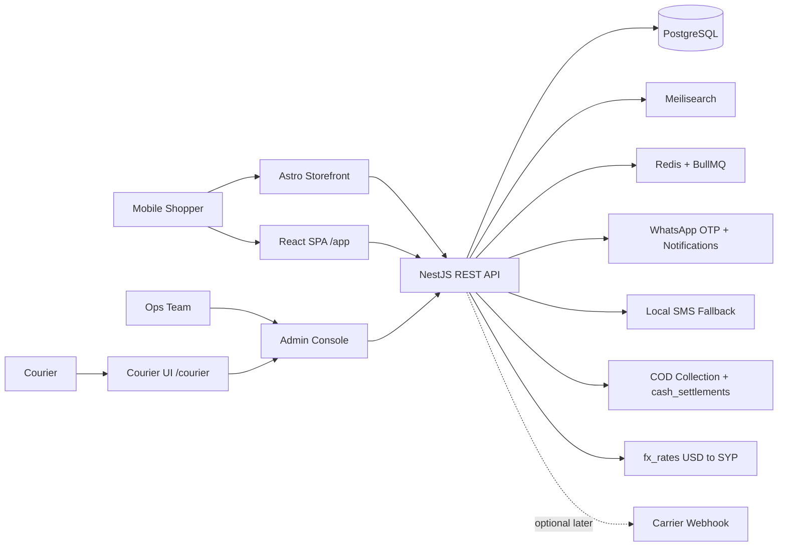

<div dir="rtl">

## 1. نظرة عامة والنطاق والجمهور والمتطلبات

### 1.1 الرؤية ومشكلة السوق

**تالي شام** (`talisham.com`) متجر إلكتروني عربي متخصص حصرياً في الهواتف الجوالة وملحقاتها (سماعات، شواحن، أغطية، بطاريات متنقلة، ساعات ذكية)، موجَّه إلى **السوق السوري**: دمشق وريفها، حلب، حمص، حماة، اللاذقية، طرطوس في المرحلة الأولى، ثم بقية المحافظات الأربع عشرة. المنطقة الزمنية المرجعية للنظام كله `Asia/Damascus`، والواجهة عربية أصلية باتجاه من اليمين إلى اليسار (RTL) بمنهج **الجوال أولاً (Mobile-First)**.

اليوم لا يشتري السوري جواله من متجر إلكتروني، بل من منشور على فيسبوك أو ستوري على إنستغرام أو رسالة واتساب أو إعلان مبوّب. المشكلة التي نعالجها ليست «كتالوج أفضل»، بل **غياب الثقة القابلة للتحقق في الشراء عن بُعد**، وتتفرع إلى خمس مشكلات ملموسة:

1. **ضعف الثقة بالشراء عن بُعد**: لا عقد، ولا إيصال، ولا سجل للطلب. المشتري يدفع أولاً ويأمل، أو يرفض الشراء كلياً ويقصد المحل. الحل في هذه الوثيقة: **الدفع عند الاستلام حصراً**، وتأكيد هاتفي قبل التجهيز، وإيصال PDF قابل للطباعة يُرفق مع الشحنة.
2. **انتشار الأجهزة المقلَّدة**: نسخ مقلَّدة تُباع بوصف «أصلي». الحل: **فحص IMEI إلزامي لكل وحدة** (`device_units`) وإظهار نتيجة الفحص للعميل على صفحة المنتج وفي الإيصال.
3. **مستعمل بلا إفصاح**: يُعرض الجهاز المستعمل بصور مأخوذة من الإنترنت وبلا ذكر لحالة البطارية أو الخدوش. الحل: `condition` إلزامي، و`battery_health_pct` إلزامي لغير الجديد، و**صور حقيقية للجهاز نفسه** لا صور الشركة المصنّعة.
4. **غموض النسخة ومصدر الاستيراد**: الفرق السعري بين `ZA/A` و`LL/A` و`AA/A`، وبين جهاز يدعم شريحتين وجهاز `eSIM only`، فرق حاسم في السوق السوري ويُخفى غالباً حتى التسليم. الحل: `device_origin` و`part_code` و`dual_sim` و`esim_only` حقول إلزامية على مستوى المتغيّر وظاهرة في المرشحات.
5. **غياب متجر متخصص موثوق**: لا توجد جهة واحدة تجمع كتالوجاً منظماً + سعراً معلناً + كفالة مكتوبة + تتبعاً للطلب. الحل: مواصفات منظمة قابلة للتصفية والمقارنة، وكفالة محل مكتوبة (`warranty_type='STORE'`) بمدة صريحة لكل متغيّر.

**قيود الواقع التشغيلي** التي تحكم كل قرار تقني في هذه الوثيقة: انقطاعات كهرباء وإنترنت متكررة، شبكات بطيئة (3G شائع)، حساسية عالية لتكلفة باقة البيانات، وأجهزة أندرويد متوسطة-ضعيفة. لذلك: الأصل صفر JavaScript على صفحات المتجر (Astro)، وميزانيات أداء تُقاس على **Slow 3G** لا على 4G، ووضع «توفير البيانات»، وطابور طلبات دون اتصال يُرسل عند عودة الشبكة.

**التسعير**: التخزين المرجعي بالدولار الأمريكي (`price_usd_cents`)، والعرض الافتراضي بالليرة السورية محسوباً من `fx_rates` الذي يحدّثه المدير يدوياً، مع إمكانية تبديل العرض بين الليرة والدولار. يُثبَّت `orders.fx_rate` و`orders.total_syp` لحظة تأكيد الطلب لمدة **48 ساعة**.

### 1.2 التمايز عن المنافسين الفعليين

المنافس ليس متجراً إلكترونياً كبيراً، بل القنوات التي يشتري منها السوريون فعلاً اليوم:

| المحور | صفحات فيسبوك/إنستغرام ومجموعات واتساب | الإعلانات المبوّبة (OpenSooq) | محلات الجوالات التقليدية | **تالي شام** |
|---|---|---|---|---|
| الكتالوج | منشورات متسلسلة، لا بحث ولا تصفية | إعلانات فردية متكررة ومكرّرة | ما هو معروض في الفترينة فقط | كتالوج منظم بمنتجات ومتغيّرات ومواصفات بأنواع بيانات صارمة (القسم رقم 7) |
| السعر | «للسعر خاص» — يُطلب على الخاص | معلن لكن غير موثوق وغير محدَّث | معلن شفهياً ويتغير بتغير الصرف | معلن بالليرة والدولار، محسوب من `fx_rates` بسعر مؤرَّخ ومُسجَّل |
| أصالة الجهاز | وعد شفهي | وعد شفهي | فحص في المحل عند الشراء | **فحص IMEI موثّق لكل وحدة** ونتيجته معروضة للعميل قبل الدفع |
| حالة المستعمل | صور مجهولة المصدر | «بحالة الوكالة» بلا قياس | معاينة يدوية | `condition` + `battery_health_pct` إلزامي + صور حقيقية للجهاز نفسه |
| النسخة والاستيراد | غير مذكورة | غير مذكورة | تُشرح شفهياً | `device_origin` + `part_code` + `dual_sim` + `esim_only` كحقول قابلة للتصفية |
| الكفالة | «كفالة» بلا مدة ولا ورقة | لا شيء | ورقة بخط اليد | `warranty_type` + `warranty_months` إلزامي، وإيصال PDF مطبوع مع الشحنة |
| الدفع | تحويل مسبق أو لقاء في مكان عام | لقاء شخصي | نقداً في المحل | **الدفع عند الاستلام حصراً**، والمبلغ مقرَّب لأقرب 1000 ليرة على الإيصال |
| التوصيل والتتبع | «بنبعتلك مع سرفيس» | مسؤولية الطرفين | لا يوجد | مندوبو المتجر داخل المدن ومكاتب النقل بين المحافظات، بتتبع وحالات معلنة (القسم رقم 8) |
| الإرجاع | تفاوض شخصي | لا يوجد | حسب المزاج | مسار إرجاع مسجَّل مع فحص IMEI ومطابقة الجهاز واسترداد نقدي |
| المقارنة | مستحيلة | مستحيلة | من الذاكرة | مقارنة حتى 4 أجهزة مع إبراز الفروق (القسم رقم 6) |
| الأداء على 3G | ثقيلة جداً (صور غير محسّنة) | ثقيلة + إعلانات | لا ينطبق | صفحات Astro بصفر JavaScript أصلاً، ميزانية ≤ 60KB مضغوطاً |

### 1.3 شرائح المستخدمين والشخصيات

| الشخصية | الهدف | الجهاز والسياق | السلوك | نقطة الألم |
|---|---|---|---|---|
| **سامر** – 26 سنة، موظف في شركة برمجيات، دمشق (المزة) | جهاز بأفضل قيمة مقابل السعر ضمن ميزانية 180–260 دولاراً | Xiaomi Redmi Note متوسط، أندرويد 13، شبكة 3G/4G متذبذبة، باقة بيانات محدودة يراقب استهلاكها، يتصفح مساءً وقت وصول الكهرباء | يقارن 5–8 أجهزة، يبحث برقم موديل محدد، يسأل عن `part_code` ودعم الشريحتين، يدفع نقداً عند الاستلام | لا يستطيع التحقق من أصالة الجهاز قبل الدفع، والصفحات الحالية تستهلك باقته دون أن تعطيه جواباً |
| **رهف** – 31 سنة، مدرّسة، حلب (الفرقان) | ترقية جهازها إلى iPhone مستعمل بحالة ممتازة + غطاء وشاحن متوافقين | iPhone 11 مستعمل، شبكة منزلية بطيئة مع انقطاعات، تتصفح من الجوال حصراً | تسأل عن حالة البطارية وصور الجهاز نفسه قبل أي شيء، تريد رقم واتساب للتواصل الفوري، ترفض التحويل المسبق | تشتري غطاءً لا يناسب مقاس جهازها، وتخشى أن الجهاز «مفتوح» أو مقلَّد بلا وسيلة تحقق |
| **أبو أحمد** – 44 سنة، صاحب محل جوالات، حمص (الحضارة) | شراء دفعات (10–40 قطعة) بأسعار جملة وإيصال مطبوع لكل شحنة | أندرويد اقتصادي + جهاز لوحي في المحل، إنترنت متقطع، يعتمد واتساب في كل أعماله | يعاود الشراء كل 2–3 أسابيع، يحتاج توفر مخزون فوري و IMEI موثّقاً لكل وحدة، ويستلم عبر مكتب نقل بري ويدفع للسائق | لا يجد سعراً متدرجاً حسب الكمية، ولا كشفاً بأرقام IMEI للدفعة، ويضيع وقته في تتبع الشحنة بالمكالمات |

### 1.4 النطاق



| داخل النطاق (In Scope) — الإصدار الأول | خارج النطاق (Out of Scope) |
|---|---|
| كتالوج جوالات وملحقات بمواصفات منظمة ومتغيّرات (لون/سعة/`part_code`/شريحتين) | تطبيقات أصلية iOS/Android (يغطيها PWA حالياً) |
| بحث ومرشحات وجهية ومقارنة أجهزة | سوق متعدد البائعين (Marketplace) وواجهات البائعين |
| سلة، حساب مستخدم بـ OTP عبر واتساب، إنشاء طلب، تتبع، إرجاع وضمان | **بوابات الدفع الإلكتروني** والمحافظ والتحويل البنكي والتقسيط |
| **الدفع عند الاستلام (COD) بالكامل**: `payment_status`، تحصيل المندوب/مكتب النقل، `cash_settlements`، تقريب المبلغ لأقرب 1000 ليرة، ضوابط رفض الاستلام | تسوية مالية آلية مع بنك أو مزوّد دفع |
| **التأكيد الهاتفي** قبل التجهيز مع تسجيل المحاولات والنتيجة | مركز اتصال بشري متكامل (CRM/Call Center) |
| **واجهة المندوب** `/courier`: مهام اليوم، تحديث الحالة، تسجيل المحصَّل، صورة/توقيع التسليم، عمل دون اتصال ومزامنة لاحقة | مستودع فعلي/WMS وإدارة الأساطيل وتحسين المسارات آلياً |
| فحص IMEI لكل وحدة (`device_units`) وإظهار نتيجته للعميل | خدمة إصلاح/صيانة أجهزة داخل المتجر |
| لوحة تحكم إدارية للمخزون والأسعار والطلبات و`fx_rates` | ذكاء أعمال متقدم / مستودع بيانات مستقل |
| تسعير مرجعي بالدولار وعرض بالليرة السورية مع تبديل العملة | التسعير التلقائي حسب المنافسين (Dynamic Repricing) |
| عربية RTL + بنية تدويل عبر مسارات `/[locale]/` | لغات إضافية غير العربية والإنجليزية في الإصدار الأول |
| إشعارات واتساب ← SMS ← بريد، وWeb Push كقناة ثانوية¹ | برنامج ولاء ونقاط ومحفظة داخلية |
| نظام تصميم **Liquid Glass** مشترك (`packages/ui`) مع تعطيل تلقائي على الأجهزة الضعيفة | ثيمات متعددة قابلة للتخصيص من قبل المستخدم |
| تقارير مبيعات ومخزون وتحصيل نقدي أساسية | تكامل webhook إلزامي مع شركة شحن (يبقى اختيارياً إن توفّر شريك لاحقاً) |

¹ **Web Push على iOS** لا يعمل داخل تبويب Safari؛ يشترط تثبيت الـ PWA على الشاشة الرئيسية (iOS ≥ 16.4) وطلب الإذن من إيماءة مستخدم، لذا لا تُفترض تغطيته لكل مستخدمي الجوال، وتبقى الأولوية لقناة واتساب.

> **ملاحظة على قابلية التمديد**: إضافة طريقة دفع مستقبلاً = قيمة جديدة في `payment_method` وخطوة إضافية في التدفق، دون إعادة هيكلة.

### 1.5 المتطلبات الوظيفية (MoSCoW)

| الأولوية | المتطلب | ملاحظة |
|---|---|---|
| **يجب (Must)** | كتالوج بمنتجات ومتغيّرات ومواصفات منظمة تشمل `device_origin` و`part_code` و`dual_sim` و`esim_only` | راجع القسم رقم 7 |
| **يجب** | `condition` و`battery_health_pct` إلزامي لغير الجديد + صور حقيقية للجهاز نفسه | راجع القسم رقم 7 |
| **يجب** | فحص IMEI لكل وحدة في `device_units` وإظهار نتيجته للعميل | راجع القسم رقم 7 |
| **يجب** | بحث عربي متسامح مع الأخطاء الإملائية ومرشحات وجهية | راجع القسم رقم 6 |
| **يجب** | تسجيل ودخول برقم الجوال السوري (`+963`) + رمز OTP عبر واتساب | راجع القسم رقم 9 |
| **يجب** | سلة ثابتة (persistent) وإنشاء طلب وتتبع حالته | راجع القسم رقم 8 |
| **يجب** | **الدفع عند الاستلام**: تحصيل، `payment_status`، تسوية نقدية يومية `cash_settlements` | راجع القسم رقم 8 |
| **يجب** | **تأكيد هاتفي** للانتقال `PENDING_CONFIRMATION → PROCESSING` مع تسجيل المحاولات | راجع القسم رقم 8 |
| **يجب** | عرض السعر بالليرة السورية من `fx_rates` مع تثبيت السعر 48 ساعة وتبديل العملة | راجع القسم رقم 3 |
| **يجب** | إدارة مخزون بحجز عند الطلب ومنع البيع الزائد (Oversell) | راجع القسم رقم 7 |
| **يجب** | عنوان سوري: `governorate` + `city` + `neighborhood` + `landmark` (إلزامي) | راجع القسم رقم 3 |
| **يجب** | PWA قابل للتثبيت مع عمل جزئي دون اتصال للصفحات المزارة | راجع القسم رقم 5 |
| **يجب** | واجهة المندوب `/courier` تعمل دون اتصال وتتزامن عند عودة الشبكة | راجع القسم رقم 10 |
| **يجب** | لوحة تحكم إدارية بصلاحيات مبنية على الأدوار (RBAC) باصطلاح `مورد:فعل:نطاق` | راجع القسم رقم 10 |
| **ينبغي (Should)** | مقارنة حتى 4 أجهزة جنباً إلى جنب | |
| **ينبغي** | ضوابط رفض الاستلام: سقف قيمة الطلب، حد الطلبات المفتوحة لكل رقم، قائمة تقييد | راجع القسم رقم 8 |
| **ينبغي** | تنبيه "أعلمني عند التوفر" وتنبيه انخفاض السعر عبر واتساب | |
| **ينبغي** | مفضلة على مستوى المتغيّر (`variantId`) | |
| **ينبغي** | تسعير متدرج حسب الكمية لشريحة أصحاب المحلات | |
| **ينبغي** | وضع «توفير البيانات» (صور أقل جودة وتعطيل الزجاج) | راجع القسم رقم 5 |
| **يمكن (Could)** | توصيات "ملحقات متوافقة مع جهازك" عبر `product_compatibility` | راجع القسم رقم 6 |
| **يمكن** | تقييم قيمة الجهاز المستعمل (Trade-in) كتقدير أولي فقط | |
| **يمكن** | خريطة تقريبية للعنوان عبر `geo_lat/geo_lng` الاختياريين | |
| **لن (Won't)** | نظام نقاط ولاء، سوق متعدد البائعين، شراء بالتقسيط، دردشة حية بشرية داخل الموقع | مؤجلة لما بعد الإصدار الأول؛ التواصل الفوري عبر واتساب |

### 1.6 المتطلبات غير الوظيفية (قابلة للقياس)

القياس المرجعي على **Slow 3G (نحو 400kbps، زمن ذهاب وإياب 400ms)** وجهاز أندرويد متوسط-ضعيف، **لا على 4G**. جدول ميزانيات الأداء في القسم رقم 5 هو المصدر الوحيد المفروض في CI، وما هنا إحالة إليه.

| الفئة | المؤشر | الهدف |
|---|---|---|
| الأداء | LCP على شبكة سريعة (p75) | ≤ 2.5 ثانية، حد أحمر 2.8 ثانية (القسم رقم 5) |
| الأداء | **LCP على 3G البطيء** (p75) — القياس المرجعي | ≤ 4.5 ثانية، حد أحمر 5.5 ثانية |
| الأداء | INP / CLS | INP ≤ 200 ms (حد أحمر 250 ms)، CLS ≤ 0.1 (حد أحمر 0.12) عند p75 |
| الأداء | حجم JS لصفحات Astro | ≤ 60 KB مضغوطاً — الأصل صفر JavaScript، ثم جزر React عند الحاجة فقط |
| الأداء | حجم JS لتطبيق `/app` | ≤ 170 KB مضغوطاً، حد أحمر 190 KB |
| الأداء | إجمالي أول زيارة لصفحة المنتج | ≤ 400 KB (بما فيها الصور)، CSS أولي ≤ 45 KB |
| الأداء | زمن استجابة API لقراءة المنتج | p95 ≤ 300 ms، p99 ≤ 600 ms |
| الأداء | زمن نتائج البحث | p95 ≤ 150 ms |
| **مقاومة انقطاع الشبكة** | التصفح دون اتصال | الصفحات المزارة تُعرض من الكاش، وطابور طلبات دون اتصال يُرسل عند عودة الشبكة (Background Sync) |
| **مقاومة انقطاع الكهرباء** | واجهة المندوب | تعمل كاملة دون اتصال ليوم عمل واحد وتتزامن عند عودة الشبكة، دون فقدان أي تحصيل مسجَّل |
| **تكلفة البيانات** | استهلاك جلسة تصفح نموذجية (5 صفحات) | ≤ 1.5 MB في الوضع الافتراضي، ≤ 700 KB في وضع «توفير البيانات» |
| التوفر | توفر الواجهة والـ API شهرياً | 99.9% (≈ 43 دقيقة توقف/شهر) |
| السعة | ذروة متزامنة | 3000 مستخدم متزامن، 300 طلب/دقيقة، 50 ألف SKU |
| الأمان | تشفير النقل والتخزين | TLS 1.3، تشفير البيانات الحساسة عند التخزين (راجع القسم رقم 9) |
| الأمان | تصحيح الثغرات الحرجة | ≤ 72 ساعة من الإفصاح (قناة Renovate الأمنية، القسم رقم 11) |
| التدويل | جاهزية RTL/LTR | 100% من مفاتيح النصوص عبر مسارات `/[locale]/` وملفات ترجمة، صفر نص مضمّن في الكود |
| إمكانية الوصول | معيار WCAG | 2.2 مستوى AA على المسارات الحرجة، وتباين ≥ 4.5:1 تحت كل سطح زجاجي (راجع القسم رقم 5) |
| التوافق | متصفحات الجوال | Safari iOS ≥ 16.4، Chrome Android ≥ 120، Samsung Internet ≥ 23، Firefox Android ≥ 128 |
| قابلية النقل | الاستضافة | كل مكوّن قابل للتشغيل بـ Docker Compose على خادم أوروبي بديل خلال ≤ 48 ساعة (راجع القسم رقم 11) |
| الموثوقية | RPO / RTO | RPO ≤ 15 دقيقة، RTO ≤ 60 دقيقة (راجع القسم رقم 11) |

### 1.7 قصص المستخدم

1. بصفتي مشترياً، أريد تصفية الجوالات حسب السعر والذاكرة وسعة البطارية ودعم الشريحتين معاً، حتى أصل لقائمة قصيرة دون استهلاك باقتي.
2. بصفتي مشترياً، أريد مقارنة حتى 4 أجهزة في جدول واحد، حتى أرى الفروق الجوهرية بسرعة.
3. بصفتي مشترياً، أريد معرفة مصدر الاستيراد ورمز النسخة (`part_code`) ونوع الكفالة ومدتها قبل الشراء، حتى أتجنب مفاجآت ما بعد البيع.
4. بصفتي مشترياً لجهاز مستعمل، أريد رؤية **نتيجة فحص IMEI وحالة البطارية وصوراً حقيقية للجهاز نفسه**، حتى أتأكد أنه أصلي وغير مقلَّد قبل أن أدفع.
5. بصفتي مشترياً، أريد الدخول برقم جوالي السوري ورمز OTP يصلني على **واتساب** دون كلمة مرور، حتى أنهي العملية في أقل من 30 ثانية.
6. بصفتي مشترياً، أريد إتمام الطلب **دون أي خطوة دفع**، وأن أدفع نقداً للمندوب عند الاستلام، حتى لا أخاطر بمالي قبل رؤية الجهاز.
7. بصفتي مشترياً، أريد أن يتصل بي فريق المتجر لتأكيد الطلب والعنوان قبل التجهيز، حتى أطمئن أن الطلب حقيقي ومسجَّل.
8. بصفتي مشترياً، أريد رؤية المبلغ المستحق نقداً **مقرَّباً لأقرب 1000 ليرة** وسعر الصرف المثبَّت لطلبي، حتى أُحضِّر المبلغ بالضبط.
9. بصفتي مشترياً، أريد تبديل عرض الأسعار بين الليرة السورية والدولار، حتى أفهم السعر بالعملة التي أفكر بها.
10. بصفتي مشترياً في محافظة أخرى، أريد اختيار مكتب النقل البري ورؤية `waybill_no` والمهلة المتوقعة، حتى أستلم من المكتب وأدفع هناك.
11. بصفتي مشترياً، أريد **تتبعاً بسيطاً** بحالة واحدة واضحة وتاريخ تحديثها من صفحة واحدة، حتى أعرف موعد الوصول دون مكالمات.
12. بصفتي مشترياً، أريد تثبيت المتجر على شاشتي الرئيسية وتصفّح ما زرته سابقاً أثناء انقطاع الإنترنت، حتى لا أتعطل مع كل انقطاع.
13. بصفتي مشترياً، أريد تقديم طلب إرجاع أو مطالبة كفالة مع رفع صور، وأن يكون الاسترداد نقدياً بعد مطابقة IMEI، حتى أُنهي الإجراء بثقة.
14. بصفتي مشترياً لملحق، أريد رؤية توافق الملحق مع طراز جهازي، حتى لا أشتري غطاءً بمقاس خاطئ.
15. بصفتي صاحب محل، أريد سعراً متدرجاً حسب الكمية وكشفاً بأرقام IMEI للدفعة، حتى أقرر حجم الطلب فوراً وأوثّق ما استلمته.
16. بصفتي مندوب توصيل، أريد قائمة مهام اليوم وتحديث الحالة وتسجيل المبلغ المحصَّل **دون اتصال**، حتى أعمل في مناطق ضعيفة التغطية ويتزامن كل شيء لاحقاً.
17. بصفتي محاسباً، أريد تسوية يومية لحصيلة كل مندوب ومكتب نقل مع إبراز الفروقات، حتى أغلق يوم التحصيل بلا خلاف.
18. بصفتي مدير كتالوج، أريد رفع ملف CSV لتحديث الأسعار بالدولار والمخزون دفعة واحدة، حتى أوفر ساعات إدخال يدوي.
19. بصفتي مديراً، أريد تحديث سعر الصرف يدوياً مع حفظ السجل التاريخي ومن قام بالتحديث، حتى تبقى الأسعار المعروضة منضبطة ومراجَعة.
20. بصفتي مسؤول عمليات، أريد لوحة بالطلبات المتعثرة وحالات رفض الاستلام، حتى أتدخل قبل تصعيدها وأقيس تكلفة الشحن المهدور.

**معايير القبول للقصص الحرجة**

```gherkin
# Story 3+4: import origin, part code, warranty and authenticity
Feature: Variant transparency and IMEI verification
  Scenario: Buyer opens a used phone variant page
    Given a variant with device_origin="EURO", part_code="ZA/A", dual_sim=true
    And warranty_type="STORE" and warranty_months=3
    And condition="USED_A" with battery_health_pct=89
    When the buyer opens the product page on mobile
    Then the import origin, part_code and dual SIM support are visible above the fold
    And the store warranty type and warranty_months appear in the specs table
    And the IMEI verification result of the exact unit is shown to the buyer
    And real photos of that specific unit are displayed, not stock images
    And a non-new variant missing battery_health_pct is blocked from publishing
    And a variant missing device_origin, part_code, warranty_type or warranty_months is blocked from publishing

# Story 5: OTP login over WhatsApp
Feature: Mobile OTP login
  Scenario: Successful login within 30 seconds
    Given a valid Syrian mobile number in E.164 matching ^\+9639[0-9]{8}$
    When the buyer requests an OTP
    Then a 6-digit code is delivered over WhatsApp in <= 30 seconds
    And local SMS is used as fallback when WhatsApp delivery fails
    And all OTP expiry, request-rate and lockout limits are enforced exactly as defined in the rate-limit table of section 9 (single source of truth, not restated here)

# Story 6+7+8: cash on delivery and phone confirmation
Feature: COD checkout with phone confirmation
  Scenario: Placing an order without any payment step
    Given a cart with one available variant and a Syrian address including a mandatory landmark
    When the buyer submits the order
    Then no payment step or gateway is presented at any point in checkout
    And payment_method is "COD"
    And the order status is "PENDING_CONFIRMATION" and payment_status is "PENDING"
    And orders.fx_rate and orders.total_syp are frozen for 48 hours
    And the cash due is displayed rounded to the nearest 1000 SYP
    And a confirmed 48-hour inventory reservation is created

  Scenario: Ops confirms the order by phone
    Given an order in "PENDING_CONFIRMATION"
    When an agent completes a confirmation call
    Then confirmation_attempts, confirmed_by, confirmed_at and confirmation_notes are recorded
    And the order moves to "PROCESSING"

  Scenario: No answer after three attempts
    Given an order in "PENDING_CONFIRMATION" with confirmation_attempts = 3 and no answer
    When the expire-pending job runs
    Then the order becomes "CANCELLED" and the reservation is released
    And the same happens automatically 48 hours after order creation

# Story 11+16: simple tracking and offline courier updates
Feature: Manual tracking and offline courier app
  Scenario: Buyer follows the order
    Given an order in "OUT_FOR_DELIVERY"
    When the buyer opens the tracking page
    Then a single current status, its timestamp and the expected delivery window are shown
    And no external carrier webhook is required for the status to be accurate

  Scenario: Courier delivers while offline
    Given the courier UI is open with today's tasks and the device is offline
    When the courier marks the order "DELIVERED" and records the collected cash amount
    Then the update is queued locally with a delivery photo or signature
    And it syncs on reconnect, setting payment_status="COLLECTED" with collected_amount_syp, collected_at and collected_by
    And the amount is attached to the courier's daily cash_settlements record

# Story 12: installable PWA and offline browsing
Feature: Installable PWA
  Scenario: Offline access to visited pages
    Given the buyer installed the app from the browser prompt
    When the device goes offline
    Then previously visited product and cart pages render from cache
    And an offline banner in Arabic is shown for uncached routes
    And the Lighthouse installability audit passes
```

### 1.8 مسرد المصطلحات

| المصطلح | التعريف |
|---|---|
| **SKU** | وحدة حفظ المخزون (Stock Keeping Unit): المعرّف الفريد لأصغر وحدة قابلة للبيع والجرد. |
| **متغيّر (Variant)** | تركيبة محددة من خصائص المنتج (اللون + السعة + رمز النسخة)، ولكل متغير SKU وسعر ومخزون مستقل. |
| **IMEI** | الرقم التسلسلي الدولي للجهاز الجوال (15 رقماً)، يُستخدم لتوثيق القطعة المُسلَّمة وللتحقق من أصالتها ولمطالبات الكفالة. |
| **الدفع عند الاستلام (COD)** | طريقة الدفع الوحيدة في الإصدار الأول: لا خطوة دفع في إتمام الطلب، ويُحصَّل المبلغ نقداً عند التسليم من المندوب أو في مكتب النقل، ويُسجَّل في `payment_status` و`collected_amount_syp`. |
| **التأكيد الهاتفي** | مكالمة إلزامية من فريق المتجر قبل التجهيز، تنقل الطلب من `PENDING_CONFIRMATION` إلى `PROCESSING` وتُسجَّل في `confirmation_attempts` و`confirmed_by` و`confirmed_at` و`confirmation_notes`. |
| **مكتب النقل** | مكتب نقل بري بين المحافظات يستلم الشحنة ويسلّمها للعميل ويحصّل المبلغ، بمرجع `waybill_no` وصورة إيصال (`shipping_method='INTERCITY_OFFICE'`). |
| **رمز النسخة (`part_code`)** | لاحقة الموديل الدالة على سوق الإصدار (مثل `ZA/A`, `LL/A`, `AA/A`)، وتؤثر مباشرة في السعر ودعم الشريحتين والكفالة. |
| **مصدر الاستيراد (`device_origin`)** | الجهة التي استُورد منها الجهاز: `GULF`, `EURO`, `US`, `ASIA`, `OTHER`. |
| **حالة البطارية (`battery_health_pct`)** | نسبة سعة البطارية المتبقية مقارنة بالجديدة، حقل إلزامي لكل جهاز غير جديد ويُعرض للعميل قبل الشراء. |
| **كفالة المحل** | `warranty_type='STORE'`: كفالة مكتوبة من المتجر نفسه، 12 شهراً للجديد و3 أشهر للمستعمل افتراضياً. |
| **التسوية النقدية (`cash_settlements`)** | مطابقة يومية بين ما حصّله كل مندوب/مكتب نقل وما يقابله من طلبات مسلَّمة، مع الفروقات وعمولة التوصيل وحالة التسوية. |
| **سعر الصرف (`fx_rates`)** | جدول أسعار تحويل الدولار إلى الليرة السورية يحدّثه المدير يدوياً بسجل تاريخي، ويُثبَّت في `orders.fx_rate` لحظة تأكيد الطلب لمدة 48 ساعة. |
| **المرشحات الوجهية (Facets)** | مرشحات مبنية على خصائص منظمة تعرض عدد النتائج لكل قيمة. |
| **PWA** | تطبيق ويب تقدمي قابل للتثبيت على الشاشة الرئيسية ويعمل جزئياً دون اتصال. |
| **الجزر (Islands)** | أجزاء React 19 تفاعلية داخل صفحة Astro ساكنة، تُحمّل بـ `client:visible` أو `client:idle` فقط عند الحاجة. |
| **Liquid Glass** | نظام التصميم: سطح زجاجي يكسر خلفيته، يُستعمل على أسطح صغيرة ثابتة فقط ويُعطَّل تلقائياً على الأجهزة الضعيفة (راجع القسم رقم 5). |
| **RTL** | اتجاه العرض من اليمين إلى اليسار. |
| **البيع الزائد (Oversell)** | بيع كمية تتجاوز المخزون الفعلي نتيجة غياب الحجز اللحظي. |
| **RBAC** | التحكم بالصلاحيات المبني على الأدوار، باصطلاح `مورد:فعل:نطاق`. |
| **RPO / RTO** | أقصى فقدان بيانات مقبول / أقصى زمن استعادة مقبول. |
| **p95 / p75** | المئين الخامس والتسعون / الخامس والسبعون لقياسات الأداء. |

</div>
