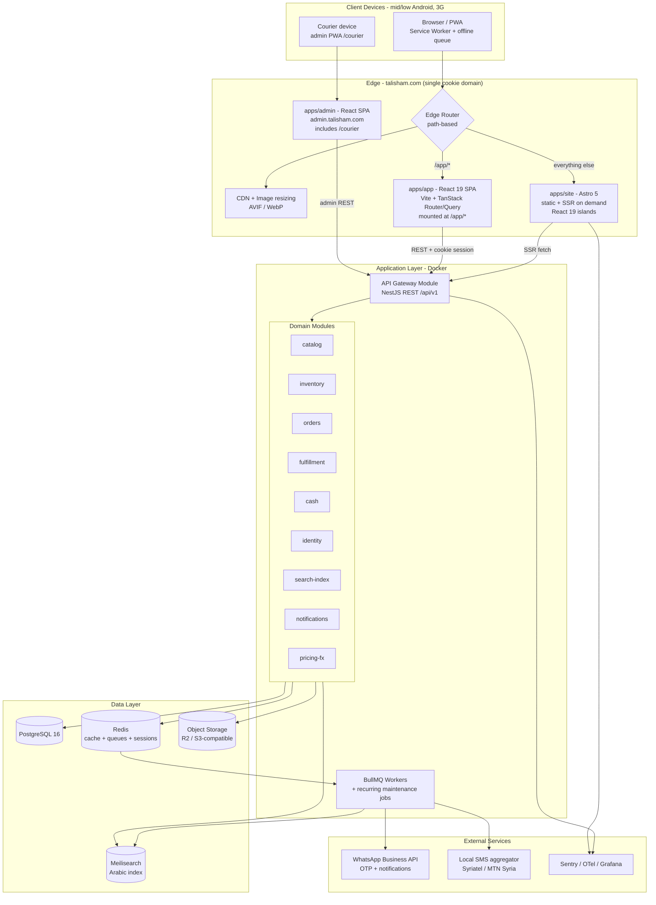

<div dir="rtl">

> **تنبيه على هذا الفصل — تبدّل المكدس (تموز 2026).**
> كُتب هذا الفصل على مكدسٍ من خادم NestJS وPostgreSQL وRedis وMeilisearch
> داخل حاويات Docker. والمنفَّذ اليوم غيره: **Worker واحد على Cloudflare**
> يخدم الموقع والتطبيقين والواجهة البرمجية على أصلٍ واحد، وقاعدة **D1**،
> ومخزن **KV**، وحاوية **R2**، ومهام **Cron**.
>
> ما لم يتبدّل هو ما يهمّ: قواعد المجال كما هي حرفياً — الحجز يخصم من
> المتاح، والتسليم هو لحظة البيع، والتقادم ليس حالة مسموحة، والقيود
> والمحفِّزات تحرس المخزون في القاعدة لا في الشيفرة.
>
> ما يبقى صالحاً هنا: القرارات والقواعد والحدود. وما يُقرأ على أنه تاريخٌ
> لا وصفٌ للقائم: أسماء المكوّنات وملفات النشر. المرجع الحيّ للتنفيذ هو
> [`docs/DEPLOY.md`](DEPLOY.md) و[`README.md`](../README.md).

</div>

<div dir="rtl">

## 2. المعمارية التقنية والمكدس وهيكل المستودع

### 2.1 المخطط المعماري العام

يقوم **تالي شام** على فصل صريح بين ثلاث واجهات لكل منها هدف واحد لا تنازعه فيه غيرها، فوق خلفية واحدة مقسّمة إلى وحدات مجال (Modular Monolith)، وطبقة بيانات مُدارة. المتصفح لا يتحدث مع قاعدة البيانات أبداً، وكل نداء يمر عبر الحافة أولاً.

- `apps/site` — **Astro 5**: كل ما تفهرسه محركات البحث. الأصل صفر JavaScript، وجزر React 19 للأجزاء التفاعلية فقط.
- `apps/app` — **React 19 SPA** (Vite) تحت `/app/*`: السلة، إتمام الطلب، الحساب، الطلبات، التتبع، المفضلة. لا قيمة SEO لها، والأولوية للتفاعل والعمل دون اتصال.
- `apps/admin` — **React SPA** (Vite) على `admin.talisham.com`، وتضم **واجهة المندوب** `/courier` التي تعمل دون اتصال وتتزامن عند عودة الشبكة.



مسار القراءة الحرج (تصفح فئة أو منتج) يُخدَّم HTML جاهزاً من الحافة بلا انتظار JavaScript، ومسارات الكتابة (سلة، طلب، مصادقة، تحصيل) تمر عبر NestJS حصراً. المهام الطويلة — إرسال OTP عبر واتساب، فهرسة المنتجات، تحديث أسعار الصرف، توليد إيصال PDF، تسوية الحصائل النقدية — تُدفع إلى طوابير BullMQ ولا تُعيق استجابة HTTP.

### 2.2 حدود المسؤولية بين الواجهات الثلاث

| المسار | التطبيق | نمط التصيير | JavaScript | التخزين المؤقت على الحافة |
| --- | --- | --- | --- | --- |
| `/`، `/c/[slug]`، `/b/[slug]`، `/blog/[slug]`، الصفحات الثابتة | `apps/site` | توليد ساكن (SSG) + إعادة بناء عند تغيير المحتوى | صفر ثم جزيرة `SearchBar` بـ `client:idle` | عام، طويل الأمد مع إبطال بالوسم |
| `/p/[slug]` صفحة المنتج | `apps/site` | SSG مع SSR عند الحاجة لتحديث السعر/التوفر | جزر: `Gallery`, `VariantPicker`, `AddToCart`, `CurrencyToggle` بـ `client:visible` | عام قصير الأمد + تحديث السعر بجزيرة |
| `/search`، `/compare` | `apps/site` | SSR (نتائج ديناميكية) | جزيرة `Filters` + `SearchBar` | خاص/بلا تخزين |
| `/app/cart`, `/app/checkout`, `/app/account`, `/app/orders`, `/app/track`, `/app/wishlist` | `apps/app` | SPA على العميل | حزمة التطبيق كاملة (ميزانيتها في القسم رقم 5) | أصول ثابتة فقط؛ `robots.txt` يمنع فهرسة `/app/` |
| `admin.talisham.com/*` و`/courier` | `apps/admin` | SPA على العميل | حزمة الإدارة (خارج ميزانية المتجر) | بلا فهرسة، بلا تخزين عام |

قاعدة الانتقال: أي رابط من Astro إلى مسار داخل `/app/*` هو انتقال متصفح كامل (`<a href>`) لا توجيه عميل؛ وأول تحميل لـ `/app` يجلب الحزمة مرة واحدة ثم يبقى التنقل داخلها على العميل. العكس (من SPA إلى صفحة SEO) انتقال متصفح كامل كذلك.

### 2.3 تبرير اختيارات المكدس

| التقنية | لماذا | البديل المرفوض ولماذا |
| --- | --- | --- |
| **Astro 5** لصفحات SEO (`apps/site`) | الأصل صفر JavaScript: صفحة المنتج تصل قابلة للقراءة على شبكة 3G بطيئة (نحو 400kbps، RTT 400ms) قبل تنفيذ أي سكربت، وهو الفارق بين بيع وارتداد في سوق الأجهزة والشبكات الضعيفة. HTML كامل من الحافة يعني فهرسة موثوقة بلا اعتماد على تصيير المُزحّف لـ JavaScript، وجزر React 19 تُحمَّل بـ `client:visible` / `client:idle` فتُدفع تكلفة التفاعل عند الحاجة فقط | SPA خالص لكل الموقع: صفحة بيضاء حتى تنزل الحزمة، وSEO هش؛ موقع ثابت بلا جزر: لا يكفي لاختيار المتغيّر ومعرض الصور والمرشحات |
| **React 19 SPA + Vite** للتطبيق (`apps/app`) | السلة وإتمام الطلب والتتبع تفاعل كثيف بحالة معقّدة وصفر قيمة SEO؛ SPA يمنح تنقلاً فورياً بلا رحلة شبكة، وService Worker وطابور طلبات دون اتصال يُرسل عند عودة الشبكة — ضرورة في بيئة انقطاعات كهرباء وإنترنت متكررة | تصيير خادم لهذه المسارات: رحلة شبكة على كل خطوة فوق شبكة بطيئة، وسلوك سيئ عند انقطاع الاتصال |
| **لا Next.js إطلاقاً** | إطار واحد لحالتَي استخدام متناقضتَين ينتهي بحلّ وسط: صفحات المحتوى تدفع تكلفة وقت تشغيل React كاملاً، وشاشات التطبيق تُقيَّد بحدود التصيير على الخادم. الفصل يعطي صفر JS حيث يلزم، وSPA كاملة حيث تلزم، بحدود واضحة وبناء أسرع وسطح تعقيد أقل | Next.js: تعقيد الحدود بين خادم/عميل، حجم وقت تشغيل أعلى على صفحات المحتوى، وارتباط أثقل بمزوّد نشر بعينه — وهو ما لا يناسب قيد قابلية النقل في البند «م» |
| **React SPA** للوحة الإدارة وواجهة المندوب (`apps/admin`) | جمهور مسجَّل داخلياً بلا SEO؛ واجهة المندوب تحتاج عملاً دون اتصال (مهام اليوم، تحديث الحالة، تسجيل المبلغ المحصَّل، صورة/توقيع التسليم) ومزامنة عند عودة الشبكة، وهذا نمط SPA بامتياز | لوحة مُصيَّرة على الخادم: بلا فائدة هنا وتكلفة تعقيد أعلى |
| **TanStack Router + TanStack Query** | توجيه مكتوب النوع من طرف إلى طرف، وطبقة جلب ببيانات قديمة-أثناء-التحديث وإعادة محاولة وحالة دون اتصال جاهزة | React Router بلا طبقة جلب: كتابة يدوية لكل حالات التحميل والإعادة |
| **TypeScript** في كل الطبقات | عقد واحد بين الواجهات الثلاث والخلفية عبر `packages/types` و`packages/api-contract` | JavaScript عادي: تكلفة صيانة أعلى وتكامل هشّ |
| **Tailwind CSS 4** + `@theme` | رموز تصميم Liquid Glass تُعرَّف مرة كمتغيرات CSS وتُستهلك في Astro وفي التطبيقين؛ أدوات منطقية الاتجاه (`ps-`, `pe-`, `start-`) تجعل RTL افتراضياً | مكتبات مكوّنات جاهزة ثقيلة: تخصيص RTL وزجاجيات مخصّصة أصعب وحجم أكبر |
| **NestJS + REST** | وحدات ومُحقِن تبعيات يفرضان حدود المجال، ووثائق OpenAPI تُولَّد منها أنواع العميل | Express عارٍ: بلا حدود معمارية؛ GraphQL: تعقيد تخزين مؤقت زائد لقراءات نمطية |
| **Prisma ORM** | ترحيلات موثوقة وأنواع مولّدة تُصدَّر للواجهات | TypeORM: تاريخ ترحيلات غير مستقر |
| **PostgreSQL 16** | معاملات ACID للمخزون والطلبات والتحصيل النقدي، و`JSONB` للنصوص متعددة اللغات وخصائص الأجهزة | MongoDB: ضمانات ضعيفة لخصم المخزون المتزامن |
| **Redis + BullMQ** | تخزين مؤقت وجلسات وحدود معدل (القيم في جدول القسم رقم 9 حصراً) وطوابير موثوقة بإعادة محاولة أسّية | RabbitMQ: تشغيل إضافي بلا حاجة في هذا الحجم |
| **Meilisearch** | تسامح إملائي وتعامل ممتاز مع التشكيل والهمزات واستجابة دون 50ms | Elasticsearch: استهلاك ذاكرة وتشغيل ثقيل (البديل المقبول: Typesense) |
| **تخزين كائنات + CDN للصور** | تحويل تلقائي إلى AVIF/WebP وأحجام متعددة، وهو شرط لميزانية أول زيارة على 3G | تخزين الصور في قاعدة البيانات أو خدمتها من الخادم مباشرة: بطء وتكلفة |
| **Vitest + Playwright + k6** | تنفيذ سريع، اختبار متصفح جوال حقيقي مع خنق الشبكة، واختبار حِمل | Jest + Cypress: أبطأ وتغطية أجهزة أضيق |
| **مسارات `/[locale]/` للتدويل** | التبديل بين `ar` و`en` على مستوى المسار مع `hreflang` صحيح، والرسائل من `packages/i18n` تُستهلك في Astro وفي التطبيقين | حزم تدويل مرتبطة بإطار واحد: تُقيّد الفصل الثلاثي |

**الدفع**: الدفع عند الاستلام فقط، و`payment_method` بقيمة واحدة `COD`. لا خطوة دفع في إتمام الطلب ولا بوابة ولا واجهة مجرّدة للدفع في `packages/types`. إضافة طريقة دفع مستقبلاً = قيمة جديدة في `payment_method` وخطوة إضافية في التدفق، دون إعادة هيكلة.

### 2.4 التوجيه على الحافة ومشاركة الجلسة

النطاق واحد (`talisham.com`) والتوجيه بالمسار، فتبقى الجلسة كوكي واحدة لا تحتاج CORS ولا تبادل رموز بين تطبيقين:

| النمط | الوجهة | ملاحظة |
| --- | --- | --- |
| `/app/*` و`/app` | أصول `apps/app` مع إعادة كتابة إلى `index.html` (توجيه على العميل) | `Cache-Control: no-store` لـ `index.html`، وتجزيء محتوى للأصول |
| `/assets/app/*` | أصول SPA المُجزّأة | ثابتة، صالحة سنة |
| `/api/*` | `api.talisham.com` (وكيل من نفس الأصل) | يمنع مشاكل الكوكي عبر المصادر |
| كل ما عداه | `apps/site` (Astro) | ساكن من الحافة أو SSR عند الحاجة |

استراتيجية الجلسة والكوكي:

| العنصر | القيمة | السبب |
| --- | --- | --- |
| كوكي الجلسة | `ts_sid` — `HttpOnly; Secure; SameSite=Lax; Domain=.talisham.com; Path=/` | يُقرأ في Astro أثناء SSR وفي نداءات SPA على نفس الأصل، ويصلح كذلك لـ `admin.talisham.com` |
| المرجع في الخادم | معرّف جلسة عشوائي يقابل سجلاً في Redis (لا حمولة رمز في الكوكي) | إبطال فوري عند الخروج أو حظر الحساب |
| رمز الوصول | قصير العمر في ذاكرة SPA فقط، يُجدَّد من كوكي التحديث | لا تخزين في `localStorage` |
| كوكي الهوية العامة | `ts_cart` (معرّف سلة مجهولة) و`ts_disp` (عرض الليرة أو الدولار) — غير `HttpOnly` | تقرأها جزر Astro بلا نداء شبكة، ولا تحمل بيانات حساسة |
| CSRF | إرسال مزدوج: كوكي `ts_csrf` + ترويسة `X-CSRF-Token` على كل كتابة | مطلوب لأن المصادقة بالكوكي |
| التخزين المؤقت | صفحات Astro المفهرسة تبقى عامة وغير مشخصنة؛ أي شخصنة (عدد السلة، اسم المستخدم) تُحقن بجزيرة عميل بعد التحميل | يحافظ على صلاحية التخزين على الحافة |
| الخروج | إبطال سجل Redis + مسح الكوكيات على النطاق الأب | يُنهي الجلسة في الواجهات الثلاث معاً |

تفاصيل صلاحية الرموز والأدوار والصلاحيات باصطلاح `مورد:فعل:نطاق` وحدود المعدل في القسم رقم 9.

### 2.5 نمط النشر: Modular Monolith أولاً

وحدة نشر واحدة لـ NestJS مقسّمة داخلياً إلى وحدات مجال مستقلة؛ الفريق صغير والمجال غير مستقر، وتكلفة الخدمات المصغّرة لا تُبرَّر قبل تجاوز 500 طلب يومياً.

قواعد الحدود المفروضة تقنياً:

1. كل وحدة تملك جداولها وحدها؛ لا استعلام SQL عابر بين وحدتين، والوصول عبر الخدمة العامة (`public/`) للوحدة فقط.
2. كل وحدة تحت `apps/api/src/modules/<name>` بمجلد `internal/` خاص و`public/` مُصدَّر.
3. `eslint-plugin-boundaries` يمنع الاستيراد من `internal/*` خارج الوحدة، والمخالفة تكسر البناء.
4. التواصل غير المتزامن بأحداث مجال على BullMQ، والحمولة عقد مكتوب النوع في `packages/types`.

| الحدث | المُنتِج | المستهلكون | الأثر |
| --- | --- | --- | --- |
| `cart.reserved` | inventory | orders | حجز مرن 15 دقيقة في السلة |
| `order.created` | orders | inventory, notifications | تحويل الحجز إلى حجز أوّلي ساعتين (يُمدَّد بعد التفاعل)، ورسالة واتساب بزرَّي التأكيد والإلغاء |
| `order.confirmation-attempted` | orders | notifications | تسجيل `confirmation_attempts` وتنبيه الفريق |
| `order.confirmed` | orders | inventory, fulfillment, notifications | خصم مؤكَّد وتجهيز وإشعار |
| `order.cancelled` | orders | inventory, notifications | تحرير الحجز فوراً |
| `shipment.status-changed` | fulfillment | orders, notifications | تحديث يدوي من اللوحة أو واجهة المندوب |
| `payment.collected` | cash | orders, notifications | تحديث `payment_status` و`collected_amount_syp` |
| `settlement.reconciled` | cash | notifications, admin | إغلاق تسوية مندوب/مكتب نقل |
| `fx.rate-updated` | pricing-fx | catalog, search-index | إعادة حساب العرض بالليرة |
| `product.updated` | catalog | search-index | إعادة فهرسة المستند |

المهام المجدولة: `inventory.release-reservations` كل 5 دقائق، و`orders.expire-pending` لإلغاء الطلب بعد 48 ساعة أو بعد 3 محاولات اتصال فاشلة، إضافة إلى مهام الصيانة الأسبوعية المتكررة (القسم رقم 11).

طريق الفصل لاحقاً: أول مرشح للاستخراج `search-index` ثم `notifications` (كلاهما بلا معاملات مشتركة)، بنقل مجلد الوحدة إلى `apps/<name>-service` واستبدال استدعاء الخدمة العامة بنداء HTTP خلف الواجهة نفسها، دون لمس الوحدات المستهلكة.

### 2.6 هيكل المستودع الأحادي

مستودع أحادي `talisham` بـ pnpm workspaces + Turborepo، وبادئة حزم `@talisham/*`.

```text
talisham/
├── apps/
│   ├── site/                                  # واجهة المتجر — Astro 5 (صفر JS + جزر React 19)
│   │   ├── astro.config.mjs                   # output: 'hybrid' + adapter الحافة
│   │   ├── src/pages/[locale]/index.astro
│   │   ├── src/pages/[locale]/c/[slug].astro          # الفئة
│   │   ├── src/pages/[locale]/p/[slug].astro          # المنتج
│   │   ├── src/pages/[locale]/b/[slug].astro          # العلامة
│   │   ├── src/pages/[locale]/compare.astro
│   │   ├── src/pages/[locale]/search.astro
│   │   ├── src/pages/[locale]/blog/[slug].astro
│   │   ├── src/pages/[locale]/{shipping,warranty,about,privacy}.astro
│   │   ├── src/pages/sitemap-[page].xml.ts
│   │   ├── src/islands/{VariantPicker.tsx,AddToCart.tsx,Gallery.tsx,Filters.tsx,SearchBar.tsx,CurrencyToggle.tsx}
│   │   ├── src/layouts/{Base.astro,Product.astro}
│   │   ├── src/lib/{api-client.ts,session.ts,fx-display.ts,seo.ts}
│   │   ├── public/manifest.webmanifest        # بيان الـ PWA
│   │   ├── public/robots.txt                  # Disallow: /app/
│   │   └── public/icons/{icon-192.png,icon-512.png,maskable-512.png}
│   ├── app/                                   # تطبيق العميل — React 19 SPA تحت /app/*
│   │   ├── vite.config.ts                     # base: '/app/'
│   │   ├── index.html
│   │   ├── src/main.tsx
│   │   ├── src/router.tsx                     # TanStack Router
│   │   ├── src/lib/query-client.ts            # TanStack Query
│   │   ├── src/routes/cart/route.tsx
│   │   ├── src/routes/checkout/{address.tsx,review.tsx,done.tsx}
│   │   ├── src/routes/{account,orders,track,wishlist}/route.tsx
│   │   ├── src/offline/{service-worker.ts,request-queue.ts}
│   │   └── src/features/address/SyrianAddressForm.tsx
│   ├── admin/                                 # لوحة التحكم — React SPA على admin.talisham.com
│   │   ├── vite.config.ts
│   │   ├── src/routes/{orders,catalog,inventory,fx-rates,shipping-rates}/route.tsx
│   │   ├── src/routes/{settlements,returns,reports,maintenance}/route.tsx
│   │   ├── src/routes/courier/{today.tsx,route-map.tsx,status.tsx,collect.tsx,proof.tsx}
│   │   └── src/offline/{courier-sync.ts,service-worker.ts}
│   └── api/                                   # NestJS
│       ├── src/main.ts
│       ├── src/modules/catalog/{catalog.module.ts,public/,internal/}
│       ├── src/modules/{inventory,orders,fulfillment,cash,identity,search-index,notifications,pricing-fx}/
│       ├── src/common/{guards,interceptors,filters}/
│       ├── src/queues/{search-index.processor.ts,whatsapp.processor.ts,maintenance.processor.ts}
│       ├── prisma/{schema.prisma,migrations/,seed.ts}
│       └── test/e2e/
├── packages/
│   ├── ui/                                    # نظام التصميم Liquid Glass (رموز + مكونات مشتركة)
│   │   ├── src/tokens/{glass.css,theme.css}
│   │   └── src/components/{GlassSurface.tsx,ProductCard.tsx,Price.tsx,RtlProvider.tsx}
│   ├── types/                                 # أنواع المجال وأحداثه
│   │   └── src/{domain-events.ts,order.ts,inventory.ts,address.ts}
│   ├── api-contract/                          # عقد OpenAPI + عميل مولَّد مشترك للواجهات الثلاث
│   │   └── src/{openapi.json,client.ts,schemas.ts}
│   ├── i18n/                                  # رسائل ar/en ومسارات /[locale]/
│   │   └── src/messages/{ar.json,en.json}
│   ├── search-config/                         # إعداد فهارس Meilisearch والمرادفات العربية
│   │   └── src/{index-settings.ts,synonyms.ar.ts}
│   ├── analytics/                             # أحداث القياس الموحّدة (راجع القسم رقم 12)
│   │   └── src/{events.ts,client.ts}
│   └── config/                                # إعدادات مشتركة
│       └── {eslint-preset.js,tsconfig.base.json,tailwind-preset.ts,prettier.config.js}
├── infra/
│   ├── docker/{docker-compose.yml,Dockerfile.api,Dockerfile.site-ssr}
│   ├── docker/compose.selfhost.yml            # الخطة البديلة: خادم أوروبي بلا مزوّد حصري
│   ├── terraform/{storage.tf,dns.tf}
│   ├── grafana/dashboards/
│   └── runbooks/{restore-drill.md,provider-migration.md}
├── .github/workflows/
│   ├── ci.yml                                 # بناء + أنواع + وحدات + تكامل + E2E
│   ├── deploy-site.yml
│   ├── deploy-app.yml
│   ├── deploy-admin.yml
│   ├── deploy-api.yml
│   ├── perf-budget.yml                        # Lighthouse CI + حجم الحزمة على شبكة بطيئة
│   ├── weekly-maintenance.yml                 # ليل الأحد 03:00 بتوقيت دمشق
│   └── security-scan.yml                      # osv-scanner + Trivy
├── renovate.json                              # قنوات الترقية (راجع القسم رقم 11)
├── .husky/{pre-commit,commit-msg}
├── turbo.json
├── pnpm-workspace.yaml
└── .env.example
```

### 2.7 متغيرات البيئة (`.env.example`)

كل ما تراه الواجهة يبدأ بـ `PUBLIC_` (اصطلاح Astro/Vite)، وما عداه لا يغادر الخادم.

| المتغير | الوصف | سرّي |
| --- | --- | --- |
| `NODE_ENV` | بيئة التشغيل: development / staging / production | لا |
| `TZ` | `Asia/Damascus` لكل الخدمات والمهام المجدولة | لا |
| `PUBLIC_SITE_URL` | `https://talisham.com` — يُستخدم في canonical وsitemap وبيان الـ PWA | لا |
| `PUBLIC_API_URL` | `https://api.talisham.com/api/v1` | لا |
| `PUBLIC_CDN_URL` | `https://cdn.talisham.com` لأصول الوسائط | لا |
| `PUBLIC_ADMIN_URL` | `https://admin.talisham.com` | لا |
| `PUBLIC_APP_BASE_PATH` | جذر تطبيق العميل، افتراضياً `/app` | لا |
| `PUBLIC_DEFAULT_LOCALE` | اللغة الافتراضية (`ar`) | لا |
| `PUBLIC_BASE_CURRENCY` | عملة التخزين المرجعية (`USD`) | لا |
| `PUBLIC_DISPLAY_CURRENCY` | عملة العرض الافتراضية (`SYP`) مع إتاحة التبديل | لا |
| `PUBLIC_WHATSAPP_NUMBER` | رقم واتساب المتجر بصيغة E.164، مثل `+963991234567` | لا |
| `PUBLIC_MEILI_SEARCH_KEY` | مفتاح بحث للقراءة فقط يُسلَّم للمتصفح | لا |
| `PUBLIC_SENTRY_DSN` / `PUBLIC_POSTHOG_KEY` | القياس من جهة العميل (راجع القسمين 11 و12) | لا |
| `DATABASE_URL` | اتصال PostgreSQL 16 مع `?sslmode=require` | نعم |
| `DIRECT_DATABASE_URL` | اتصال مباشر بلا مُجمِّع، للترحيلات فقط | نعم |
| `REDIS_URL` | Redis للتخزين المؤقت والجلسات وBullMQ | نعم |
| `MEILI_HOST` / `MEILI_MASTER_KEY` | خادم البحث ومفتاح إدارة الفهارس | لا / نعم |
| `S3_ENDPOINT` / `S3_BUCKET_MEDIA` | نقطة تخزين الكائنات والحاوية `talisham-media` (تُخدَّم عبر `cdn.talisham.com`) | لا |
| `S3_ACCESS_KEY_ID` / `S3_SECRET_ACCESS_KEY` | مفاتيح التخزين (تعمل مع R2 وMinIO وB2 بلا تغيير كود) | نعم |
| `SESSION_COOKIE_DOMAIN` | `.talisham.com` لمشاركة الجلسة بين الموقع والتطبيقين | لا |
| `JWT_ACCESS_SECRET` / `JWT_REFRESH_SECRET` | توقيع الرموز (راجع القسم رقم 9) | نعم |
| `JWT_ACCESS_TTL` / `JWT_REFRESH_TTL` | مدة الصلاحية، مثل `15m` و`30d` | لا |
| `WHATSAPP_PROVIDER` / `WHATSAPP_TOKEN` / `WHATSAPP_PHONE_ID` | قناة OTP والإشعارات الأساسية عبر مزوّد WhatsApp Business API | لا / نعم / لا |
| `SMS_AGGREGATOR` / `SMS_API_KEY` / `SMS_SENDER_ID` | مجمّع محلي مرتبط بسوريتل وMTN سوريا، قناة احتياطية | لا / نعم / لا |
| `SMTP_URL` | البريد الاختياري (محلياً Mailpit) | نعم |
| `ORDER_CONFIRM_WINDOW_HOURS` | نافذة التأكيد الهاتفي وتثبيت السعر، افتراضياً `48` | لا |
| `CART_RESERVATION_MINUTES` | مهلة الحجز المرن في السلة، افتراضياً `15` | لا |
| `COD_MAX_ORDER_USD_CENTS` / `COD_MAX_OPEN_ORDERS_PER_PHONE` | ضوابط مخاطر الدفع عند الاستلام (راجع القسم رقم 8) | لا |
| `CASH_ROUNDING_SYP` | تقريب المبلغ النقدي، افتراضياً `1000` | لا |
| `OTEL_EXPORTER_OTLP_ENDPOINT` / `SENTRY_DSN` | المراقبة من جهة الخادم (راجع القسم رقم 11) | لا / نعم |

### 2.8 التشغيل المحلي خطوة بخطوة

```bash
# المتطلبات: Node.js 22 LTS، pnpm 9، Docker 27
git clone git@github.com:<org>/talisham.git && cd talisham

# 1) تثبيت الاعتماديات لكل مساحات العمل
pnpm install

# 2) تجهيز متغيرات البيئة
cp .env.example .env
cp .env apps/site/.env && cp .env apps/app/.env && cp .env apps/admin/.env && cp .env apps/api/.env

# 3) الخدمات المحلية: postgres:16، redis:7، meilisearch، minio (بديل تخزين الكائنات)، mailpit (البريد)
docker compose -f infra/docker/docker-compose.yml up -d
docker compose -f infra/docker/docker-compose.yml ps    # تأكد أن الحالة healthy
# minio console: http://localhost:9001   |   mailpit: http://localhost:8025

# 4) توليد عميل Prisma وتطبيق الترحيلات
pnpm --filter @talisham/api exec prisma generate
pnpm --filter @talisham/api exec prisma migrate dev --name init

# 5) بذر البيانات التجريبية (تفاصيل المحتوى في القسم رقم 3)
pnpm --filter @talisham/api exec prisma db seed

# 6) بناء فهرس البحث الأولي
pnpm --filter @talisham/api run search:reindex

# 7) توليد عميل العقد من OpenAPI لمشاركته بين الواجهات الثلاث
pnpm --filter @talisham/api-contract run generate

# 8) تشغيل كل التطبيقات بالتوازي عبر Turborepo
pnpm dev
# site  (Astro):        http://localhost:4321
# app   (SPA /app):     http://localhost:5173/app
# admin (SPA):          http://localhost:5174        |  واجهة المندوب: /courier
# api   (NestJS):       http://localhost:4000/api/v1 |  docs: /api/docs

# محاكاة الواجهة الموحّدة محلياً (توجيه /app/* إلى SPA وما عداه إلى Astro)
pnpm run dev:edge          # وكيل على http://localhost:8080

# فحوصات سريعة قبل الدفع
pnpm lint && pnpm typecheck && pnpm test && pnpm run perf:budget
```

### 2.9 قابلية النقل والخطة البديلة

المسار الأول: Cloudflare (Pages/Workers/R2/Images). لكن قبول الحسابات وسداد الاشتراكات من داخل سوريا قد يبقى عائقاً عملياً رغم التخفيف الواسع للعقوبات الأمريكية خلال 2025، ويلزم التحقق من الحالة الراهنة عند التنفيذ. لذلك تُبنى المعمارية قابلة للنقل بلا إعادة كتابة:

| المكوّن | المسار الأول | البديل الموثّق |
| --- | --- | --- |
| صفحات Astro | Pages/Workers على الحافة | Node adapter داخل حاوية على خادم أوروبي (Hetzner/Contabo) خلف Nginx |
| توجيه `/app/*` | Worker على الحافة | قاعدة `location` في Nginx بنفس الدلالة |
| تخزين الوسائط | R2 + Images | MinIO أو Backblaze B2 (نفس واجهة S3 ونفس متغيرات البيئة) + Bunny CDN |
| قاعدة البيانات | PostgreSQL مُدار | PostgreSQL مُستضاف ذاتياً في Docker Compose مع نسخ احتياطي مجدول |
| الخلفية والعمال | حاويات Docker | نفس الحاويات عبر `infra/docker/compose.selfhost.yml` |

القاعدة الملزمة: لا اعتماد على ميزة حصرية لمزوّد واحد في كود التطبيق، وكل وصول للتخزين عبر واجهة متوافقة مع S3، ومسار الهجرة موثّق في `infra/runbooks/provider-migration.md`.

### 2.10 معايير الكود ونمط التفرّع

- **ESLint** بإعداد مشترك من `packages/config/eslint-preset.js` يضم `@typescript-eslint`، و`eslint-plugin-boundaries` لحدود الوحدات، و`eslint-plugin-jsx-a11y` لإمكانية الوصول (راجع القسم رقم 5)، وقاعدة مخصّصة تمنع استيراد كود من `apps/app` داخل `apps/site` والعكس (المشترك يمر عبر `packages/*` حصراً). ممنوع `any` الصريح وممنوع الاستيراد النسبي العابر للحزم.
- **حارس الجزر**: قاعدة لِنت تمنع مكوّن React داخل `apps/site` بلا توجيه `client:*` صريح، وتمنع `client:load` إلا باستثناء موثَّق — الافتراض `client:visible` أو `client:idle`.
- **Prettier** موحّد: `printWidth: 100`, `singleQuote: true`, `semi: true`, مع `prettier-plugin-tailwindcss` لترتيب الأصناف.
- **Husky**: `pre-commit` يشغّل `lint-staged` (ESLint + Prettier على الملفات المتغيرة)، و`commit-msg` يشغّل `commitlint`.
- **Conventional Commits** إلزامي بصيغة `type(scope): subject`، والنطاقات المسموحة: `site, app, admin, api, ui, types, api-contract, i18n, search-config, analytics, config, infra, ci`. أمثلة: `feat(api): reserve variant stock on order create`، `fix(site): mirror glass specular direction in RTL`.
- **نمط التفرّع (Trunk-Based المُبسَّط)**: `main` قابل للنشر دائماً بلا فرع `develop`. فروع قصيرة العمر (أقل من 3 أيام) بأسماء `feat/<ticket>-<slug>`, `fix/<ticket>-<slug>`, `chore/<slug>`. الدمج بـ **squash merge** فقط، بمراجعة واحدة موافِقة ونجاح كل فحوص CI (راجع القسم رقم 11). الإصدارات موسومة بـ SemVer عبر Changesets، والإصلاحات العاجلة على `hotfix/<slug>` مشتق من `main`.
- **حماية الفرع**: منع الدفع المباشر إلى `main`، وإلزام تحديث الفرع قبل الدمج، وفحص أسرار يمنع تسريب أي متغير مُعلَّم "سرّي" في الجدول أعلاه، وبوابة ميزانية الأداء وحجم الحزمة إلزامية على كل طلب دمج يمس `apps/site` أو `apps/app`.

</div>
