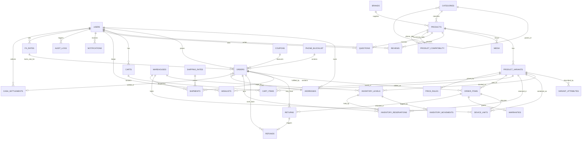

<div dir="rtl">

## 3. نموذج البيانات ومخطط قاعدة البيانات

### 3.1 مبادئ النمذجة والاصطلاحات

قاعدة البيانات PostgreSQL 16 مع Prisma ORM. الاصطلاحات مُلزِمة عبر كل الجداول:

| البند | القاعدة |
|---|---|
| تسمية الجداول | `snake_case` بصيغة الجمع (`product_variants`, `returns`, `audit_logs`, `users`)، والنماذج في Prisma بصيغة `PascalCase` مع `@@map` |
| المفتاح الأساسي | `id UUID` أصلي مولّد بنمط UUIDv7 (ترتيب زمني يقلل تشظّي فهرس B-Tree مقارنة بـ UUIDv4)، عبر امتداد `pg_uuidv7` أو في طبقة التطبيق عند غيابه. **داخلي فقط** |
| المعرّف العام | كل كيان يظهر في رابط عام أو في استجابة لغير مالكه يحمل `public_id CHAR(12) UNIQUE NOT NULL` مولَّداً عشوائياً (Base32 بلا حروف ملتبسة). **السبب**: UUIDv7 يحمل طابعاً زمنياً، فمن معرّفَي طلبين يمكن تقدير عدد الطلبات اليومية — وهي معلومة تجارية لا يجوز تسريبها في رابط. المعرّف الداخلي لا يخرج في أي استجابة عامة |
| الطوابع الزمنية | `created_at`, `updated_at` من نوع `TIMESTAMPTZ` مخزّنة بـ UTC، والعرض بتوقيت `Asia/Damascus` في طبقة الواجهة |
| المبالغ المالية | **التخزين المرجعي بالدولار الأمريكي**: أعداد صحيحة بالسنتات في أعمدة `*_usd_cents BIGINT` حصراً (ممنوع `FLOAT` وممنوع `NUMERIC`/`Decimal` للمبالغ). عمود `currency CHAR(3)` يخصّ **العرض** فقط وافتراضه `SYP`. المبالغ المشتقّة بالليرة السورية تُحسب من `fx_rates` وتُخزَّن فقط حيث يلزم تثبيتها (`orders`, `refunds`, `cash_settlements`) في أعمدة `*_syp BIGINT` بالليرة الكاملة بلا كسور |
| التقريب النقدي | كل مبلغ يُطلب نقداً من العميل يُقرَّب لأقرب **1000 ليرة سورية** ويُخزَّن مقرَّباً (`CHECK (x % 1000 = 0)`) لأن الفئات النقدية الصغيرة غير متداولة عملياً |
| النصوص المعروضة | `JSONB` بمفتاحين `ar` و`en` (راجع 3.6) |
| الحذف | حذف ناعم (soft delete) عبر `deleted_at TIMESTAMPTZ NULL` للكيانات ذات المرجعية التاريخية |
| الحالات | أنواع `ENUM` أصلية في PostgreSQL لا سلاسل نصية حرة |
| الامتدادات | `pgcrypto`, `pg_trgm`, `btree_gin`, `unaccent`, `ltree`, و`pg_uuidv7` عند توفره على البيئة |

قاعدة العملة بجملة واحدة: **السعر يُدخَل ويُخزَّن ويُقارَن بالدولار، ويُعرَض بالليرة**. أي عمود يخالف هذا الاصطلاح خطأ في المراجعة.

### 3.2 مخطط الكيانات والعلاقات (ERD)



### 3.3 الجداول الأساسية

**الهوية والعناوين**

| الجدول | الأعمدة الرئيسية | القيود |
|---|---|---|
| `users` | `id`, `phone_e164 VARCHAR(16)`, `phone_verified_at`, `email CITEXT NULL`, `full_name`, `role user_role`, `locale CHAR(2) DEFAULT 'ar'`, `display_currency CHAR(3) DEFAULT 'SYP'`, `status`, `last_login_at`, `deleted_at` | `UNIQUE(phone_e164) WHERE deleted_at IS NULL`، `CHECK (phone_e164 ~ '^\+9639[0-9]{8}$')` (أرقام الجوال السورية على سوريتل وMTN سوريا) |
| `addresses` | `id`, `user_id FK`, `label`, `recipient_name`, `governorate governorate NOT NULL`, `city VARCHAR(64) NOT NULL`, `neighborhood VARCHAR(64)`, `street VARCHAR(96)`, `landmark VARCHAR(120) NOT NULL`, `details TEXT`, `phone VARCHAR(16) NOT NULL`, `alt_phone VARCHAR(16) NULL`, `geo_lat NUMERIC(9,6) NULL`, `geo_lng NUMERIC(9,6) NULL`, `is_default BOOLEAN`, `deleted_at` | `UNIQUE(user_id) WHERE is_default AND deleted_at IS NULL`، `CHECK (length(landmark) >= 3)`، `CHECK (phone ~ '^\+9639[0-9]{8}$')`، `CHECK (alt_phone IS NULL OR alt_phone ~ '^\+963[0-9]{8,9}$')` |

`landmark` (معلم قريب) **إلزامي** لأن العناوين الرسمية في سوريا غير موثوقة عملياً، والمندوب يصل بالمعلم والهاتف لا بالشارع. لا يوجد رمز بريدي ولا رقم مبنى إلزامي ولا أي حقل عنوان مستورد من سوق آخر؛ والإحداثيات اختيارية تماماً لأن كثيراً من العملاء لن يشاركوا الموقع.

```sql
CREATE TYPE governorate AS ENUM (
  'DAMASCUS','RIF_DIMASHQ','ALEPPO','HOMS','HAMA','LATAKIA','TARTUS',
  'IDLIB','DEIR_EZZOR','HASAKAH','RAQQA','DARAA','SUWAYDA','QUNEITRA'
);
```

**الكتالوج**

| الجدول | الأعمدة الرئيسية | القيود |
|---|---|---|
| `brands` | `id`, `slug`, `name JSONB`, `logo_media_id FK`, `country_of_origin`, `is_active` | `UNIQUE(slug)` |
| `categories` | `id`, `parent_id FK self`, `slug`, `name JSONB`, `path LTREE`, `depth SMALLINT`, `sort_order`, `icon`, `seo JSONB` | `UNIQUE(slug)`، `CHECK (depth <= 4)` |
| `products` | `id`, `slug`, `brand_id FK`, `category_id FK`, `name JSONB`, `short_desc JSONB`, `description JSONB`, `spec JSONB`, `release_year SMALLINT`, `status`, `rating_avg NUMERIC(2,1)`, `rating_count`, `deleted_at` | `UNIQUE(slug) WHERE deleted_at IS NULL` |
| `product_variants` | `id`, `product_id FK`, `sku VARCHAR(40)`, `barcode`, `color_code`, `color_name JSONB`, `storage_gb SMALLINT`, `ram_gb SMALLINT`, `network_gen network_gen`, `sim_type sim_type`, `dual_sim BOOLEAN NOT NULL DEFAULT false`, `esim_only BOOLEAN NOT NULL DEFAULT false`, `part_code VARCHAR(8) NULL`, `condition product_condition`, `battery_health_pct SMALLINT NULL`, `device_origin device_origin NOT NULL`, `warranty_type warranty_type NOT NULL`, `warranty_months SMALLINT NOT NULL`, `price_usd_cents BIGINT NOT NULL`, `compare_at_price_usd_cents BIGINT NULL`, `cost_price_usd_cents BIGINT NULL`, `currency CHAR(3) DEFAULT 'SYP'`, `weight_g INT`, `is_default`, `deleted_at` | `UNIQUE(sku)`، `UNIQUE(product_id, storage_gb, ram_gb, color_code, device_origin, part_code)`، `CHECK (price_usd_cents >= 0)`، `CHECK (NOT (dual_sim AND esim_only))`، `CHECK (part_code IS NULL OR part_code ~ '^[A-Z]{2}/A$')`، `CHECK (condition = 'NEW' OR battery_health_pct BETWEEN 1 AND 100)`، `CHECK (warranty_months >= 0)` |
| `product_compatibility` | `id`, `accessory_product_id FK`, `phone_product_id FK`, `note JSONB` | `UNIQUE(accessory_product_id, phone_product_id)`، فهرس على `phone_product_id` |
| `variant_attributes` | `id`, `variant_id FK`, `attr_key VARCHAR(48)`, `value_text JSONB`, `value_num NUMERIC(10,2)`, `value_bool`, `unit`, `is_filterable`, `is_comparable`, `sort_order` | `UNIQUE(variant_id, attr_key)` |
| `media` | `id`, `owner_type`, `owner_id`, `r2_key`, `url`, `kind media_kind`, `is_real_unit_photo BOOLEAN`, `width`, `height`, `blurhash`, `color_code`, `alt JSONB`, `sort_order` | `UNIQUE(r2_key)`، فهرس مركّب `(owner_type, owner_id, sort_order)` |

جدول `media` هو الجدول الوحيد للوسائط لكل الكيانات (منتجات، متغيرات، وحدات أجهزة، علامات، شهادات ضمان، إيصالات تسليم) عبر `owner_type`/`owner_id`؛ ولا يوجد جدول وسائط خاص بالمنتجات. عمود `color_code` يربط الصورة بلون المتغيّر لعرض معرض الصور المطابق للّون المختار، و`is_real_unit_photo` يميّز **الصور الحقيقية للجهاز المستعمل نفسه** (`owner_type='device_unit'`) عن صور الكتالوج التسويقية، وهو شرط نشر لأي متغيّر بحالة غير `NEW`.

**المخزون والمستودعات**

| الجدول | الأعمدة الرئيسية | القيود |
|---|---|---|
| `warehouses` | `id`, `code VARCHAR(8)`, `name JSONB`, `governorate governorate`, `city`, `priority SMALLINT`, `is_active` | `UNIQUE(code)` |
| `inventory_levels` | `id`, `variant_id FK`, `warehouse_id FK`, `on_hand INT`, `reserved INT`, `incoming INT`, `version INT` | `UNIQUE(variant_id, warehouse_id)`، `CHECK (on_hand >= 0 AND reserved >= 0 AND reserved <= on_hand)` |
| `inventory_reservations` | `id`, `variant_id FK`, `warehouse_id FK`, `cart_id FK NULL`, `order_id FK NULL`, `qty SMALLINT`, `kind reservation_kind`, `expires_at`, `released_at` | `CHECK (cart_id IS NOT NULL OR order_id IS NOT NULL)`، فهرس على `(expires_at) WHERE released_at IS NULL` |
| `inventory_movements` | `id`, `variant_id FK`, `warehouse_id FK`, `device_unit_id FK NULL`, `delta INT`, `reason movement_reason`, `ref_type`, `ref_id`, `actor_id`, `created_at` | دفتر حركات غير قابل للتعديل أو الحذف، فهرس `(variant_id, created_at DESC)` |
| `device_units` | `id`, `variant_id FK`, `warehouse_id FK`, `imei VARCHAR(15) NULL`, `imei2 VARCHAR(15) NULL`, `serial NULL`, `state device_unit_state`, `grade`, `battery_health_pct SMALLINT NULL`, `imei_check_status imei_check_status`, `imei_check_at`, `imei_check_report JSONB`, `order_item_id FK NULL`, `warranty_type warranty_type`, `warranty_start_at`, `warranty_end_at` | `UNIQUE(imei) WHERE imei IS NOT NULL`، `CHECK (imei ~ '^[0-9]{15}$')` |

نموذج المخزون **مزدوج**: `inventory_levels` هو مصدر الكمية الوحيد لكل (متغيّر، مستودع)، والكمية المتاحة = `on_hand − reserved` تُحسب من هذين العمودين مع **قفل متفائل** على `version` عند كل تحديث (`UPDATE … WHERE version = $1`)، ويُخزَّن ملخّصها في Redis بمهلة 60 ثانية. الحجوزات المرنة والمثبّتة تُسجَّل صفوفاً في `inventory_reservations`، وكل تغيّر في الكمية يُقيَّد في `inventory_movements` وهو الاسم الوحيد لدفتر الحركات. وبالتوازي يوفّر `device_units` تتبّعاً **بالوحدة (unit-level)** للأجهزة التي تتطلب IMEI، ما يتيح ربط الضمان والإرجاع وفحص IMEI بالجهاز نفسه؛ أما الملحقات (شواحن، أغطية) فلا صفوف لها في `device_units` وتُدار بالكمية فقط.

**قيد الاتساق مفروض داخل المعاملة نفسها، لا بمهمة دورية.** للفئات التي تتطلب IMEI يجب أن يساوي عدد صفوف `device_units` بحالة `IN_STOCK` قيمة `on_hand` لنفس (المتغيّر، المستودع)، ويُفرض ذلك بمُحفِّز (trigger) مؤجَّل إلى نهاية المعاملة:

```sql
CREATE CONSTRAINT TRIGGER trg_units_match_levels
  AFTER INSERT OR UPDATE OR DELETE ON device_units
  DEFERRABLE INITIALLY DEFERRED
  FOR EACH ROW EXECUTE FUNCTION assert_units_match_levels();
-- الدالة تقارن COUNT(device_units WHERE state='IN_STOCK') بـ inventory_levels.on_hand
-- لنفس (variant_id, warehouse_id) وترفع استثناءً عند الاختلاف، فتفشل المعاملة كلها.
```

سبب هذا التشديد أن الاعتماد على مهمة تدقيق أسبوعية يعني اكتشاف الانحراف **بعد أسبوع من البيع الزائد**، وهو زمن كافٍ لبيع أجهزة غير موجودة والوعد بتسليمها. مهمة `maint.stock-reconcile` الأسبوعية (القسم رقم 11) تبقى قائمة بوصفها **شبكة أمان** تكشف الانحراف الناتج عن تدخل يدوي مباشر في قاعدة البيانات أو عن استعادة نسخة احتياطية، لا بوصفها آلية الكشف الأساسية.

**مهل الحجز** (قيمة واحدة معتمدة في الوثيقة كلها):

| نوع الحجز | `kind` | المهلة | ما ينهيها |
|---|---|---|---|
| حجز السلة المرن | `SOFT_HOLD` | **15 دقيقة** من آخر تعديل على السلة | `inventory.release-reservations` كل 5 دقائق |
| حجز الطلب الأوّلي | `ORDER_HOLD` | **ساعتان** من إنشاء الطلب | التأكيد (يتحوّل إلى `SALE`)، أو انقضاء الساعتين بلا تفاعل من العميل |
| حجز الطلب المُمدَّد | `ORDER_HOLD_EXT` | حتى **48 ساعة** من إنشاء الطلب، ويُمنح بعد أول تفاعل ناجح مع العميل | التأكيد، أو `orders.expire-pending` بعد 48 ساعة أو 3 محاولات فاشلة |

**لماذا حجزان لا حجز واحد:** الهواتف تُتتبع بالوحدة، وحجز 48 ساعة لكل طلب غير مؤكَّد يُجمّد جهازاً قد يكون آخر قطعة، فيكفي طلب واحد غير جاد لتعطيل بيعه يومين. لذلك يُفصل **عمر الطلب** (48 ساعة، وهي نافذة التأكيد) عن **عمر الحجز** (ساعتان قابلة للتمديد). الطلب الذي انتهى حجزه يبقى قائماً في `PENDING_CONFIRMATION` لكن بلا مخزون محجوز، ويُعاد التحقق من التوفر إلزامياً لحظة التأكيد: إن نفد المخزون يُعرض على العميل بديل أو إلغاء بلا رسوم.

**قاعدة الندرة:** إذا كان `on_hand ≤ 2` للمتغيّر، فالحد الأقصى للتمديد **12 ساعة** لا 48، ويُخفَّض سقف الطلبات المفتوحة لكل رقم على هذا المتغيّر إلى واحد. الأجهزة النادرة هي بالضبط ما لا يحتمل التجميد.

عند إنشاء الطلب يُرقّى `SOFT_HOLD` إلى `ORDER_HOLD` بنفس الصف مع `expires_at = now() + interval '2 hours'`، ويُمدَّد إلى `ORDER_HOLD_EXT` عند أول تفاعل ناجح. أما `orders.price_locked_until` فيُثبَّت 48 ساعة عند الإنشاء ولا يرتبط بعمر الحجز.

**السلة والطلبات والتحصيل النقدي**

| الجدول | الأعمدة الرئيسية | القيود |
|---|---|---|
| `carts` | `id`, `user_id FK NULL`, `anon_token UUID NULL`, `display_currency CHAR(3) DEFAULT 'SYP'`, `coupon_id FK NULL`, `expires_at`, `merged_into_id` | `CHECK (user_id IS NOT NULL OR anon_token IS NOT NULL)` |
| `cart_items` | `id`, `cart_id FK`, `variant_id FK`, `qty SMALLINT`, `unit_price_usd_cents BIGINT`, `added_at` | `UNIQUE(cart_id, variant_id)`، `CHECK (qty BETWEEN 1 AND 10)` |
| `orders` | `id`, `order_no VARCHAR(14)`, `user_id FK`, `status order_status`, `shipping_address_id FK`, `subtotal_usd_cents BIGINT`, `discount_total_usd_cents BIGINT`, `shipping_total_usd_cents BIGINT`, `tax_rate_bp INT DEFAULT 0`, `tax_amount_usd_cents BIGINT`, `total_usd_cents BIGINT`, `fx_rate NUMERIC(14,4)`, `fx_rate_id FK`, `total_syp BIGINT`, `rounding_diff_syp INT NOT NULL DEFAULT 0`, `fx_stale BOOLEAN NOT NULL DEFAULT false`, `price_locked_until TIMESTAMPTZ`, `currency CHAR(3) DEFAULT 'SYP'`, `payment_method payment_method NOT NULL DEFAULT 'COD'`, `payment_status payment_status NOT NULL DEFAULT 'PENDING'`, `collected_amount_syp BIGINT NULL`, `collected_at TIMESTAMPTZ NULL`, `collected_by UUID NULL`, `settlement_id FK NULL`, `confirmation_attempts SMALLINT DEFAULT 0`, `confirmed_by UUID NULL`, `confirmed_at TIMESTAMPTZ NULL`, `confirmation_notes TEXT NULL`, `coupon_id`, `placed_at`, `notes` | `UNIQUE(order_no)`، `CHECK (order_no ~ '^TS-[0-9]{4}-[0-9]{6}$')`، `CHECK (total_usd_cents >= 0)`، `CHECK (total_syp % 1000 = 0)`، `CHECK (tax_rate_bp BETWEEN 0 AND 10000)`، `CHECK (confirmation_attempts <= 3)`، `CHECK (payment_status <> 'COLLECTED' OR collected_at IS NOT NULL)` |
| `order_items` | `id`, `order_id FK`, `variant_id FK`, `device_unit_id FK NULL`, `sku_snapshot`, `name_snapshot JSONB`, `part_code_snapshot`, `qty`, `unit_price_usd_cents BIGINT`, `line_total_usd_cents BIGINT` | فهرس `(order_id)`، لا حذف ناعم |
| `cash_settlements` | `id`, `settlement_no VARCHAR(16)`, `collector_type collector_type`, `collector_id UUID`, `settlement_date DATE`, `orders_count INT`, `expected_amount_syp BIGINT`, `collected_amount_syp BIGINT`, `variance_syp BIGINT`, `delivery_commission_syp BIGINT`, `state settlement_state`, `reconciled_at`, `reconciled_by`, `notes` | `UNIQUE(collector_type, collector_id, settlement_date)`، `CHECK (variance_syp = collected_amount_syp - expected_amount_syp)` |
| `refunds` | `id`, `order_id FK`, `return_id FK NULL`, `method refund_method NOT NULL DEFAULT 'CASH'`, `amount_usd_cents BIGINT`, `fx_rate NUMERIC(14,4)`, `amount_syp BIGINT`, `imei_verified BOOLEAN DEFAULT false`, `device_matched BOOLEAN DEFAULT false`, `state refund_state`, `approved_by`, `disbursed_at`, `receipt_media_id FK NULL` | `CHECK (amount_syp % 1000 = 0)`، `CHECK (state <> 'DISBURSED' OR (imei_verified AND device_matched))` — لا استرداد نقدي إلا بعد فحص IMEI ومطابقة الجهاز المُعاد بالجهاز المُسلَّم |
| `phone_blocklist` | `id`, `phone_e164`, `reason`, `failed_deliveries_count`, `wasted_shipping_usd_cents`, `blocked_until`, `created_by` | `UNIQUE(phone_e164) WHERE blocked_until > now()` |

**حساب مبالغ الطلب** (كل المبالغ المرجعية بالسنتات الأمريكية):

```
tax_amount_usd_cents = round(
  (subtotal_usd_cents - discount_total_usd_cents + shipping_total_usd_cents) * tax_rate_bp / 10000
)
total_usd_cents = subtotal_usd_cents - discount_total_usd_cents
                + shipping_total_usd_cents + tax_amount_usd_cents
total_syp = round_to_1000( total_usd_cents * fx_rate / 100 )
```

`tax_rate_bp` حقل رسوم **قابل للتهيئة بنقاط أساس** وقيمته الافتراضية `0`، أي لا رسوم مطبَّقة ما لم يفعّلها المدير. الأسعار المعروضة للعميل **نهائية وشاملة** أي رسوم مطبَّقة؛ لا يوجد أي مبلغ رسوم مستخرج من الإجمالي، ولا نسبة ثابتة مضمّنة في أي عمود. تُصدَر للطلب فاتورة/إيصال PDF قابل للطباعة يُرفَق مع الشحنة، ويُطبَع عليه المبلغ النقدي **مقرَّباً لأقرب 1000 ليرة** كما يظهر تماماً على شاشة المندوب.

**تثبيت سعر الصرف**: عند إنشاء الطلب تُنسَخ قيمة السعر السارية من `fx_rates` إلى `orders.fx_rate` مع `fx_rate_id` للأثر، ويُضبط `price_locked_until = placed_at + interval '48 hours'`. بعد انقضاء النافذة يمنع النظام الشحن ويُعيد التسعير بسعر الصرف الجاري مع إشعار العميل قبل التجهيز.

**الدفع**: `payment_method` نوع معدود بقيمة واحدة `COD`، ولا توجد خطوة دفع في إتمام الطلب إطلاقاً ولا بوابة دفع ولا أي طبقة تجريد للدفع. إضافة طريقة دفع مستقبلاً = قيمة جديدة في `payment_method` وخطوة إضافية في التدفق، دون إعادة هيكلة. حقول التحصيل (`payment_status`, `collected_amount_syp`, `collected_at`, `collected_by`, `settlement_id`) **مستقلة تماماً عن `status`**: الطلب يمكن أن يكون `DELIVERED` و`payment_status='PARTIAL'` ريثما تُسوّى الفروقات في `cash_settlements`. قائمة قيم `order_status` المعتمدة مرجعها القسم رقم 8، وضوابط رفض الاستلام (التأكيد الهاتفي الإلزامي، سقف قيمة الطلب، حد الطلبات المفتوحة لكل رقم، `phone_blocklist`) مفصّلة هناك.

**ما بعد البيع والشحن والمحتوى والتسويق**

| الجدول | الأعمدة الرئيسية | ملاحظات |
|---|---|---|
| `shipping_rates` | `id`, `governorate governorate`, `method shipping_method`, `base_fee_usd_cents BIGINT`, `per_kg_fee_usd_cents BIGINT`, `eta_min_days SMALLINT`, `eta_max_days SMALLINT`, `is_active` | `UNIQUE(governorate, method)`، `CHECK (eta_min_days <= eta_max_days)` |
| `shipments` | `id`, `order_id`, `warehouse_id`, `method shipping_method`, `courier_id UUID NULL`, `office_name VARCHAR(64) NULL`, `waybill_no VARCHAR(32) NULL`, `receipt_media_id FK NULL`, `status shipment_status`, `dispatched_at`, `delivered_at`, `delivery_proof_media_id FK NULL`, `updated_by`, `updated_source update_source` | `UNIQUE(office_name, waybill_no) WHERE waybill_no IS NOT NULL`، `CHECK (method <> 'INTERCITY_OFFICE' OR (office_name IS NOT NULL AND waybill_no IS NOT NULL))` |
| `returns` | `id`, `order_id`, `order_item_id`, `reason_code`, `state return_state`, `requested_at`, `resolved_at`, `refund_amount_usd_cents BIGINT`, `imei_checked BOOLEAN`, `inspection_notes` | نافذة الإرجاع 7 أيام تُحسب من `delivered_at`؛ الاسترداد ينشئ صفاً في `refunds` بطريقة `CASH` |
| `warranties` | `id`, `order_item_id`, `device_unit_id`, `type warranty_type`, `months SMALLINT`, `starts_at`, `expires_at`, `provider_name`, `certificate_media_id` | `expires_at` عمود مولّد `GENERATED ALWAYS AS (starts_at + months * INTERVAL '1 month')` |
| `reviews` | `id`, `product_id`, `user_id`, `order_item_id`, `rating SMALLINT`, `title`, `body`, `is_verified_purchase`, `status`, `helpful_count` | `UNIQUE(user_id, order_item_id)`، `CHECK (rating BETWEEN 1 AND 5)` |
| `questions` | `id`, `product_id`, `user_id`, `body`, `answer_body`, `answered_by`, `answered_at`, `status` | فهرس جزئي على `status='published'` |
| `coupons` | `id`, `code VARCHAR(24)`, `type coupon_type`, `value BIGINT` (سنتات دولارية عند الخصم الثابت، ونسبة مئوية صحيحة عند النسبي)، `min_subtotal_usd_cents BIGINT`, `max_discount_usd_cents BIGINT`, `usage_limit`, `used_count`, `per_user_limit`, `starts_at`, `ends_at` | `UNIQUE(upper(code))` |
| `price_rules` | `id`, `scope`, `target_id`, `kind price_rule_kind`, `amount BIGINT` (سنتات دولارية أو نسبة صحيحة حسب `kind`)، `priority`, `starts_at`, `ends_at`, `stackable BOOLEAN` | تفاصيل الأولوية في القسم رقم 7 |
| `fx_rates` | `id`, `base CHAR(3) DEFAULT 'USD'`, `quote CHAR(3) DEFAULT 'SYP'`, `rate NUMERIC(14,4)`, `effective_from TIMESTAMPTZ`, `valid_until TIMESTAMPTZ NOT NULL`, `safety_margin_bp INT DEFAULT 0`, `set_by FK users`, `note`, `created_at` | `UNIQUE(quote, effective_from)`، `CHECK (rate > 0)`، `CHECK (valid_until > effective_from)`؛ سجل تاريخي غير قابل للتعديل، والسعر الساري هو أحدث صف بـ `effective_from <= now() < valid_until` |
| `wishlists` | `id`, `user_id`, `variant_id`, `notify_on_drop BOOLEAN`, `created_at` | `UNIQUE(user_id, variant_id)` — المفضلة على مستوى **المتغيّر** لا المنتج |
| `notifications` | `id`, `user_id`, `channel notification_channel`, `template_key`, `payload JSONB`, `sent_at`, `read_at`, `dedupe_key` | `UNIQUE(dedupe_key)`؛ ترتيب القنوات التشغيلي في القسم رقم 12 |
| `audit_logs` | `id`, `actor_id`, `actor_role`, `action`, `entity_type`, `entity_id`, `diff JSONB`, `ip INET`, `user_agent`, `created_at` | مقسّم شهرياً (partitioned) |

جدول `fx_rates` يحدّثه المدير **يدوياً** من لوحة التحكم؛ لا سحب آلي من أي مصدر خارجي، ولا تعديل على صف قديم — كل تغيير صف جديد بـ `effective_from` جديد، ما يجعل إعادة بناء أي فاتورة تاريخية ممكنة بدقة.

**التقادم ليس حالة مسموحة.** التحديث اليدوي يعني أن نسياناً بشرياً واحداً في سوق متقلب يجعل المتجر يبيع بسعر ميت ويخسر صامتاً، لذلك لكل سعر `valid_until` إلزامي (افتراضه 24 ساعة من `effective_from`)، وسلوك النظام عند انقضائه محدَّد سلفاً ولا يُترك للاجتهاد:

| المرحلة | الشرط | سلوك النظام |
| --- | --- | --- |
| تنبيه مبكر | تبقّى أقل من 4 ساعات على `valid_until` | إشعار واتساب للمدير + لافتة في لوحة التحكم |
| هامش أمان | انقضى `valid_until` بأقل من 12 ساعة | يستمر البيع بالسعر الأخير مضافاً إليه `safety_margin_bp` (افتراضه 300 نقطة أساس = 3%)، مع وسم داخلي `fx_stale = true` على كل طلب ينشأ في هذه الفترة |
| إيقاف البيع | انقضى `valid_until` بأكثر من 12 ساعة | يتوقف استقبال الطلبات تلقائياً وتُعرض رسالة «تحديث الأسعار جارٍ»، ويبقى التصفح والبحث عاملَين |

الطلبات الموسومة `fx_stale` تظهر في تقرير منفصل لأنها الأرجح انحرافاً في الهامش. وإيقاف البيع قرار مؤلم لكنه أرخص من بيع مئة جهاز بسعر أمس.

**الشحن داخل سوريا**: لا وجود لأي تكامل webhook إلزامي مع شركة شحن. تحديث حالة الشحنة يدوي من لوحة التحكم أو من واجهة المندوب (`updated_source ENUM('ADMIN','COURIER_APP','OFFICE_SYNC','PARTNER_WEBHOOK')`)، وقيمة `PARTNER_WEBHOOK` محجوزة لدعم اختياري إن توفّر شريك لاحقاً. لشحنات مكاتب النقل البري بين المحافظات يُسجَّل `office_name` (أمثلة قابلة للاستبدال: القدموس، الفؤاد، الأهلية) و`waybill_no` وصورة الإيصال في `receipt_media_id`. مهل `shipping_rates` الواقعية: داخل دمشق 1–2 يوم (24–48 ساعة)، وبين المحافظات 2–5 أيام.

### 3.4 نمذجة المتغيرات وسمات الجوّالات

نعتمد نموذجاً هجيناً: السمات عالية التكرار في البحث والتصفية تُرقّى إلى **أعمدة أصلية** في `product_variants` (`storage_gb`, `ram_gb`, `color_code`, `network_gen`, `sim_type`, `dual_sim`, `esim_only`, `part_code`, `condition`, `device_origin`) لأنها تدخل في المفتاح الفريد وفي فهارس التصفية؛ وبقية السمات الوصفية تُخزَّن صفوفاً في `variant_attributes` بمفتاح موحّد. الأنواع المعدودة:

```sql
CREATE TYPE network_gen        AS ENUM ('4G','5G','5G_MMWAVE');
CREATE TYPE sim_type           AS ENUM ('NANO_SINGLE','NANO_DUAL','NANO_ESIM','ESIM_ONLY');
CREATE TYPE product_condition  AS ENUM ('NEW','OPEN_BOX','REFURBISHED','USED_A','USED_B');
CREATE TYPE device_origin      AS ENUM ('GULF','EURO','US','ASIA','OTHER');
CREATE TYPE warranty_type      AS ENUM ('STORE','AGENT','IMPORTER','NONE');
CREATE TYPE device_unit_state  AS ENUM ('IN_STOCK','ALLOCATED','SOLD','RETURNED','RMA');
CREATE TYPE imei_check_status  AS ENUM ('NOT_CHECKED','CLEAN','BLACKLISTED','LOCKED','MISMATCH');
CREATE TYPE reservation_kind   AS ENUM ('SOFT_HOLD','ORDER_HOLD','ORDER_HOLD_EXT');
CREATE TYPE movement_reason    AS ENUM (
  'RECEIPT','RESERVE','RELEASE','SALE','RETURN',
  'TRANSFER_IN','TRANSFER_OUT','ADJUSTMENT','RMA'
);
CREATE TYPE payment_method     AS ENUM ('COD');
CREATE TYPE payment_status     AS ENUM ('PENDING','COLLECTED','PARTIAL','REFUNDED');
CREATE TYPE collector_type     AS ENUM ('COURIER','TRANSPORT_OFFICE');
CREATE TYPE settlement_state   AS ENUM ('OPEN','RECONCILED','DISPUTED','SETTLED');
CREATE TYPE refund_method      AS ENUM ('CASH');
CREATE TYPE refund_state       AS ENUM ('REQUESTED','APPROVED','DISBURSED','REJECTED');
CREATE TYPE shipping_method    AS ENUM ('COURIER_INTRACITY','INTERCITY_OFFICE','POST');
CREATE TYPE update_source      AS ENUM ('ADMIN','COURIER_APP','OFFICE_SYNC','PARTNER_WEBHOOK');
```

`movement_reason` أعلاه هو **القائمة الكاملة الوحيدة** وتغطي كل أسباب الحركة المستعملة في القسم رقم 7 بحروف كبيرة، بما فيها الحجز والتحرير المنفصلان عن البيع، وحركتَي النقل بين المستودعات المتقابلتين (`TRANSFER_IN`/`TRANSFER_OUT`).

انتقال حالة الجهاز أحادي الاتجاه: `IN_STOCK → ALLOCATED → SOLD → RETURNED / RMA`، ويُقيَّد كل انتقال في `inventory_movements`.

مفاتيح `attr_key` القياسية للجوّالات: `screen_size_in`, `screen_tech`, `refresh_rate_hz`, `chipset`, `camera_main_mp`, `camera_ultrawide_mp`, `camera_front_mp`, `battery_mah`, `charging_w`, `os_name`, `os_version`, `water_resistance`, `nfc`, `weight_g`. القيم الرقمية في `value_num` مع `unit` لتمكين المدى (`range`) في التصفية، والنصية في `value_text` بصيغة ثنائية اللغة.

**فروق السوق السورية الحاسمة على مستوى المتغيّر** (لا المنتج)، وكلها تظهر في صفحة المنتج وفي المرشحات:

| الحقل | لماذا يغيّر السعر | حالة الحقل |
|---|---|---|
| `device_origin` | مصدر الاستيراد يحدّد الملحقات والشاحن ووضع الكفالة وقبول السوق | `NOT NULL`، ضمن المفتاح الفريد و`filterableAttributes` |
| `part_code` | رمز النسخة (`ZA/A`, `LL/A`, `AA/A`) يفرق بين نسخ متطابقة المواصفات بفارق سعري ملموس | ضمن المفتاح الفريد وضمن المرشحات |
| `dual_sim` | الشريحتان مطلب واسع في السوق ويرفع السعر | `NOT NULL` |
| `esim_only` | نسخ eSIM فقط أرخص وأصعب تصريفاً محلياً، ويجب التحذير منها صراحةً | `NOT NULL` |
| `warranty_type` + `warranty_months` | كفالة المحل هي الغالبة عملياً: 12 شهراً افتراضياً للجديد و3 أشهر للمستعمل | كلاهما `NOT NULL` |
| `condition` | الجديد/المفتوح/المجدد/المستعمل A/B فروق سعرية كبيرة داخل المنتج نفسه | `NOT NULL` |
| `battery_health_pct` | لا يُقبل عرض مستعمل بلا نسبة بطارية | إلزامي لكل `condition <> 'NEW'` بقيد `CHECK` |

يُمنع نشر أي متغيّر تنقصه هذه الحقول، وتُنسَخ إلى `device_units` و`warranties` عند البيع. ولكل متغيّر غير جديد **صور حقيقية للجهاز نفسه** (`media.is_real_unit_photo = true` على `owner_type='device_unit'`) ونتيجة فحص IMEI في `device_units.imei_check_status` تُعرض للعميل قبل الشراء — وهما أقوى عاملَي ثقة في هذا السوق.

توافق الملحقات مع الهواتف يُنمذَج علائقياً في `product_compatibility(id, accessory_product_id, phone_product_id, note JSONB)` مع `UNIQUE(accessory_product_id, phone_product_id)` وفهرس على `phone_product_id`؛ وحقل `compatible_model_ids` في فهرس البحث مشتق من هذا الجدول، ولا توجد قائمة نصية حرة داخل المنتج.

### 3.5 مقتطف Prisma

```prisma
model ProductVariant {
  id          String           @id @default(dbgenerated("uuidv7()")) @db.Uuid
  productId   String           @map("product_id") @db.Uuid
  product     Product          @relation(fields: [productId], references: [id], onDelete: Restrict)
  sku         String           @unique @db.VarChar(40)
  colorCode   String           @map("color_code") @db.VarChar(16)
  colorName   Json             @map("color_name") @db.JsonB
  storageGb   Int              @map("storage_gb") @db.SmallInt
  ramGb       Int              @map("ram_gb") @db.SmallInt
  networkGen  NetworkGen       @default(FIVE_G) @map("network_gen")
  simType     SimType          @map("sim_type")
  dualSim     Boolean          @default(false) @map("dual_sim")
  esimOnly    Boolean          @default(false) @map("esim_only")
  partCode    String?          @map("part_code") @db.VarChar(8)   // ZA/A, LL/A, AA/A
  condition   ProductCondition @default(NEW)
  batteryHealthPct Int?        @map("battery_health_pct") @db.SmallInt // إلزامي لغير الجديد
  deviceOrigin   DeviceOrigin  @map("device_origin")
  warrantyType   WarrantyType  @default(STORE) @map("warranty_type")
  warrantyMonths Int           @map("warranty_months") @db.SmallInt
  priceUsdCents        BigInt  @map("price_usd_cents") @db.BigInt          // سنتات دولارية
  compareAtPriceUsdCents BigInt? @map("compare_at_price_usd_cents") @db.BigInt
  costPriceUsdCents    BigInt?  @map("cost_price_usd_cents") @db.BigInt
  currency    String           @default("SYP") @db.Char(3)   // عملة العرض فقط
  isDefault   Boolean          @default(false) @map("is_default")
  levels      InventoryLevel[]
  units       DeviceUnit[]
  attributes  VariantAttribute[]
  deletedAt   DateTime?        @map("deleted_at") @db.Timestamptz(3)

  @@unique([productId, storageGb, ramGb, colorCode, deviceOrigin, partCode])
  @@index([priceUsdCents])
  @@index([condition, deviceOrigin])
  @@map("product_variants")
}

model Order {
  id            String   @id @default(dbgenerated("uuidv7()")) @db.Uuid
  orderNo       String   @unique @map("order_no") @db.VarChar(14)   // TS-YYMM-NNNNNN
  userId        String   @map("user_id") @db.Uuid
  status        OrderStatus   @default(PENDING_CONFIRMATION)
  shippingAddressId String   @map("shipping_address_id") @db.Uuid

  subtotalUsdCents      BigInt @map("subtotal_usd_cents") @db.BigInt
  discountTotalUsdCents BigInt @default(0) @map("discount_total_usd_cents") @db.BigInt
  shippingTotalUsdCents BigInt @default(0) @map("shipping_total_usd_cents") @db.BigInt
  taxRateBp             Int    @default(0) @map("tax_rate_bp")        // نقاط أساس
  taxAmountUsdCents     BigInt @default(0) @map("tax_amount_usd_cents") @db.BigInt
  totalUsdCents         BigInt @map("total_usd_cents") @db.BigInt

  fxRate           Decimal  @map("fx_rate") @db.Decimal(14, 4)   // نسبة لا مبلغ
  fxRateId         String   @map("fx_rate_id") @db.Uuid
  totalSyp         BigInt   @map("total_syp") @db.BigInt         // مقرَّب لأقرب 1000
  priceLockedUntil DateTime @map("price_locked_until") @db.Timestamptz(3)
  currency         String   @default("SYP") @db.Char(3)

  paymentMethod      PaymentMethod @default(COD) @map("payment_method")
  paymentStatus      PaymentStatus @default(PENDING) @map("payment_status")
  collectedAmountSyp BigInt?   @map("collected_amount_syp") @db.BigInt
  collectedAt        DateTime? @map("collected_at") @db.Timestamptz(3)
  collectedBy        String?   @map("collected_by") @db.Uuid
  settlementId       String?   @map("settlement_id") @db.Uuid

  confirmationAttempts Int       @default(0) @map("confirmation_attempts") @db.SmallInt
  confirmedBy          String?   @map("confirmed_by") @db.Uuid
  confirmedAt          DateTime? @map("confirmed_at") @db.Timestamptz(3)
  confirmationNotes    String?   @map("confirmation_notes")

  items      OrderItem[]
  shipments  Shipment[]
  refunds    Refund[]
  placedAt   DateTime @default(now()) @map("placed_at") @db.Timestamptz(3)

  @@index([userId, placedAt(sort: Desc)])
  @@index([status, priceLockedUntil])
  @@index([paymentStatus, collectedBy])
  @@map("orders")
}

model FxRate {
  id            String   @id @default(dbgenerated("uuidv7()")) @db.Uuid
  base          String   @default("USD") @db.Char(3)
  quote         String   @default("SYP") @db.Char(3)
  rate          Decimal  @db.Decimal(14, 4)
  effectiveFrom DateTime @map("effective_from") @db.Timestamptz(3)
  setBy         String   @map("set_by") @db.Uuid
  note          String?
  createdAt     DateTime @default(now()) @map("created_at") @db.Timestamptz(3)

  @@unique([quote, effectiveFrom])
  @@index([quote, effectiveFrom(sort: Desc)])
  @@map("fx_rates")
}

model InventoryLevel {
  id          String          @id @default(dbgenerated("uuidv7()")) @db.Uuid
  variantId   String          @map("variant_id") @db.Uuid
  variant     ProductVariant  @relation(fields: [variantId], references: [id], onDelete: Restrict)
  warehouseId String          @map("warehouse_id") @db.Uuid
  onHand      Int             @default(0) @map("on_hand")
  reserved    Int             @default(0)
  incoming    Int             @default(0)
  version     Int             @default(0)   // قفل متفائل

  @@unique([variantId, warehouseId])
  @@index([warehouseId])
  @@map("inventory_levels")
}

model DeviceUnit {
  id          String          @id @default(dbgenerated("uuidv7()")) @db.Uuid
  variantId   String          @map("variant_id") @db.Uuid
  variant     ProductVariant  @relation(fields: [variantId], references: [id], onDelete: Restrict)
  warehouseId String          @map("warehouse_id") @db.Uuid
  imei        String?         @unique @db.VarChar(15)
  imei2       String?         @db.VarChar(15)
  serial      String?         @db.VarChar(40)
  state       DeviceUnitState @default(IN_STOCK)
  grade       String?         @db.VarChar(8)
  batteryHealthPct Int?       @map("battery_health_pct") @db.SmallInt
  imeiCheckStatus  ImeiCheckStatus @default(NOT_CHECKED) @map("imei_check_status")
  imeiCheckAt      DateTime?  @map("imei_check_at") @db.Timestamptz(3)
  imeiCheckReport  Json?      @map("imei_check_report") @db.JsonB
  orderItemId String?         @map("order_item_id") @db.Uuid
  warrantyType    WarrantyType @default(STORE) @map("warranty_type")
  warrantyStartAt DateTime?    @map("warranty_start_at") @db.Timestamptz(3)
  warrantyEndAt   DateTime?    @map("warranty_end_at") @db.Timestamptz(3)

  @@index([variantId, state])
  @@index([warehouseId, state])
  @@map("device_units")
}

model CashSettlement {
  id            String   @id @default(dbgenerated("uuidv7()")) @db.Uuid
  settlementNo  String   @unique @map("settlement_no") @db.VarChar(16)
  collectorType CollectorType @map("collector_type")
  collectorId   String   @map("collector_id") @db.Uuid
  settlementDate DateTime @map("settlement_date") @db.Date
  ordersCount   Int      @default(0) @map("orders_count")
  expectedAmountSyp  BigInt @map("expected_amount_syp") @db.BigInt
  collectedAmountSyp BigInt @default(0) @map("collected_amount_syp") @db.BigInt
  varianceSyp        BigInt @default(0) @map("variance_syp") @db.BigInt
  deliveryCommissionSyp BigInt @default(0) @map("delivery_commission_syp") @db.BigInt
  state         SettlementState @default(OPEN)
  reconciledAt  DateTime? @map("reconciled_at") @db.Timestamptz(3)

  @@unique([collectorType, collectorId, settlementDate])
  @@index([state, settlementDate])
  @@map("cash_settlements")
}
```

كل المبالغ `BigInt`: بالسنتات الأمريكية في الأعمدة المرجعية `*UsdCents`، وبالليرة الكاملة في الأعمدة المثبَّتة `*Syp`. `Decimal` مسموح فقط للنِّسب لا للمبالغ: `fxRate` و`ratingAvg`. ويُقرأ مستوى المخزون ويُحدَّث دائماً عبر `InventoryLevel` مع شرط `version` في جملة `UPDATE`.

### 3.6 الحقول متعددة اللغات

كل نص معروض يُخزَّن `JSONB` بالشكل `{"ar": "آيفون 17 برو", "en": "iPhone 17 Pro"}` بدلاً من جدول ترجمات منفصل، لأن اللغات المخطط لها اثنتان والقراءة أكثر بكثير من الكتابة. قيد التحقق يفرض وجود العربية:

```sql
ALTER TABLE products ADD CONSTRAINT products_name_ar_required
  CHECK (name ? 'ar' AND length(name->>'ar') BETWEEN 2 AND 200);
```

القراءة تتم عبر `COALESCE(name->>$locale, name->>'ar')`، ما يضمن سقوطاً آمناً (fallback) إلى العربية عند غياب الإنجليزية.

### 3.7 الفهارس والأداء

```sql
CREATE INDEX CONCURRENTLY idx_products_name_ar_trgm
  ON products USING gin ((name->>'ar') gin_trgm_ops) WHERE deleted_at IS NULL;
CREATE INDEX CONCURRENTLY idx_orders_user_recent
  ON orders (user_id, placed_at DESC) INCLUDE (status, total_usd_cents, total_syp);
CREATE INDEX CONCURRENTLY idx_orders_pending_confirmation
  ON orders (price_locked_until) WHERE status = 'PENDING_CONFIRMATION';
CREATE INDEX CONCURRENTLY idx_orders_cod_uncollected
  ON orders (collected_by, placed_at DESC) WHERE payment_status IN ('PENDING','PARTIAL');
CREATE INDEX CONCURRENTLY idx_orders_settlement
  ON orders (settlement_id) WHERE settlement_id IS NOT NULL;
CREATE INDEX CONCURRENTLY idx_fx_rates_current
  ON fx_rates (quote, effective_from DESC);
CREATE INDEX CONCURRENTLY idx_variants_market_filters
  ON product_variants (condition, device_origin, part_code, dual_sim)
  WHERE deleted_at IS NULL;
CREATE INDEX CONCURRENTLY idx_inv_levels_available
  ON inventory_levels (variant_id, warehouse_id) INCLUDE (on_hand, reserved, version);
CREATE INDEX CONCURRENTLY idx_device_units_in_stock
  ON device_units (variant_id, warehouse_id) WHERE state = 'IN_STOCK';
CREATE INDEX CONCURRENTLY idx_inv_reservations_expiry
  ON inventory_reservations (expires_at) WHERE released_at IS NULL;
CREATE INDEX CONCURRENTLY idx_shipments_waybill
  ON shipments (office_name, waybill_no) WHERE waybill_no IS NOT NULL;
CREATE INDEX CONCURRENTLY idx_shipping_rates_lookup
  ON shipping_rates (governorate, method) WHERE is_active;
CREATE INDEX CONCURRENTLY idx_addresses_governorate
  ON addresses (governorate, city) WHERE deleted_at IS NULL;
CREATE INDEX CONCURRENTLY idx_compat_phone
  ON product_compatibility (phone_product_id);
CREATE INDEX CONCURRENTLY idx_attrs_filterable
  ON variant_attributes (attr_key, value_num) WHERE is_filterable;
CREATE INDEX CONCURRENTLY idx_audit_created_brin
  ON audit_logs USING brin (created_at) WITH (pages_per_range = 32);
```

الميزانية: استعلام صفحة المنتج أقل من 30 ملّي ثانية p95، وقائمة الفئة أقل من 80 ملّي ثانية. البحث النصي الحر لا يمرّ على PostgreSQL بل على Meilisearch (راجع القسم رقم 6)، وفهارس `pg_trgm` مخصّصة للوحة الإدارة فقط. `audit_logs` مقسّم بالمدى الشهري مع احتفاظ 24 شهراً، و`orders` تبقى غير مقسّمة حتى 5 ملايين صف. `idx_orders_cod_uncollected` هو الفهرس الذي تعتمد عليه شاشة المندوب ومطابقة `cash_settlements` اليومية.

### 3.8 الترحيلات والبيانات الأولية والتدقيق

الترحيلات عبر `prisma migrate dev` محلياً و`prisma migrate deploy` في CI بأسلوب **توسيع ثم انكماش (expand/contract)**: إضافة العمود nullable → كتابة مزدوجة → ترحيل خلفي على دفعات 5000 صف عبر BullMQ → فرض `NOT NULL` → حذف القديم في إصدار لاحق. ممنوع `DROP COLUMN` في الترحيل نفسه الذي ينشر الكود.

**بيانات البذر — هذه الفقرة هي المصدر الوحيد لأرقام البذر في الوثيقة كلها**، ولا تُكرَّر أعدادها في أي قسم آخر. ملف `prisma/seed.ts` يزرع:

| المجموعة | الكمية | تفاصيل |
|---|---|---|
| العلامات التجارية | 14 | آبل، سامسونغ، شاومي، ريلمي، أوبو، هونر، تكنو، إنفينكس، نوكيا، أنكر… |
| الفئات | 26 بعمق 3 | جوالات، ملحقات، شواحن، سماعات، حمايات |
| المنتجات | 120 | منها 34 منتجاً مستعملاً/مجدداً |
| المتغيّرات | ~380 | موزّعة على `device_origin` و`part_code` و`condition` |
| المستودعات | 3 | `DAM-01` (دمشق)، `ALP-01` (حلب)، `LTK-01` (اللاذقية) |
| `inventory_levels` | صف لكل (متغيّر، مستودع) | يطابق مجموعه عدد صفوف `device_units` |
| `device_units` | 1200 | أرقام IMEI صالحة رقمياً (Luhn) ومطابقة لقيم `on_hand`، منها 300 وحدة `imei_check_status='CLEAN'` |
| `governorate` | 14 محافظة كاملة | مع عناوين نموذجية تحمل `landmark` واقعياً (مثل «مقابل دوار كفرسوسة»، «جانب سرايا حلب») |
| `shipping_rates` | 42 صفاً | 14 محافظة × 3 طرق شحن، بمهل 1–2 يوم داخل دمشق و2–5 أيام بين المحافظات |
| `fx_rates` | 6 صفوف تاريخية | آخرها هو السعر الساري، `set_by` حساب المدير |
| `users` | 5 | مدير واحد، موظّفا تأكيد هاتفي، مندوبان — بأرقام من نطاق `+9639xxxxxxxx` |
| `orders` | 40 طلباً تجريبياً | موزّعة على كل حالات `order_status` و`payment_status`، ومربوطة بصفّي `cash_settlements` يومَين |

الحذف الناعم مفروض على مستوى الوصول لا على مستوى النية: امتداد Prisma عام يحقن `deletedAt: null` في كل `findMany/findFirst` ويحوّل `delete` إلى `update`. الجداول المحاسبية (`order_items`, `shipments`, `inventory_movements`, `cash_settlements`, `refunds`, `fx_rates`, `audit_logs`) لا تقبل الحذف مطلقاً. سجل التدقيق يُكتب عبر مُعترِض (interceptor) في NestJS يلتقط الفرق (`diff`) بين الحالتين لكل عملية كتابة إدارية، ويستبعد الحقول الحساسة (`phone_e164` مقنّع جزئياً، ولا تُسجَّل أي رموز OTP)، ويلتقط إلزامياً كل تعديل على `fx_rates` و`tax_rate_bp` وكل تسجيل مبلغ محصَّل في `orders.collected_amount_syp`.

### 3.9 سجل الجداول الموحّد

هذا القسم هو **نواة** نموذج البيانات لا كامله: الفصول 14–18 تضيف جداول متخصصة تُعرَّف في مواضعها لأن تعريفها هنا يفصلها عن سياقها. لكن **الفهرس واحد**، وأي جدول جديد يجب أن يُسجَّل هنا وإلا عُدّ غير موجود. القاعدة: مكان التعريف يتبع الوظيفة، ومكان الفهرسة واحد دائماً.

| المجال | الجداول | مكان التعريف |
| --- | --- | --- |
| الهوية والعناوين | `users`, `sessions`, `addresses` | 3.3 |
| الكتالوج | `brands`, `categories`, `products`, `product_variants`, `variant_attributes`, `product_compatibility`, `media` | 3.3 |
| المخزون | `warehouses`, `inventory_levels`, `inventory_reservations`, `inventory_movements`, `device_units` | 3.3 |
| الطلبات | `carts`, `cart_items`, `orders`, `order_items`, `order_status_history`, `shipments`, `shipping_rates` | 3.3 |
| المال | `fx_rates`, `cash_settlements`, `refunds`, `coupons`, `price_rules` | 3.3 |
| ما بعد البيع | `returns`, `warranties` | 3.3 |
| المحتوى والتدقيق | `reviews`, `questions`, `notifications`, `audit_logs`, `feature_flags`, `consent_logs` | 3.3 |
| الحساب والدعم | `support_tickets`, `ticket_messages`, `ticket_macros`, `product_questions`, `review_reports`, `price_alerts`, `stock_alerts`, `notification_preferences`, `account_deletion_requests`, `help_articles`, `help_article_feedback`, `moderation_terms` | الفصل 14 |
| الكفالة والصيانة | `warranty_claims`, `repair_jobs`, `claim_media`, `spare_parts`, `repair_part_usages`, `loaner_devices`, `warranty_policies`, `supplier_claims` | الفصل 15 |
| المشتريات والمالية | `suppliers`, `supplier_scorecards`, `supplier_price_history`, `purchase_orders`, `purchase_order_items`, `goods_receipts`, `goods_receipt_items`, `supplier_invoices`, `landed_costs`, `expenses`, `inventory_valuations` | الفصل 16 |
| التوصيل | `couriers`, `delivery_zones`, `courier_assignments`, `delivery_routes`, `delivery_attempts`, `cash_handovers`, `courier_commissions`, `transport_offices`, `transport_office_settlements` | الفصل 17 |
| الإعدادات والمحتوى | `store_settings`, `banners`, `collections`, `pages`, `posts`, `ui_strings`, `branches` | الفصل 18 |

**قواعد ملزِمة لأي جدول أينما عُرِّف**: مفتاح `id UUID` بنمط UUIDv7؛ و`public_id` إن كان الكيان يظهر في رابط عام؛ وطوابع `created_at`/`updated_at` بـ `TIMESTAMPTZ`؛ وتسمية snake_case بصيغة الجمع؛ والمبالغ `*_usd_cents BIGINT` والمبالغ المثبَّتة بالليرة `*_syp BIGINT` بلا كسور؛ والنصوص ثنائية اللغة `JSONB {ar,en}`؛ والوسائط في `media` وحده؛ والحذف الناعم عبر `deleted_at` إلا في الجداول المحاسبية.

</div>
