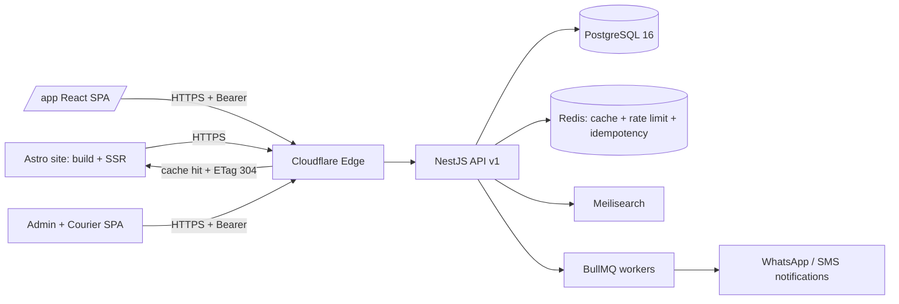
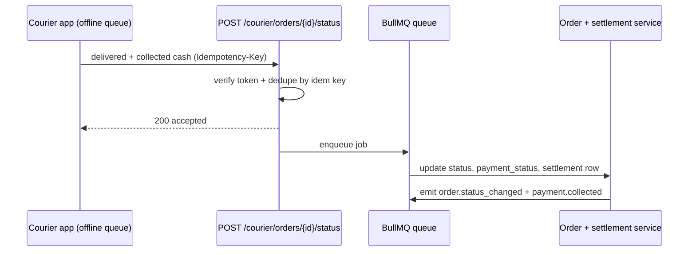

<div dir="rtl">

## 4. تصميم واجهة برمجة التطبيقات (API)

### 4.1 مبادئ التصميم

الواجهة الخلفية (NestJS) تعرض واجهة **REST** واحدة فوق JSON/UTF-8 حصراً، بلا GraphQL في المرحلة الأولى. القواعد الملزمة:

- **الجذر والإصدار:** جذر الواجهة هو `https://api.talisham.com/api/v1`. **كل المسارات في هذا القسم وفي بقية الوثيقة تُكتب نسبيةً إلى هذا الجذر** بلا بادئة `/v1/` مكرَّرة: يُكتب `/orders` ويُقصد `https://api.talisham.com/api/v1/orders`. الإصدار في المسار لا في الترويسة. عند إطلاق `v2` يبقى `v1` مدعوماً 6 أشهر مع ترويسة `Sunset: Sat, 01 Aug 2026 00:00:00 GMT` وترويسة `Deprecation: true`.
- **التسمية:** أسماء مجموعات بصيغة الجمع و`kebab-case` (`/catalog/products`, `/me/addresses`)، الأفعال في طريقة HTTP لا في المسار، والاستثناء الوحيد أفعال الحالة (`/orders/{orderNo}/cancel`, `/admin/orders/{id}/confirm`). المعرّفات من نوع `UUIDv7` وتُعرض في JSON كسلسلة UUID قياسية (مثل `0198f3a2-4b7c-7c31-9a55-2f0e6d1a8c44`) بلا بادئات نوعية، ولا تُكشف مفاتيح قاعدة البيانات الرقمية (راجع القسم 3). ولأن `UUIDv7` مرتّب زمنياً فهو **ليس** حماية من IDOR؛ الحماية تتحقق بشرط المالك داخل الاستعلام.
- **اللغة:** ترويسة `Accept-Language: ar-SY` هي الافتراضية، والقيم المدعومة `ar` و`en`. الخادم يعيد `Content-Language` ويترجم حقول المحتوى (اسم المنتج، الوصف، أسماء الخصائص) ورسائل الأخطاء من أعمدة `JSONB {ar,en}`. الأرقام تُعاد دائماً بالأرقام اللاتينية (`1500`) والتنسيق مسؤولية الواجهة. كل الطوابع الزمنية بصيغة ISO-8601 بتوقيت UTC، والعرض بتوقيت `Asia/Damascus` مسؤولية العميل.
- **العملة:** المرجع المحاسبي **الدولار الأمريكي**، وكل المبالغ تُعاد كأعداد صحيحة بالسنتات في حقول تنتهي بـ `UsdCents` (`"priceUsdCents": 89900` = 899.00 دولار). العرض الافتراضي بالليرة السورية محسوباً من سعر صرف يحدّده المدير (`fx_rates`)، فتُرفق مع كل مبلغ قابل للدفع الحقول `fxRate` و`totalSyp`. ترويسة `X-Currency: SYP` (افتراضي) أو `USD` تحدّد عملة العرض فقط ولا تغيّر القيمة المرجعية بالسنتات. لا يظهر أي مبلغ عشري في أي طلب أو استجابة.
- **الرسوم:** الأسعار المعادة **نهائية وشاملة** أي رسوم مطبَّقة. لا يوجد حقل ضريبة في أي استجابة؛ نسبة الرسوم القابلة للتهيئة `taxRateBp` (نقاط أساس، الافتراضي `0`) تُقرأ من إعدادات المتجر عبر `GET /config/public` وتدخل في السعر المعروض مسبقاً، فلا يضيف العميل شيئاً فوق `grandTotalUsdCents`.
- **الدفع:** الدفع عند الاستلام فقط (`paymentMethod: "COD"`). **لا توجد خطوة دفع ولا جلسة إتمام دفع ولا بوابة في أي مسار**؛ ينتقل العميل من التحقق من السلة إلى `POST /orders` مباشرة. إضافة طريقة دفع مستقبلاً = قيمة جديدة في `payment_method` وخطوة إضافية في التدفق، دون إعادة هيكلة. التحصيل النقدي يجري عبر مسارات `/courier/*` و`/admin/settlements` الموصوفة أدناه.
- **الترويسات القياسية:** `X-Request-Id` (يُولَّد إن غاب ويُعاد في كل استجابة)، و`traceparent` لربط التتبع مع OpenTelemetry، و`Authorization: Bearer <access_token>` (صلاحية 15 دقيقة، والتجديد عبر refresh token — تفاصيل الجلسات في القسم 9).
- **الصلاحيات:** تُكتب بصيغة `مورد:فعل:نطاق` موحّدة مع القسم 9، والنطاق `own` أو `any`. الصلاحيات الممنوحة لدور «زائر» (`catalog:read:any`, `search:read:any`, `carts:write:own`, `reviews:read:any`, `auth:token:any`) لا تتطلب رمز وصول؛ ما عداها يتطلب `Authorization: Bearer` وتحقّقاً في الاستعلام نفسه.
- **ثلاثة عملاء لواجهة واحدة:** الواجهة تخدم (1) **Astro** أثناء البناء الساكن وعند التوليد على الخادم (SSR) لصفحات SEO، (2) تطبيق `/app` (React 19 SPA)، (3) لوحة الإدارة وواجهة المندوب. لذلك نقاط الكتالوج مصمَّمة لتكون **قابلة للتخزين المؤقت بلا مصادقة** ومزوّدة بـ `ETag` قوي (تفصيل في 4.10)، ونقاط الحساب والطلبات `private, no-store` دائماً.



### 4.2 جدول المسارات

كل المسارات أدناه نسبية إلى الجذر `https://api.talisham.com/api/v1` وتُكتب بلا بادئة `/v1/`.

**الكتالوج والبحث**

| Endpoint | Method | الوصف | الصلاحية |
|---|---|---|---|
| `/catalog/products` | GET | قائمة المنتجات مع تصفية وفرز وترقيم | `catalog:read:any` |
| `/catalog/products/{slug}` | GET | تفاصيل منتج بكل متغيراته وصوره ومواصفاته | `catalog:read:any` |
| `/catalog/products/{id}/related` | GET | منتجات مشابهة/ملحقات متوافقة (القسم 6) | `catalog:read:any` |
| `/catalog/categories` | GET | شجرة التصنيفات بمستويين | `catalog:read:any` |
| `/catalog/brands` | GET | العلامات التجارية مع عدد المنتجات | `catalog:read:any` |
| `/catalog/variants/{id}/imei-report` | GET | نتيجة فحص IMEI المعروضة للعميل (وحدة جهاز مستعمل) | `catalog:read:any` |
| `/search` | GET | بحث نصي عربي مع أوجه تصفية (facets) | `search:read:any` |
| `/search/suggest` | GET | اقتراحات فورية (حد 8 نتائج) | `search:read:any` |
| `/config/public` | GET | إعدادات العرض العامة: `taxRateBp`، عملات العرض، حدود الدفع عند الاستلام | `catalog:read:any` |
| `/fx/current` | GET | سعر الصرف النافذ (ليرة/دولار) و`effectiveFrom` | `catalog:read:any` |

**السلة**

| Endpoint | Method | الوصف | الصلاحية |
|---|---|---|---|
| `/carts` | POST | إنشاء سلة زائر وإرجاع `cartId` | `carts:write:own` |
| `/carts/{cartId}` | GET | جلب السلة محسوبة (إجماليات، توفر، تحويل ليرة) | `carts:read:own` |
| `/carts/{cartId}/items` | POST | إضافة متغير منتج بكمية (حجز مرن 15 دقيقة) | `carts:write:own` |
| `/carts/{cartId}/items/{itemId}` | PATCH | تعديل الكمية | `carts:write:own` |
| `/carts/{cartId}/items/{itemId}` | DELETE | حذف عنصر | `carts:write:own` |
| `/carts/{cartId}/coupons` | POST | تطبيق كوبون خصم (القسم 7) | `carts:write:own` |
| `/carts/{cartId}/shipping-estimate` | POST | تقدير الشحن حسب المحافظة والطريقة | `carts:write:own` |
| `/carts/{cartId}/validate` | POST | إعادة التحقق من التوفر والأسعار وسعر الصرف قبل إنشاء الطلب | `carts:write:own` |
| `/carts/{cartId}/merge` | POST | دمج سلة الزائر بسلة الحساب بعد الدخول | `carts:write:own` |

**الطلبات** — لا توجد جلسة دفع ولا خطوة تحصيل هنا؛ الانتقال من `/carts/{cartId}/validate` إلى `POST /orders` مباشرة.

| Endpoint | Method | الوصف | الصلاحية |
|---|---|---|---|
| `/orders` | POST | إنشاء طلب من سلة بحالة `PENDING_CONFIRMATION` (يتطلب `Idempotency-Key`) | `orders:write:own` |
| `/orders` | GET | طلبات المستخدم مع ترقيم | `orders:read:own` |
| `/orders/{orderNo}` | GET | تفاصيل طلب مع حالة التحصيل والمبلغ المستحق نقداً | `orders:read:own` |
| `/orders/{orderNo}/cancel` | POST | إلغاء قبل الشحن | `orders:write:own` |
| `/orders/{orderNo}/shipments` | GET | الشحنات وسجل التتبع (تحديث يدوي، بلا تكامل webhook مع شركة شحن) | `orders:read:own` |
| `/orders/{orderNo}/returns` | POST | فتح طلب إرجاع/ضمان مشروط بفحص IMEI (القسم 8) | `returns:write:own` |

**الحساب والعناوين**

| Endpoint | Method | الوصف | الصلاحية |
|---|---|---|---|
| `/auth/otp/request` | POST | إرسال رمز OTP إلى رقم `+963…`: **واتساب قناة أساسية**، وSMS محلي احتياطي | `auth:token:any` |
| `/auth/otp/verify` | POST | التحقق وإصدار الرموز | `auth:token:any` |
| `/auth/refresh` | POST | تجديد رمز الوصول | `auth:token:any` |
| `/auth/logout` | POST | إبطال جلسة | `auth:token:own` |
| `/auth/sessions/{id}` | DELETE | إنهاء جلسة محددة من قائمة أجهزة المستخدم | `auth:token:own` |
| `/.well-known/jwks.json` | GET | مفاتيح التحقق العامة من توقيع الـ JWT | `auth:token:any` |
| `/me` | GET / PATCH | الملف الشخصي والتفضيلات (قناة الإشعار المفضّلة) | `profile:read:own` / `profile:write:own` |
| `/me/addresses` | GET / POST | عناوين سورية (محافظة، مدينة، حي، شارع، معلم قريب إلزامي) | `addresses:write:own` |
| `/me/addresses/{id}` | PATCH / DELETE | تعديل أو حذف عنوان | `addresses:write:own` |
| `/account/deletion-request` | POST | طلب حذف الحساب وبدء مهلة التنفيذ | `profile:write:own` |

**المفضلة والمقارنة** — المفضلة على مستوى المتغيّر (`variantId`) لا المنتج.

| Endpoint | Method | الوصف | الصلاحية |
|---|---|---|---|
| `/me/wishlist` | GET | قائمة المفضلة (متغيّرات) | `wishlist:read:own` |
| `/me/wishlist/items` | POST | إضافة متغيّر بجسم `{ "variantId": "..." }` | `wishlist:write:own` |
| `/me/wishlist/items/{variantId}` | DELETE | إزالة متغيّر من المفضلة | `wishlist:write:own` |
| `/compare` | POST | مقارنة حتى 4 منتجات وإرجاع `compareToken` | `catalog:read:any` |
| `/compare/{token}` | GET | مصفوفة المواصفات القابلة للمشاركة | `catalog:read:any` |

**التقييمات**

| Endpoint | Method | الوصف | الصلاحية |
|---|---|---|---|
| `/catalog/products/{id}/reviews` | GET | التقييمات المعتمدة مع توزيع النجوم | `reviews:read:any` |
| `/catalog/products/{id}/reviews` | POST | إضافة تقييم (شراء موثّق فقط) | `reviews:write:own` |
| `/reviews/{id}/helpful` | POST | تصويت "مفيد" | `reviews:write:own` |
| `/reviews/{id}` | DELETE | حذف تقييم المستخدم نفسه | `reviews:write:own` |

**الإدارة (admin)** — الواجهات المستهلِكة موصوفة في القسم 10

| Endpoint | Method | الوصف | الصلاحية |
|---|---|---|---|
| `/admin/products` | POST / GET | إنشاء وقائمة منتجات (تشمل المسودات) | `catalog:write:any` |
| `/admin/products/{id}` | PATCH / DELETE | تعديل أو أرشفة | `catalog:write:any` |
| `/admin/catalog/imports` | POST | رفع ملف استيراد كتالوج وبدء مهمة المعالجة (القسم 7) | `catalog:write:any` |
| `/admin/variants/{id}/inventory-adjustments` | POST | تسوية مخزون بسبب موثّق (يتطلب `Idempotency-Key`) | `inventory:write:any` |
| `/admin/device-units` | POST / GET | تسجيل وحدات الأجهزة بـ IMEI ونتيجة الفحص وحالة الجهاز | `inventory:write:any` |
| `/admin/orders` | GET | بحث الطلبات بفلاتر تشغيلية (حالة، محافظة، حالة التحصيل) | `orders:read:any` |
| `/admin/orders/{id}/confirm` | POST | تسجيل نتيجة مكالمة التأكيد الهاتفي والانتقال إلى `PROCESSING` | `orders:confirm:any` |
| `/admin/orders/{id}/status` | PATCH | تغيير الحالة يدوياً (يتطلب `Idempotency-Key`) | `orders:update_status:any` |
| `/admin/orders/bulk-status` | POST | تغيير حالة دفعة طلبات (يتطلب `Idempotency-Key`) | `orders:update_status:any` |
| `/admin/shipments` | POST | إنشاء شحنة: مندوب داخل المدينة أو مكتب نقل مع `waybillNo` وصورة الإيصال | `orders:update_status:any` |
| `/admin/settlements` | GET | تسويات النقد اليومية لكل مندوب/مكتب نقل مع الفروقات | `settlements:read:any` |
| `/admin/settlements` | POST | إقفال تسوية يوم وتسجيل الفروقات وعمولة التوصيل (يتطلب `Idempotency-Key`) | `settlements:write:any` |
| `/admin/fx` | POST | تعيين سعر صرف جديد مع `effectiveFrom` و`setBy` (سجل تاريخي) | `pricing:write:any` |
| `/admin/cod/blocklist` | GET / POST | قائمة تقييد الأرقام متكررة رفض الاستلام | `orders:update_status:any` |
| `/admin/coupons` | POST / PATCH | إدارة العروض والكوبونات | `marketing:write:any` |
| `/admin/reviews/{id}/moderate` | PATCH | اعتماد أو رفض تقييم | `reviews:moderate:any` |
| `/admin/media/upload-url` | POST | رابط رفع موقّع إلى تخزين الوسائط (R2 أو متوافق S3) | `catalog:write:any` |
| `/admin/reports/sales` | GET | تقرير مبيعات مجمّع بالدولار مع تحويل عرض بالليرة | `reports:view:any` |

**واجهة المندوب (courier)** — تعمل دون اتصال وتتزامن عند عودة الشبكة (القسم 10)

| Endpoint | Method | الوصف | الصلاحية |
|---|---|---|---|
| `/courier/tasks` | GET | مهام اليوم للمندوب: الطلبات المسنَدة، العناوين، المبلغ المستحق نقداً مقرَّباً | `delivery:read:own` |
| `/courier/orders/{id}/status` | POST | تحديث حالة التسليم (`OUT_FOR_DELIVERY`, `DELIVERED`, `DELIVERY_FAILED`) مع سبب وصورة/توقيع (يتطلب `Idempotency-Key`) | `delivery:update:own` |
| `/courier/orders/{id}/collect` | POST | تسجيل المبلغ المحصَّل نقداً وربطه بتسوية اليوم (يتطلب `Idempotency-Key`) | `payments:collect:own` |
| `/courier/settlements/today` | GET | حصيلة اليوم للمندوب ومطابقتها مع الطلبات المسلَّمة | `settlements:read:own` |

**القياس الميداني (RUM)**

| Endpoint | Method | الوصف | الصلاحية |
|---|---|---|---|
| `/rum` | POST | استقبال قياسات الأداء الميدانية من المتصفح (القسم 5) | `catalog:read:any` |

### 4.3 نموذج الاستجابة الموحّد

كل استجابة ناجحة تتبع الغلاف `{ data, meta }`، وكل فشل يتبع `{ error }`. لا ترجع الواجهة مصفوفة عارية أبداً. كل المبالغ أعداد صحيحة بسنتات الدولار، ويُرفق `fxRate` و`totalSyp` حيثما وُجد مبلغ قابل للتحصيل.

**(أ) جلب منتج بمتغيراته** — `GET /catalog/products/iphone-15-pro-max`

```json
{
  "data": {
    "id": "0198f3a2-4b7c-7c31-9a55-2f0e6d1a8c44",
    "slug": "iphone-15-pro-max",
    "name": "آيفون 15 برو ماكس",
    "brand": { "id": "0198f3a2-4b7c-7d02-8e19-63a7b4c0d511", "name": "آبل" },
    "rating": { "average": 4.6, "count": 218 },
    "specs": [
      { "key": "screen_size", "label": "حجم الشاشة", "value": "6.7 بوصة" },
      { "key": "battery", "label": "البطارية", "value": "4441 مللي أمبير" }
    ],
    "variants": [
      {
        "id": "0198f3a2-4b7c-7e44-b3c8-91d5a7e02f16",
        "sku": "IP15PM-256-NT-ZA",
        "options": { "storage": "256GB", "color": "تيتانيوم طبيعي" },
        "deviceOrigin": "GULF",
        "partCode": "ZA/A",
        "dualSim": true,
        "esimOnly": false,
        "condition": "NEW",
        "batteryHealthPct": null,
        "warranty": { "type": "STORE", "months": 12 },
        "price": { "priceUsdCents": 89900, "compareAtUsdCents": 94900, "currency": "USD" },
        "display": { "currency": "SYP", "fxRate": 12850, "priceSyp": 11552150 },
        "stock": { "status": "in_stock", "quantity": 14 },
        "images": ["https://cdn.talisham.com/p/ip15pm-nt-1.avif"]
      },
      {
        "id": "0198f3a2-4b7c-7f80-a2d6-4c8b1e93a077",
        "sku": "IP15PM-256-BL-LL-U",
        "options": { "storage": "256GB", "color": "تيتانيوم أزرق" },
        "deviceOrigin": "US",
        "partCode": "LL/A",
        "dualSim": false,
        "esimOnly": true,
        "condition": "USED_A",
        "batteryHealthPct": 92,
        "warranty": { "type": "STORE", "months": 3 },
        "imeiCheck": { "status": "PASSED", "checkedAt": "2026-07-21T08:10:00Z" },
        "price": { "priceUsdCents": 71500, "compareAtUsdCents": null, "currency": "USD" },
        "display": { "currency": "SYP", "fxRate": 12850, "priceSyp": 9187750 },
        "stock": { "status": "low_stock", "quantity": 3 },
        "images": ["https://cdn.talisham.com/p/ip15pm-bl-used-1.avif"]
      }
    ]
  },
  "meta": { "locale": "ar-SY", "fxRate": 12850, "requestId": "0198f3c0-71a4-7b16-8d33-c2e5904f1a77" }
}
```

الحقول `deviceOrigin` و`partCode` و`dualSim` و`esimOnly` و`condition` و`batteryHealthPct` تظهر في صفحة المنتج وفي المرشحات لأن فروقها السعرية حاسمة في السوق السوري. المتغيّر غير الجديد يعرض `batteryHealthPct` و`imeiCheck` إلزامياً.

**(ب) إضافة للسلة** — `POST /carts/0198f3b1-0c25-7a13-9f47-6b2e8d40c9a3/items`

```json
{ "variantId": "0198f3a2-4b7c-7e44-b3c8-91d5a7e02f16", "quantity": 1 }
```

```json
{
  "data": {
    "cartId": "0198f3b1-0c25-7a13-9f47-6b2e8d40c9a3",
    "items": [
      {
        "itemId": "0198f3b1-0c26-7b58-84ae-1d7c3f9026be",
        "variantId": "0198f3a2-4b7c-7e44-b3c8-91d5a7e02f16",
        "name": "آيفون 15 برو ماكس - 256GB تيتانيوم طبيعي",
        "quantity": 1,
        "unitPriceUsdCents": 89900,
        "lineTotalUsdCents": 89900
      }
    ],
    "totals": {
      "subtotalUsdCents": 89900,
      "discountUsdCents": 0,
      "shippingUsdCents": 0,
      "grandTotalUsdCents": 89900,
      "currency": "USD"
    },
    "display": { "currency": "SYP", "fxRate": 12850, "totalSyp": 11552150 },
    "itemCount": 1,
    "reservationExpiresAt": "2026-07-28T09:56:22Z"
  },
  "meta": { "requestId": "0198f3c0-71a5-7c40-b6f2-08d31c7ae594" }
}
```

المبالغ كلها أعداد صحيحة بسنتات الدولار، و`totalSyp` قيمة عرض محسوبة `round(grandTotalUsdCents / 100 × fxRate)` غير مخزَّنة على السلة. حجز السلة **مرن 15 دقيقة** ويُجدَّد مع كل تعديل (القسم 3). لا يوجد حقل ضريبة: السعر المعروض نهائي وشامل أي رسوم مطبَّقة.

**(ج) إنشاء طلب — بلا أي خطوة دفع** — `POST /orders` مع `Idempotency-Key: 5f2c1a90-...`

```json
{
  "cartId": "0198f3b1-0c25-7a13-9f47-6b2e8d40c9a3",
  "shippingAddressId": "0198f3b0-9a11-7c60-b8d2-5e4a17f3c882",
  "shippingMethod": "COURIER_INTRACITY",
  "contactPhone": "+963991234567",
  "customerNote": "الاتصال قبل التوصيل بنصف ساعة"
}
```

```json
{
  "data": {
    "orderNo": "TS-2607-000148",
    "status": "PENDING_CONFIRMATION",
    "createdAt": "2026-07-28T09:41:22Z",
    "paymentMethod": "COD",
    "paymentStatus": "PENDING",
    "totals": {
      "subtotalUsdCents": 89900,
      "discountUsdCents": 0,
      "shippingUsdCents": 300,
      "grandTotalUsdCents": 90200,
      "currency": "USD"
    },
    "fxRate": 12850,
    "totalSyp": 11590700,
    "codAmountSyp": 11591000,
    "priceLockedUntil": "2026-07-30T09:41:22Z",
    "shipping": {
      "method": "COURIER_INTRACITY",
      "governorate": "دمشق",
      "city": "دمشق",
      "etaMinDays": 1,
      "etaMaxDays": 2
    },
    "confirmation": { "attempts": 0, "confirmedAt": null, "confirmedBy": null },
    "reservationExpiresAt": "2026-07-30T09:41:22Z"
  },
  "meta": { "requestId": "0198f3c0-71a6-7d92-9c04-b7e5142f8a30" }
}
```

القراءة: `grandTotalUsdCents = 89900 + 300 = 90200` سنتاً (902.00 دولار)، و`totalSyp = round(902 × 12850) = 11590700` ليرة مثبَّتاً بسعر الصرف لحظة تأكيد الطلب، و`codAmountSyp` هو المبلغ المستحق نقداً **مقرَّباً لأقرب 10 ليرات** (`11591000`) وهو الرقم الذي يُطبع على الإيصال ويظهر على شاشة المندوب. صلاحية السعر المثبَّت **48 ساعة** (`priceLockedUntil`) ثم يُعاد التسعير قبل الشحن. و`reservationExpiresAt` حجز أوّلي **ساعتان** من `createdAt` يُمدَّد إلى 48 ساعة (أو 12 ساعة للأجهزة النادرة) عند أول تفاعل ناجح مع العميل — عمر الحجز مستقل عن نافذة التأكيد (القسم 3)؛ مهمة `orders.expire-pending` تلغي الطلب بعد انقضائها أو بعد 3 محاولات اتصال فاشلة، و`inventory.release-reservations` تُشغَّل كل 5 دقائق.

الطلب يُنشَأ دائماً بحالة `PENDING_CONFIRMATION` وحالة تحصيل `PENDING`. لا خطوة دفع في هذا التدفق ولا واجهة مزوّد دفع: **إضافة طريقة دفع مستقبلاً = قيمة جديدة في `payment_method` وخطوة إضافية في التدفق، دون إعادة هيكلة.** ما بعد الإنشاء تُغيَّر الحالة عبر `POST /admin/orders/{id}/confirm` ثم `PATCH /admin/orders/{id}/status` أو من واجهة المندوب `POST /courier/orders/{id}/status` (القسم 8).

**(د) تأكيد هاتفي** — `POST /admin/orders/0198f3c1-.../confirm`

```json
{ "outcome": "CONFIRMED", "notes": "تم التأكيد مع العميل، العنوان مطابق" }
```

```json
{
  "data": {
    "orderNo": "TS-2607-000148",
    "status": "PROCESSING",
    "confirmation": {
      "attempts": 2,
      "confirmedBy": "0198f3a9-2c31-7b70-9d18-4f0a5c6e8b23",
      "confirmedAt": "2026-07-28T11:05:40Z",
      "notes": "تم التأكيد مع العميل، العنوان مطابق"
    },
    "reprice": { "required": false, "priceLockedUntil": "2026-07-30T09:41:22Z" }
  },
  "meta": { "requestId": "0198f3c0-71b0-7a44-9d2e-5c81b7f3e206" }
}
```

القيم المقبولة لـ `outcome`: `CONFIRMED` (ينقل إلى `PROCESSING`)، و`NO_ANSWER` (يزيد `confirmationAttempts` ويُبقي الحالة)، و`CANCELLED` (رفض العميل → `CANCELLED` وتحرير الحجز).

**(هـ) مهام المندوب** — `GET /courier/tasks?date=2026-07-29`

```json
{
  "data": {
    "courierId": "0198f3aa-11c4-7d02-8b64-9e7a3c150fd8",
    "date": "2026-07-29",
    "summary": { "tasks": 7, "expectedCashSyp": 68420000 },
    "tasks": [
      {
        "orderId": "0198f3c1-3d55-7e91-a4c7-2b60f8d4e913",
        "orderNo": "TS-2607-000148",
        "status": "OUT_FOR_DELIVERY",
        "codAmountSyp": 11591000,
        "customer": { "name": "سامر الحلبي", "phone": "+963991234567", "altPhone": "+963931112233" },
        "address": {
          "governorate": "دمشق",
          "city": "دمشق",
          "neighborhood": "المزة - فيلات غربية",
          "street": "شارع الجلاء",
          "landmark": "مقابل صيدلية النور",
          "details": "بناء رقم 7، الطابق الثالث",
          "geoLat": 33.5065,
          "geoLng": 36.2565
        }
      }
    ]
  },
  "meta": { "syncedAt": "2026-07-29T05:00:00Z", "requestId": "0198f3c0-71b2-7c08-8e55-1a94d3f6b077" }
}
```

الاستجابة مصمَّمة للعمل دون اتصال: التطبيق يخزّنها محلياً، ويضع تحديثات الحالة والتحصيل في طابور يُرسل عند عودة الشبكة بالمفاتيح نفسها (`Idempotency-Key`) فلا يتكرر أثرها.

**(و) تسجيل التحصيل** — `POST /courier/orders/0198f3c1-.../collect` مع `Idempotency-Key`

```json
{
  "collectedAmountSyp": 11591000,
  "collectedAt": "2026-07-29T13:22:10Z",
  "collectedBy": "COURIER",
  "proofMediaId": "0198f3c2-6a10-7f33-b7d1-08e2c5a91b44"
}
```

```json
{
  "data": {
    "orderNo": "TS-2607-000148",
    "status": "DELIVERED",
    "paymentStatus": "COLLECTED",
    "expectedAmountSyp": 11591000,
    "collectedAmountSyp": 11591000,
    "varianceSyp": 0,
    "settlementId": "0198f3c3-0b21-7e58-9a33-6d40f1c7b592"
  },
  "meta": { "requestId": "0198f3c0-71b4-7d61-b0a2-3f95c1de8a40" }
}
```

قيم `collectedBy`: `COURIER` أو `TRANSPORT_OFFICE`. إذا كان `collectedAmountSyp` أقل من المستحق تصبح `paymentStatus = "PARTIAL"` ويُسجَّل `varianceSyp` سالباً ويظهر الفرق في تدقيق `cash_settlements` الأسبوعي (القسم 11).

**(ز) سعر الصرف** — `GET /fx/current` و`POST /admin/fx`

```json
{
  "data": { "base": "USD", "quote": "SYP", "rate": 12850, "effectiveFrom": "2026-07-27T18:00:00Z", "setBy": "0198f3a9-2c31-7b70-9d18-4f0a5c6e8b23" },
  "meta": { "requestId": "0198f3c0-71b6-7a12-9f80-4c73b2e05a19" }
}
```

`POST /admin/fx` بجسم `{ "rate": 13100, "effectiveFrom": "2026-07-30T06:00:00Z" }` يضيف صفاً جديداً في `fx_rates` بلا تعديل الصفوف السابقة (سجل تاريخي)، ولا يمسّ الطلبات التي ثُبِّت سعرها، ويُبطل مفاتيح التخزين المؤقت الحاملة وسم `fx:current`.

### 4.4 صيغة الأخطاء الموحّدة

```json
{
  "error": {
    "code": "OUT_OF_STOCK",
    "message": "الكمية المطلوبة غير متوفرة حالياً",
    "messageEn": "Requested quantity is not available",
    "details": [{ "field": "quantity", "available": 3 }],
    "requestId": "0198f3c0-71a7-7e18-a5bb-3f60c9d47e21"
  }
}
```

| الرمز | HTTP | الرسالة (ar) | Message (en) |
|---|---|---|---|
| `VALIDATION_ERROR` | 422 | بيانات الطلب غير صحيحة | Invalid request payload |
| `UNAUTHENTICATED` | 401 | يلزم تسجيل الدخول | Authentication required |
| `TOKEN_EXPIRED` | 401 | انتهت صلاحية الجلسة | Session token expired |
| `FORBIDDEN` | 403 | لا تملك صلاحية لهذا الإجراء | Insufficient permissions |
| `NOT_FOUND` | 404 | العنصر غير موجود | Resource not found |
| `OUT_OF_STOCK` | 409 | الكمية غير متوفرة | Out of stock |
| `PRICE_CHANGED` | 409 | تغيّر السعر، حدّث السلة | Price changed, refresh cart |
| `PRICE_LOCK_EXPIRED` | 409 | انتهت صلاحية السعر المثبَّت (48 ساعة)، يلزم إعادة التسعير | Locked price expired, repricing required |
| `FX_RATE_UNAVAILABLE` | 503 | لا يوجد سعر صرف نافذ، راجع الإدارة | No effective FX rate configured |
| `COUPON_INVALID` | 422 | الكوبون غير صالح أو منتهٍ | Coupon invalid or expired |
| `COD_LIMIT_EXCEEDED` | 422 | قيمة الطلب تتجاوز سقف الدفع عند الاستلام | COD order value limit exceeded |
| `COD_OPEN_ORDERS_LIMIT` | 429 | تجاوزت حد الطلبات المفتوحة لهذا الرقم | Too many open COD orders for this phone |
| `PHONE_BLOCKLISTED` | 403 | الرقم مقيَّد لتكرار رفض الاستلام | Phone number is blocklisted |
| `ORDER_NOT_CONFIRMED` | 409 | لا يمكن التجهيز قبل التأكيد الهاتفي | Phone confirmation required first |
| `IMEI_MISMATCH` | 409 | رقم IMEI لا يطابق الجهاز المسلَّم | IMEI does not match delivered unit |
| `OTP_INVALID` | 400 | رمز التحقق غير صحيح | Invalid OTP code |
| `OTP_THROTTLED` | 429 | تجاوزت محاولات الإرسال | Too many OTP requests |
| `ACCOUNT_TEMP_LOCKED` | 423 | الحساب مقفل مؤقتاً بعد محاولات فاشلة متكررة | Account temporarily locked |
| `IDEMPOTENCY_CONFLICT` | 409 | مفتاح التنفيذ مستخدم بمحتوى مختلف | Idempotency key reused |
| `RATE_LIMITED` | 429 | عدد الطلبات كبير، حاول لاحقاً | Rate limit exceeded |
| `PAYLOAD_TOO_LARGE` | 413 | حجم البيانات كبير جداً | Payload too large |
| `INTERNAL_ERROR` | 500 | خطأ غير متوقع | Unexpected server error |
| `SERVICE_UNAVAILABLE` | 503 | الخدمة غير متاحة مؤقتاً | Service temporarily unavailable |

الرموز `OTP_INVALID` (400) و`OTP_THROTTLED` (429) و`ACCOUNT_TEMP_LOCKED` (423) هي نفسها المستعملة في تدفق المصادقة الموصوف في القسم 9، وهذا الجدول مرجعها.

### 4.5 الترقيم والفرز والتصفية

- **ترقيم بالمؤشر (cursor pagination) فقط** للقوائم الطويلة: `?limit=24&cursor=eyJpZCI6IjAxOThmM2EyLTRiN2MtN2MzMS05YTU1...`. الحد الافتراضي 24 والأقصى 100. المؤشر Base64 لكائن `{ "id": "...", "sortValue": ... }` ولا يُفسَّر من العميل. الحد الافتراضي أُبقي منخفضاً لأن القياس المرجعي شبكة 3G بطيئة (القسم 5).
- الاستجابة تحمل `meta.page`: `{ "nextCursor": "...", "hasMore": true, "limit": 24 }`. لا نُرجع `totalCount` في الكتالوج (مكلف)، بل `meta.estimatedTotal` من Meilisearch.
- **الفرز** عبر قائمة بيضاء: `sort=-created_at | price | -price | -rating | -sales_30d | relevance` (الأخير في `/search` فقط). الفرز بالسعر يجري على `price_usd_cents` لا على قيمة العرض بالليرة.
- **التصفية** بصيغة أقواس ووحدتها سنتات الدولار: `filter[brand]=apple,samsung&filter[price][gte]=30000&filter[price][lte]=120000&filter[storage]=256GB&filter[condition]=NEW,USED_A&filter[device_origin]=GULF,EURO&filter[part_code]=ZA/A&filter[dual_sim]=true&filter[warranty_type]=STORE&filter[in_stock]=true`. أي مفتاح خارج القائمة البيضاء يُرفض بـ `VALIDATION_ERROR`.

### 4.6 مفتاح عدم التكرار (Idempotency-Key)

إلزامي على: `POST /orders`، `POST /orders/{orderNo}/returns`، `POST /admin/orders/{id}/confirm`، `PATCH /admin/orders/{id}/status`، `POST /admin/orders/bulk-status`، `POST /admin/shipments`، `POST /admin/variants/{id}/inventory-adjustments`، `POST /admin/settlements`، `POST /admin/fx`، `POST /courier/orders/{id}/status`، `POST /courier/orders/{id}/collect`. القيمة UUIDv4 يولّدها العميل.

الآلية: مفتاح Redis `idem:{subjectId}:{key}` بعمر **24 ساعة** يخزن `status` (`in_progress|completed`) و`bodyHash` (SHA-256) و`response`. إعادة الإرسال بنفس المفتاح ونفس الجسم تعيد الاستجابة المخزّنة بحالة 200 وترويسة `Idempotent-Replay: true`؛ نفس المفتاح بجسم مختلف يعيد `IDEMPOTENCY_CONFLICT`؛ الطلب أثناء `in_progress` يعيد 409 مع `Retry-After: 2`.

هذا الضمان هو أساس عمل واجهة المندوب دون اتصال: الطابور المحلي قد يعيد إرسال «تم التسليم» أو «حُصِّل المبلغ» عدة مرات بعد عودة الشبكة، ويجب ألا يُسجَّل التحصيل مرتين في `cash_settlements`.

### 4.7 تحديد المعدل (Rate Limiting)

عدّاد نافذة منزلقة في Redis، مفتاحه IP للمسارات العامة و`userId` للمصادَق عليها، مع طبقة Cloudflare WAF أمامه (أو `nginx limit_req` في الخطة البديلة على خادم أوروبي — القسم 2).

تحمل **كل** استجابة خاضعة للتحديد ترويسات `RateLimit-Limit` (سقف النافذة الحالية) و`RateLimit-Remaining` (المتبقي فيها) و`RateLimit-Reset` (الثواني حتى بداية نافذة جديدة). عند تجاوز السقف يردّ الخادم `429` بجسم الخطأ الموحّد ورمز `RATE_LIMITED` (أو `OTP_THROTTLED` لمسارات الـ OTP)، مع ترويسة `Retry-After` بالثواني؛ وعلى العميل احترامها بتراجع أُسّي (exponential backoff) بدل إعادة المحاولة الفورية. لا تُستهلك حصة النافذة في الاستجابات المخدومة من الذاكرة المؤقتة على الحافة.

القيم المرجعية لحدود المعدل معرّفة في القسم 9 وهي المصدر الوحيد، ولا تُكرَّر هنا ولا في أي قسم آخر.

### 4.8 الأحداث والـ Webhooks

**الصادرة** (تُرسَل من عامل BullMQ إلى نقاط اشتراك مسجّلة في `webhook_endpoints`، وتغذّي أيضاً إشعارات واتساب/SMS):

| الحدث | الوصف |
|---|---|
| `order.created` | إنشاء طلب جديد بحالة `PENDING_CONFIRMATION` |
| `order.confirmed` | نجاح مكالمة التأكيد والانتقال إلى `PROCESSING` |
| `order.status_changed` | تغيّر حالة الطلب (تحديث يدوي من الإدارة أو المندوب) |
| `shipment.updated` | تحديث تتبع الشحنة أو تسجيل `waybillNo` لمكتب النقل |
| `payment.collected` | تسجيل تحصيل نقدي كامل أو جزئي |
| `settlement.closed` | إقفال تسوية نقدية لمندوب/مكتب نقل مع فروقاتها |
| `inventory.low_stock` | هبوط المخزون تحت الحد |
| `review.created` | تقييم بانتظار المراجعة |

الجسم: `{ "id": "0198f3c4-1a2b-7d34-9e51-7ac9b620d3f5", "type": "...", "createdAt": "...", "data": {...} }`. التوقيع في `X-TaliSham-Signature: t=1785312000,v1=<HMAC_SHA256(t + "." + rawBody, secret)>` مع تسامح زمني 300 ثانية لصد إعادة الإرسال. إعادة المحاولة 5 مرات تصاعدياً (1د، 5د، 30د، 2س، 6س) ثم تعطيل النقطة وتنبيه.

**الواردة:** **لا تكامل webhook مع أي شركة شحن**؛ تتبع الشحنات يتحدّث يدوياً من لوحة التحكم (`PATCH /admin/orders/{id}/status`, `POST /admin/shipments`) أو من واجهة المندوب (`POST /courier/orders/{id}/status`)، ويُوثَّق `waybillNo` مكتب النقل مع صورة الإيصال. يبقى مسار واحد وارد لإيصالات تسليم الرسائل: `POST /webhooks/messaging/{provider}` حيث `provider ∈ {whatsapp, sms}` للتحقق من وصول الـ OTP والإشعارات. التحقق: قائمة IP مسموحة + توقيع المزوّد، ثم رد `200` خلال أقل من 500 مللي ثانية مع وضع الحدث في طابور المعالجة. إن توفّر شريك شحن يدعم webhooks لاحقاً يُضاف مسار `POST /webhooks/shipping/{partner}` بالآلية نفسها دون تغيير بقية التدفق.



### 4.9 توثيق OpenAPI والأنواع المشتركة

- التوثيق يُولَّد من الشيفرة عبر `@nestjs/swagger` + `nestjs-zod`؛ واجهة Swagger على `/api/v1/docs` (محمية بمصادقة في الإنتاج) والمواصفة الخام على `/api/v1/openapi.json`.
- المواصفة تُصدَّر إلى `packages/api-contract/openapi.json` وتُدفع مع الشيفرة، ثم `openapi-typescript` يولّد `packages/api-contract/src/types.gen.ts` الذي تستهلكه العملاء الثلاثة من الحزمة `@talisham/api-contract`: `apps/site` (Astro، في مرحلة البناء وفي SSR)، و`apps/app` (React 19 SPA عبر TanStack Query)، و`apps/admin` بما فيها واجهة `/courier`.
- في CI فحص `pnpm api:contract:check` يفشل الدمج إذا اختلفت المواصفة المولّدة عن المدفوعة، ما يمنع انحراف العقد (contract drift) — راجع القسم 11.

### 4.10 CORS والتخزين المؤقت

CORS بقائمة مصادر صريحة (`https://talisham.com`, `https://www.talisham.com`, `https://admin.talisham.com`, و`http://localhost:4321` لخادم تطوير Astro و`http://localhost:5173` لخادمي Vite في التطوير)، الطرق `GET,POST,PATCH,DELETE,OPTIONS`، الترويسات المسموحة `Authorization, Content-Type, Accept-Language, X-Currency, Idempotency-Key, X-Request-Id`، و`Access-Control-Max-Age: 600`. لا نعتمد الكوكيز عبر النطاقات (`credentials: false`) لأن رمز الوصول يُرسل في ترويسة؛ ولأن `/app/*` و`/` على النطاق نفسه فجلسة الكوكي واحدة على الحافة (القسم 2).

**أثر تعدد العملاء على التخزين المؤقت:** نقاط الكتالوج تُستدعى من ثلاثة سياقات — Astro أثناء البناء (طلبات مكثفة قصيرة) وAstro عند SSR وتطبيق `/app` ولوحة الإدارة — لذلك تلتزم كلها بالقواعد التالية: استجابة واحدة قابلة للتخزين بلا مصادقة، و`ETag` قوي يسمح لـ Astro بإعادة البناء التزايدي بردود `304` رخيصة، و**إبطال بالوسم** فور تعديل المنتج من لوحة الإدارة بدل انتظار انتهاء المهلة، مع إعادة توليد صفحات Astro المتأثرة عبر خطاف بناء.

| النقطة | Cache-Control | ETag |
|---|---|---|
| `/catalog/products` | `public, max-age=60, s-maxage=300, stale-while-revalidate=600` | نعم |
| `/catalog/products/{slug}` | `public, max-age=120, s-maxage=600, stale-while-revalidate=1800` | نعم |
| `/catalog/categories`, `/catalog/brands` | `public, s-maxage=3600` | نعم |
| `/config/public` | `public, s-maxage=300` | نعم |
| `/fx/current` | `public, max-age=60, s-maxage=300` | نعم |
| `/search`, `/search/suggest` | `public, max-age=30` | لا |
| `/carts/*`, `/orders/*`, `/me/*`, `/courier/*`, `/admin/*` | `private, no-store` | لا |

الـ ETag قيمة قوية مشتقة من `updatedAt` + معرّف المورد + اللغة + عملة العرض؛ الطلب بـ `If-None-Match` يعيد `304`. كل استجابات الكتالوج تحمل `Vary: Accept-Language, X-Currency`، وتُوسَم بوسوم تخزين (`product:{id}`, `category:{id}`, `fx:current`) ليُبطَل التخزين المؤقت انتقائياً فور تعديل المنتج أو تحديث سعر الصرف من لوحة الإدارة. الوسوم منفَّذة بـ Cloudflare Cache Tags، ويقابلها في الخطة البديلة `proxy_cache_purge` على nginx أو وسوم Bunny CDN — بلا اعتماد على ميزة حصرية لمزوّد واحد (القسم 2).

</div>
