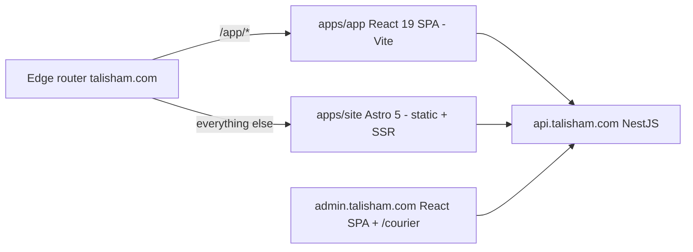
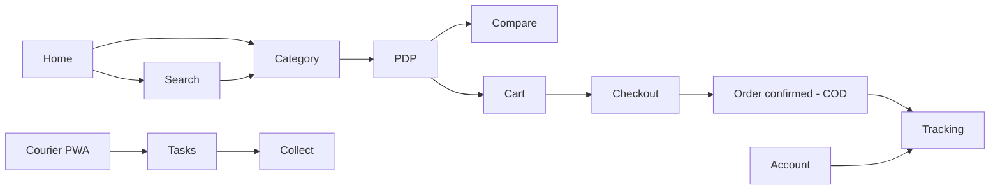
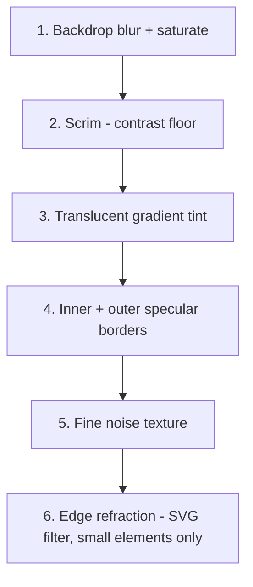
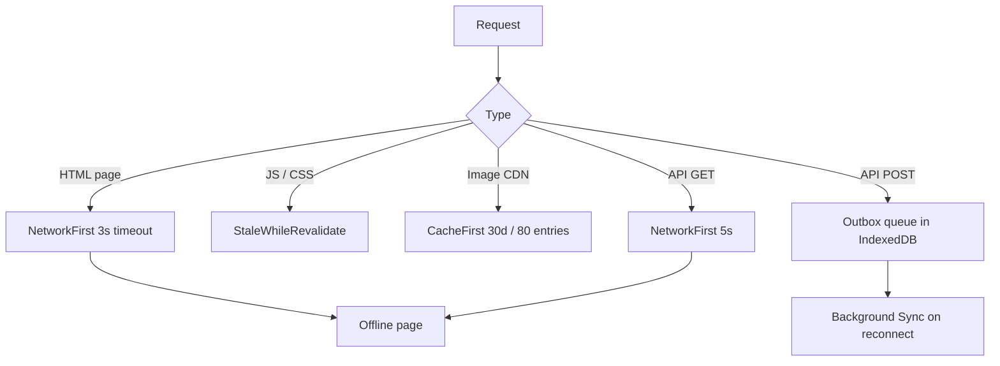

<div dir="rtl">

## 5. تجربة الجوال أولاً وتصميم الواجهة والأداء وإمكانية الوصول

### 5.1 مبادئ الجوال أولاً في الواقع السوري

الواجهة تُصمَّم لمستخدم في دمشق أو حلب أو اللاذقية يفتح المتجر من هاتف أندرويد متوسط-ضعيف، على شبكة 3G مزدحمة، برصيد بيانات محدود، وقد ينقطع التيار الكهربائي عنه أو عن برج الاتصال في منتصف الجلسة. كل قرار بصري يُقاس بهذا السياق أولاً، لا بمظهره على شاشة مكتبية سريعة.

المبادئ الملزِمة:

1. **الأصل صفر JavaScript.** صفحات التصفح (`apps/site`) تُولَّد ساكنة وتُقرأ وتُتصفَّح كاملةً قبل تنفيذ أي سطر JS. التفاعل يُضاف كجزر React 19 محدودة النطاق فقط حيث يتعذّر تحقيقه بـ HTML وCSS.
2. **إجراء رئيسي واحد لكل شاشة** داخل منطقة الإبهام: آخر 160 بكسل من أسفل الشاشة.
3. **لا اعتماد على التحويم (hover).** كل ما يظهر بالتحويم يجب أن يكون متاحاً بالنقر أو ظاهراً دائماً.
4. **ميزانية الشبكة قبل الجمال.** أي عنصر بصري يكلّف أكثر من 10KB مضغوطاً يحتاج مبرراً مكتوباً في طلب الدمج (PR)، ويُقاس أثره على ميزانيات القسم 5.7.
5. **الصمود أمام الانقطاع.** كل نموذج طويل (العنوان، إتمام الطلب، تسجيل التحصيل في واجهة المندوب) يحفظ مسودته محلياً كل 800ms، ويستعيدها بعد إعادة تشغيل الجهاز أو المتصفح. لا يفقد المستخدم إدخالاً بسبب انقطاع كهرباء.
6. **الشبكة اختيارية لا مفروضة.** القراءة تعمل من الكاش، والكتابة تدخل طابوراً يُرسَل عند عودة الاتصال (5.8).
7. **احترام البطارية.** لا حركات مستمرة، ولا مؤقتات دورية في الخلفية، ولا تأثيرات بصرية باهظة عند تفعيل وضع توفير الطاقة (5.4.6).
8. **الوضوح فوق الزخرفة، والصلب هو الأصل.** هذه أهم قاعدة في القسم، وقد صيغت هكذا بعد مراجعة: **التصميم الصلب (opaque) هو المنتج الأساس**، ويُصمَّم ويُختبر ويُراجَع بوصفه الحالة الطبيعية لا حالة تدهور؛ ونظام Liquid Glass (5.4) **تحسين تدريجي** يُضاف فوقه عند توفر القدرة. السبب واقعي لا فلسفي: في سوق أغلب أجهزته متوسطة أو ضعيفة، النسخة الصلبة هي ما يراه أكثر المستخدمين فعلياً، فلو صُمِّمت بوصفها «بديلاً عند الفشل» لكان المنتج الحقيقي هو النسخة التي لم يُعتنَ بها. كل لقطة مرجعية (visual snapshot) وكل مراجعة تصميم تشمل النسختين، والنسخة الصلبة تسبق.

| الرمز | العرض (px) | الجهاز المرجعي | شبكة المنتجات | الهامش الجانبي | التنقل |
|---|---|---|---|---|---|
| `base` | 360–389 | Galaxy A14 / Redmi 12C | عمودان | 16px | شريط سفلي |
| `sm` | 390–429 | iPhone 11 / 13 مستعمل | عمودان | 16px | شريط سفلي |
| `md` | 430–767 | iPhone 15 Pro Max | عمودان | 20px | شريط سفلي |
| `lg` | 768–1023 | لوحي | 3 أعمدة | 24px | شريط علوي + فلاتر بورقة |
| `xl` | 1024–1279 | لابتوب | 4 أعمدة | 32px | علوي + عمود فلاتر ثابت |
| `2xl` | ≥1280 | سطح المكتب | 5 أعمدة | حاوية 1200px | علوي |

نقاط الانكسار ورموز التصميم تُعرَّف في `packages/ui/src/theme.css` عبر `@theme` في Tailwind 4، ويستهلكها `apps/site` و`apps/app` و`apps/admin` من مصدر واحد:

```css
/* packages/ui/src/theme.css */
@import "tailwindcss";

@theme {
  --breakpoint-sm: 390px;
  --breakpoint-md: 430px;
  --breakpoint-lg: 768px;
  --breakpoint-xl: 1024px;
  --breakpoint-2xl: 1280px;
  --container-content: 1200px;
}
```

### 5.2 تقسيم الواجهة: Astro ساكن مقابل تطبيق `/app`

الحدّ الفاصل بسيط: **كل ما له قيمة في محركات البحث يُبنى في Astro، وكل ما هو عمل خاص بالمستخدم يُبنى في تطبيق SPA تحت `/app/*`**. التوجيه على الحافة يوزّع الطلبات على النطاق نفسه `talisham.com` بجلسة كوكي واحدة.



| التطبيق | التقنية | المسارات | لماذا |
|---|---|---|---|
| `apps/site` | Astro 5، توليد ساكن + SSR عند الحاجة | `/`، `/c/[slug]`، `/p/[slug]`، `/b/[slug]`، `/compare`، `/search`، `/blog/[slug]`، الصفحات الثابتة | HTML جاهز، أسرع LCP على 3G، أرشفة كاملة |
| `apps/app` | React 19 SPA بـ Vite + TanStack Router + TanStack Query | `/app/cart`، `/app/checkout`، `/app/account`، `/app/orders`، `/app/orders/:id/tracking`، `/app/wishlist` | لا قيمة SEO، والأولوية للتفاعل والعمل دون اتصال |
| `apps/admin` | React SPA بـ Vite على `admin.talisham.com` | الإدارة + **واجهة المندوب** `/courier` | أدوات تشغيل، تعمل دون اتصال وتتزامن عند عودة الشبكة |
| `packages/ui` | نظام تصميم مشترك (رموز + مكوّنات) | — | مصدر واحد للزجاج والألوان والخطوط |

**ما الذي يُرسَل كجزيرة في كل صفحة Astro ولماذا:**

| الصفحة | الجزر (`client:*`) | JS المتوقع (gzip) | لماذا جزيرة ولماذا لا أكثر |
|---|---|---|---|
| `/` الرئيسية | شريط البحث `client:idle`، شريط الفئات الأفقي `client:visible` | ~14KB | البانر والشبكة HTML خالص؛ التمرير الأفقي CSS بـ `scroll-snap` |
| `/c/[slug]` الفئة | المرشحات `client:visible`، الترتيب `client:visible`، «عرض المزيد» `client:visible` | ~26KB | الصفحة الأولى مُولَّدة ساكنة؛ المرشحات تُطبَّق بمسارات URL فتعمل بلا JS أيضاً |
| `/p/[slug]` المنتج | اختيار المتغيّر `client:load`، «أضف للسلة» `client:load`، معرض الصور `client:visible`، أكورديون المواصفات = HTML `<details>` | ~30KB | المتغيّر يغيّر السعر والمخزون فوراً؛ الباقي لا يحتاج JS |
| `/b/[slug]` العلامة | شريط البحث `client:idle` | ~10KB | صفحة سرد ونصوص |
| `/compare` المقارنة | مبدّل الأعمدة وإبراز الفروقات `client:visible` | ~18KB | الجدول نفسه HTML؛ منطق المقارنة في القسم 6 |
| `/search` البحث | شريط البحث والاقتراحات `client:load` | ~22KB | تفاعل لحظي لا يُحاكى بـ HTML |
| `/blog/[slug]` والثابتة | لا شيء (عدا شريط البحث `client:idle`) | ~10KB | محتوى قراءة فقط |

قواعد الجزر:
- **الجزيرة تملك حالتها فقط.** لا حالة عامة مشتركة بين الجزر عبر React Context؛ التواصل بينها عبر `CustomEvent` على `window` ومخزن صغير في `packages/ui/src/store.ts` يقرأه أي جزيرة.
- `client:load` مسموحة فقط لجزيرتَي المنتج (المتغيّر و«أضف للسلة») وشريط بحث `/search`. كل ما عداها `client:visible` أو `client:idle`.
- **حالة السلة** تُقرأ في Astro من كوكي `cart_id` وتُعرَض في الشريط السفلي بلا JS (شارة العدد مُولَّدة على الخادم عند SSR، ومحدَّثة بالجزيرة بعد الترطيب).
- الانتقال من صفحة Astro إلى `/app/*` انتقال تنقّل كامل (full navigation) لا تحميل SPA مسبق، ويُستبق بـ `<link rel="prefetch">` لحزمة `/app` عند ظهور زر «إتمام الطلب» في الشاشة.

### 5.3 خريطة الشاشات وتخطيطها عند 360–430 بكسل



| # | الشاشة | المسار | التقنية | التخطيط عند 360–430px | عنصر LCP |
|---|---|---|---|---|---|
| 1 | الرئيسية | `/` | Astro + جزيرتان | شريط بحث ملتصق أعلى (56px، زجاج رقيق) + بانر 16:9 + شريط فئات أفقي (أيقونة 64px) + شبكة «الأكثر مبيعاً» عمودان + شريط «مستعمل مفحوص IMEI» | صورة البانر |
| 2 | الفئة / قائمة المنتجات | `/c/[slug]` | Astro + جزر | رأس ملتصق باسم الفئة + زرّا «تصفية» و«ترتيب» (48px) يفتحان أوراقاً سفلية، شبكة عمودين ببطاقة 168×292px تُظهر السعر بالليرة والدولار والحالة (`NEW/USED_A`…) وشارة الكفالة | صورة أول منتج |
| 3 | صفحة المنتج | `/p/[slug]` | Astro + 3 جزر | معرض 1:1 بسحب أفقي + نقاط، الاسم، السعر (ليرة كبيرة + دولار صغير)، شارات: `device_origin`، `part_code`، `dual_sim`/`esim_only`، `warranty_type` و`warranty_months`، و`battery_health_pct` لغير الجديد، ثم منتقي المتغيّر أزراراً 44px، ثم بطاقة «فحص IMEI: مطابق» مع صور الجهاز الحقيقية، ثم التوصيل والدفع عند الاستلام، ثم المواصفات `<details>`، ثم المراجعات. شريط سفلي زجاجي مثبّت (السعر + «أضف للسلة» + زر واتساب) | أول صورة في المعرض |
| 4 | العلامة التجارية | `/b/[slug]` | Astro | ترويسة العلامة + شبكة عمودين + نص تعريفي | شعار العلامة |
| 5 | المقارنة | `/compare` | Astro + جزيرة | جدول أفقي قابل للسحب، عمود الخاصية مثبّت `position: sticky`، 4 أجهزة كحد أقصى، إبراز الفروقات (منطق المقارنة في القسم 6) | رأس الجدول |
| 6 | البحث | `/search` | Astro + جزيرة `client:load` | حقل بتركيز تلقائي، اقتراحات بعد 250ms من التوقف، آخر 6 عمليات بحث، أزرار العلامات | قائمة الاقتراحات |
| 7 | المدوّنة والصفحات الثابتة | `/blog/[slug]` | Astro | عمود نص واحد بعرض 68 محرفاً، صور 16:9 | صورة الغلاف أو أول فقرة |
| 8 | السلة | `/app/cart` | SPA | بطاقات 96px مع منتقي كمية (‎−/+‎ بمساحة 44px)، سحب أفقي للحذف مع «تراجع» 5 ثوانٍ، ملخص التكلفة مثبّت أسفل الشاشة، مؤقّت الحجز المرن **15 دقيقة** ظاهراً | أول صورة منتج |
| 9 | إتمام الطلب | `/app/checkout` | SPA | خطوتان في صفحة واحدة: **العنوان ← الشحن ← المراجعة**. **لا خطوة دفع إطلاقاً**: بطاقة ثابتة «الدفع عند الاستلام نقداً» غير قابلة للتغيير، مع بيان المبلغ مقرَّباً لأقرب 10 ليرات. حقل الهاتف بلوحة أرقام وبادئة `+963` مثبّتة، `landmark` حقل إلزامي بمثال «مقابل صيدلية الشام — شارع بغداد». حفظ المسودة كل 800ms | مؤشر الخطوات |
| 10 | تأكيد الطلب | `/app/orders/:id` | SPA | رقم الطلب `TS-2607-000431` بزر نسخ، لافتة «سنتصل بك للتأكيد خلال ساعات» ، سعر مثبَّت وصلاحيته **48 ساعة** بعدّاد، زر واتساب | بطاقة رقم الطلب |
| 11 | تتبع الطلب | `/app/orders/:id/tracking` | SPA | خط زمني عمودي بحالات `PENDING_CONFIRMATION → PROCESSING → SHIPPED → OUT_FOR_DELIVERY → DELIVERED` مع طابع زمني، وبطاقة مكتب النقل و`waybill_no` بزر نسخ وصورة الإيصال إن وُجدت (تفاصيل الحالات في القسم 8) | بطاقة الحالة الحالية |
| 12 | الحساب | `/app/account` | SPA | شبكة اختصارات 2×3 ببطاقات 100px: طلباتي، عناويني، المفضلة، الإشعارات، اللغة والعملة، الدعم | بطاقة الملف الشخصي |
| 13 | المفضلة | `/app/wishlist` | SPA | قائمة على مستوى المتغيّر (`variantId`) مع تنبيه توفّر ومقارنة سعر | أول صورة |
| 14 | الدخول / OTP | `/app/login` | SPA | حقل هاتف `+963` ثم 6 خانات OTP بلصق تلقائي، القناة الافتراضية واتساب مع زر «أرسل عبر SMS بدلاً منها» بعد 30 ثانية | بطاقة الحقل |
| 15 | واجهة المندوب — مهام اليوم | `/courier` | Admin SPA | قائمة مهام ببطاقات 88px: الاسم، الحي، الهاتف بزرَّي اتصال وواتساب، المبلغ المستحق مقرَّباً لأقرب 10 ليرات | أول بطاقة مهمة |
| 16 | واجهة المندوب — تنفيذ التسليم | `/courier/task/:id` | Admin SPA | خريطة/معلم مختصر، أزرار حالة كبيرة (56px): تم التسليم / فشل التسليم، حقل المبلغ المحصَّل، صورة التسليم، توقيع، ويعمل كله دون اتصال ويتزامن لاحقاً | أزرار الحالة |
| 17 | صفحة دون اتصال | `/offline` | Astro (مخزَّنة مسبقاً) | رسالة + آخر المنتجات المُزارة من الكاش + زر «حاول ثانية» | نص العنوان |

### 5.4 نظام التصميم: Liquid Glass

#### 5.4.1 المادة وطبقاتها

الزجاج في «تالي شام» ليس لوناً شبه شفاف، بل **مادة تكسر ما خلفها**. كل سطح زجاجي يتكوّن من ست طبقات مرتَّبة من الخلف إلى الأمام:



1. **ضبابية الخلفية**: `backdrop-filter: blur() saturate()` — يعطي إحساس السُمك.
2. **أرضية التباين (scrim)**: طبقة لون خافتة تضمن قراءة النص فوق أسوأ خلفية ممكنة (5.4.7). إلزامية، لا يُبنى زجاج بدونها.
3. **الصبغة المتدرّجة**: تدرّج شفاف من الأعلى إلى الأسفل يوحي بميل السطح.
4. **الوميض (specular)**: حدّ داخلي فاتح 1px وحدّ خارجي داكن 1px يحاكيان انعكاس الضوء على حافة الزجاج.
5. **الضجيج**: نسيج خفيف جداً (opacity ≤ 0.035) يكسر تدرّج الألوان (banding) على الشاشات الرخيصة.
6. **الانكسار الحقيقي عند الحواف**: مرشّح SVG (`feTurbulence` + `feDisplacementMap`) — **للعناصر الصغيرة فقط** (أزرار، شارات، مقابض) ولا يُستعمل على أسطح تتجاوز 20% من مساحة الشاشة.

#### 5.4.2 رموز التصميم

| الرمز | القيمة (فاتح) | القيمة (داكن) | الاستخدام |
|---|---|---|---|
| `--glass-thin` | `blur(8px) saturate(140%)` | `blur(8px) saturate(130%)` | الشارات، الرقائق (chips)، أزرار المعرض |
| `--glass-regular` | `blur(14px) saturate(160%)` | `blur(14px) saturate(145%)` | الشريط السفلي، الرأس الملتصق، شريط «أضف للسلة» |
| `--glass-thick` | `blur(22px) saturate(180%)` | `blur(22px) saturate(160%)` | الأوراق السفلية والنوافذ |
| `--glass-tint` | `linear-gradient(180deg, rgb(255 255 255 / .58), rgb(255 255 255 / .40))` | `linear-gradient(180deg, rgb(22 27 38 / .62), rgb(12 17 29 / .46))` | الصبغة المتدرّجة |
| `--glass-scrim` | `rgb(255 255 255 / .34)` | `rgb(8 11 18 / .40)` | أرضية التباين تحت الزجاج |
| `--glass-specular` | `rgb(255 255 255 / .70)` | `rgb(255 255 255 / .18)` | الحدّ الداخلي العلوي |
| `--glass-border` | `rgb(16 24 40 / .10)` | `rgb(255 255 255 / .10)` | الحدّ الخارجي |
| `--glass-shadow` | `0 8px 24px -8px rgb(16 24 40 / .22)` | `0 8px 24px -8px rgb(0 0 0 / .55)` | ظل الارتفاع |
| `--glass-refraction` | `url(#ts-refract)` | نفسه | مرشّح الانكسار (عناصر صغيرة) |
| `--glass-noise` | `url("data:image/svg+xml,…")` بـ `opacity .035` | نفسه | كسر التدرّج |
| `--glass-radius` | `18px` (أشرطة) / `24px` (أوراق) | نفسه | نصف قطر الحواف |
| `--glass-fallback` | `rgb(255 255 255 / .96)` | `rgb(20 25 35 / .96)` | البديل الصلب المموّه اللون |
| `--glass-blur-max` | `22px` | نفسه | **سقف نصف قطر الضبابية — لا يُتجاوَز** |

الرموز تُعرَّف في `packages/ui/src/theme.css` وتُنشَر إلى Tailwind 4 بـ `@theme` فتصبح متاحة كأصناف مثل `bg-glass-tint` و`shadow-glass`.

#### 5.4.3 مقتطف CSS لطبقة زجاجية كاملة

```css
/* packages/ui/src/glass.css */
.glass {
  position: relative;
  isolation: isolate;
  border-radius: var(--glass-radius);
  /* 1) البديل الصلب هو الأصل — الزجاج ترقية */
  background: var(--glass-fallback);
  border: 1px solid var(--glass-border);
  box-shadow: var(--glass-shadow);
}

/* 2) الترقية إلى زجاج حقيقي فقط عند توفّر الدعم وعدم وجود مانع */
@supports (backdrop-filter: blur(1px)) or (-webkit-backdrop-filter: blur(1px)) {
  :root:not([data-glass='off']) .glass {
    background: var(--glass-tint);
    -webkit-backdrop-filter: var(--glass-regular);
    backdrop-filter: var(--glass-regular);
  }
}

.glass--thin  { -webkit-backdrop-filter: var(--glass-thin);  backdrop-filter: var(--glass-thin); }
.glass--thick { -webkit-backdrop-filter: var(--glass-thick); backdrop-filter: var(--glass-thick); }

/* 3) أرضية التباين (scrim) — إلزامية تحت كل زجاج */
.glass::before {
  content: '';
  position: absolute;
  inset: 0;
  z-index: -2;
  border-radius: inherit;
  background: var(--glass-scrim);
}

/* 4) الوميض: حدّ داخلي علوي + ضجيج. الاتجاه منطقي فينعكس في RTL تلقائياً */
.glass::after {
  content: '';
  position: absolute;
  inset: 0;
  z-index: -1;
  border-radius: inherit;
  pointer-events: none;
  box-shadow:
    inset 0 1px 0 0 var(--glass-specular),
    inset var(--glass-specular-x, 1px) 0 0 0 var(--glass-specular);
  background-image: var(--glass-noise);
  background-size: 160px 160px;
  opacity: .9;
}

/* 5) RTL: مصدر الضوء يتبع اتجاه القراءة */
:dir(rtl) .glass { --glass-specular-x: -1px; }
:dir(rtl) .glass { box-shadow: 0 8px 24px -8px rgb(16 24 40 / .22); }

/* 6) الانكسار عند الحواف — عناصر صغيرة فقط */
.glass--refract { filter: var(--glass-refraction); }

/* 7) منع التكديس: لا أكثر من طبقتين زجاجيتين متداخلتين */
.glass .glass .glass {
  -webkit-backdrop-filter: none;
  backdrop-filter: none;
  background: var(--glass-fallback);
}

/* 8) التعطيل التكيّفي */
@media (prefers-reduced-transparency: reduce) {
  .glass {
    -webkit-backdrop-filter: none !important;
    backdrop-filter: none !important;
    background: var(--glass-fallback) !important;
  }
  .glass--refract { filter: none !important; }
}
@media (prefers-contrast: more) {
  .glass { background: var(--glass-fallback) !important; border-color: currentColor; }
}
:root[data-glass='off'] .glass,
:root[data-saver='on'] .glass {
  -webkit-backdrop-filter: none !important;
  backdrop-filter: none !important;
  background: var(--glass-fallback) !important;
  box-shadow: none;
}
:root[data-glass='off'] .glass--refract { filter: none !important; }
```

**`will-change` ممنوع بشكل دائم على الأسطح الزجاجية.** يُضاف عبر JS قبل بدء حركة الورقة السفلية مباشرة ويُزال في `transitionend` فقط.

#### 5.4.4 مرشّح الانكسار (SVG)

يُدرَج مرة واحدة في تخطيط `apps/site` و`apps/app` داخل `<svg aria-hidden="true" width="0" height="0">`:

```html
<svg aria-hidden="true" focusable="false" width="0" height="0" style="position:absolute">
  <filter id="ts-refract" x="-10%" y="-10%" width="120%" height="120%"
          color-interpolation-filters="sRGB">
    <feTurbulence type="fractalNoise" baseFrequency="0.012 0.02"
                  numOctaves="2" seed="7" result="noise" />
    <feGaussianBlur in="noise" stdDeviation="1.2" result="softNoise" />
    <feDisplacementMap in="SourceGraphic" in2="softNoise"
                       scale="6" xChannelSelector="R" yChannelSelector="G" />
  </filter>
</svg>
```

قيود صارمة: `scale ≤ 8`، والمرشّح يُطبَّق فقط على عناصر مساحتها ≤ 20% من الشاشة، ويُلغى كلياً عند `data-glass="off"` أو `prefers-reduced-transparency`. سبب القيد أن `feDisplacementMap` يُعاد حسابه على المعالج المركزي في متصفحات أندرويد القديمة ويكلّف عشرات المللي ثانية لكل إطار.

#### 5.4.5 أين يُستخدم الزجاج وأين يُمنع

| السطح | زجاج؟ | الرمز | ملاحظة |
|---|---|---|---|
| الشريط السفلي للتنقل | نعم | `--glass-regular` | + `env(safe-area-inset-bottom)` |
| الرأس الملتصق (بحث/عنوان الفئة) | نعم | `--glass-regular` | يظهر بعد تمرير 80px |
| شريط «أضف للسلة» في صفحة المنتج | نعم | `--glass-regular` | يظهر بعد تمرير 240px |
| الأوراق السفلية والنوافذ | نعم | `--glass-thick` | طبقة واحدة فقط، لا زجاج داخلها |
| البطاقات المميّزة (عرض اليوم، شارة IMEI مطابق) | نعم، محدودة | `--glass-thin` | حد أقصى بطاقتان في الشاشة الواحدة |
| أزرار المعرض والرقائق الصغيرة | نعم | `--glass-thin` + `--glass-refract` | العناصر الصغيرة وحدها |
| بطاقات المنتجات في الشبكة | **لا** | — | تُرسم آلاف المرات أثناء التمرير |
| القوائم الطويلة المتمرّرة (الطلبات، مهام المندوب) | **لا** | — | ممنوع منعاً باتاً |
| خلفيات الصفحات | **لا** | — | ممنوع منعاً باتاً |
| جداول لوحة التحكم | **لا** | — | أسطح صلبة حفاظاً على الوضوح |
| نصوص المتن وحقول الإدخال | **لا** | — | خلفية صلبة دائماً |

**لوحة التحكم `admin.talisham.com` تأخذ نسخة مقيّدة**: الزجاج مسموح على الأشرطة (الرأس، الشريط الجانبي المطوي) والنوافذ فقط، وكل الجداول والنماذج وواجهة المندوب `/courier` أسطح صلبة — لأن المندوب يستعملها تحت شمس مباشرة وعلى بطارية منخفضة.

#### 5.4.6 التعطيل التكيّفي بالكود

```ts
// packages/ui/src/glass-guard.ts
type GlassMode = 'on' | 'off';

const MIN_FPS = 45;
const SAMPLE_FRAMES = 60;

function hardBlockers(): boolean {
  const m = window.matchMedia;
  if (m('(prefers-reduced-transparency: reduce)').matches) return true;
  if (m('(prefers-contrast: more)').matches) return true;
  // أجهزة ضعيفة الذاكرة شائعة جداً في السوق السوري
  const mem = (navigator as any).deviceMemory as number | undefined;
  if (typeof mem === 'number' && mem <= 2) return true;
  if ((navigator as any).hardwareConcurrency <= 4 && (mem ?? 8) <= 3) return true;
  // وضع توفير الطاقة / توفير البيانات
  const conn = (navigator as any).connection;
  if (conn?.saveData) return true;
  if (!CSS.supports('backdrop-filter', 'blur(1px)') &&
      !CSS.supports('-webkit-backdrop-filter', 'blur(1px)')) return true;
  return false;
}

async function batterySaverLikely(): Promise<boolean> {
  const b = await (navigator as any).getBattery?.();
  return !!b && !b.charging && b.level <= 0.2; // تقريب عملي: لا API قياسية لوضع التوفير
}

/** قياس معدل الإطارات أثناء أول حركة تمرير حقيقية */
function measureFps(): Promise<number> {
  return new Promise((resolve) => {
    let frames = 0;
    const t0 = performance.now();
    const tick = () => {
      if (++frames >= SAMPLE_FRAMES) {
        resolve((frames * 1000) / (performance.now() - t0));
        return;
      }
      requestAnimationFrame(tick);
    };
    requestAnimationFrame(tick);
  });
}

function apply(mode: GlassMode) {
  document.documentElement.dataset.glass = mode;
  try { localStorage.setItem('ts:glass', mode); } catch {}
}

export async function initGlassGuard() {
  const saved = localStorage.getItem('ts:glass') as GlassMode | null;
  if (saved === 'off') return apply('off');           // قرار سابق مثبَّت
  if (hardBlockers() || await batterySaverLikely()) return apply('off');
  apply('on');

  // قياس تكيّفي بعد الترطيب: إن هبطت الإطارات نطفئ الزجاج ونتذكّر
  addEventListener('scroll', async function once() {
    removeEventListener('scroll', once);
    const fps = await measureFps();
    if (fps < MIN_FPS) apply('off');
  }, { passive: true, once: true });

  // إعادة التقييم عند تغيّر تفضيلات المستخدم
  matchMedia('(prefers-reduced-transparency: reduce)')
    .addEventListener('change', (e) => apply(e.matches ? 'off' : 'on'));
}
```

يُستدعى `initGlassGuard()` من سكربت مضمَّن صغير (< 1KB) في `<head>` قبل الرسم لتفادي وميض الزجاج ثم اختفائه، ويُتاح للمستخدم تبديل يدوي في `/app/account` تحت «المظهر → تقليل التأثيرات».

#### 5.4.7 التباين وأرضية الـ scrim

- كل نص فوق زجاج يجب أن يحقق **4.5:1 فوق أسوأ خلفية ممكنة** (أفتح وأغمق إطار في الصور التي قد تمر خلف السطح)، لا فوق الخلفية «المتوسطة».
- الضمان تقني لا تقديري: طبقة `::before` بلون `--glass-scrim` تُحسب مسبقاً لتضمن الحد الأدنى؛ ولو تعذّر، يُرفع الـ scrim آلياً حتى تحقق النسبة.
- **اختبار آلي**: مهمة في CI تركّب لقطات لكل سطح زجاجي فوق **صور منتجات حقيقية** (5 خلفيات: هاتف أبيض، هاتف أسود، خلفية ملوّنة، صورة مستعمل بإضاءة ضعيفة، بانر عرض) وتقيس التباين بـ `@axe-core/playwright` + فحص بكسل مخصّص. أي نتيجة < 4.5:1 تفشل البناء.
- الأيقونات الوظيفية فوق الزجاج ≥ 3:1، وحدود الحقول ≥ 3:1.
- عند `prefers-contrast: more` يُستبدل الزجاج بالكامل بـ `--glass-fallback` مع حدّ `currentColor`.

#### 5.4.8 سلوك RTL للوميض

مصدر الضوء الافتراضي أعلى-يسار في LTR، وأعلى-**يمين** في RTL: ينعكس الحدّ الداخلي الجانبي (`--glass-specular-x`) وميل التدرّج وإزاحة الظل الأفقية مع اتجاه القراءة، عبر `:dir(rtl)` والخصائص المنطقية. زاوية الانكسار في `feTurbulence` غير اتجاهية فلا تحتاج انعكاساً.

### 5.5 أنماط تفاعل الجوال

- **شريط تنقل سفلي** بخمسة عناصر ثابتة: الرئيسية، الفئات، البحث، السلة (بشارة عدد)، حسابي. الارتفاع 56px + `env(safe-area-inset-bottom)`، سطح `--glass-regular`. يظهر في صفحات Astro وفي `/app` بالمظهر نفسه من `packages/ui` فلا يُلاحظ المستخدم عبور الحدّ بين التطبيقين.
- **الأوراق السفلية (bottom sheets)** بدل النوافذ المنبثقة لكل ما هو: المرشحات، الترتيب، اختيار المتغيّر، اختيار العنوان، تبديل العملة (ليرة/دولار)، مشاركة المنتج، إرشاد تثبيت الـ PWA. تدعم السحب للإغلاق ونقطتَي توقف عند 50% و90%. والمتطلبات التالية **إلزامية لكل ورقة بلا استثناء**:
  - `role="dialog"` و`aria-modal="true"` و`aria-labelledby` مربوط بمعرّف عنوان الورقة.
  - **حصر التركيز (focus trap)** داخل الورقة ما دامت مفتوحة، مع دوران التركيز من آخر عنصر إلى أوّله.
  - تعطيل الخلفية بخاصية **`inert`** على حاوية الصفحة، فلا يصلها التركيز ولا قارئ الشاشة.
  - الإغلاق بمفتاح **Escape** وبالسحب للأسفل معاً (لا يكفي أحدهما).
  - **إعادة التركيز** إلى العنصر المُطلِق (زر «تصفية» مثلاً) فور الإغلاق.
  - **منع تمرير الخلفية** (scroll lock) مع استعادة موضع التمرير كما كان بعد الإغلاق.
  - طبقة زجاجية واحدة فقط: الورقة زجاج، ومحتواها أسطح صلبة.
- **إيماءات السحب**: أفقياً في معرض الصور والشرائط الأفقية، وأفقياً لحذف عنصر السلة. لكل إيماءة بديل بالنقر (متطلب WCAG 2.5.7).
- **مساحة اللمس ≥ 44×44px** لكل عنصر تفاعلي، وفاصل 8px بين الأهداف المتجاورة. أزرار واجهة المندوب 56px لأنها تُستعمل بيد واحدة أثناء الحركة.
- **لوحة المفاتيح المناسبة**: `inputmode="tel" autocomplete="tel"` لرقم الهاتف مع بادئة `+963` ثابتة غير قابلة للحذف، و`inputmode="numeric" autocomplete="one-time-code"` لحقل OTP (لصق تلقائي)، و`inputmode="search" enterkeyhint="search"` للبحث، و`inputmode="decimal"` لحقل المبلغ المحصَّل في `/courier`.
- **مثبّت «أضف للسلة»**: يظهر بعد تمرير 240px، ارتفاع 64px، يختفي عند فتح لوحة المفاتيح، ويعطي ردّ فعل لمسياً (`navigator.vibrate(10)`) وإعلاناً بـ `aria-live="polite"`.
- **زر واتساب عائم** في صفحة المنتج وصفحة الطلب: يفتح محادثة برقم المتجر ونص مُعبّأ يتضمن اسم المنتج ورقم الطلب. الثقة عبر واتساب عامل حاسم في هذا السوق.
- **الحالات الفارغة والأخطاء**: لكل شاشة حالة فارغة مصمَّمة وحالة خطأ شبكة بزر «إعادة المحاولة»، ونص صريح «أنت غير متصل — سنرسل طلبك تلقائياً عند عودة الشبكة».

### 5.6 RTL والخطوط العربية والأرقام

- `<html lang="ar" dir="rtl">`. التدويل بمسارات `/[locale]/` (`/ar/…` افتراضي بلا بادئة، `/en/…` للإنجليزية)، وتبديل اللغة تنقّل عادي يحافظ على المسار المكافئ عبر `hreflang`.
- **الخصائص المنطقية إلزامية**: `ms-*/me-*/ps-*/pe-*/start-*/end-*` في Tailwind، ويمنع ESLint استخدام `ml-*/mr-*/left-*/right-*` عبر قاعدة `no-restricted-syntax` في تهيئة ESLint المشتركة بالجذر.
- **انعكاس الأيقونات**: تُعكَس أسهم الرجوع/التالي وسهام مؤشرات التقدّم وأيقونة الإرسال. **لا تُعكَس**: شعارات العلامات، زر التشغيل، الساعة، علامة الصح، الصور، أيقونات وسائل التواصل، أيقونة واتساب.
- **الخطوط**: `Cairo Variable` أساسياً و`IBM Plex Sans Arabic` احتياطياً ثم `system-ui`. تُستضاف ذاتياً (لا مصدر خارجي) بصيغة woff2 مقتطعة إلى نطاق: `U+0600-06FF, U+0750-077F, U+08A0-08FF, U+FB50-FDFF, U+FE70-FEFF, U+0020-007E` بوزنين (400/700)، `font-display: swap`، و`preload` للوزن 400 فقط. تُقاس المصفوفة الاحتياطية بـ `size-adjust` لتقليل CLS إلى الصفر عند التبديل.

| الرمز | الحجم | ارتفاع السطر | الاستخدام |
|---|---|---|---|
| `caption` | 12px | 1.6 | تسميات ثانوية فقط (لا نص متن) |
| `body-sm` | 14px | 1.75 | الحد الأدنى لأي نص متن |
| `body` | 16px | 1.75 | المتن الافتراضي |
| `title-sm` | 18px | 1.6 | اسم المنتج في البطاقة |
| `title` | 20px | 1.5 | عناوين الأقسام |
| `h2` | 24px | 1.4 | عنوان صفحة المنتج |
| `h1` | 30px | 1.3 | عنوان الصفحة (`lg` فأعلى: 36px) |

- **الأرقام**: أرقام لاتينية (0–9) افتراضاً للأسعار وأرقام الطلبات والهواتف لسهولة القراءة والنسخ، عبر دالة موحّدة `formatNumber()` في `packages/i18n/src/format.ts` تعتمد `Intl.NumberFormat('ar-SY-u-nu-latn')` وتسمح بتبديل `-u-nu-arab` من إعداد واحد.
- **العملة**: العرض الافتراضي بالليرة السورية محسوباً من `fx_rates`، مع الدولار بخط أصغر تحته، ومبدّل عرض في الرأس وفي ورقة سفلية:

```ts
// packages/i18n/src/money.ts
export const syp = (n: number) =>
  new Intl.NumberFormat('ar-SY', {
    style: 'currency', currency: 'SYP', maximumFractionDigits: 0,
  }).format(n);

export const usd = (cents: number) =>
  new Intl.NumberFormat('ar-SY', {
    style: 'currency', currency: 'USD', minimumFractionDigits: 2,
  }).format(cents / 100);

/** المبلغ النقدي المستحق يُقرَّب لأقرب 10 ليرات قبل العرض والطباعة */
export const cashRound = (n: number) => Math.round(n / 1000) * 1000;
```

  يُمنع كسر السطر بين الرقم والرمز عبر `white-space: nowrap`، وتُعرض أسعار الليرة دائماً بالمبلغ النهائي الشامل لأي رسوم مطبَّقة.
- **التواريخ والوقت**: `Asia/Damascus` في كل عرض، ودالة `formatDateTime()` واحدة؛ العدّادات (صلاحية السعر 48 ساعة، الحجز المرن 15 دقيقة) تُحسب من طوابع UTC وتُعرض محلياً.
- **الرسوم والمخططات** تبدأ من اليمين، وأشرطة التقدّم تمتلئ من اليمين لليسار.
- الوضع الليلي يتبع `prefers-color-scheme` مع تجاوز يدوي محفوظ في كوكي `theme` يُقرأ عند SSR لتفادي وميض الألوان (FOUC).

### 5.7 ميزانيات الأداء وطريقة القياس

**المرجع القياسي: شبكة Slow 3G (نحو 400kbps نزول، زمن ذهاب وإياب 400ms) وجهاز أندرويد متوسط-ضعيف (Galaxy A14 أو ما يعادله، 4× خنق للمعالج)، عند المئين 75 لمستخدمي سوريا.** لا يجوز الاستشهاد بقياس على 4G كدليل اجتياز.

**الجدول التالي هو المصدر الوحيد المُلزِم لميزانيات الأداء في هذه الوثيقة كلها، وقيمه مفروضة آلياً في التكامل المستمر: تجاوز الحد الأحمر يفشل البناء.** أي رقم مخالف في أي قسم آخر يُصحَّح إلى هذه القيم أو يُستبدل بإحالة إليها.

| المؤشر | النطاق | الميزانية | الحد الأحمر (يفشل البناء) |
|---|---|---|---|
| LCP — شبكة سريعة | كل الصفحات | ≤ 2.5s | 2.8s |
| LCP — Slow 3G | كل الصفحات | ≤ 4.5s | 5.5s |
| INP | كل الصفحات | ≤ 200ms | 250ms |
| CLS | كل الصفحات | ≤ 0.1 | 0.12 |
| TTFB | Astro (ساكن/حافة) | ≤ 600ms | 800ms |
| JavaScript (gzip) | صفحات Astro | ≤ **60KB** | 70KB |
| JavaScript (gzip) | تطبيق `/app` | ≤ **170KB** | 190KB |
| JavaScript (gzip) | `/courier` داخل الإدارة | ≤ 120KB | 140KB |
| CSS أولي | كل الصفحات | ≤ **45KB** | 55KB |
| الخطوط (وزنان مقتطعان) | كل الصفحات | ≤ 80KB | 95KB |
| صورة LCP (AVIF) | صفحة المنتج | ≤ 90KB | 110KB |
| إجمالي أول زيارة | **صفحة المنتج** | ≤ **400KB** | 450KB |
| إجمالي أول زيارة | الرئيسية | ≤ 380KB | 430KB |
| المهام الطويلة > 50ms | كل الصفحات | ≤ 3 | 5 |
| زمن رسم إطار الزجاج | الأسطح الزجاجية | ≤ 8ms | 12ms |

القيم الطموحة (LCP ≤ 2.0s على شبكة سريعة، INP ≤ 180ms، CLS ≤ 0.05، JS صفحات Astro ≤ 40KB) تُذكر بوصفها «أهداف الشهر 12» لا حدوداً ملزِمة.

```json
// apps/site/lighthouse-budget.json
[{
  "path": "/p/*",
  "timings": [
    { "metric": "largest-contentful-paint", "budget": 2500 },
    { "metric": "cumulative-layout-shift", "budget": 0.1 },
    { "metric": "total-blocking-time", "budget": 200 }
  ],
  "resourceSizes": [
    { "resourceType": "script", "budget": 60 },
    { "resourceType": "stylesheet", "budget": 45 },
    { "resourceType": "font", "budget": 80 },
    { "resourceType": "image", "budget": 220 },
    { "resourceType": "total", "budget": 400 }
  ]
}]
```

```js
// .size-limit.js — بوابة حجم الحزم في CI
module.exports = [
  { name: 'site: product page islands', path: 'apps/site/dist/_astro/*.js', limit: '60 KB', gzip: true },
  { name: 'app: initial bundle',        path: 'apps/app/dist/assets/index-*.js', limit: '170 KB', gzip: true },
  { name: 'admin: courier route',       path: 'apps/admin/dist/assets/courier-*.js', limit: '120 KB', gzip: true },
];
```

**أدوات التنفيذ:**
- **الصور**: `astro:assets` مع `srcset` عند العروض 320/360/430/640/828/1080 و`sizes="(max-width: 767px) 50vw, 25vw"`، AVIF ثم WebP من Cloudflare Images (وفي الخطة البديلة Bunny CDN بالتحويلات نفسها). `loading="eager" fetchpriority="high"` لصورة LCP وحدها، و`loading="lazy" decoding="async"` لما دونها، مع `aspect-ratio` معلن على كل حاوية لمنع الإزاحة. عنصر نائب من `blurhash` (بصمة نصية ~30 حرفاً) مخزَّن في العمود `blurhash` من جدول `media`.
- **تقسيم الحزم**: تحميل كسول لكل مكوّن ثقيل (المعرض المكبّر، محرر المراجعات، جدول المقارنة)، ومنع أي مكتبة > 25KB من الدخول في الحزمة المشتركة، ومراقبة بـ `rollup-plugin-visualizer` و`size-limit` في التكامل المستمر.
- **القياس**: Lighthouse CI على 5 مسارات مرجعية (`/`, `/c/mobiles`, `/p/[sample]`, `/search`, `/app/checkout`) في كل PR بملف خنق **Slow 3G + 4× CPU** (تفاصيل الأنابيب في القسم 11)، وقياس حقلي بمكتبة `web-vitals` يُرسَل مع سمة `effectiveType` و`deviceMemory` لتفكيك النتائج حسب ضعف الجهاز والشبكة، ومراجعة أسبوعية ضمن دورة الصيانة.
- **بوابة الزجاج**: اختبار أداء مخصّص يفتح صفحة المنتج ويسجّل مدة الإطار أثناء تمرير 2000px مع الزجاج مفعَّلاً؛ تجاوز 12ms للإطار يفشل البناء.

### 5.8 تطبيق الويب التقدمي (PWA) والعمل دون اتصال



- **البيان**: `apps/site/public/manifest.webmanifest` بـ `display: "standalone"`، `dir: "rtl"`، `lang: "ar"`، `start_url: "/?source=pwa"`، أيقونات 192/512 + `maskable`، و`theme_color` من رمز العلامة. بيان منفصل لواجهة المندوب على `admin.talisham.com` بـ `start_url: "/courier"`.
- **التثبيت**: التقاط `beforeinstallprompt` وعرض ورقة سفلية مخصّصة بعد الجلسة الثانية و3 مشاهدات صفحة؛ ولمستخدمي Safari على iOS ورقة إرشادية مصوّرة لخطوات «إضافة إلى الشاشة الرئيسية». تثبيت واجهة المندوب **إلزامي** ضمن تدريب المندوب.
- **العمل دون اتصال**: تُخزَّن آخر **20** صفحة منتج مُزارة (HTML + صورها) وصفحات الفئات المزارة والسلة المحلية، مع `/offline` تعرض المخزَّن. المخزون والسعر يُعرضان مع طابع «آخر تحديث» ولا يُعتمد عليهما عند إنشاء طلب دون اتصال.
- **طابور الطلبات (Outbox)**: كل عملية كتابة (إضافة للسلة، إنشاء طلب، تحديث حالة من `/courier`، تسجيل مبلغ محصَّل) تُكتب في `IndexedDB` بمفتاح `Idempotency-Key` (UUIDv7) ثم تُرسَل عبر `BackgroundSync` بمهلة 24 ساعة وإعادة محاولة أسّية. الخادم يعتمد المفتاح لمنع التكرار.

```ts
// apps/app/src/offline/outbox.ts
export async function enqueue(req: { url: string; method: string; body: unknown }) {
  const db = await openOutbox();
  await db.add('outbox', { ...req, key: uuidv7(), queuedAt: Date.now(), tries: 0 });
  const reg = await navigator.serviceWorker.ready;
  await reg.sync?.register('ts-outbox').catch(() => flushNow()); // بديل لمتصفحات بلا Background Sync
}
```

- الواجهة تُظهر شارة «قيد الإرسال (n)» ما دام الطابور غير فارغ، وإشعاراً عند نجاح المزامنة. في `/courier` تُعرض المهام غير المتزامنة بحدّ برتقالي حتى تُؤكَّد على الخادم.
- **التحديث**: `skipWaiting: false`؛ عند اكتشاف عامل خدمة جديد يظهر شريط «تتوفر نسخة جديدة — تحديث»، ويُطبَّق عند الضغط أو في الجلسة التالية. رقم إصدار العامل مربوط بـ `GIT_SHA`.
- **قيد Web Push على iOS**: الإشعارات لا تعمل داخل تبويب Safari مهما كان الإصدار؛ تشترط تثبيت الـ PWA على الشاشة الرئيسية (iOS ≥ 16.4) وطلب الإذن من إيماءة مستخدم مباشرة. لذلك Web Push قناة **ثانوية** فقط، والمسار المضمون هو واتساب ثم SMS (ترتيب القنوات في القسم 12).

### 5.9 إمكانية الوصول (WCAG 2.2 AA)

| المعيار | البند | نقطة الفحص الفعلية |
|---|---|---|
| 1.4.3 | تباين النص | ≥ 4.5:1 للنص العادي و3:1 للنص ≥ 18.66px عريض — **بما في ذلك فوق كل سطح زجاجي، مقاساً فوق أسوأ خلفية** |
| 1.4.11 | تباين غير نصي | حدود الحقول والأيقونات الوظيفية ≥ 3:1، وحدّ الزجاج نفسه ≥ 3:1 عن محيطه |
| 1.4.10 | إعادة التدفق | لا تمرير أفقي عند 320px بتكبير 400% |
| 1.4.12 | تباعد النص | لا قصّ عند زيادة تباعد الأسطر والحروف (حرج في العربية) |
| 2.4.3 | ترتيب التركيز | يتبع الترتيب البصري، ولا يغادر الورقة السفلية المفتوحة، ويعود للعنصر المُطلِق بعد إغلاقها؛ فحص آلي بـ axe واختبار Playwright يجتاز التدفق بلوحة المفاتيح وحدها |
| 2.4.7 / 2.4.11 | التركيز | حلقة تركيز 2px بإزاحة 2px، ولا يحجبها الشريط السفلي المثبّت ولا شريط «أضف للسلة» |
| 2.5.7 | بدائل السحب | حذف عنصر السلة متاح بزر، وتصفح المعرض بأزرار سابق/تالي |
| 2.5.8 | حجم الهدف | الحد الأدنى 24×24px بالمعيار، ونلتزم داخلياً بـ 44×44px (56px في `/courier`) |
| 3.2.6 | مساعدة متسقة | زر الدعم وواتساب في الموضع نفسه في كل الشاشات |
| 3.3.7 | إدخال متكرر | لا يُطلب العنوان أو الهاتف مرتين في التدفق نفسه |
| 3.3.8 | مصادقة ميسّرة | حقل OTP يقبل اللصق و`autocomplete="one-time-code"` بلا اختبار إدراكي |
| 4.1.2 | الأسماء والأدوار | كل أيقونة بلا نص لها `aria-label` عربي |

إضافات إلزامية: رابط تخطّي إلى المحتوى (skip link)، ترتيب عناوين منطقي (`h1` واحد لكل صفحة)، إعلان تغيّر السلة والمرشحات بـ `aria-live="polite"`، احترام `prefers-reduced-motion` بإلغاء كل الحركات فوق 200ms وتحويل حركة الأوراق السفلية إلى ظهور فوري، احترام `prefers-reduced-transparency` بإطفاء الزجاج كلياً، ونصوص بديلة للصور تتضمن الطراز واللون والسعة والحالة. الفحص الآلي بـ `@axe-core/playwright` على الشاشات المذكورة في 5.3 في كل بناء (صفر مخالفات critical/serious)، وفحص يدوي شهري بـ VoiceOver على iOS وTalkBack على أندرويد، وفحص أسبوعي ضمن دورة الصيانة.

### 5.10 مصفوفة الأجهزة والمتصفحات (السياسة المرجعية للوثيقة)

| الأولوية | الجهاز | نظام التشغيل | المتصفح | مساحة العرض (px) |
|---|---|---|---|---|
| P0 | Galaxy A14 / A24 | Android 13–14 | Chrome 120+ | 360×800 |
| P0 | Redmi 12C / Note 12 | Android 12–13 | Chrome 120+ | 360×800 |
| P0 | Galaxy S21/S23 | Android 14 | Samsung Internet 23–26 | 360×780 |
| P0 | iPhone 11 / 13 (مستعمل، شائع في السوق) | iOS 16.4–18 | Safari | 390×844 |
| P1 | iPhone 15 Pro Max | iOS 18 | Safari | 430×932 |
| P1 | iPhone SE 2020/2022 | iOS 16.4+ | Safari | 375×667 |
| P1 | Tecno / Infinix متوسط | Android 12 | Chrome | 360×800 |
| P2 | جهاز لوحي أندرويد | Android 13 | Chrome | 800×1280 |
| P2 | سطح مكتب (لوحة التحكم) | Windows 10/11 | Chrome, Edge, Firefox | 1440×900 |

**سياسة الدعم المرجعية: Safari iOS ≥ 16.4، Chrome Android ≥ 120، Samsung Internet ≥ 23، Firefox Android ≥ 128.** هذه هي القاعدة المعتمدة في كل أقسام الوثيقة (وهي أيضاً سبب اشتراط iOS ≥ 16.4 لـ Web Push). أي متصفح خارج السياسة يحصل على نسخة تعمل بلا JavaScript متقدم ولا زجاج، دون ضمان اكتمال بصري — وهو ما تكفله بنية Astro «صفر JS أصلاً».

الاختبار الآلي بملفات أجهزة Playwright (`pixel-7`, `iphone-14`, `galaxy-s9+` بعرض 360) مع خنق Slow 3G، واختبار على أجهزة حقيقية قبل كل إصدار إنتاجي — بما فيها جهاز أندرويد ضعيف واحد على الأقل بذاكرة 2GB للتحقق من مسار إطفاء الزجاج التلقائي.

### 5.11 وضع «توفير البيانات»

يُفعَّل تلقائياً عند `navigator.connection.saveData === true` أو `effectiveType` من `2g`/`slow-2g`، ويُتاح تبديله يدوياً في `/app/account` ويُحفظ في كوكي `saver` يُقرأ عند SSR فتُرسَل الصفحة مخفَّفة من الخادم مباشرة.

| البند | الوضع العادي | وضع توفير البيانات |
|---|---|---|
| جودة الصور | AVIF q=55، حتى 1080px | AVIF q=38، حتى 640px |
| صور معرض المنتج | تحميل كسول للكل | الصورة الأولى فقط، والبقية بزر «عرض الصور» |
| الزجاج (5.4) | مفعَّل | **مُطفأ** (`data-saver="on"`) |
| الشرائح الدوّارة والفيديو | تشغيل تلقائي معطَّل أصلاً | لا تُحمَّل إطلاقاً حتى بالنقر الأول |
| الخطوط | Cairo 400 + 700 | 400 فقط، و700 يُحاكى بـ `font-synthesis-weight` |
| جزر Astro | حسب 5.2 | `client:visible` فقط، وتُلغى جزيرة شريط الفئات |
| الجلب المسبق (prefetch) | مفعَّل للروابط الظاهرة | معطَّل كلياً |
| تخزين الـ PWA | 20 صفحة منتج | 8 صفحات منتج، وصور مصغّرة فقط |
| القياس الحقلي (web-vitals) | كل الجلسات | عيّنة 10% |

يُعرض للمستخدم شريط خفيف أعلى الصفحة: «وضع توفير البيانات مفعَّل — الصور بجودة أقل» مع رابط تعطيل، احتراماً لمبدأ عدم مفاجأة المستخدم بجودة أدنى دون تفسير.

### 5.12 نظام الحركة: الدخول والخروج

مادة Liquid Glass تُعرَّف بحركتها بقدر ما تُعرَّف بشكلها — سطح لا يستجيب يبدو صورة لا مادة. لكن الحركة على جهاز ضعيف أسوأ من غيابها: تقطّعٌ يجعل المتجر يبدو مكسوراً. لذلك الحركة هنا **نظام مقنَّن** لا تأثيرات متفرقة.

**القاعدة الحاكمة: المحتوى الأول لا يتحرّك.** صفحات Astro تصل مبنيّة، وأي حركة دخول على محتواها الأول تؤخّر ظهوره وتضرّ بقياس LCP وتُهدر ثواني على شبكة بطيئة. الحركة مخصَّصة لما **يتغيّر بعد** وصول الصفحة: الطبقات، وتغيّر الحالة، والاستجابة للمس. المستخدم الذي انتظر أربع ثوانٍ لا يُكافأ بانتظار نصف ثانية أخرى ليظهر ما حُمِّل أصلاً.

**الرموز**

| الرمز | القيمة | الاستعمال |
|---|---|---|
| `--dur-tap` | 110ms | ارتداد اللمس، تبديل حالة زر |
| `--dur-in` | 200ms | دخول عنصر داخل الصفحة |
| `--dur-out` | 140ms | خروج عنصر (أسرع من الدخول دائماً) |
| `--dur-layer` | 260ms | دخول ورقة سفلية أو نافذة |
| `--dur-layer-out` | 180ms | خروجها |
| `--ease-in` | `cubic-bezier(.16,1,.3,1)` | تباطؤ عند الدخول — يوحي بالاستقرار |
| `--ease-out` | `cubic-bezier(.4,0,1,1)` | تسارع عند الخروج — يوحي بالمغادرة |
| `--ease-state` | `cubic-bezier(.2,0,0,1)` | تغيّر حالة داخل عنصر قائم |
| `--shift` | 10px | مسافة إزاحة الدخول القصوى للعناصر |

**الخروج أسرع من الدخول** قاعدة لا استثناء لها: الدخول يُقدِّم شيئاً يستحق الانتظار، والخروج يُنجز قراراً اتخذه المستخدم فعلاً، وإبطاؤه يشعره أن الواجهة تجادله.

**سلوك كل عنصر**

| العنصر | الدخول | الخروج |
|---|---|---|
| ورقة سفلية | انزلاق من الأسفل + تلاشٍ للطبقة المعتمة، `--dur-layer` | انزلاق للأسفل + تلاشٍ، `--dur-layer-out`، وقابل للمقاطعة بالسحب |
| شريط «أضف للسلة» الملتصق | يظهر عند تمرير المستخدم بعد المعرض: إزاحة 10px + تلاشٍ | تلاشٍ فقط |
| بطاقة منتج تُضاف للسلة | ارتداد 0.96 ← 1 على الزر + وميض عدّاد السلة | — |
| تغيّر السعر عند اختيار متغيّر | تلاشٍ متقاطع 140ms على الرقم وحده | — |
| رسالة نجاح (toast) | إزاحة من الأسفل + تلاشٍ | تلاشٍ بعد 3 ثوانٍ أو عند اللمس |
| رسالة خطأ | **بلا حركة دخول** — تظهر فوراً | تلاشٍ عند التصحيح |
| هيكل التحميل (skeleton) | ظهور فوري بلا وميض متحرك | استبدال بالمحتوى بتلاشٍ 140ms |
| تنقّل بين الصفحات | لا انتقال مخصَّص — الصفحة الجديدة تظهر مباشرة | — |

رسالة الخطأ بلا حركة دخول قرار مقصود: التأخير في إظهار خطأ يجعل المستخدم يظن أن ضغطته لم تُسجَّل فيضغط ثانية.

**قواعد الأداء — غير قابلة للتفاوض**

1. **`transform` و`opacity` فقط.** ممنوع تحريك `width`/`height`/`top`/`inset` أو أي خاصية تُعيد التخطيط.
2. **ممنوع تحريك `backdrop-filter` أو نصف قطر الضبابية إطلاقاً** — أغلى ما يمكن طلبه من متصفح جوال. إن لزم تدرّج زجاجي، تُحرَّك شفافية طبقة زجاجية مركَّبة سلفاً.
3. `will-change` يُضاف قبل الحركة ويُزال بعد `transitionend`، ولا يبقى دائماً.
4. لا تتجاوز الحركة الواحدة **ثلاثة عناصر متتابعة** بفاصل 40ms؛ التتابعات الطويلة تبدو بطيئة على شبكة بطيئة حتى لو كانت سلسة.
5. ميزانية: أي حركة تُسقط معدل الإطارات دون 50 إطاراً/ثانية على جهاز مرجعي متوسط الضعف تُحذف، لا تُحسَّن.

**التدرّج التكيّفي** — الحركة تتبع المادة نفسها (5.4): حيث يُعطَّل الزجاج تُخفَّض الحركة.

| الحالة | السلوك |
|---|---|
| افتراضي | النظام كاملاً |
| `prefers-reduced-motion: reduce` | كل الإزاحات تُلغى، ويبقى تلاشٍ 100ms فقط، والأوراق السفلية تظهر بلا انزلاق |
| `deviceMemory ≤ 2` أو وضع توفير الطاقة | كالسابق، مع إلغاء ارتداد اللمس |
| وضع توفير البيانات | لا أثر على الحركة (الحركة لا تكلّف بيانات) |

**RTL**: أي إزاحة أفقية تُكتب بخصائص منطقية (`translate` عبر متغيّر يقلب إشارته مع `dir`)، فالورقة التي تدخل من اليمين في العربية يجب أن تدخل من اليسار في الإنجليزية. وإزاحات المحور الرأسي لا تتأثر بالاتجاه.

**الاختبار**: لقطات الانحدار البصري تُلتقط بعد اكتمال الحركة لا أثناءها (`prefers-reduced-motion` مفعَّل في بيئة الاختبار)، واختبار مخصَّص يتحقق من أن فتح الورقة السفلية وإغلاقها لا يحرّك أي خاصية تخطيطية — يُرصد بمراقب الأداء في المتصفح ضمن اختبارات Playwright.

### 5.13 الحركة المدفوعة بالإصبع والحالات الممتدة

القسم السابق يغطي الانتقالات المؤقَّتة. هذا يغطي ما تبقّى: الحركة التي يقودها الإصبع، وحالات الانتظار، وثلاثة قرارات حُسمت بقرار صاحب المشروع.

**أ. فيزياء السحب**

الحركة التي يقودها الإصبع ليست انتقالاً بمدة ثابتة: المدة تُشتق من سرعة الرفع، وأي مدة مكتوبة سلفاً تجعل السطح يبدو ثقيلاً أو منفصلاً عن اليد.

| القاعدة | القيمة |
|---|---|
| التتبّع | السطح يتبع الإصبع **1:1** في اتجاه الإغلاق، بلا انتقال أثناء السحب (`transform` يُضبط مباشرة) |
| المقاومة العكسية | السحب في الاتجاه المعاكس يتحرّك بمعامل 0.35 وبسقف 40 بكسل (مطاطية) |
| عتبة الإغلاق | المسافة > 25% من ارتفاع السطح، **أو** السرعة > 0.5 بكسل/مللي ثانية لحظة الرفع — أيهما تحقق |
| مدة الاستقرار | `المسافة المتبقية ÷ السرعة`، محصورة بين 120 و280 مللي ثانية، بمنحنى `--ease-out` |
| التعارض مع التمرير | السحب للإغلاق لا ينشط إلا إذا كان محتوى السطح عند أعلاه (`scrollTop === 0`)، وإلا فالإصبع يمرّر المحتوى |
| المس | `touch-action: none` على المقبض والحواف فقط، لا على المحتوى كله |
| الدورة | `will-change: transform` يُضاف عند `pointerdown` ويُزال بعد الاستقرار |

تُنفَّذ بـ Pointer Events (لا Touch Events) لتغطية القلم والفأرة مجاناً، وتُستعمل نفس الفيزياء في: الورقة السفلية، وإغلاق الصورة ملء الشاشة، وحذف عنصر بالسحب الجانبي في لوحة الإدارة.

**ب. المعرض**

- التمرير الأفقي بـ `scroll-snap-type: x mandatory` — زخم أصلي من المتصفح بصفر JavaScript، وهو أفضل ما يمكن على جهاز ضعيف. أي تنفيذ بـ JavaScript هنا خسارة صافية.
- النقاط تتبع الشريحة الظاهرة عبر `IntersectionObserver` لا عبر معالج تمرير.
- فتح الصورة ملء الشاشة: عنصر مشترك باسم `view-transition-name: product-image`، والإغلاق بالسحب لأسفل بفيزياء (أ).
- التكبير: يُترك للمتصفح (`touch-action: pinch-zoom` داخل العرض الكامل فقط). لا تنفيذ مخصَّص للتكبير في الإصدار الأول.

**ج. حالات الانتظار على شبكة بطيئة**

| الزمن منذ اللمس | ما يظهر |
|---|---|
| 0–100 مللي ثانية | إقرار فوري باللمس (تدرّج لون + ارتداد 0.96) — إلزامي حتى لو كان الإجراء بطيئاً |
| حتى وصول الرد | الزر يدخل حالة انتظار: يُستبدل نصّه بمؤشر دوّار **مع تثبيت عرضه** حتى لا يقفز التخطيط |
| بعد 3 ثوانٍ | سطر ثانوي: «الشبكة بطيئة… ما زلنا نحاول» بلا تغيير المؤشر |
| بعد 10 ثوانٍ | فشل صريح مع زر «أعد المحاولة»، ولا انتظار مفتوح إلى ما لا نهاية |

هياكل التحميل (skeletons) **ساكنة بلا وميض متحرك**، ولا تظهر إلا بعد 300 مللي ثانية من الانتظار — فالرد السريع يجب ألا يُنتج ومضة هيكل تُشعر المستخدم بالبطء بدل العكس.

**د. حذف عنصر من قائمة — الاستثناء الموثَّق**

منع تحريك خصائص التخطيط يترك سؤالاً: كيف يختفي صنف من السلة؟ التقنية المعتمدة: **يتلاشى العنصر وينزلق 12 بكسل في اتجاه القراءة خلال `--dur-out`، ثم يُحذف من الشجرة وتنغلق القائمة فوراً**. لا تحريك للارتفاع ولا `grid-template-rows` متحرك ولا قياس بـ JavaScript. القفزة الصغيرة الناتجة عن انغلاق القائمة مقبولة، وأرخص بكثير من تحريك ارتفاع يعيد التخطيط في كل إطار. ويرافقها إجراء تراجع (undo) في رسالة قصيرة لأن الحذف الفوري بلا تراجع أقسى من حركة بطيئة.

**هـ. لحظة تحديث سعر الصرف**

كل أرقام الشاشة تتغيّر دفعة واحدة، وهي لحظة تمسّ الثقة مباشرة: تغيّر صامت يبدو تلاعباً، ووميض صاخب يبدو عطلاً. المعتمد: **غسلة خلفية نحاسية خفيفة (8% شفافية) على الأرقام المتغيّرة وحدها تتلاشى خلال 600 مللي ثانية**، مع شريط سطر واحد: «حُدِّثت الأسعار — سعر الصرف الآن كذا». أما الأرقام داخل سلة مفتوحة فلا تتغيّر ضمناً إطلاقاً: تعارض السعر يوقف إنشاء الطلب حتى موافقة صريحة (الفصل 8).

**و. تقدّم حالة الطلب والحالات الفارغة**

- شريط تقدّم الطلب يملأ المسافة بين محطتين خلال 300 مللي ثانية **عند تغيّر الحالة والمستخدم ينظر**؛ وعند فتح الصفحة يكون في موضعه النهائي مباشرة (قاعدة «المحتوى الأول لا يتحرّك»).
- الحالات الفارغة (لا نتائج، سلة فارغة) رسم ساكن بلا حركة. الاستثناء الوحيد: حالة انقطاع الاتصال تحمل نقطة نابضة بطيئة لأنها تعني «ما زلنا نحاول» لا «انتهى».

**ز. الإدارة وواجهة المندوب**

ميزانية الحركة هنا **نصف ميزانية المتجر**: صفوف الجداول لا تتحرك إطلاقاً، والفرز والتصفية يستبدلان المحتوى فوراً. ومؤشر المزامنة في واجهة المندوب **حالة مستمرة لا انتقال**: ثلاث حالات ظاهرة دائماً (مُزامَن / بانتظار المزامنة مع عدد / بلا اتصال)، لأن المندوب يحتاج أن يعرف وضعه بنظرة لا أن يلتقط حركة عابرة.

**ح. القرارات الثلاثة**

| القرار | الحكم | التفصيل |
|---|---|---|
| **انتقالات الصفحات** | **معتمدة** | `<ClientRouter />` في Astro لانتقالات بين المستندات، وانتقالان مسمّيان فقط: صورة المنتج (من المصغّرة إلى صفحة المنتج) وتلاشٍ عام للصفحة، بمدة 220 مللي ثانية دخولاً و160 خروجاً. `view-transition-name` يُوضع على الصورة وحدها لا على حاوية كبيرة حتى لا يتأخر LCP. المتصفح غير الداعم ينتقل فوراً بلا حشوة (polyfill) — الحشوة تكلّف أكثر من قيمة الميزة. ويُعطَّل الانتقال كلياً عند تقليل الحركة أو ضعف الجهاز أو وضع توفير البيانات. وتطبيق `/app` يستعمل الواجهة نفسها في موجّهه بنفس الرموز. |
| **الاهتزاز اللمسي** | **مرفوض** | لا استعمال لواجهة الاهتزاز. السبب: غير مدعومة أصلاً في Safari على iOS فتنقسم التجربة، ومزعجة لجزء من المستخدمين. البديل لمسح IMEI في واجهة المندوب: تأكيد بصري عالي التباين ونغمة قصيرة **قابلة للإيقاف**. |
| **الواجهة المتفائلة** | **مرفوضة** | الإضافة للسلة تنتظر تأكيد الخادم. السبب: المخزون هنا يُتتبع بالوحدة والقطع نادرة، وإظهار «أُضيف» ثم التراجع أمام المستخدم لأن القطعة نفدت أسوأ من انتظار جزء من الثانية. التعويض: إقرار اللمس خلال 100 مللي ثانية وحالة انتظار واضحة في الزر — الإحساس بالاستجابة يأتي من سرعة الإقرار لا من الكذب على المستخدم. |

### 5.14 حركة الأزرار وحالاتها

الزر هو العنصر الذي يلمسه المستخدم فعلاً، وهو المكان الذي يُحكم منه على «سرعة» المتجر كله — لا من زمن التحميل. ولأننا رفضنا الواجهة المتفائلة، صار الزر مسؤولاً وحده عن سدّ الفجوة بين اللمسة والرد.

**دورة حياة الزر الأساسي**

| الحالة | الشكل | الحركة | التوقيت |
|---|---|---|---|
| ساكن | لون اللكنة الكامل | — | — |
| ملموس (`:active`) | تعتيم 6% + `scale(.96)` | `--dur-tap` بمنحنى `--ease-state` | **يبدأ خلال 100 مللي ثانية من اللمس مهما كان الإجراء بطيئاً** |
| منتظر | مؤشر دوّار بدل النص، **العرض مثبَّت على عرض النص الأطول** | تلاشٍ متقاطع 140 مللي ثانية بين النص والمؤشر | يظهر بعد 150 مللي ثانية فقط — الرد الأسرع من ذلك لا يستحق وميض مؤشر |
| ناجح | علامة صح مكان النص، خلفية خضراء | تلاشٍ متقاطع + مقياس 0.9 ← 1 على العلامة | يبقى 900 مللي ثانية ثم يعود للنص |
| فاشل | نص الخطأ داخل الزر إن كان قصيراً، وإلا رسالة أسفله | **بلا حركة دخول** | يبقى حتى تغيّر المدخلات |
| معطَّل | شفافية 45%، بلا مؤشر يد | لا انتقال عند التعطيل الفوري | — |

**تثبيت العرض** ليس تفصيلاً تجميلياً: زر يتقلّص عند دخول حالة الانتظار يزيح ما حوله ويُنتج قفزة تخطيط تُحتسب في مؤشر CLS.

**قواعد ملزِمة**

1. **لا زر يقبل ضغطتين.** عند أول ضغطة يُعطَّل الزر فوراً حتى يعود الرد، مع `Idempotency-Key` على الطلب — على شبكة سورية متقطعة الضغط المكرر هو القاعدة لا الاستثناء، والنتيجة طلب مكرر إن لم يُمنع في الطبقتين.
2. **مساحة اللمس 44×44 بكسل** كحد أدنى ولو كان الزر المرئي أصغر (تُوسَّع بـ `::after` شفاف لا بـ padding يشوّه الشكل).
3. **زر الإجراء الهدّام** (حذف، إلغاء طلب) لونه طيني، ولا يدخل حالة نجاح خضراء بل يختفي مع شريط تراجع.
4. **زر واتساب** لا يدخل حالة انتظار إطلاقاً — ينقل المستخدم خارج التطبيق فوراً.
5. `:focus-visible` ظاهر دائماً بحلقة 2 بكسل بلون اللكنة وإزاحة 2 بكسل، ولا يُلغى أبداً بـ `outline:none`.
6. الأزرار داخل الأسطح الزجاجية تحتفظ بخلفية صلبة كاملة التعتيم — زر شبه شفاف فوق سطح شبه شفاف يفقد التباين ويصبح غير قابل للقراءة على خلفية فاتحة.

**أزرار الاختيار** (المتغيّر، المرشّح): تبديل الحالة فوري بلا تأخير، والانتقال على الحدّ واللون فقط بمدة `--dur-tap`. ولا تتحرّك أبعادها إطلاقاً لأن شبكة الخيارات ستتراقص.

**تحت الحركة المخفّضة**: يبقى تغيّر اللون وحالة الانتظار، ويُلغى `scale` وارتداد النجاح — الإقرار يبقى قائماً بالضرورة، لأن إلغاءه يعني زراً لا يستجيب.

</div>
