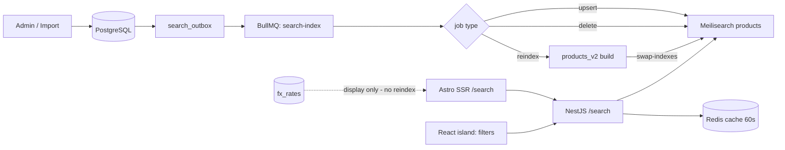

<div dir="rtl">

## 6. البحث والتصفية والمقارنة والتوصيات

البحث هو المسار الأول للشراء في متاجر الجوالات: أكثر من 60% من الجلسات المتوقعة تبدأ بكتابة اسم موديل أو علامة تجارية. لذلك يُعامل البحث كخدمة مستقلة داخل NestJS (`apps/api/src/modules/search`) مبنية فوق **Meilisearch** (البديل: Typesense)، وليس كاستعلام `LIKE` على PostgreSQL. صفحة النتائج نفسها تُقدَّم من `apps/site` (Astro 5) بتصيير خادمي كاملاً لتكون قابلة للفهرسة وقابلة للقراءة بلا JavaScript، والمرشحات جزيرة React واحدة فوقها (راجع 6.4).

### 6.1 معمارية الفهرسة والمزامنة

الفهارس (indexes) المعتمدة:

| الفهرس | المحتوى | التحديث | الحجم التقديري (السنة الأولى) |
|---|---|---|---|
| `products` | الأجهزة والملحقات القابلة للبيع (مستوى المنتج لا المتغير) | لحظي عبر الطابور | 12,000–15,000 مستند |
| `suggestions` | عبارات البحث المُنظّفة + أسماء الموديلات والعلامات | ليلياً | ~4,000 مستند |
| `categories` | الأقسام والمجموعات للتوجيه السريع | عند التغيير | < 200 مستند |

المستند المُفهرس مُسطّح ومحسوب مسبقاً (denormalized) حتى لا يحتاج البحث لأي استعلام إضافي:

```json
{
  "id": "0198f3a2-4b7c-7c31-9a55-2f0e6d1a8c44",
  "slug": "apple-iphone-13-128gb-used",
  "name_ar": "ايفون 13 128 جيجا مستعمل",
  "name_en": "Apple iPhone 13 128GB Used",
  "name_norm": "ايفون 13 128 جيجا مستعمل",
  "brand": "Apple", "brand_ar": "ابل",
  "model_number": ["A2633", "MLPF3"],
  "category": "phones", "os": "iOS",
  "price_usd_cents": 32500, "price_before_usd_cents": 35000, "discount_pct": 7,
  "ram_gb": 4, "storage_gb": 128, "screen_in": 6.1,
  "camera_mp_main": 12, "battery_mah": 3240, "has_5g": true,
  "device_origin": "US", "part_code": "LL/A",
  "dual_sim": false, "esim_only": false,
  "condition": "USED_A", "battery_health_pct": 89,
  "warranty_type": "STORE", "warranty_months": 3,
  "imei_checked": true,
  "colors": ["أسود", "أزرق"], "in_stock": true, "stock_qty": 3,
  "rating": 4.6, "reviews_count": 41, "sales_30d": 27,
  "compatible_model_ids": [],
  "image": "https://cdn.talisham.com/p/0198f3a2-4b7c-7c31-9a55-2f0e6d1a8c44/main.avif",
  "created_at": 1753574400
}
```

ملاحظات على المستند المُفهرس:

- المعرّف `id` هو `UUIDv7` نفسه المخزَّن في عمود `uuid` ويُعرض كسلسلة UUID قياسية بلا أي بادئة نوعية.
- حقل السعر اسمه `price_usd_cents` وقيمته **عدد صحيح بسنتات الدولار الأمريكي** (وكذلك `price_before_usd_cents`). **لا يُخزَّن في الفهرس أي مبلغ بالليرة السورية إطلاقاً**: العرض بالليرة يُحسب في الواجهة لحظة التصيير من سعر الصرف الحالي في جدول `fx_rates` (راجع القسم 3). السبب تشغيلي مباشر: سعر الصرف يتغيّر يدوياً عدة مرات في الشهر، وإعادة فهرسة 15,000 مستند عند كل تعديل عبث لا مبرر له.
- `device_origin` مصدر الاستيراد بخمس قيم `GULF | EURO | US | ASIA | OTHER`، و`part_code` رمز النسخة كما هو مطبوع على العلبة (`ZA/A`, `LL/A`, `AA/A`, `B/A` …) يُخزَّن نصاً خاماً دون تفسير.
- `dual_sim` تعني قبول **شريحتين فعليتين**، و`esim_only` تعني عدم وجود منفذ شريحة فعلية إطلاقاً. الحقلان مستقلان: نسخة `LL/A` الأمريكية من ايفون 13 شريحة واحدة + eSIM (`dual_sim=false`)، بينما النسخة الخليجية `ZA/A` بشريحتين فعليتين — والفرق السعري بينهما حقيقي في السوق ويجب أن يكون قابلاً للتصفية لا مذكوراً في الوصف.
- `condition` بقيم `NEW, OPEN_BOX, REFURBISHED, USED_A, USED_B`، و`battery_health_pct` إلزامي لكل ما ليس `NEW` (يُفهرس كعدد صحيح 0–100 ليكون قابلاً للتصفية بنطاق).
- `device_origin` و`part_code` و`dual_sim` و`esim_only` و`warranty_type` و`warranty_months` و`battery_health_pct` مأخوذة من `product_variants` (النسخة الممثِّلة للمنتج في الفهرس).
- `imei_checked` مشتق من وجود نتيجة فحص IMEI مسجّلة على وحدة الجهاز في `device_units`، ويُعرض كشارة ثقة في بطاقة النتيجة.
- الحقول المسطّحة `name_ar` / `name_en` / `brand_ar` هي إسقاط للفهرسة فقط، مشتقة آلياً من أعمدة `JSONB` بمفتاحي `ar`/`en` في قاعدة البيانات (راجع القسم 3).
- `compatible_model_ids` حقل **مشتق** من جدول `product_compatibility` كما في 6.4 و6.7؛ لا توجد قائمة توافق حرة يكتبها المدخِل.

المزامنة تتم عبر **صندوق صادر (outbox)** لتفادي فقدان الأحداث: كل كتابة على `products` أو `product_variants` أو `prices` أو `inventory_levels` أو `product_compatibility` (راجع القسم 3) تُدرج صفاً في جدول `search_outbox`، ويلتقطه عامل BullMQ في الطابور `search-index`. **تحديث `fx_rates` لا يمسّ الفهرس ولا يُدرج أي صف في `search_outbox`.**



قواعد التشغيل: دفعات (batches) من 200 مستند كل ثانيتين، تزامن (concurrency) = 5، إعادة محاولة أُسّية 5 مرات، وطابور فاشل `search-index-dlq`. تحديثات المخزون فقط تُرسل كتحديث جزئي لحقلي `in_stock` و`stock_qty` لتقليل الحمل، وقيمة `stock_qty` تُقرأ من `inventory_levels` بالمعادلة `on_hand − reserved` (لا تُشتق بـ `COUNT(*)`). إعادة البناء الكاملة (full reindex) تُنفَّذ في فهرس جديد `products_v{n}` ثم تُبدَّل ذرياً عبر `POST /swap-indexes` بدون انقطاع، وزمنها المستهدف أقل من 90 ثانية لـ 15,000 مستند. تُشغَّل تلقائياً بعد كل نشر يغيّر إعدادات الفهرس، وأسبوعياً كوظيفة مجدولة `search:reindex:weekly` ضمن نافذة الصيانة الأسبوعية (ليل الأحد 03:00 بتوقيت دمشق، راجع القسم 11)، مع تحقق آلي من تطابق عدد المستندات بين PostgreSQL والفهرس بعد كل إعادة بناء.

### 6.2 معالجة اللغة العربية عملياً

التطبيع (normalization) يُطبَّق مرتين: على المستند عند الفهرسة (حقل `name_norm` + `search_blob`)، وعلى استعلام المستخدم في `SearchQueryNormalizer` داخل NestJS، بنفس الدالة تماماً حتى لا يختلف السلوك.

| القاعدة | مثال قبل | مثال بعد |
|---|---|---|
| توحيد الهمزات والألف (أ إ آ ٱ ← ا) | آيفون، إيفون، أيفون | ايفون |
| التاء المربوطة (ة ← ه) | سماعة | سماعه |
| الألف المقصورة (ى ← ي) | موبايل ذكى | موبايل ذكي |
| حذف التشكيل (U+064B–U+0652) | هَاتِفٌ | هاتف |
| حذف التطويل (U+0640) | موبايــــل | موبايل |
| الأرقام العربية-الهندية ← لاتينية | ١٢٨ جيجا | 128 جيجا |
| توحيد المسافات وإزالة الرموز الزائدة | آيفون  13 !! | ايفون 13 |

**استعلامات حقيقية متوقعة من السوق السوري** (مأخوذة من صياغة الطلبات على صفحات فيسبوك ومجموعات واتساب، وهي المرجع في بناء ملف المرادفات):

| الاستعلام كما يُكتب | بعد التطبيع | السلوك المتوقع |
|---|---|---|
| `موبايل سامسونج مستعمل` | `موبايل سامسونج مستعمل` | مرادفات + اقتراح مرشّح `condition IN [USED_A, USED_B]` |
| `تلفون شاومي رخيص` | `تلفون شاومي رخيص` | مرادفات + اقتراح فرز `price_usd_cents:asc` |
| `ايفون ١٣ برو ماكس` | `ايفون 13 برو ماكس` | تطابق دقيق على الموديل |
| `جوال بكفالة محل` | `جوال بكفاله محل` | اقتراح مرشّح `warranty_type = "STORE"` |
| `ايفون 13 LL/A` | `ايفون 13 LL/A` | `part_code` كوحدة واحدة، بلا تسامح مطبعي |
| `سامسونج A54 خليجي` | `سامسونج A54 خليجي` | اقتراح مرشّح `device_origin = "GULF"` |
| `بطاريه ايفون 11 اصليه` | `بطاريه ايفون 11 اصليه` | قسم الملحقات + `compatible_model_ids` |
| `خليوي بشريحتين` | `خليوي بشريحتين` | اقتراح مرشّح `dual_sim = true` |

**فهم الاستعلام الخفيف (query understanding)**: قبل إرسال الاستعلام إلى Meilisearch يمرّ على مستخرِج أنماط بسيط (تعبيرات نمطية، بلا تعلّم آلي) يلتقط السعة (`128 جيجا`)، والحالة (`مستعمل`، `جديد`، `مفتوح العلبة`)، ورمز النسخة (`LL/A`)، ومصدر الاستيراد (`خليجي`، `اوروبي`، `امريكي`)، وثنائية الشريحة (`شريحتين`). هذه لا تُطبَّق قسراً بل تُعرض فوق النتائج كرقائق (chips) قابلة للنقر تضيف المرشّح إلى الرابط، فيبقى المستخدم مسيطراً وتبقى الحالة في الرابط لا في ذاكرة الجزيرة.

المرادفات (synonyms) تُدار كملف `packages/search-config/synonyms.json` ويُطبَّق عند النشر. **مرادفات Meilisearch أحادية الاتجاه**: تعريف `"موبايل": ["جوال", ...]` يعني أن استعلام «موبايل» يوسَّع ليشمل «جوال» فقط، ولا يعني أن استعلام «جوال» يوسَّع ليشمل «موبايل». لذلك نكتب المصدر كمجموعات مكافئة في ملف `synonyms.source.json`، ويولّد سكربت `pnpm search:synonyms:build` ملف `synonyms.json` النهائي **بالاتجاهين آلياً** (لكل مصطلح في المجموعة مدخل يسرد بقية المصطلحات) قبل رفعه إلى الفهرس؛ يفشل النشر إذا لم يكن الملف المولَّد متماثلاً.

المصدر (مجموعات مكافئة، لا اتجاه لها) — المفردات الشامية أولاً لأنها الأكثر وروداً فعلياً:

```json
[
  ["موبايل", "جوال", "تلفون", "خليوي", "خلوي", "هاتف", "محمول", "phone", "mobile"],
  ["ايفون", "آيفون", "إيفون", "iphone", "ابل", "أبل", "apple"],
  ["سامسونج", "سامسونغ", "samsung", "جالكسي", "غالاكسي", "galaxy"],
  ["شاومي", "شياومي", "xiaomi", "ريدمي", "redmi", "بوكو", "poco"],
  ["اوبو", "أوبو", "oppo", "ريلمي", "realme", "فيفو", "vivo"],
  ["هواوي", "huawei", "هونر", "honor"],
  ["تكنو", "tecno", "انفينكس", "infinix", "itel"],
  ["شاحن", "تشارجر", "charger", "محول", "شاحن سريع"],
  ["سماعات", "سماعه", "هاندسفري", "ايربودز", "airpods", "headphones", "buds"],
  ["بطاريه", "بطارية", "battery", "بطاريه اصليه"],
  ["مستعمل", "سكند هاند", "نضيف", "used", "second hand"],
  ["كفاله", "كفالة", "ضمان", "warranty"],
  ["خليجي", "شرق اوسطي", "gulf"],
  ["امريكي", "أمريكي", "us", "ll/a"],
  ["ساعه ذكيه", "ساعة ذكية", "smartwatch", "ووتش", "watch"]
]
```

المولَّد (مقتطف — لاحظ وجود مدخل لكل مصطلح في الاتجاهين):

```json
{
  "موبايل": ["جوال", "تلفون", "خليوي", "خلوي", "هاتف", "محمول", "phone", "mobile"],
  "جوال":   ["موبايل", "تلفون", "خليوي", "خلوي", "هاتف", "محمول", "phone", "mobile"],
  "تلفون":  ["موبايل", "جوال", "خليوي", "خلوي", "هاتف", "محمول", "phone", "mobile"],
  "خليوي":  ["موبايل", "جوال", "تلفون", "خلوي", "هاتف", "محمول", "phone", "mobile"],
  "ايفون":  ["آيفون", "إيفون", "iphone", "ابل", "أبل", "apple"],
  "iphone": ["ايفون", "آيفون", "إيفون", "ابل", "أبل", "apple"]
}
```

إعدادات Meilisearch الأساسية:

```ts
await index.updateSettings({
  searchableAttributes: ['name_ar','name_en','name_norm','brand_ar','brand',
    'model_number','part_code','category','colors'],
  filterableAttributes: ['brand','category','os','price_usd_cents','ram_gb','storage_gb','screen_in',
    'camera_mp_main','battery_mah','has_5g','condition','battery_health_pct',
    'device_origin','part_code','dual_sim','esim_only',
    'warranty_type','warranty_months','imei_checked','reviews_count',
    'in_stock','colors','compatible_model_ids'],
  sortableAttributes: ['price_usd_cents','created_at','sales_30d','rating','battery_health_pct'],
  rankingRules: ['words','typo','proximity','attribute','in_stock:desc','sort','exactness',
    'sales_30d:desc','rating:desc'],
  typoTolerance: {
    minWordSizeForTypos: { oneTypo: 4, twoTypos: 8 },
    disableOnAttributes: ['model_number','part_code']
  },
  nonSeparatorTokens: ['-','+','/','.'],   // يحافظ على SM-S928B و LL/A و A3102 ككلمة واحدة
  faceting: { maxValuesPerFacet: 200 },
  pagination: { maxTotalHits: 2000 }
});
```

هذا يغطي: البحث بالإنجليزية عن الموديل (`iPhone 13 Pro`) بفضل حقول `name_en`، تصحيح الأخطاء المطبعية (`سامسونح` → `سامسونج`)، والبحث برقم الموديل أو رمز النسخة الدقيق مع تعطيل التسامح المطبعي عليهما (`LL/A` يجب ألّا يطابق `AA/A` أبداً — الفرق بينهما فرق سعر حقيقي).

**كل مرشّحات السعر تُصاغ بسنتات الدولار مباشرة** ولا تُصاغ بالليرة أبداً، مثل `price_usd_cents >= 15000 AND price_usd_cents <= 30000` لشريحة 150–300 دولار. الواجهة تحوّل حدّي الشريحة للعرض بالليرة بضربهما في `fx_rates.rate` الحالي وتقريب المعروض لأقرب 1000 ليرة، ثم تعيد التحويل إلى سنتات عند بناء الاستعلام — أي أن الليرة طبقة عرض بحتة داخل حدود الشرائح الثابتة بالدولار، فلا تتغيّر حدود الشرائح ولا العدّادات المخزَّنة مع تغيّر سعر الصرف. ويُصاغ مرشّح مصدر الاستيراد بالشكل `device_origin = "GULF"`، ورمز النسخة `part_code = "LL/A"`.

### 6.3 الإكمال التلقائي والاقتراحات وسجل البحث

- استدعاء `GET /api/v1/search/suggest?q=` من مربع البحث مع تأخير (debounce) 150ms وإلغاء الطلب السابق عبر `AbortController`، وحد 8 اقتراحات.
- **تكيّف مع الشبكة البطيئة**: عند `navigator.connection.effectiveType ∈ {2g, slow-2g}` أو `saveData = true` يرتفع التأخير إلى 300ms وينخفض الحد إلى 5 اقتراحات نصية بلا صور، لأن 3G هي الحالة الشائعة لا الاستثناء.
- الاقتراحات مركّبة: 4 عبارات من فهرس `suggestions` + 3 منتجات مع صورة وسعر + سطر واحد للقسم المطابق.
- سجل البحث للمستخدم المسجّل في Redis: `search:hist:{userId}` كقائمة بحد 20 عنصراً و TTL 180 يوماً؛ وللزائر في `localStorage` (يعمل دون اتصال).
- العبارات الرائجة: `ZINCRBY search:trending:{yyyy-ww}` وتُعرض عند فتح مربع البحث فارغاً؛ وتُزرَع في الإطلاق يدوياً بأكثر عشرة موديلات تداولاً في السوق المحلي.
- عند صفر نتائج: تخفيف تدريجي — إسقاط آخر كلمة، ثم البحث بالمرادفات، ثم عرض "الأكثر مبيعاً في القسم"، مع تسجيل الحدث `search_no_results`.
- حدود المعدل لنقطتَي `/search` و`/search/suggest` مصدرها الوحيد جدول القسم 9، ولا تُكرَّر قيمها هنا.

### 6.4 المرشحات الوجهية (facets)، تقديم الصفحة، وسلوك التصفية على الجوال

| المرشّح الوجهي | المفتاح | معامل الرابط | العنصر في الواجهة |
|---|---|---|---|
| العلامة التجارية | `brand` | `brand` | قائمة مع بحث داخلي وعدّاد |
| السعر | `price_usd_cents` | `price_min` / `price_max` (بالسنتات) | شريط مزدوج + شرائح جاهزة: < 100$، 100–200$، 200–350$، 350–600$، > 600$ — تُعرض قيمتها بالليرة محسوبة من سعر الصرف الحالي |
| مصدر الاستيراد | `device_origin` | `origin` | شرائح متعددة الاختيار: خليجي `GULF` / أوروبي `EURO` / أمريكي `US` / آسيوي `ASIA` / أخرى `OTHER` |
| رمز النسخة | `part_code` | `part` | قائمة بحث داخلي (`ZA/A`, `LL/A`, `AA/A`, `B/A` …) مع تلميح يشرح دلالة الرمز |
| ثنائية الشريحة | `dual_sim` | `dual_sim` | مفتاح «شريحتان فعليتان» |
| eSIM فقط | `esim_only` | `esim_only` | مفتاح ثانوي (مطوي افتراضياً) |
| حالة الجهاز | `condition` | `condition` | شرائح متعددة: جديد `NEW` / مفتوح العلبة `OPEN_BOX` / مجدد `REFURBISHED` / مستعمل ممتاز `USED_A` / مستعمل جيد `USED_B` |
| صحة البطارية | `battery_health_pct` | `battery_min` | شرائح: 95%+، 90%+، 85%+، 80%+ — تظهر تلقائياً عند اختيار أي حالة غير `NEW` |
| نوع الكفالة | `warranty_type` + `warranty_months` | `warranty` / `warranty_months` | كفالة محل `STORE` / وكيل `AGENT` / مستورد `IMPORTER` / بلا كفالة `NONE` + 3 / 6 / 12 شهراً |
| فحص IMEI | `imei_checked` | `imei` | مفتاح «مفحوص IMEI فقط» |
| الذاكرة العشوائية | `ram_gb` | `ram` | شرائح: 4، 6، 8، 12، 16 |
| التخزين | `storage_gb` | `storage` | شرائح: 64، 128، 256، 512، 1024 |
| حجم الشاشة | `screen_in` | `screen` | نطاقات: أقل من 6.1، 6.1–6.7، أكبر من 6.7 |
| الكاميرا الرئيسية | `camera_mp_main` | `camera` | 12+، 48+، 108+، 200+ |
| البطارية | `battery_mah` | `battery` | 4000+، 5000+، 6000+ |
| شبكة 5G | `has_5g` | `g5` | مفتاح تبديل |
| النظام | `os` | `os` | Android / iOS |
| التوافق | `compatible_model_ids` | `fits` | يظهر في أقسام الملحقات فقط: «متوافق مع جهازي» |
| التوفر | `in_stock` | `stock` | مفتاح "المتوفر فقط" |

**المرشحات الأربعة الحاسمة محلياً** — مصدر الاستيراد، رمز النسخة، حالة الجهاز، ونوع الكفالة — مرئية دائماً في صفحات الجوالات وفي أعلى الورقة السفلية قبل أي مرشّح آخر، لأنها هي ما يفسّر أن جهازين متطابقين ظاهرياً يختلفان بمئة دولار. مرشّح مصدر الاستيراد لا يُدمج مع مرشّح الكفالة: جهاز خليجي المصدر قد يحمل كفالة محل، والعكس صحيح. أما `compatible_model_ids` فقيمه **مشتقة** من جدول `product_compatibility` وتُحقن في مستند الملحق عند الفهرسة.

**تقديم صفحة النتائج: Astro SSR + جزيرة مرشحات واحدة**

صفحة `/search` وصفحات `/c/[slug]` و`/b/[slug]` تُصيَّر على الخادم في `apps/site`، فتصل إلى المتصفح قائمة نتائج HTML كاملة يقرأها الزاحف ويقرأها المستخدم قبل تنفيذ أي سطر JavaScript. الجزيرة الوحيدة هي لوحة المرشحات (`client:idle`)، وميزانيتها ≤ 18KB مضغوطاً ضمن سقف 60KB لصفحات Astro.

```astro
---
// apps/site/src/pages/search.astro
export const prerender = false;                    // SSR — لا توليد ساكن لصفحة النتائج
import Filters from '../components/search/Filters.tsx';
import ResultsList from '../components/search/ResultsList.astro';
import { parseSearchParams, toQueryString } from '@talisham/search-params';

const params   = parseSearchParams(Astro.url.searchParams);   // مصدر الحقيقة الوحيد
const currency = Astro.cookies.get('currency_pref')?.value ?? 'SYP';
const [res, fx] = await Promise.all([searchApi.query(params), fxApi.current()]);
---
<ResultsList hits={res.hits} total={res.total} fx={fx} currency={currency} />
<Filters client:idle facets={res.facets} initial={params} total={res.total} />
<noscript><form method="get" action="/search"><!-- كل المرشحات كحقول GET --></form></noscript>
```

بنية الروابط الفعلية (كل مرشّح معامل صريح، والرابط قابل للنسخ واللصق في واتساب):

```
/search?q=ايفون+13&origin=US&part=LL%2FA&condition=USED_A&battery_min=85&sort=price_asc
/search?q=موبايل+سامسونج&origin=GULF&dual_sim=1&warranty=STORE&price_min=10000&price_max=30000
/c/phones?brand=Apple&condition=USED_A,USED_B&battery_min=90&stock=1&page=2
/b/samsung?origin=GULF&storage=256&price_max=45000&sort=price_asc
/c/chargers?fits=0198f3a2-4b7c-7c31-9a55-2f0e6d1a8c44
```

قواعد الجزيرة، ملزِمة:

- **مصدر حالة المرشحات هو `location.search` لا حالة React الداخلية.** الجزيرة تقرأ الحالة الابتدائية من الخصائص التي حقنها الخادم، وكل تفاعل يكتب أولاً في الرابط ثم يعيد الجلب.
- تغيير مرشّح كامل ← `history.pushState` (يدخل سجل التصفح، فزر الرجوع يلغي آخر مرشّح كما يتوقع المستخدم). سحب الشريط المزدوج ← `history.replaceState` بتأخير 250ms حتى لا يمتلئ السجل.
- حدث `popstate` يعيد بناء الحالة من الرابط بالكامل — لا مسار تحديث لا يمرّ بالرابط.
- بعد الكتابة في الرابط: `fetch('/api/v1/search?' + qs)` وتحديث القائمة موضعياً؛ وإن فشل الطلب مرتين تسقط الجزيرة إلى `location.assign(url)` فيتولّى Astro التصيير من الخادم — وهو مسار الاحتياط نفسه الذي يعمل بلا JavaScript أصلاً.

سياسة الفهرسة (تفصيلها في القسم 12): صفحات الفئة والعلامة مع تركيبات المرشحات المدرجة في قائمة بيضاء (`brand`, `condition`, `origin`, `storage`) تحصل على `canonical` ذاتي وتُفهرس لأنها تطابق نية بحث حقيقية («ايفون مستعمل بدمشق»)؛ وما عداها من التركيبات والصفحات ذات `q` الحر يأخذ `noindex,follow` مع `canonical` إلى الصفحة الأم، منعاً لتضخم الفهرس.

**على الجوال**: زر ثابت "التصفية" أسفل الشاشة يفتح **ورقة سفلية (bottom sheet)** بارتفاع 85vh مع تمرير داخلي، ويظل زر أساسي ثابت أسفلها يعرض العدد الفوري: «عرض 128 نتيجة». الورقة السفلية وشريط الأدوات الملتصق سطحان زجاجيان صغيران ثابتان (`--glass-regular`)، أما قائمة النتائج المتمرّرة فأسطح صلبة بلا زجاج التزاماً بقواعد الأداء في القسم 5. العدّادات تأتي من `facetDistribution` في نفس استجابة البحث دون طلب إضافي، وتُحدَّث تفاؤلياً خلال أقل من 200ms. القيم التي تُنتج صفر نتائج تُعطَّل بصرياً ولا تُخفى.

### 6.5 الفرز وقواعد الترتيب

| الخيار | معامل الرابط | التنفيذ |
|---|---|---|
| الأكثر صلة (افتراضي) | — | `rankingRules` أعلاه دون `sort` |
| السعر: من الأقل | `sort=price_asc` | `sort=price_usd_cents:asc` |
| السعر: من الأعلى | `sort=price_desc` | `sort=price_usd_cents:desc` |
| الأحدث | `sort=new` | `sort=created_at:desc` |
| الأكثر مبيعاً | `sort=best` | `sort=sales_30d:desc` |
| الأعلى تقييماً | `sort=rating` | `sort=rating:desc` مع فلتر `reviews_count >= 5` |
| أفضل بطارية (للمستعمل) | `sort=battery` | `sort=battery_health_pct:desc` مع فلتر `condition != "NEW"` |

الفرز بالسعر يعمل على `price_usd_cents` دائماً، فيبقى الترتيب مستقراً ولا يتغيّر عند تعديل سعر الصرف — وهذا سبب إضافي لعدم تخزين أي مبلغ بالليرة في الفهرس.

**دقة مهمة حول `in_stock:desc`**: قواعد الترتيب في Meilisearch تُطبَّق بالتسلسل، وعند تمرير فرز صريح تحسم قاعدة `sort` الترتيب قبل أن تصل النتائج إلى أي قاعدة تليها. لذلك لا يصح وضع `in_stock:desc` بعد `sort` ثم افتراض أنها ستُقدّم المتوفر على النافد. المعتمد أن `in_stock:desc` **تسبق** `sort` في `rankingRules` (كما في إعدادات 6.2)، فتنقسم النتائج أولاً إلى مجموعتين — متوفر ثم نافد — **ويبقى الفرز المطلوب (السعر أو التاريخ أو المبيعات) فعّالاً داخل كل مجموعة على حدة**. أي أن «السعر: من الأقل» يعني: المتوفر مرتّباً تصاعدياً بالسعر، يليه النافد مرتّباً تصاعدياً بالسعر.

البديل إذا رغبنا في فرز عالمي واحد بالسعر عبر المجموعتين معاً مع إبقاء النافد أسفل الصفحة: استعلامان متتاليان بنفس المرشّحات والفرز، الأول بـ `filter=in_stock = true` والثاني بـ `filter=in_stock = false`، ثم دمج النتيجتين في الخادم. في الحالتين النافد يظهر في النهاية ولا يُخفى، لتفعيل "أعلمني عند التوفر".

### 6.6 المقارنة بين الأجهزة

- حتى **4 أجهزة**، تُخزَّن معرفاتها في `localStorage` تحت `compare:v1` ومزامَنة في عنوان `/compare?ids=a,b,c,d` لتكون قابلة للمشاركة عبر واتساب — وهي قناة المشاركة الأولى فعلياً، لذا يُصيَّر `/compare` من Astro على الخادم ليظهر معاينة الرابط كاملة.
- مربع اختيار "قارن" على كل بطاقة منتج + شريط عائم سفلي يعرض المصغّرات وزر «قارن (3)».
- جدول المواصفات يعتمد `spec_keys` الموحّدة من القسم 3، مجمّعاً في أقسام: الشاشة، الأداء، الكاميرا، البطارية والشحن، الاتصال، **مصدر الاستيراد ورمز النسخة والشرائح**، الأبعاد، **الحالة وصحة البطارية**، الكفالة والسعر.
- **تمييز الفروق**: مفتاح «إظهار الاختلافات فقط» يخفي الصفوف المتطابقة، وتُظلَّل الخانة الأفضل رقمياً (وفق اتجاه المواصفة: أعلى أفضل للبطارية وصحة البطارية، أقل أفضل للوزن) بخلفية خضراء خفيفة + أيقونة، لا باللون وحده (متطلب إمكانية الوصول، راجع القسم 5).
- السعر في جدول المقارنة يُعرض بالعملة المختارة (ليرة أو دولار) من مفتاح واحد أعلى الجدول، والقيمة المرجعية دائماً `price_usd_cents`.
- على الجوال: العمود الأول (اسم المواصفة) مثبّت `position: sticky` مع `inset-inline-start: 0`، وبقية الأعمدة بتمرير أفقي بمحاذاة `scroll-snap`، وعرض عمود المنتج 42vw.

### 6.7 التوصيات

المرحلة الأولى (تنطلق مع الإصدار الأول، بلا تعلّم آلي):

| الوحدة | المنطق | المصدر |
|---|---|---|
| منتجات مشابهة | نفس `category` و`os`، السعر ضمن ±20% من `price_usd_cents`، استبعاد المنتج نفسه، ترتيب `sales_30d` | استعلام Meilisearch واحد |
| نفس الموديل بحالة أخرى | نفس `model_number` مع `condition` مختلفة، مرتّبة بالسعر تصاعدياً | Meilisearch |
| نسخ أخرى من نفس الموديل | نفس `model_number` مع `device_origin` أو `part_code` مختلف — يشرح فرق السعر بدل أن يثير الشك فيه | Meilisearch |
| ملحقات متوافقة | `compatible_model_ids = "<product_id>"` على مستندات الملحقات، والحقل مشتق من `product_compatibility` | Meilisearch |
| شوهد مؤخراً | قائمة Redis `rv:{userId\|anonId}` بحد 20 و TTL 90 يوماً | Redis |
| يُشترى معاً | جدول `product_affinity(product_id, related_id, score, computed_at)` | وظيفة BullMQ ليلية |

وظيفة `co-purchase:rebuild` تحسب أزواج المنتجات من `order_items` خلال آخر 90 يوماً بحد أدنى 5 طلبات مشتركة (min support)، وتحتفظ بأفضل 10 لكل منتج. المرحلة الثانية (بعد 3 أشهر من البيانات الحقيقية): ترجيح بالنقر لا بالشراء فقط، ثم التخصيص حسب سجل التصفح. المرحلة الثالثة (اختيارية): تضمينات دلالية (embeddings) عبر `pgvector` أو البحث المتجهي في Meilisearch لتغطية استعلامات وصفية مثل «موبايل ببطارية قوية وكاميرا منيحة تحت 300 دولار». كل وحدة توصيات تُحمَّل بكسول (lazy) بعد المحتوى الأساسي حتى لا تؤثر على LCP.

### 6.8 قياس جودة البحث وزمن الاستجابة

أحداث تُرسل إلى PostHog و GA4: `search_performed` (النص، عدد النتائج، زمن الاستجابة)، `search_no_results`، `search_result_clicked` (الموضع)، `facet_applied` (مع مفتاح المرشّح)، `compare_opened`، `recommendation_clicked`.

> **هذا الجدول هو المصدر الوحيد لزمن استجابة البحث في الوثيقة كلها.** القسم 1 (مؤشرات النجاح) والقسم 11 (المراقبة والتنبيهات) يحيلان إليه ولا يكرّران قيمه.

| المؤشر | الهدف | التنبيه |
|---|---|---|
| **زمن استجابة البحث p95** | **≤ 150 مللي ثانية** | **> 250 مللي ثانية لمدة 5 دقائق** |
| زمن استجابة الاقتراحات p95 | ≤ 60 مللي ثانية | > 100 مللي ثانية |
| معدل البحث دون نتائج | < 5% من الاستعلامات | > 8% لمدة ساعة |
| نسبة النقر على النتائج (CTR) | > 35% | < 25% أسبوعياً |
| متوسط موضع النقرة الأولى | ≤ 4 | > 6 |
| التحويل من البحث إلى السلة | > 12% | — |

زمن البحث يُقاس **داخل الخادم**: من دخول الطلب إلى `apps/api` حتى خروج الاستجابة، شاملاً زمن Meilisearch وطبقة NestJS، **دون زمن الشبكة**. هذا التمييز ضروري لأن القياس المرجعي لتجربة المستخدم يجري على شبكة بطيئة (راجع القسم 11)، فلا يصح خلط بطء الشبكة ببطء الخدمة عند إطلاق التنبيهات.

يُراجَع تقرير «أعلى 50 استعلاماً دون نتائج» أسبوعياً من لوحة التحكم (راجع القسم 10) ويُترجَم مباشرة إلى إضافات في ملف المرادفات أو إلى فجوات في الكتالوج (راجع القسم 7). ويُراجَع معه توزيع `facet_applied` على مرشحات مصدر الاستيراد ورمز النسخة وحالة الجهاز، لأن ارتفاع استخدامها مؤشر مباشر على أن فروق النسخ هي محرّك القرار الشرائي في السوق.

</div>
