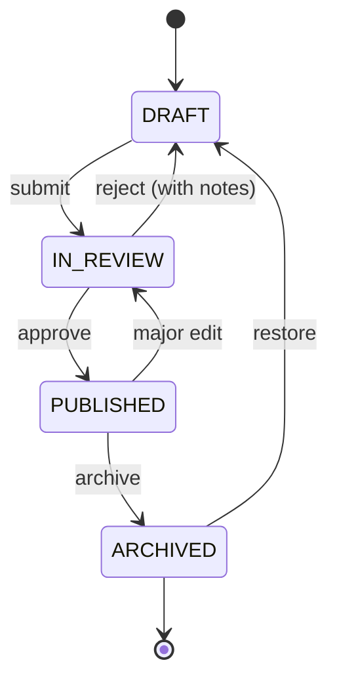
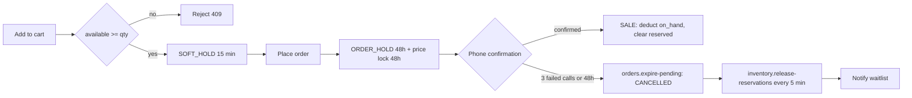

<div dir="rtl">

## 7. الكتالوج وإدارة المخزون والتسعير والعروض

### 7.1 بنية الفئات والعلامات التجارية وشجرة التصنيف

الكتالوج مبني على ثلاثة كيانات مستقلة: الفئة (Category) شجرية، والعلامة التجارية (Brand) مسطّحة، ومجموعة السمات (Attribute Set) المرتبطة بالفئة. تُخزَّن الشجرة بأسلوب المسار المُجسَّد (Materialized Path) في العمود `categories.path` من نوع `ltree` مع فهرس GiST، ما يجعل استعلام "كل أبناء فئة" بعملية واحدة بدل استعلامات متكررة، ويحدّ العمق الأقصى بأربعة مستويات لتبقى قوائم التنقل في الجوال قابلة للاستيعاب على شبكات بطيئة.

```text
phones (الجوالات)
├── smartphones (هواتف ذكية)
├── feature-phones (هواتف بسيطة)
└── used-refurbished (مستعمل ومجدَّد)
accessories (الملحقات)
├── audio (سماعات) → tws | wired | over-ear
├── power (الطاقة) → chargers | cables | power-banks | solar-chargers
├── protection (الحماية) → cases | screen-protectors
└── mounts (حوامل ومثبتات)
wearables (الأجهزة القابلة للارتداء)
├── smartwatches (ساعات ذكية)
└── bands (أساور رياضية)
```

الفئة `power` ليست فئة ثانوية في هذا السوق: انقطاع الكهرباء المتكرر يجعل بطاريات الطاقة المحمولة (`power-banks`) والشواحن الشمسية من أعلى الفئات دوراناً بعد الجوالات نفسها، ولذلك ترث ترتيب عرض متقدّماً في `categories.sort_order` وتظهر في التنقل السفلي للفئات.

كل فئة ترتبط بمجموعة سمات تحدد حقول المنتج القابلة للتصفية (راجع القسم رقم 6 لآلية الفهرسة والتصفية). للجوالات: `screen_size_in`, `chipset`, `ram_gb`, `storage_gb`, `battery_mah`, `camera_main_mp`, `network_gen` (4G/5G)، `sim_type`. أما فروق السوق الحاسمة سعرياً فليست سمات حرة بل **أعمدة إلزامية على مستوى المتغيّر** في `product_variants` (راجع القسم رقم 3):

| العمود | النوع | لماذا هو إلزامي |
|---|---|---|
| `device_origin` | `ENUM('GULF','EURO','US','ASIA','OTHER')` | مصدر الاستيراد يحدد الملحقات المرفقة ووضع الكفالة وقبول السوق، وفرق سعره حقيقي |
| `part_code` | `VARCHAR(8)` بنمط `^[A-Z]{2}/A$` | رمز النسخة المطبوع على العلبة (`ZA/A`, `LL/A`, `AA/A`) — أدق من «خليجي/دولي» ويحسم النزاع مع العميل |
| `dual_sim` | `BOOLEAN` | شريحتان فعليتان: مطلب شائع جداً محلياً (خطّا سيريتل وMTN سوريا معاً) |
| `esim_only` | `BOOLEAN` | غياب منفذ الشريحة يجعل الجهاز غير صالح لكثير من المشترين هنا، وإخفاؤه سبب مرتجعات |
| `condition` | `ENUM('NEW','OPEN_BOX','REFURBISHED','USED_A','USED_B')` | نصف السوق مستعمل؛ الحالة عنصر تسعير لا وصف تسويقي |
| `battery_health_pct` | `SMALLINT` (إلزامي لغير الجديد) | أول سؤال يطرحه المشتري المحلي على أي جهاز مستعمل |
| `warranty_type` | `ENUM('STORE','AGENT','IMPORTER','NONE')` | كفالة المحل هي الغالبة عملياً، وذكرها مكتوبةً شرط ثقة |
| `warranty_months` | `SMALLINT` | 12 شهراً للجديد و3 أشهر للمستعمل افتراضياً، وتُكتب على الإيصال |

للملحقات: `connector_type` (USB-C / Lightning) و`output_watt` و`capacity_mah` لبطاريات الطاقة؛ أما التوافق مع الهواتف فيُنمذَج علائقياً في جدول `product_compatibility(id, accessory_product_id, phone_product_id, note JSONB)` بقيد `UNIQUE(accessory_product_id, phone_product_id)` وفهرس على `phone_product_id` (القسم رقم 3)، ولا توجد قائمة توافق حرة داخل المنتج؛ وحقل `compatible_model_ids` في فهرس البحث مشتق من هذا الجدول.

جدول `brands` يحمل `slug`, `name JSONB`, `logo_media_id`, `is_featured`, `sort_order`، والعلاقة مع المنتج علاقة واحد-إلى-متعدد. العلامات الافتتاحية ونطاقاتها السعرية الواقعية في السوق السوري (بالدولار الأمريكي، وهي وحدة التسعير المرجعية):

| العلامة | نماذج شائعة فعلياً | نطاق السعر بالدولار |
|---|---|---|
| Apple | iPhone 11 / 12 / 13 مستعمل، iPhone 15 Pro Max جديد | 150 – 950 |
| Samsung | Galaxy A06 / A16 / A35، S23 مستعمل | 90 – 520 |
| Xiaomi / POCO | Redmi 14C، Redmi Note 14، POCO X6 | 95 – 280 |
| Honor | X6b / X8b | 110 – 190 |
| Infinix / Tecno | Smart 9، Spark 30، Camon 30 | 75 – 180 |
| Realme / Oppo | C65، A18 | 85 – 200 |
| Nokia | 105 / 110 (هاتف بسيط) | 15 – 30 |

تُخزَّن كل النصوص متعددة اللغات في جداول الكتالوج في أعمدة `JSONB` بمفتاحي `ar`/`en` — مثل `brands.name` و`products.name` و`products.description` و`product_variants.color_name` — مع سقوط آمن `COALESCE(col->>$locale, col->>'ar')` كما في القسم رقم 3، فلا توجد أعمدة `*_ar`/`*_en` ولا جداول ترجمة منفصلة، ما يقلّل الالتحاقات (JOINs) في مسارات القراءة الحرجة.

### 7.2 دورة حياة المنتج

المنتج يمر بحالات صريحة في العمود `products.status`، ولا يُسمح بالانتقال إلا عبر خدمة `ProductLifecycleService` التي تسجّل كل انتقال في `product_status_history` (من، إلى، المستخدم، السبب، التوقيت).



**بوابات الجودة قبل الانتقال إلى `IN_REVIEW`** — أي بوابة فاشلة تمنع الانتقال وتمنع النشر نهائياً:

| البوابة | الشرط |
|---|---|
| المحتوى العربي | `products.name->>'ar'` و`products.description->>'ar'` غير فارغين، والوصف ≥ 150 حرفاً |
| التصنيف | فئة موجودة في الشجرة وعلامة تجارية مرتبطة |
| السعر | متغيّر صالح واحد على الأقل بـ `price_usd_cents > 0` (سنتات دولارية، القسم رقم 3) |
| فروق السوق | قيم غير فارغة لـ `device_origin` و`part_code` (لفئة `phones`) و`dual_sim` و`esim_only` و`condition` و`warranty_type` و`warranty_months` في **كل** متغيرات المنتج |
| الأجهزة غير الجديدة | `battery_health_pct` غير فارغ، و`imei_check_status = 'CLEAN'` للوحدة، و≥ 3 صور بـ `media.is_real_unit_photo = true` للجهاز نفسه، وتقرير فحص مرفوع |
| الوسائط | 4 صور بحد أدنى مع نص بديل عربي في `media.alt->>'ar'` |

الانتقال إلى `PUBLISHED` يطلق حدث `product.published` على BullMQ: إعادة فهرسة Meilisearch، وتفريغ مفاتيح Redis (`price:*` و`stock:*` للمنتج)، وإعادة بناء صفحة المنتج الساكنة في Astro وتفريغ ذاكرة الحافة لمسارها `/p/[slug]`. الأرشفة لا تحذف السجل ولا تكسر الطلبات السابقة؛ الصفحة تعيد 410 وتُزال من الفهرس ومن خريطة الموقع (sitemap).

### 7.3 المتغيرات والوسائط

المتغير (Variant) هو وحدة البيع والمخزون والسعر: `product_variants` بمفتاح فريد `UNIQUE(product_id, storage_gb, ram_gb, color_code, device_origin, part_code)` ونمط SKU ثابت `IP15PM-256-NT-ZA` (موديل-سعة-لون-رمز النسخة)، ويُلحق `-U` بالوحدات المستعملة (`IP13-128-MDN-LL-U`). الصور مرتبطة بمستوى اللون لا بمستوى المتغير، عبر جدول الوسائط الموحّد `media(owner_type, owner_id, color_code, is_real_unit_photo, …)` وهو الجدول الوحيد للوسائط، فلا تُكرَّر صور اللون الأسود لنسختي 256GB و512GB، ويكفي تغيير معرض الصور فورياً عند اختيار اللون دون إعادة تحميل.

| القاعدة | القيمة |
|---|---|
| الأبعاد الدنيا | 2000×2000 بكسل، نسبة 1:1، خلفية بيضاء (صور الكتالوج) |
| الصيغة الأصلية المقبولة | JPEG / PNG / WebP، حد أقصى 8 ميجابايت للملف |
| الصيغ المُنتَجة | AVIF ثم WebP عبر `astro:assets` وCloudflare Images بعروض 320/480/720/1080/1600 (وBunny Optimizer في الخطة البديلة، القسم رقم 11) |
| عدد الصور | 4 كحد أدنى، 12 كحد أقصى لكل لون |
| **صور الوحدة الحقيقية** | إلزامية لكل متغيّر بحالة ≠ `NEW`: 6 صور بحد أدنى للجهاز نفسه (الواجهة، الظهر، الحواف الأربع، الشاشة وهي تعمل، شاشة الإعدادات تُظهر السعة، لقطة صحة البطارية)، بـ `is_real_unit_photo = true`، وبلا فلاتر أو تجميل |
| النص البديل | `media.alt JSONB` بمفتاح `ar` إلزامي، 15–125 حرفاً، ممنوع تكرار نفس النص لصورتين |
| الفيديو | اختياري، ≤ 30 ثانية، ≤ 15 ميجابايت، MP4/H.264 |

يرفض الرفع أي ملف يخالف القواعد برسالة تشخيصية، ويُحسب تمثيل لوني تقريبي (blurhash) ويُخزَّن في `media.blurhash` لعرض عنصر نائب أثناء التحميل. وفي **وضع توفير البيانات** (ترويسة `Save-Data` أو تفضيل `prefers-reduced-data` أو تفعيل المستخدم للوضع يدوياً) يُقدَّم عرض 480 بكسل بجودة مخفّضة ويُلغى تحميل الفيديو مسبقاً — قرار محسوس على شبكات 3G وباقات محدودة الحجم.

### 7.4 الاستيراد الجماعي والتحقق

الاستيراد يقبل CSV بترميز UTF-8 مع BOM أو XLSX، عبر `POST /v1/admin/catalog/imports` الذي يرفع الملف إلى التخزين الكائني ويجدول مهمة `catalog-import` على BullMQ. التنفيذ على مرحلتين: تشغيل تجريبي (`dry_run: true`) يتحقق ولا يكتب، ثم تنفيذ فعلي. التحقق بمخططات Zod على مستوى الصف، والكتابة على دفعات من 500 صف داخل معاملة واحدة لكل دفعة.

الأعمدة الإلزامية وقواعد التحقق — وهي **نفس** بوابات جودة النشر في 7.2، لأن ما لا يُستورد صحيحاً لا يُنشر:

| العمود | إلزامي | التحقق | رمز الخطأ عند الفشل |
|---|---|---|---|
| `sku` | دائماً | فريد عالمياً وداخل الملف، نمط `^[A-Z0-9-]{6,32}$` | `DUPLICATE_SKU` |
| `product_name_ar`, `color_name_ar` | دائماً | غير فارغ | `REQUIRED_FIELD_MISSING` |
| `brand_slug`, `category_path` | دائماً | موجودان في الشجرة | `UNKNOWN_REFERENCE` |
| `storage_gb`, `ram_gb` | للجوالات | عدد صحيح موجب | `INVALID_NUMBER` |
| `device_origin` | دائماً | ضمن `GULF, EURO, US, ASIA, OTHER` | `INVALID_ENUM_VALUE` |
| `part_code` | لفئة `phones` | نمط `^[A-Z]{2}/A$` | `PART_CODE_FORMAT` |
| `dual_sim`, `esim_only` | دائماً | `true/false`، وممنوع أن يكونا `true` معاً | `SIM_FLAGS_CONFLICT` |
| `condition` | دائماً | ضمن `NEW, OPEN_BOX, REFURBISHED, USED_A, USED_B` | `INVALID_ENUM_VALUE` |
| `battery_health_pct` | إذا `condition ≠ NEW` | عدد صحيح 1–100، و≥ 85 للدرجة `USED_A` | `BATTERY_HEALTH_REQUIRED` |
| `warranty_type` | دائماً | ضمن `STORE, AGENT, IMPORTER, NONE` | `INVALID_ENUM_VALUE` |
| `warranty_months` | دائماً | عدد صحيح ≥ 0 (12 للجديد، 3 للمستعمل افتراضياً) | `REQUIRED_FIELD_MISSING` |
| `price_usd_cents` | دائماً | عدد صحيح موجب **بسنتات الدولار**، ويُرفض أي كسر عشري | `PRICE_NOT_INTEGER_CENTS` |
| `compare_at_price_usd_cents` | اختياري | فارغ أو أكبر من `price_usd_cents` | `COMPARE_PRICE_INVALID` |
| `initial_stock`, `warehouse_code` | دائماً | المستودع موجود ونشط | `UNKNOWN_REFERENCE` |
| `image_urls` | دائماً | مفصولة بـ `\|`، وكل رابط يعيد 200 | `IMAGE_UNREACHABLE` |
| `real_unit_image_urls` | إذا `condition ≠ NEW` | 6 روابط بحد أدنى للجهاز نفسه | `REAL_PHOTO_REQUIRED` |
| `imei_list` | للوحدات المفردة | 15 رقماً، فحص Luhn، فريد عالمياً | `IMEI_LUHN_FAILED` / `IMEI_DUPLICATE` |

أعمدة الملف `product_name_ar`/`product_name_en` و`color_name_ar`/`color_name_en` مجرد حقول في ملف الاستيراد تُدمج عند الكتابة في عمود `JSONB` واحد بمفتاحي `ar`/`en` (`products.name`، `product_variants.color_name`)، والنسخة الإنجليزية اختيارية مع سقوط آمن إلى العربية. **كل قيم الأسعار في الملف أعداد صحيحة بسنتات الدولار الأمريكي** ولا تُقبل أي قيمة بالليرة السورية في الاستيراد إطلاقاً، لأن الليرة طبقة عرض تُحسب من `fx_rates` (7.6).

```json
{
  "importId": "0198f3a2-4b7c-7c31-9a55-2f0e6d1a8c44",
  "fileName": "used-iphones-damascus-2607.xlsx",
  "totalRows": 420,
  "succeeded": 398,
  "failed": 22,
  "durationMs": 18740,
  "errors": [
    { "row": 17, "column": "price_usd_cents", "code": "PRICE_NOT_POSITIVE", "value": "0", "message": "سعر المتغيّر بالسنتات يجب أن يكون أكبر من صفر" },
    { "row": 91, "column": "sku", "code": "DUPLICATE_SKU", "value": "IP13-128-MDN-LL-U", "message": "رمز المنتج مكرر داخل الملف" },
    { "row": 133, "column": "device_origin", "code": "INVALID_ENUM_VALUE", "value": "خليجي", "message": "مصدر الاستيراد إلزامي بإحدى القيم: GULF أو EURO أو US أو ASIA أو OTHER" },
    { "row": 178, "column": "battery_health_pct", "code": "BATTERY_HEALTH_REQUIRED", "value": "", "message": "نسبة صحة البطارية إلزامية لكل جهاز غير جديد" },
    { "row": 202, "column": "part_code", "code": "PART_CODE_FORMAT", "value": "ZAA", "message": "رمز النسخة بصيغة حرفين ثم /A مثل ZA/A" }
  ],
  "errorReportUrl": "/v1/admin/catalog/imports/0198f3a2-4b7c-7c31-9a55-2f0e6d1a8c44/errors.csv"
}
```

تقرير الأخطاء يُنزَّل كملف CSV يطابق الملف الأصلي مع عمودين إضافيين `error_code` و`error_message` (بالعربية افتراضياً)، فيصحح المشغّل الصفوف الفاشلة ويعيد رفعها مباشرة. المنتجات المستوردة تدخل بحالة `DRAFT` دائماً.

### 7.5 إدارة المخزون

المخزون يُسجَّل لكل متغير ولكل مستودع في `inventory_levels(variant_id, warehouse_id, on_hand, reserved, incoming, reorder_point, safety_stock, version)`، والمتاح للبيع محسوب: `available = on_hand - reserved`. المستودعات الأولية: `DAM-01` (دمشق — المستودع الرئيسي)، `ALP-01` (حلب)، `LTK-01` (اللاذقية)، وتُضاف نقاط حمص وحماة وطرطوس عند التوسّع.



منع البيع الزائد (Oversell) يعتمد قفلاً متفائلاً (Optimistic Lock) داخل معاملة بمستوى `READ COMMITTED`: التحديث مشروط بالكمية والإصدار معاً، وصفر صفوف متأثرة يعني إعادة المحاولة أو الرفض بـ 409.

```sql
UPDATE inventory_levels
SET reserved = reserved + $qty, version = version + 1
WHERE variant_id = $vid AND warehouse_id = $wid
  AND (on_hand - reserved) >= $qty AND version = $ver;
```

الحجوزات كلها صفوف في `inventory_reservations`: الحجز المرن (`SOFT_HOLD`) في السلة مدته **15 دقيقة** ويخص السلة وحدها، أما عند إنشاء الطلب فيُرقّى الصف نفسه إلى حجز مؤكَّد (`ORDER_HOLD`) بـ `expires_at = now() + interval '48 hours'` مرتبط بنافذة التأكيد الهاتفي، وهي **اللحظة نفسها** التي يُثبَّت فيها `orders.price_locked_until` (7.6). مهمة تحرير الحجوزات المنتهية اسمها الوحيد `inventory.release-reservations` وتعمل **كل 5 دقائق**، ومهمة `orders.expire-pending` تُلغي الطلب المعلَّق بعد 48 ساعة أو بعد 3 محاولات اتصال فاشلة (تفاصيل ربط الحجز بحالة الطلب في القسم رقم 8).

كل حركة مخزون تُقيَّد في دفتر `inventory_movements` وهو الاسم الوحيد لدفتر الحركات، بسبب من نوع `movement_reason` المعرَّف في القسم رقم 3 وبقيمه **بحروف كبيرة حصراً**: `RECEIPT`, `RESERVE`, `RELEASE`, `SALE`, `RETURN`, `TRANSFER_IN`, `TRANSFER_OUT`, `ADJUSTMENT`, `RMA` — لا قيمة خارج هذه القائمة ولا كتابة بحروف صغيرة. فلا تُعدَّل الأرصدة إلا عبر قيد، ولا تُشتق الكمية بـ `COUNT(*)` من أي جدول آخر بل من `inventory_levels` حصراً.

عند هبوط `available` دون `reorder_point` يُطلق تنبيه إلى قناة العمليات وقائمة "منتجات تحتاج إعادة طلب" في لوحة التحكم. الجرد عبر `stock_counts` بجلسة مسح باركود ثم فروقات تُرحَّل كقيود `ADJUSTMENT` بسبب إلزامي. النقل بين المستودعات (دمشق ← حلب مثلاً) عبر `stock_transfers` بحالات `DRAFT → IN_TRANSIT → RECEIVED`، والكمية تُخصم فوراً من المصدر كقيد `TRANSFER_OUT` وتظهر كـ `incoming` في الوجهة حتى يُسجَّل `TRANSFER_IN` عند الاستلام.

تتبع IMEI إلزامي لفئة `phones` عبر الجدول الوحيد لوحدات الأجهزة `device_units(id, variant_id, warehouse_id, imei, imei2, serial, state, grade, battery_health_pct, imei_check_status, imei_check_at, imei_check_report, order_item_id, warranty_type, warranty_start_at, warranty_end_at)` بحالات العمود `state`: `IN_STOCK → ALLOCATED → SOLD → RETURNED / RMA`، مع فحص خوارزمية Luhn وفرادة IMEI عالمياً. قيد الاتساق: للفئات التي تتطلب IMEI يجب أن يساوي عدد الوحدات بحالة `IN_STOCK` قيمة `on_hand` في `inventory_levels` لنفس (المتغيّر، المستودع)، ويكشف تقرير التسوية الليلي أي انحراف ويصححه ضمن دورة الصيانة الأسبوعية (القسم رقم 11). الـ IMEI مقنّع للمشغّلين العاديين ويظهر كاملاً لصلاحية `inventory:imei:read` فقط (راجع القسم رقم 9).

**الأجهزة المجددة والمستعملة.** هذه ليست فئة هامشية بل نصف السوق تقريباً، وهي أكثر ما يخيف المشتري عن بُعد، فالضوابط عليها أشد من الجديد:

| المطلب | القاعدة الملزِمة |
|---|---|
| السجل | الوحدة تُسجَّل في `device_units` نفسه لا في جدول منفصل، بوحدة مفردة لكل جهاز (`on_hand = 1`) |
| الحالة | `condition` على المتغيّر بإحدى القيم `OPEN_BOX`, `REFURBISHED`, `USED_A`, `USED_B`، و`device_units.grade` يطابقها للوحدة نفسها |
| صحة البطارية | `battery_health_pct` إلزامي، و≥ 85% للدرجة `USED_A`، ويُعرض رقماً صريحاً لا وصفاً («ممتازة» ممنوعة) |
| **صور الجهاز نفسه** | 6 صور حقيقية بحد أدنى بـ `is_real_unit_photo = true` للوحدة المعروضة تحديداً؛ ممنوع منعاً باتاً استعمال صور الكتالوج التسويقية لبيع وحدة مستعملة |
| تقرير الفحص | `inspection_report_media_id` يشير إلى تقرير مصوّر في جدول `media`: الشاشة، البطارية، الكاميرات، المنافذ، البصمة/الوجه، آثار الفتح أو التصليح |
| فحص IMEI | `imei_check_status = 'CLEAN'` شرط نشر، ونتيجة الفحص وتاريخها **معروضتان للعميل** على صفحة المنتج قبل زر الشراء وعلى الإيصال |
| الإفصاح الإلزامي | الحالة، صحة البطارية، أي عيب تجميلي، أي قطعة مستبدلة (شاشة/بطارية)، نوع الكفالة ومدتها، ورمز النسخة — كلها فوق زر «أضف للسلة» لا داخل تبويب مطوي |
| الكفالة | كفالة محل مكتوبة: **3 أشهر** افتراضياً للمستعمل والمجدَّد (`warranty_type = 'STORE'`, `warranty_months = 3`)، مقابل 12 شهراً للجديد؛ وتُطبع على الإيصال المرفق بالشحنة |

ولا يُسمح بنشر متغيّر بحالة غير `NEW` بغياب أي من هذه القيم — البوابة مطبَّقة في الاستيراد (7.4) وفي انتقال `IN_REVIEW` (7.2) معاً، لا في الواجهة وحدها.

### 7.6 التسعير: مرجع بالدولار وعرض بالليرة

**قاعدة واحدة تحكم كل شيء:** الأسعار تُخزَّن أعداداً صحيحة `BIGINT` **بسنتات الدولار الأمريكي** في قاعدة البيانات وفي الـ API وفي فهرس البحث معاً، والليرة السورية **طبقة عرض** تُحسب لحظياً ولا تُخزَّن إلا حيث يلزم تثبيتها. السبب تشغيلي مباشر: سعر الصرف يتغيّر يدوياً عدة مرات في الشهر، وتخزين الليرة يعني إعادة كتابة الكتالوج كله عند كل تغيير وفقدان القدرة على إعادة بناء أي فاتورة قديمة.

الحقول الأساسية على المتغيّر: `price_usd_cents` (السعر البيعي النهائي)، `compare_at_price_usd_cents` (السعر قبل الخصم، يُعرض مشطوباً)، `cost_price_usd_cents` (داخلي للربحية، غير مكشوف في واجهة العميل)، مع `currency CHAR(3) DEFAULT 'SYP'` لعملة **العرض** فقط. لا يظهر أي مبلغ عشري في الأعمدة ولا في أمثلة JSON، والقسمة على 100 لا تحدث إلا في طبقة العرض.

| الآلية | الجدول | الوصف |
|---|---|---|
| قواعد مجدولة | `price_rules` | خصم نسبة/مبلغ (سنتات دولارية) على فئة أو علامة أو قائمة SKU بين `starts_at` و`ends_at`، بأولوية `priority` |
| أسعار حسب الشريحة | `price_list_items` | قوائم `retail`, `wholesale`, `corporate`, `vip` مرتبطة بمجموعة العميل — الجملة مهمة هنا لمحلات الجوالات التي تشتري بكميات |
| سعر الصرف | `fx_rates(rate, effective_from, set_by)` | يحدّثه المدير **يدوياً**، سجل تاريخي غير قابل للتعديل، والسعر الساري هو أحدث صف بـ `effective_from <= now()` |
| الرسوم | `orders.tax_rate_bp INT DEFAULT 0` | حقل رسوم قابل للتهيئة بنقاط أساس، افتراضه **صفر**؛ لا نسبة ثابتة ولا مبلغ مستخرج من السعر |

**الرسوم.** لا توجد ضريبة قيمة مضافة مطبَّقة على المتجر. الأسعار المعروضة **نهائية وشاملة** أي رسوم مطبَّقة، فما يراه العميل على البطاقة هو ما يدفعه للمندوب. إذا فُعِّلت رسوم مستقبلاً يضبط المدير `tax_rate_bp` (مثلاً 200 نقطة أساس = 2%) فتُحتسب على مستوى الطلب بالصيغة الواردة في القسم رقم 3، وتظهر سطراً صريحاً في تفصيل السلة والإيصال. لا يوجد في أي مكان من الكتالوج مبلغ رسوم مستخرج من السعر المعروض.

**تحويل العرض والتقريب.** التحويل يحدث في طبقة العرض فقط، والتقريب موحّد لأقرب 1000 ليرة في كل الشاشات والإيصالات:

```ts
// packages/ui/src/money.ts — الوحدة الوحيدة للتحويل والتنسيق
export const roundTo1000 = (syp: number) => Math.round(syp / 1000) * 1000;

export function displaySyp(usdCents: number, rate: number): number {
  return roundTo1000((usdCents * rate) / 100);   // rate = ليرة لكل دولار
}

export function formatMoney(usdCents: number, rate: number, pref: 'SYP' | 'USD') {
  return pref === 'USD'
    ? `${(usdCents / 100).toFixed(2)} $`
    : `${displaySyp(usdCents, rate).toLocaleString('ar-SY')} ل.س`;
}
```

الواجهة تتيح **تبديل العرض بين الليرة والدولار** من مفتاح واحد في الرأس، ويُحفظ الاختيار في كوكي `currency_pref` تقرأه صفحات Astro عند التصيير فلا يحدث وميض تبديل عملة بعد التحميل. البطاقة تعرض السعر بالعملة المختارة والسعر المقابل بخط أصغر تحته، لأن جزءاً كبيراً من المشترين يقارن بالدولار ويدفع بالليرة.

مثال محسوب بسعر صرف `12850` ليرة للدولار:

| المتغيّر | `price_usd_cents` | بالدولار | بالليرة قبل التقريب | المعروض |
|---|---|---|---|---|
| iPhone 15 Pro Max 256GB جديد `ZA/A` | 89900 | 899.00 $ | 11,552,150 | **11,552,000 ل.س** |
| iPhone 13 128GB مستعمل `LL/A` (بطارية 89%) | 32500 | 325.00 $ | 4,176,250 | **4,176,000 ل.س** |
| Galaxy A16 128GB جديد | 14900 | 149.00 $ | 1,914,650 | **1,915,000 ل.س** |
| بطارية طاقة 20000mAh | 1800 | 18.00 $ | 231,300 | **231,000 ل.س** |

**تثبيت السعر على الطلب.** عند إنشاء الطلب تُنسَخ قيمة السعر السارية من `fx_rates` إلى `orders.fx_rate` (مع `fx_rate_id` للأثر) ويُحسب `orders.total_syp`، ويُضبط `price_locked_until = placed_at + interval '48 hours'` — وهي نفس نافذة الحجز المؤكَّد ونافذة التأكيد الهاتفي، فلا توجد في النظام مهلتان متنافستان. بعد انقضاء 48 ساعة بلا تجهيز يمنع النظام الشحن ويُعيد التسعير بسعر الصرف الجاري، ويُبلَّغ العميل بالمبلغ الجديد عبر واتساب مع حقه في الإلغاء بلا أي رسوم. فرق سعر الصرف بين لحظة التثبيت ولحظة التحصيل النقدي يُقيَّد بنداً مستقلاً في `cash_settlements` (القسمان 3 و8) ولا يُخصم من المندوب.

**سياسة تحديث سعر الصرف اليدوي وسلوك النظام عند القفزات الحادة.** التحديث لا يُعدِّل صفاً قديماً أبداً بل يضيف صفاً جديداً بـ `effective_from` جديد، ويُسجَّل في `audit_logs` إلزامياً بمن غيّره ومتى ولماذا، ويتطلب صلاحية `pricing:write` (القسم رقم 9). ويقيس النظام الانحراف عن آخر سعر ساري ويتصرف حسبه:

| الانحراف `\|new − last\| / last` | سلوك النظام |
|---|---|
| ≤ 2% | يُطبَّق فوراً؛ تفريغ `fx:current` ومفاتيح `price:*`، وإعادة تسعير العرض في الصفحات المخبَّأة |
| > 2% و ≤ 8% | يُطبَّق مع إشعار قناة العمليات، وتقرير آلي بالمنتجات التي تجاوز تغيّر سعرها المعروض 5% لمراجعة بشرية |
| > 8% | يتطلب تأكيداً ثانياً في اللوحة وملاحظة إلزامية في `fx_rates.note`؛ ويُفتح تلقائياً تنبيه بمراجعة الكوبونات وقواعد التسعير النشطة قبل الاعتماد |
| > 20% خلال 24 ساعة | يُرفض الإدخال المباشر ويُشترط موافقة حساب المالك — حماية من خطأ إدخال بصفر زائد أو ناقص |

ولأن التخزين المرجعي بالدولار، فهامش الربح (`price_usd_cents − cost_price_usd_cents`) **لا يتأثر بتقلب الليرة إطلاقاً**؛ الأثر الوحيد يقع على أرقام العرض وعلى المبلغ النقدي المستحق، وهذا بالضبط سبب اختيار الدولار وحدةً مرجعية بدل تصحيح آلاف الأسعار يدوياً بعد كل قفزة.

**الحساب والتخزين المؤقت.** السعر الفعّال يُحسب في `PricingService.resolve(variantId, customerGroup, at)` ويعيد سنتات دولارية فقط، وتُخزَّن النتيجة في Redis 300 ثانية بمفتاح `price:{variant}:{group}`، ويُفرَّغ المفتاح فور تفعيل أو انتهاء أي قاعدة تسعير. سعر الصرف الساري يُقرأ من `FxService.current()` بمفتاح `fx:current` بمهلة 60 ثانية ويُبطَل فوراً عبر Pub/Sub عند إدراج صف جديد في `fx_rates`، فلا يبقى سعر قديم معروضاً أكثر من دقيقة.

مسار التسعير ينتهي عند مبلغ مستحق نهائي بالسنتات، ومنه المبلغ النقدي بالليرة المقرَّب لأقرب 1000. **إضافة طريقة دفع مستقبلاً = قيمة جديدة في `payment_method` وخطوة إضافية في التدفق، دون إعادة هيكلة.**

### 7.7 العروض والكوبونات

ثلاثة أنواع من العروض: الكوبون (`coupons`) بأنواع `percentage` و`fixed_amount` و`free_shipping`؛ الحزمة (`bundles`) التي تجمع جوالاً وملحقاً بسعر أقل من مجموع مفرداتهما (جوال + بطارية طاقة + واقي شاشة حزمة تباع جيداً هنا)؛ وعرض الكمية (`quantity_breaks`) بشرائح مثل 3+ قطع بخصم 10% لمحلات الجوالات الصغيرة.

```json
{
  "code": "SHAM10",
  "type": "percentage",
  "value": 10,
  "maxDiscountUsdCents": 2500,
  "minSubtotalUsdCents": 8000,
  "appliesTo": { "categoryPaths": ["accessories"], "excludeVariantIds": [] },
  "startsAt": "2026-08-01T00:00:00+03:00",
  "endsAt": "2026-09-15T23:59:59+03:00",
  "usageLimitTotal": 5000,
  "usageLimitPerCustomer": 1,
  "firstOrderOnly": false,
  "stackable": false
}
```

كل مبالغ الكوبونات بسنتات الدولار، فلا يفقد الكوبون معناه عند تغيّر سعر الصرف ولا يحتاج تعديلاً يدوياً بعد كل قفزة، ويُعرض أثره للعميل بالليرة محسوباً لحظياً. التوقيتات بتوقيت `Asia/Damascus`.

ضوابط منع التلاعب: التحقق من الكوبون على الخادم فقط ولا يُثق بأي قيمة قادمة من العميل؛ عدّاد الاستخدام يُزاد ذرياً داخل معاملة تأكيد الطلب لا عند إدخال الرمز؛ الحد لكل عميل مرتبط برقم الجوال الموثّق بصيغة `+963` (توثيق عبر واتساب، القسم رقم 12) لا بالبريد أو الجلسة؛ تحديد معدل محاولات إدخال الرمز على مستوى رقم الجوال الموثّق وفق حدود المعدل المعرّفة في القسم رقم 9 (المصدر الوحيد لهذه الأرقام) لمنع التخمين؛ منع تطبيق الخصم على المنتجات التي عليها قاعدة تسعير مجدولة نشطة إلا إذا كان `stackable = true`؛ وسقف خصم مطلق لكل طلب. الأولوية عند التعارض: عرض الكمية ← الحزمة ← قاعدة التسعير ← الكوبون، ويُطبَّق الأفضل للعميل عند التساوي مع تسجيل قرار الحساب في `order_discount_trace` للتدقيق.

### 7.8 نفاد المخزون والطلب المسبق

المنتج غير المتوفر يبقى منشوراً وقابلاً للفهرسة (لا يُحذف) مع شارة "غير متوفر حالياً"، ويُستبدل زر الشراء بزر "أشعرني عند التوفر" الذي يسجّل في `stock_notifications(variant_id, phone_e164, locale, created_at, notified_at)` برقم بصيغة `^\+9639[0-9]{8}$`. عند أول قيد `RECEIPT` يرفع `available` فوق صفر، تُشعَر القائمة بالترتيب الزمني على دفعات من 200 رسالة كل 5 دقائق تفادياً لاندفاع الطلب على وحدات محدودة، عبر ترتيب القنوات التشغيلي: واتساب ← SMS ← بريد (القسم رقم 12). المتغير غير المتوفر لأكثر من 90 يوماً يُدرَج تلقائياً في قائمة مراجعة الأرشفة.

الطلب المسبق (Pre-order) للأجهزة الجديدة يُفعَّل بحقول `variant.preorder_enabled`, `preorder_limit`, `expected_release_date`. الكمية المطلوبة مسبقاً تُحجز مقابل `incoming` لا `on_hand`، ويوقف النظام القبول فور بلوغ `preorder_limit`. ولأن الدفع عند الاستلام هو الطريقة الوحيدة فلا عربون ولا حجز مالي: البديل التشغيلي هو **تأكيد هاتفي مسبق إلزامي** يُسجَّل في حقول التأكيد (`confirmation_attempts`, `confirmed_by`, `confirmed_at`, `confirmation_notes`)، وسقف `preorder_limit` منخفض عمداً لتقليل الشحن المهدور. صفحة المنتج تعرض تاريخ الوصول المتوقع بالتقويم الميلادي بتوقيت `Asia/Damascus`، وتظهر شروط الإلغاء ضمن رحلة الطلب (راجع القسم رقم 8).

### 7.9 قواعد البيع وضوابط الدفع عند الاستلام

الدفع عند الاستلام هو طريقة الدفع الوحيدة، وأخطر ما فيه هو **رفض الاستلام**: بضاعة تعود بعد أن دفع المتجر تكلفة شحن ذهاباً وإياباً، وجهاز خرج من المخزون أياماً بلا بيع. لذلك الضوابط ليست في تدفق الطلب وحده (القسم رقم 8) بل في الكتالوج نفسه — قبل أن يُسمح بإضافة المنتج إلى السلة:

| الضابط | القيمة الافتراضية | مكان التطبيق |
|---|---|---|
| سقف قيمة طلب الدفع عند الاستلام | **1,200 $** (`cod_max_order_usd_cents = 120000`) للعميل العادي | يُفحص عند إضافة العنصر وعند إنشاء الطلب |
| سقف الطلب الأول لعميل جديد | **500 $** حتى أول تسليم ناجح | نفس الفحص، مع رسالة تشرح البديل |
| سقف العميل الموثّق (3 طلبات مسلَّمة فأكثر) | **2,500 $** | تُرفع تلقائياً من سجل العميل |
| تجاوز السقف | لا رفض نهائي: تأكيد مشدَّد (مكالمة + توثيق الهوية على واتساب + موافقة مدير)، أو استلام من مستودع `DAM-01` | لوحة التحكم |
| حد الطلبات المفتوحة لكل رقم | **2** طلبين مفتوحين كحد أقصى، وإجمالي قيمة مفتوحة ≤ **1,500 $** | فحص على `phone_e164` لا على الحساب |
| المتغيّر عالي القيمة | كل متغيّر > **800 $** يُوسَم `high_value`: تأكيد هاتفي مزدوج، وتصوير الجهاز وIMEI قبل الخروج من المستودع | خدمة الكتالوج + المستودع |
| تكرار الرفض | رفضا استلام خلال 90 يوماً ← إدراج الرقم في `phone_blocklist` 60 يوماً مع تسجيل `wasted_shipping_usd_cents` | آلي مع مراجعة بشرية للاعتراض |

هذه السقوف كلها قيم قابلة للتهيئة في إعدادات المتجر لا أرقام مكتوبة في الشيفرة، وتُقاس أثرها أسبوعياً بمؤشرين: نسبة الطلبات المرفوضة عند الباب، وتكلفة الشحن المهدور بالدولار لكل مئة طلب. أما التأكيد الهاتفي الإلزامي قبل التجهيز وسلسلة الحالات `PENDING_CONFIRMATION → PROCESSING → SHIPPED → OUT_FOR_DELIVERY → DELIVERED` ففي القسم رقم 8، وحدود معدل الطلبات لكل رقم في القسم رقم 9.

</div>
