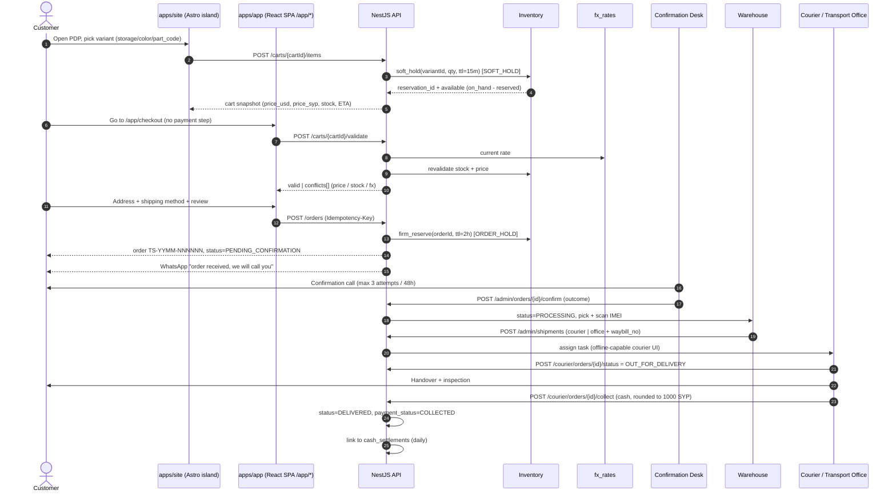
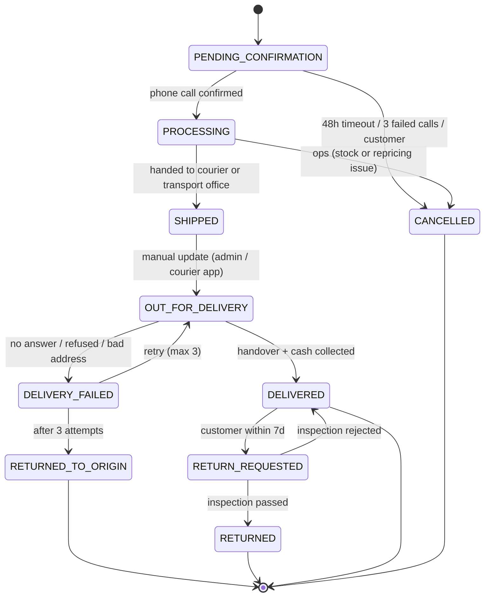
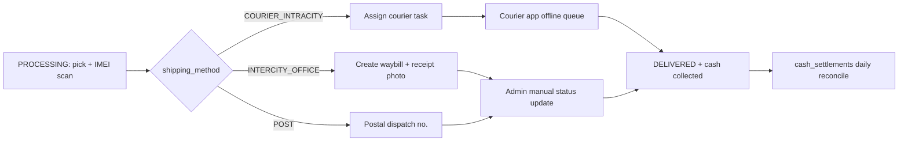
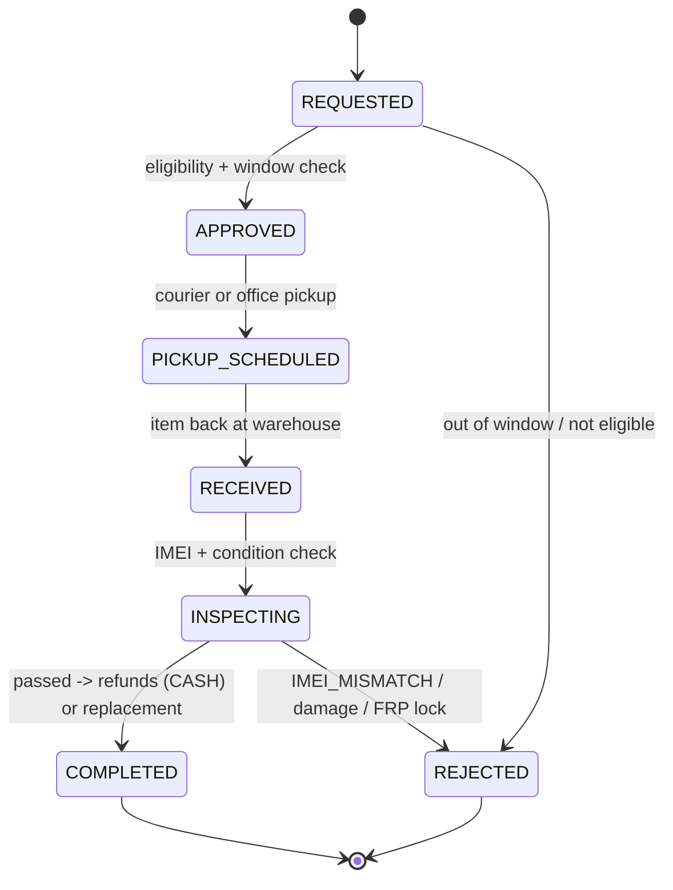

<div dir="rtl">

## 8. رحلة الشراء والطلبات والشحن والإرجاع والضمان

### 8.1 تدفق الشراء من صفحة المنتج حتى التسليم

الرحلة مصمَّمة لسوق يشتري بالهاتف على شبكة بطيئة ولا يثق بالشراء عن بُعد، فالمبدأ الحاكم: **لا خطوة دفع إطلاقاً**، والدفع عند الاستلام هو طريقة الدفع الوحيدة (`payment_method ENUM('COD')`). ما يبني الثقة بديلاً عن الدفع المسبق هو مكالمة التأكيد الهاتفي، وإظهار نتيجة فحص IMEI، والصور الحقيقية للجهاز المستعمل نفسه، وكفالة المحل المكتوبة، ورقم واتساب للتواصل الفوري.

الهدف التشغيلي: **ثلاث شاشات كحد أقصى** بين السلة وإنشاء الطلب (بيانات العميل والعنوان ← اختيار طريقة الشحن ← المراجعة)، وزمن إتمام وسيط (median) لا يتجاوز 90 ثانية للمستخدم العائد على شبكة 3G.



ضمانات إلزامية في هذا التدفق:

| الضمانة | التفصيل |
|---|---|
| منع التكرار | كل `POST /orders` بترويسة `Idempotency-Key` (UUIDv4، صلاحية 24 ساعة في Redis) — حاسم على شبكة تنقطع أثناء الإرسال |
| رقم الطلب | `TS-YYMM-NNNNNN` (مثال `TS-2607-000148`) في `orders.order_no VARCHAR(14)` بقيد `CHECK (order_no ~ '^TS-[0-9]{4}-[0-9]{6}$')` |
| أثر الحالة | كل انتقال يُسجَّل في `order_status_history` بـ `actor_type`, `actor_id`, `reason_code`, `source` (`ADMIN` \| `COURIER_APP` \| `OFFICE_SYNC` \| `SYSTEM`) |
| تثبيت التسعير | `orders.fx_rate` + `orders.fx_rate_id` + `orders.total_syp` تُثبَّت لحظة إنشاء الطلب، و`price_locked_until = placed_at + 48h` |
| لا طبقة دفع | لا بوابة ولا واجهة مزوّد دفع في أي مكان من التدفق. **إضافة طريقة دفع مستقبلاً = قيمة جديدة في `payment_method` وخطوة إضافية في التدفق، دون إعادة هيكلة.** |

حدود المعدل لكل مسارات هذا القسم مرجعها **جدول القسم رقم 9 وحده** ولا تُكرَّر قيمها هنا.

### 8.2 السلة: الضيف والدمج والحجز المرن والتحقق قبل التأكيد

| البند | القرار التنفيذي |
| --- | --- |
| سلة الضيف | كوكي `cart_token` بخصائص `httpOnly; Secure; SameSite=Lax` على النطاق `talisham.com`، وصف في `carts` بـ `user_id = NULL` |
| التخزين | نسخة ساخنة في Redis `cart:{token}` لمدة 7 أيام، ومصدر الحقيقة في PostgreSQL (`carts` / `cart_items`) |
| العمل دون اتصال | السلة تُحفظ في IndexedDB داخل `apps/app`، وتعديلاتها تدخل طابور Background Sync عند انقطاع الشبكة |
| انتهاء الصلاحية | سلة الضيف تُحذف بعد 30 يوماً بلا نشاط (مهمة الصيانة الأسبوعية)، وسلة المستخدم المسجَّل دائمة مع وسم «تغيّر السعر» |
| الحجز المرن | **15 دقيقة** لكل عنصر (`inventory_reservations.kind='SOFT_HOLD'`)، يتجدّد بأي تفاعل مع السلة |
| الحجز الأوّلي | عند إنشاء الطلب يتحول إلى `ORDER_HOLD` مدته **ساعتان**، ويُمدَّد إلى `ORDER_HOLD_EXT` (48 ساعة، أو 12 للأجهزة النادرة) عند أول تفاعل ناجح |
| تحرير الحجوزات | مهمة BullMQ `inventory.release-reservations` كل **5 دقائق** |
| الدمج بعد الدخول | اتحاد على `variant_id`: الكمية = `min(كمية الضيف + كمية المستخدم, المتاح, حد الشراء لكل عميل)` |

قبل إنشاء الطلب يُنفَّذ تحقق إلزامي (`POST /carts/{cartId}/validate`) يفحص **ثلاثة أشياء معاً**: التوفر الفعلي (`on_hand − reserved`)، والسعر الفعّال الآن (قواعد التسعير في القسم رقم 7)، و**سعر الصرف الساري** من `fx_rates`:

```json
{
  "cartId": "0198f4a1-2c33-7e02-8d14-6b5a9f3c1e77",
  "displayCurrency": "SYP",
  "fx": {
    "rateId": "0198f4a0-88b1-7c19-9f30-2d71e4a05c66",
    "rate": 12850.0,
    "effectiveFrom": "2026-07-27T06:00:00Z",
    "changedSinceCartOpened": true
  },
  "valid": false,
  "conflicts": [
    { "code": "PRICE_CHANGED", "variantId": "0198f2b7-9d41-7a68-b3c2-5e8d0a47f912",
      "oldPriceUsdCents": 42900, "newPriceUsdCents": 44900, "requiresConsent": true },
    { "code": "OUT_OF_STOCK", "variantId": "0198f2b8-0e12-7b95-9c47-1a6f3d80b25e",
      "requested": 2, "available": 1, "requiresConsent": true },
    { "code": "FX_CHANGED", "oldRate": 12600.0, "newRate": 12850.0, "requiresConsent": true }
  ],
  "totals": {
    "subtotalUsdCents": 89900,
    "discountTotalUsdCents": 0,
    "shippingTotalUsdCents": 300,
    "taxRateBp": 0,
    "taxAmountUsdCents": 0,
    "grandTotalUsdCents": 90200,
    "grandTotalSypRaw": 11590700,
    "codAmountSyp": 11591000
  }
}
```

قواعد قراءة هذه الأرقام:

- كل المبالغ المرجعية أعداد صحيحة **بالسنتات الأمريكية** (`*_usd_cents BIGINT`)، والليرة السورية مشتقّة للعرض والتحصيل.
- `taxRateBp` حقل رسوم قابل للتهيئة بنقاط الأساس وقيمته الافتراضية `0`، والأسعار المعروضة **نهائية وشاملة** أي رسوم مطبَّقة.
- `grandTotalSypRaw = round(grandTotalUsdCents × fx.rate / 100)`، والمبلغ المستحق نقداً `codAmountSyp = round(grandTotalSypRaw / 1000) × 1000` وهو ما يُخزَّن في `orders.total_syp` (قيد `CHECK (total_syp % 1000 = 0)` في القسم رقم 3) وهو وحده ما يُطبع على الإيصال ويظهر على شاشة المندوب.
- الواجهة تتيح تبديل العرض بين الليرة والدولار بزر واحد؛ التبديل يغيّر العرض فقط ولا يغيّر المبلغ المستحق نقداً.
- أي تعارض بعلامة `requiresConsent` يوقف `POST /orders` حتى يوافق العميل صراحة على القيمة الجديدة.

### 8.3 نموذج العنوان السوري والتحقق منه

العنوان السوري لا يُبنى على ترقيم رسمي موثوق، بل على **المعلم القريب** — ولذلك `landmark` حقل **إلزامي** ومن دونه يفشل المندوب فعلياً في الوصول. و`alt_phone` هو خط النجاة الثاني عندما ينقطع التيار عن هاتف العميل أو يكون خارج التغطية.

| الحقل | المفتاح | إلزامي | قاعدة التحقق |
| --- | --- | --- | --- |
| اسم المستلم | `recipient_name` | نعم | 3–60 حرفاً |
| المحافظة | `governorate` | نعم | من `governorate ENUM` (14 محافظة، القسم رقم 3) |
| المدينة/البلدة | `city` | نعم | 2–64 حرفاً، اقتراح تلقائي حسب المحافظة |
| الحي | `neighborhood` | نعم | 2–64 حرفاً (مثل «المزة – فيلات غربية»، «الأعظمية») |
| الشارع | `street` | لا | حتى 96 حرفاً |
| **المعلم القريب** | `landmark` | **نعم** | 3–120 حرفاً، `CHECK (length(landmark) >= 3)` (مثل «مقابل صيدلية النور») |
| تفاصيل | `details` | لا | نص حر (رقم البناء، الطابق، لون الباب) |
| الهاتف | `phone` | نعم | `^\+9639[0-9]{8}$` |
| هاتف بديل | `alt_phone` | لا (موصى به بشدة) | `^\+963[0-9]{8,9}$`، ويجب أن يخالف `phone` |
| الإحداثيات | `geo_lat` / `geo_lng` | لا (اختيارية) | `NUMERIC(9,6)` داخل حدود سوريا تقريباً: خط العرض 32.0–37.4، خط الطول 35.6–42.4 |
| العنوان الافتراضي | `is_default` | — | صف واحد لكل مستخدم (`UNIQUE(user_id) WHERE is_default`) |

```json
{
  "id": "0198f3c5-7a19-7d40-a812-4f2b6e91c073",
  "recipientName": "سامر الحلبي",
  "governorate": "DAMASCUS",
  "city": "دمشق",
  "neighborhood": "المزة - فيلات غربية",
  "street": "شارع الجلاء",
  "landmark": "مقابل صيدلية النور، بجانب فرن الشام",
  "details": "بناء رقم 7، الطابق الثالث، الباب الأيمن",
  "phone": "+963991234567",
  "altPhone": "+963931112233",
  "geoLat": 33.5065, "geoLng": 36.2565,
  "isDefault": true
}
```

التحقق على مرحلتين: (1) تحقق نحوي فوري بـ Zod في جزيرة React داخل `apps/app`، (2) تحقق دلالي في الخلفية يطابق `governorate` مع تغطية `shipping_rates` النشطة ويرفض العنوان برمز `GOVERNORATE_NOT_SERVED` إن لم توجد طريقة شحن فعّالة. إن وُجدت إحداثيات وكانت خارج نطاق 40 كم من مركز المدينة المعلنة يُرفع تحذير **غير حاجب** `ADDRESS_PIN_MISMATCH` يظهر لموظف التأكيد الهاتفي لا للعميل. اختيار الإحداثيات اختياري تماماً لأن جزءاً كبيراً من المستخدمين لا يفتح الخرائط على باقة بيانات محدودة.

قاعدة تشغيلية: مربع «تأكيد العنوان بالمعلم» في شاشة المراجعة يعرض السطر كما سيقرؤه المندوب حرفياً (`المحافظة – المدينة – الحي – المعلم – التفاصيل`) ويطلب إقراراً واحداً؛ هذه الخطوة وحدها خفّضت أخطاء العناوين في الاختبار الميداني وتُقاس بمؤشر `bad_address_rate`.

### 8.4 مكالمة التأكيد الهاتفي

مكالمة التأكيد هي **البوابة الوحيدة** للانتقال `PENDING_CONFIRMATION → PROCESSING`، ولا يُجهَّز أي طلب قبلها (رمز الخطأ `ORDER_NOT_CONFIRMED` عند المحاولة). الغرض المزدوج: تقليل رفض الاستلام، وتصحيح العنوان قبل إنفاق تكلفة الشحن.

**النص الإرشادي للموظف** (يظهر داخل لوحة التحكم مع الطلب، ويُقرأ كما هو):

```text
1. «مساء الخير، معك [الاسم] من متجر تالي شام. بخصوص طلبكم رقم TS-2607-000148.»
2. تأكيد الصنف: «الطلب هو [الموديل] – [السعة] – [اللون] – [حالة الجهاز] – رمز النسخة [part_code].»
3. تأكيد الحالة والكفالة: «الجهاز [جديد/مستعمل درجة A]، صحة البطارية [xx]%، كفالة محل [12/3] شهراً،
   ونتيجة فحص IMEI [سليم] ونرسلها لكم على واتساب قبل الشحن.»
4. تأكيد المبلغ نقداً: «المبلغ المستحق عند الاستلام [codAmountSyp] ليرة، شامل التوصيل، يُدفع للمندوب.»
5. تأكيد العنوان بالمعلم: «العنوان [المحافظة – المدينة – الحي]، المعلم [landmark]. صحيح؟»
6. تأكيد التوقيت: «التسليم خلال [eta_min–eta_max]، ونتصل قبل الوصول بنصف ساعة.»
7. سؤال الإتاحة: «هل تكونون متواجدين لاستلام الجهاز ودفع المبلغ نقداً؟»
8. الختام: «سنرسل تفاصيل الطلب على واتساب من الرقم نفسه.»
```

**ترتيب القنوات: واتساب أولاً، والمكالمة تصعيد لا قاعدة.** رقم العميل مؤكَّد أصلاً برمز تحقق عند التسجيل، فإلزام مكالمة بشرية لكل طلب تكلفة تشغيلية بلا مقابل معرفي جديد، وتأخير يضيف ساعات إلى دورة التسليم. لذلك التسلسل:

| الخطوة | التوقيت | الآلية |
|---|---|---|
| 1 — تأكيد ذاتي | فوراً بعد إنشاء الطلب | رسالة واتساب بزرَّي «أؤكد الطلب» / «ألغِ الطلب» مع ملخص الطلب والمبلغ المستحق نقداً. الضغط يعادل تأكيداً كاملاً ويُسجَّل `confirmation_notes='WHATSAPP_SELF_CONFIRM'` |
| 2 — تذكير | بعد 45 دقيقة بلا تفاعل | تذكير واحد على القناة نفسها |
| 3 — مكالمة | بعد ساعتين بلا تفاعل، **أو فوراً** إذا تجاوزت قيمة الطلب عتبة `high_value_threshold`، أو كان العنوان ناقصاً، أو كان العميل أول طلب له | مكالمة بشرية بالنص الإرشادي أعلاه |

هذا يحوّل المكالمة من إجراء على مئة طلب إلى إجراء على العشرين التي تحتاجها فعلاً، ويقصّر زمن التأكيد الوسطي من ساعات إلى دقائق لأغلب الطلبات.

| البند | القاعدة |
|---|---|
| عدد المحاولات الهاتفية | 3 كحد أقصى (`orders.confirmation_attempts`، قيد `CHECK (confirmation_attempts <= 3)`) |
| تباعد المحاولات | الأولى بعد ساعتين من إنشاء الطلب، الثانية بعد 4 ساعات منها، الثالثة صباح اليوم التالي — كلها داخل نافذة 09:00–21:00 بتوقيت `Asia/Damascus` |
| نافذة التأكيد | **48 ساعة** من `placed_at`، وهي عمر `price_locked_until` — لكنها **ليست** عمر الحجز |
| عمر الحجز | `ORDER_HOLD` **ساعتان** فقط، ويُمدَّد إلى `ORDER_HOLD_EXT` (حتى 48 ساعة، أو 12 ساعة للأجهزة النادرة) عند أول تفاعل ناجح مع العميل. راجع القسم رقم 3 لسبب الفصل |
| إعادة التحقق | التأكيد بعد انتهاء الحجز يستدعي **إعادة تحقق إلزامية من التوفر والسعر**؛ عند النفاد يُعرض بديل أو إلغاء بلا رسوم |
| تسجيل النتيجة | `confirmed_by`, `confirmed_at`, `confirmation_notes`, `confirmation_attempts` + صف في `order_status_history` |
| الإلغاء التلقائي | مهمة `orders.expire-pending` تنقل إلى `CANCELLED` بعد **48 ساعة** أو بعد **3 محاولات اتصال فاشلة**، أيهما أسبق |

نتائج المكالمة المقبولة في `POST /admin/orders/{id}/confirm` عبر الحقل `outcome`:

| القيمة | الأثر على الحالة | الأثر على الحجز |
|---|---|---|
| `CONFIRMED` | `PENDING_CONFIRMATION → PROCESSING` | يُثبَّت الحجز حتى التجهيز، بعد إعادة تحقق من التوفر إن كان الحجز قد انتهى |
| `NO_ANSWER` | تبقى الحالة، `confirmation_attempts += 1` | **لا تمديد** — الحجز الأوّلي ينتهي بعد ساعتين ويعود المخزون للبيع |
| `RESCHEDULE` | تبقى الحالة مع `next_attempt_at` | تفاعل ناجح ⇒ يُمدَّد إلى `ORDER_HOLD_EXT` |
| `ADDRESS_FIXED` | تبقى الحالة، يُحدَّث العنوان ويُعاد حساب الشحن | تفاعل ناجح ⇒ يُمدَّد إلى `ORDER_HOLD_EXT` |
| `CANCELLED` | `PENDING_CONFIRMATION → CANCELLED` مع `reason_code` | تحرير فوري للحجز |

### 8.5 مخطط حالات الطلب وملكية الانتقالات



```sql
CREATE TYPE order_status AS ENUM (
  'PENDING_CONFIRMATION','PROCESSING','SHIPPED','OUT_FOR_DELIVERY','DELIVERED',
  'DELIVERY_FAILED','RETURNED_TO_ORIGIN','RETURN_REQUESTED','RETURNED','CANCELLED'
);
CREATE TYPE shipment_status AS ENUM (
  'CREATED','DISPATCHED','IN_TRANSIT','AT_OFFICE','OUT_FOR_DELIVERY',
  'DELIVERED','FAILED','RETURNING'
);
CREATE TYPE return_state AS ENUM (
  'REQUESTED','APPROVED','PICKUP_SCHEDULED','RECEIVED','INSPECTING','COMPLETED','REJECTED'
);
```

| الانتقال | المالك | الآلية والمسار |
| --- | --- | --- |
| `→ PENDING_CONFIRMATION` | العميل | `POST /orders` مع `Idempotency-Key`؛ حجز أوّلي ساعتان |
| `PENDING_CONFIRMATION → PROCESSING` | فريق التأكيد (`orders:confirm:any`) | `POST /admin/orders/{id}/confirm` بنتيجة `CONFIRMED` |
| `PENDING_CONFIRMATION → CANCELLED` | العميل أو النظام | `POST /orders/{orderNo}/cancel`، أو مهمة `orders.expire-pending` (48 ساعة / 3 محاولات) |
| `PROCESSING → SHIPPED` | المستودع (`orders:update_status:any`) | `POST /admin/shipments` بعد مسح IMEI وتسجيله في `device_units`؛ يُمنع الانتقال إن كانت الفئة تتطلب IMEI ولم يُسجَّل |
| `PROCESSING → CANCELLED` | فريق العمليات | `reason_code` إلزامي (`OOS_AFTER_CONFIRM`, `FX_REPRICE_REJECTED`, …) |
| `SHIPPED → OUT_FOR_DELIVERY` | المندوب أو الإدارة | `POST /courier/orders/{id}/status` أو `PATCH /admin/orders/{id}/status` — **تحديث يدوي، لا webhook من شركة شحن** |
| `OUT_FOR_DELIVERY → DELIVERED` | المندوب / مكتب النقل | تحديث الحالة + تسجيل التحصيل (`POST /courier/orders/{id}/collect`) + صورة/توقيع التسليم |
| `OUT_FOR_DELIVERY → DELIVERY_FAILED` | المندوب | `reason_code` إلزامي: `NO_ANSWER`, `REFUSED`, `BAD_ADDRESS`, `POSTPONED` |
| `DELIVERY_FAILED → OUT_FOR_DELIVERY` | العمليات | إعادة جدولة، بحد أقصى 3 محاولات |
| `DELIVERY_FAILED → RETURNED_TO_ORIGIN` | النظام | بعد المحاولة الثالثة، مع حركة `RETURN` في `inventory_movements` عند الاستلام والفحص |
| `DELIVERED → RETURN_REQUESTED` | العميل | خلال 7 أيام من `delivered_at` |
| `RETURN_REQUESTED → RETURNED` | فريق الفحص (`returns:approve`) | بعد اجتياز فحص القبول ومطابقة IMEI |

آلة الحالات منفَّذة كـ `OrderStateMachine` في `apps/api/src/orders/state-machine.ts`، ولا يُسمح بأي انتقال خارج المخطط: تُرفض المحاولة بخطأ `409 INVALID_TRANSITION` (صيغة الأخطاء في القسم رقم 4، ومصفوفة الصلاحيات باصطلاح `مورد:فعل:نطاق` في القسم رقم 9).

**حقول التحصيل مستقلة تماماً عن `status`**: طلب في `DELIVERED` قد يكون `payment_status = 'PARTIAL'` ريثما تُسوّى الفروقات، والعكس غير ممكن (لا يُسمح بـ `COLLECTED` قبل `DELIVERED` إلا لمكتب النقل الذي يحصّل عند التسليم في المكتب).

### 8.6 الشحن داخل سوريا

ثلاث طرق فقط، وكلها بلا تكامل webhook إلزامي مع أي شركة شحن:

| الطريقة | `shipping_method` | التغطية | مَن ينفّذ | التتبع |
|---|---|---|---|---|
| مندوب المتجر داخل المدينة | `COURIER_INTRACITY` | داخل مدن التغطية الأولى | مندوبو المتجر عبر واجهة `/courier` | تحديث يدوي من تطبيق المندوب (يعمل دون اتصال) |
| مكتب نقل بري بين المحافظات | `INTERCITY_OFFICE` | كل المحافظات الأربع عشرة | مكاتب النقل (أمثلة قابلة للاستبدال: القدموس، الفؤاد، الأهلية) | `waybill_no` + صورة إيصال المكتب + تحديث يدوي من الإدارة |
| البريد السوري | `POST` | خيار اقتصادي واسع التغطية | البريد السوري | رقم إرسالية + تحديث يدوي |

تعريفة نموذجية (`shipping_rates(governorate, method, base_fee_usd_cents, per_kg_fee_usd_cents, eta_min_days, eta_max_days)`) — القيم بالسنتات الأمريكية وتُعرض بالليرة من `fx_rates`:

| المحافظة | `COURIER_INTRACITY` | `INTERCITY_OFFICE` | `POST` | المهلة الواقعية |
|---|---|---|---|---|
| دمشق | 200 | — | 100 | 24–48 ساعة داخل المدينة |
| ريف دمشق | 300 | 250 | 100 | 1–2 يوم |
| حلب | 250 | 350 | 120 | 2–4 أيام |
| حمص | 250 | 300 | 100 | 2–3 أيام |
| حماة | 250 | 300 | 100 | 2–3 أيام |
| اللاذقية | 250 | 320 | 120 | 2–4 أيام |
| طرطوس | 250 | 320 | 120 | 2–4 أيام |
| درعا | 250 | 350 | 120 | 2–4 أيام |
| السويداء | — | 380 | 130 | 3–4 أيام |
| القنيطرة | — | 400 | 150 | 3–5 أيام |
| إدلب | — | 400 | 150 | 3–5 أيام |
| الرقة | — | 600 | 180 | 4–5 أيام |
| دير الزور | — | 600 | 180 | 4–5 أيام |
| الحسكة | — | 650 | 180 | 4–5 أيام |

رسم إضافي `per_kg_fee_usd_cents = 50` لكل كيلوغرام فوق الكيلوغرام الأول (الجوالات والملحقات نادراً ما تتجاوزه). عرض ترويجي قابل للتهيئة: شحن مجاني للطلبات فوق 500 دولار داخل المحافظات السبع الأولى. المهل تُعرض للعميل كنطاق لا كوعد قاطع، وتُحتسب أيام عمل مع استبعاد الجمعة، وتُعرض معها جملة صريحة: «قد تتأخر المواعيد بسبب انقطاع الطرق أو الكهرباء».

**بوليصة مكتب النقل**: عند `method='INTERCITY_OFFICE'` يصبح `office_name` و`waybill_no` إلزاميين (قيد في `shipments`)، وتُرفع صورة الإيصال في `receipt_media_id` وتُرسل للعميل على واتساب فوراً — وهي أقوى دليل ثقة لدى عميل يدفع نقداً عند الاستلام في المكتب.

**واجهة المندوب** `/courier` داخل `apps/admin` على `admin.talisham.com` تعمل دون اتصال: تحميل مهام اليوم صباحاً، ترتيب مسار التوصيل، تحديث الحالة، تسجيل المبلغ المحصَّل، وصورة/توقيع التسليم — كلها في طابور محلي يُرسل عند عودة الشبكة بـ Background Sync وبمفاتيح `Idempotency-Key` ثابتة، فلا يتكرر أثر أي عملية.



يُذكر صراحةً: إن توفّر شريك شحن يدعم webhooks لاحقاً يُضاف مسار وارد اختياري بقيمة `updated_source='PARTNER_WEBHOOK'` دون تغيير بقية التدفق.

### 8.7 الدفع عند الاستلام: التحصيل والتسوية

**المبلغ المستحق نقداً**

```text
raw_syp        = round(total_usd_cents × orders.fx_rate / 100)
orders.total_syp = round(raw_syp / 1000) × 1000        -- تقريب لأقرب 1000 ليرة
cod_amount_syp = orders.total_syp                       -- ما يُطبع ويُطلب من العميل
```

مثال الطلب `TS-2607-000148`: الإجمالي `90200` سنتاً (902.00 دولار) وسعر الصرف المثبَّت `12850` ⇒ خام `11,590,700` ليرة ⇒ **المستحق نقداً `11,591,000` ليرة**.

فرق التقريب (≤ 500 ليرة صعوداً أو هبوطاً) لا يُطالَب به ولا يُعاد للعميل، لكنه **يُخزَّن إلزامياً** في `orders.rounding_diff_syp` (هنا `+300`). سبب التخزين محاسبي بحت: بدونه لن يتطابق مجموع ما حصّله المندوبون مع مجموع إجماليات الطلبات أبداً، ويظهر فرق صغير متراكم يبدو كعجز في التسوية بينما هو أثر تقريب. تُرحَّل هذه الفروق شهرياً إلى **حساب فروق التقريب** في التقارير المالية (القسم رقم 16)، ويُراقَب مجموعها: إن تجاوز حداً معيّناً فذلك مؤشر على أن وحدة التقريب صارت كبيرة على قيمة الليرة ويجب مراجعتها. الرقم المقرَّب هو **نفسه** على: إيصال PDF المرفق مع الشحنة، وشاشة المندوب، ورسالة واتساب قبل الخروج للتوصيل، وبوليصة مكتب النقل.

**تسجيل التحصيل** — `POST /courier/orders/{id}/collect`:

| الحقل | المصدر | ملاحظة |
|---|---|---|
| `payment_status` | `PENDING → COLLECTED \| PARTIAL \| REFUNDED` | مستقل عن `orders.status` |
| `collected_amount_syp` | إدخال المندوب | يُقارن آلياً بـ `orders.total_syp` |
| `collected_at` | الخادم | قيد: `payment_status='COLLECTED'` يستلزم `collected_at IS NOT NULL` |
| `collected_by` | معرّف المندوب أو مكتب النقل | مرتبط بـ `collector_type ENUM('COURIER','TRANSPORT_OFFICE')` |
| `settlement_id` | آلي | يُربط بصف اليوم في `cash_settlements` |
| `proof_media_id` | صورة/توقيع | إلزامي للطلبات فوق 300 دولار |

**الحالات الجزئية**: يُسمح بـ `PARTIAL` في حالتين فقط — نقص في السيولة النقدية لدى العميل (يُسلَّم الجهاز بموافقة مدير العمليات ويُفتح رصيد متبقٍّ)، أو خصم متفق عليه لعيب مكتشف عند التسليم. كلاهما يتطلب `reason_code` وموافقة صريحة، ويظهر الطلب في تقرير «مستحقات مفتوحة» حتى التسوية. تحصيل **أكثر** من المستحق ممنوع بقيد: `collected_amount_syp <= orders.total_syp`.

**التسوية اليومية** (`cash_settlements`): صف واحد لكل (نوع المحصِّل، المحصِّل، اليوم) بقيد `UNIQUE(collector_type, collector_id, settlement_date)`:

| العمود | المعنى |
|---|---|
| `orders_count` | عدد الطلبات المسلَّمة في اليوم |
| `expected_amount_syp` | مجموع `orders.total_syp` للطلبات المسلَّمة |
| `collected_amount_syp` | مجموع ما سُجِّل فعلاً |
| `variance_syp` | `collected − expected` بقيد محسوب |
| `delivery_commission_syp` | عمولة التوصيل المستحقة للمندوب/المكتب |
| `state` | `OPEN → RECONCILED → SETTLED`، أو `DISPUTED` عند فرق غير مبرَّر |

المطابقة الآلية تُشغَّل بمهمة BullMQ `settlements.reconcile-daily` في 23:30 بتوقيت `Asia/Damascus`: تجمع الطلبات المسلَّمة لكل محصِّل، تحسب `variance_syp`، وتضع الصف في `RECONCILED` إذا كان الفرق صفراً، وإلا `DISPUTED` مع إشعار واتساب للمالك. صافي المستحق للمتجر = `collected_amount_syp − delivery_commission_syp`، ويُقفل الصف بـ `SETTLED` عند تسليم النقد فعلياً مع `reconciled_by` و`reconciled_at`.

**تقرير التحصيل** في لوحة التحكم (يومي وأسبوعي): إجمالي المحصَّل بالليرة وما يعادله بالدولار بسعر اليوم، عدد الطلبات المسلَّمة مقابل الفاشلة، متوسط زمن التحصيل من `SHIPPED` إلى `COLLECTED`، الفروقات المفتوحة لكل محصِّل، نسبة `PARTIAL`، وقائمة الطلبات `DELIVERED` التي بقيت `payment_status='PENDING'` أكثر من 48 ساعة (إنذار). كل تعديل على `collected_amount_syp` يُسجَّل إلزامياً في `audit_logs`.

### 8.8 ضوابط رفض الاستلام وتكلفتها

رفض الاستلام هو **أخطر مخاطر الدفع عند الاستلام**: تكلفته شحن ذهاب وإياب مدفوعان بالكامل من المتجر، إضافة إلى تجميد الجهاز خارج المخزون لأيام.

| الضابط | القاعدة التنفيذية | التنفيذ |
|---|---|---|
| تأكيد هاتفي إلزامي | لا تجهيز قبل `outcome='CONFIRMED'` | `ORDER_NOT_CONFIRMED` (409) |
| سقف قيمة الطلب | 1500 دولار للطلب الواحد؛ ما فوقه يتطلب موافقة مدير أو الاستلام من المعرض | `COD_LIMIT_EXCEEDED` (409) |
| حد الطلبات المفتوحة لكل رقم | طلبان مفتوحان كحد أقصى لكل `phone_e164` | `COD_OPEN_ORDERS_LIMIT` (429) |
| قائمة التقييد | رفضان خلال 90 يوماً ⇒ إدراج في `phone_blocklist` لمدة 180 يوماً | `PHONE_BLOCKED` (403)، ويبقى الشراء ممكناً بالاستلام من المعرض |
| قياس الهدر | `phone_blocklist.wasted_shipping_usd_cents` يتراكم مع كل رفض | تقرير أسبوعي: «تكلفة الشحن المهدور» |
| تخفيف المخاطرة | للعملاء الجدد في المحافظات البعيدة: توصيل عبر `INTERCITY_OFFICE` (يدفع العميل عند الاستلام في المكتب) بدل التوصيل للباب | قاعدة في محرّك الشحن |

المؤشرات الحاكمة: `refusal_rate` (هدف ≤ 5%)، و`wasted_shipping_cost_per_100_orders`، و`confirmation_success_rate` (هدف ≥ 90% من المحاولة الأولى أو الثانية). ارتفاع `refusal_rate` فوق 8% في محافظة يفرض تلقائياً تحويلها إلى `INTERCITY_OFFICE` فقط.

### 8.9 الإشعارات لكل حالة

ترتيب القنوات التشغيلي ثابت: **واتساب ← SMS ← بريد**، وWeb Push قناة ثانوية فقط.

| الحالة | واتساب | SMS (احتياطي) | بريد | Web Push | القالب |
| --- | --- | --- | --- | --- | --- |
| `PENDING_CONFIRMATION` | نعم (استلمنا طلبك، سنتصل بك) | عند فشل واتساب | لا | لا | `order_received_ar` |
| محاولة تأكيد فاشلة | نعم (زرّا تأكيد/إلغاء) | بعد المحاولة الثانية | لا | لا | `order_confirm_retry_ar` |
| `PROCESSING` | نعم (تم التأكيد + المبلغ نقداً) | عند فشل واتساب | نعم | نعم | `order_confirmed_ar` |
| `SHIPPED` | نعم (الطريقة + `waybill_no` + صورة الإيصال) | عند فشل واتساب | نعم | نعم | `order_shipped_ar` |
| `OUT_FOR_DELIVERY` | نعم (المندوب في الطريق + المبلغ المستحق) | نعم دائماً | لا | نعم | `order_ofd_ar` |
| `DELIVERED` | نعم (إيصال PDF + الكفالة + IMEI) | عند فشل واتساب | نعم | نعم | `order_delivered_ar` |
| `DELIVERY_FAILED` | نعم (سبب + إعادة جدولة) | نعم دائماً | لا | نعم | `delivery_failed_ar` |
| `RETURNED_TO_ORIGIN` | نعم | عند فشل واتساب | نعم | لا | `rto_ar` |
| `CANCELLED` | نعم (السبب) | عند فشل واتساب | نعم | لا | `order_cancelled_ar` |
| `RETURN_REQUESTED` | نعم | لا | نعم | نعم | `return_received_ar` |
| `RETURNED` / استرداد نقدي | نعم (موعد ومكان استلام المبلغ) | نعم دائماً | نعم | لا | `refund_ready_ar` |
| تسوية غير مطابقة | إشعار واتساب للمالك فقط | لا | لا | لا | `settlement_variance_ar` |

> **قيد Web Push على iOS:** إشعار المتصفح لا يعمل داخل تبويب Safari؛ فهو يشترط تثبيت الـ PWA على الشاشة الرئيسية (iOS ≥ 16.4) وطلب الإذن من إيماءة مستخدم. لذلك تُقرأ خانات «نعم» في عمود Web Push على أنها مشروطة لمستخدمي iOS، والبديل المعتمد هو واتساب ثم SMS، ولا يجوز افتراض تغطية Web Push لكل مستخدمي الجوال في أي مؤشر تشغيلي.

القوالب في `apps/api/src/notifications/templates/` بنسختي `ar` و`en`، وتُرسل عبر مهمة `notifications.dispatch` مع `dedupe_key` لمنع التكرار. رسائل واتساب عبر WhatsApp Business API من مزوّد، والاحتياطي SMS محلي عبر مجمّع مرتبط بمشغّلَي **سوريتل** و**MTN سوريا**. سياسة عدم الإزعاج: لا رسائل بين 22:00 و08:00 بتوقيت `Asia/Damascus` إلا لحالتي `OUT_FOR_DELIVERY` و`DELIVERY_FAILED`. كل الأرقام بصيغة E.164 ببادئة `+963`.

### 8.10 الإرجاع والاستبدال والضمان

- **النافذة الزمنية:** 7 أيام من `orders.delivered_at` للأجهزة والملحقات معاً، ويُحسب اليوم السابع بنهايته بتوقيت `Asia/Damascus`.
- **شروط القبول:** العلبة والملحقات كاملة، الجهاز بالحالة نفسها المسلَّمة، وإيصال المتجر. يُرفض الإرجاع عند: كسر أو سائل، أو تفعيل قفل التنشيط (Activation Lock / FRP)، أو غياب ملحق أساسي، أو أثر فتح/صيانة خارجية.
- **فحص IMEI إلزامي:** يُطابق IMEI الجهاز المُعاد مع `device_units.imei` المرتبط بـ `order_items.device_unit_id`؛ عدم التطابق = رفض فوري بالرمز `IMEI_MISMATCH`. تُسجَّل النتيجة في `returns.imei_checked` وفي `device_units.imei_check_status`.
- **الاسترداد النقدي:** عند `COMPLETED` يُنشأ صف في `refunds` بـ `method='CASH'` و`amount_usd_cents` و`fx_rate` و`amount_syp` مقرَّباً لأقرب 1000 ليرة، ولا يُصرف (`state='DISBURSED'`) إلا بعد `imei_verified AND device_matched`. الصرف نقداً من المعرض أو عبر المندوب مع `receipt_media_id` كإثبات.
- **الاستبدال:** يُنشأ طلب بديل مرتبط بـ `orders.replacement_of`، لا تُحصَّل عنه قيمة جديدة إن كان بالقيمة نفسها (`payment_status='COLLECTED'` موروث)، ويُشحن بعد اجتياز الفحص، ويحتفظ بتاريخ بدء ضمان الجهاز الأصلي.

حالات جدول `returns` (العمود `state return_state`):



مهلة الفحص التشغيلية: 48 ساعة عمل من `RECEIVED`. الجهاز المقبول يعود بحركة `RETURN` في `inventory_movements` وحالة `RETURNED` في `device_units`، ولا يُعاد بيعه كجديد أبداً بل يُعاد تصنيفه (`OPEN_BOX` أو `USED_A` حسب الفحص) مع `battery_health_pct` محدَّث وصور حقيقية جديدة.

**الضمان:**

| البند | كفالة المحل (`STORE`) — الغالبة | كفالة الوكيل (`AGENT`) | كفالة المستورد (`IMPORTER`) |
|---|---|---|---|
| المدة الافتراضية | 12 شهراً للجديد، 3 أشهر للمستعمل | حسب الجهة | حسب الجهة |
| الجهة المنفذة | ورشة المتجر أو شريك صيانة | مركز خدمة الوكيل | المستورد |
| التغطية | عيوب التصنيع + بدل خلال أول 7 أيام | عيوب التصنيع | عيوب التصنيع |
| الإثبات | إيصال المتجر + صف `warranties` + `device_units` | إيصال + IMEI مسجَّل | إيصال المستورد |
| العرض في الواجهة | شارة «كفالة محل [n] شهراً» على صفحة المنتج | شارة «كفالة وكيل» | شارة «كفالة مستورد» |

`warranty_months` إلزامي على مستوى المتغيّر، وقيمة `warranty_type='NONE'` مسموحة لكن تُعرض بوضوح للعميل قبل الشراء. عند التجهيز يمسح المستودع IMEI (وSerial للساعات) في `device_units`، فتتحرك الوحدة `IN_STOCK → ALLOCATED → SOLD → RETURNED / RMA`، ويُمنع الانتقال إلى `SHIPPED` إذا كانت الفئة تتطلب IMEI ولم يُسجَّل. مطالبات الصيانة في `warranty_claims` بحالات `OPENED → DIAGNOSING → IN_REPAIR → READY → CLOSED`، وكل مطالبة مرتبطة بـ **IMEI لا بالطلب** ليعمل التتبع حتى بعد انتقال ملكية الجهاز — وهو أمر شائع جداً في سوق الجوالات السوري.

### 8.11 حالات الاستثناء

| السيناريو | الكشف | الإجراء الآلي | مهلة (SLA) |
| --- | --- | --- | --- |
| تعذّر الاتصال بالعميل | `outcome='NO_ANSWER'` ثلاث مرات، أو مرور 48 ساعة | رسالة واتساب بزرّي تأكيد/إلغاء بعد المحاولة الثانية، ثم `orders.expire-pending` → `CANCELLED` وتحرير الحجز | 48 ساعة كحد أقصى |
| رفض الاستلام عند الباب | `reason_code='REFUSED'` من واجهة المندوب | `DELIVERY_FAILED` بلا إعادة محاولة، فتح تذكرة، تحديث عدّاد `phone_blocklist`، وتسجيل تكلفة الشحن المهدور، ثم `RETURNED_TO_ORIGIN` وإعادة المخزون بعد الفحص | تذكرة خلال 24 ساعة |
| عنوان خاطئ أو غير قابل للوصول | `reason_code='BAD_ADDRESS'` | اتصال فوري من فريق التأكيد لتصحيح `landmark`/`neighborhood`، وإعادة الجدولة مرة واحدة؛ إن تعذّر → `RETURNED_TO_ORIGIN` | 48 ساعة قبل الإرجاع |
| انقطاع الشبكة أثناء التسليم | فشل الطلب في تطبيق المندوب | العملية تُحفظ في طابور محلي (IndexedDB) وتُرسل عند عودة الشبكة بـ Background Sync بمفتاح `Idempotency-Key` ثابت؛ الإيصال الورقي المرقَّم مسبقاً هو المرجع اليدوي البديل | مزامنة خلال أقل من دقيقة من عودة الشبكة |
| انقطاع كهرباء يوقف المندوب | لا مزامنة منذ 6 ساعات (`courier.stale-sync`) | تنبيه للعمليات + عرض آخر حالة معروفة للعميل بلا وعد جديد | مراجعة خلال 6 ساعات |
| نفاد مخزون بعد التأكيد | فشل الالتزام على `inventory_levels` (تعارض القفل المتفائل على `version`) | إلغاء جزئي أو كامل بـ `reason_code='OOS_AFTER_CONFIRM'` مع اعتذار واتساب وعرض بديل | فوري |
| انتهاء صلاحية السعر المثبَّت | `now() > price_locked_until` قبل الشحن | يمنع النظام الشحن، يعيد التسعير بسعر الصرف الجاري، ويطلب موافقة العميل بمكالمة/واتساب؛ الرفض → `CANCELLED` بـ `FX_REPRICE_REJECTED` | 24 ساعة للرد |
| شحنة عالقة بلا حركة | لا تحديث حالة منذ 7 أيام (مهمة `shipping.stale-status`) | تصعيد آلي لمكتب النقل + وسم `INVESTIGATION` + إخطار العميل على واتساب | إغلاق التحقيق خلال 10 أيام |
| فرق في التسوية النقدية | `variance_syp <> 0` في `cash_settlements` | الصف → `DISPUTED`، تجميد إسناد مهام جديدة للمحصِّل، وإشعار واتساب للمالك | تسوية خلال 72 ساعة |
| ازدواج طلب | تكرار `Idempotency-Key` | إعادة الطلب نفسه دون إنشاء جديد ودون حجز إضافي | فوري |

</div>
