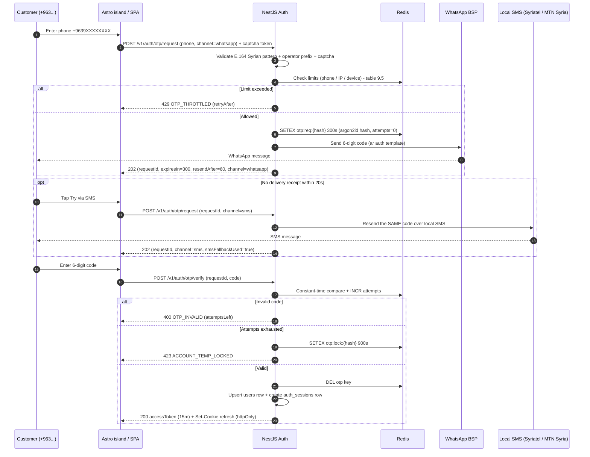

<div dir="rtl">

## 9. الحسابات والمصادقة والأمان والصلاحيات والامتثال

### 9.1 تدفق التسجيل والدخول برقم الجوال السوري ورمز التحقق (OTP)

لا يوجد في المتجر تسجيل بكلمة مرور إطلاقاً؛ الهوية الأساسية هي رقم جوال سوري بصيغة E.164 (`+9639XXXXXXXX`)، ويُوحَّد التسجيل والدخول في تدفق واحد (Passwordless): إن لم يكن الرقم موجوداً يُنشأ حساب مستخدم جديد بعد التحقق مباشرة.

**قناة التسليم**: واتساب قناة أساسية عبر WhatsApp Business API لدى مزوّد معتمد (BSP) بقالب مصادقة عربي، والرسالة القصيرة المحلية قناة احتياطية عبر مجمّع مرتبط بمشغّلَي **سوريتل** و**MTN سوريا**، والبريد قناة أخيرة للحسابات التي سجّلت بريداً. السبب: واتساب يصل عبر بيانات الإنترنت (متاح حتى على 3G بطيء ومع تغيّر الشبكة)، بينما الرسالة القصيرة تصل عند انقطاع الإنترنت أو غياب واتساب عن الجهاز؛ فالقناتان تكمّلان بعضهما ولا تتنافسان.

**التحقق من الصيغة**: نمط ملزم `^\+9639[0-9]{8}$` على الخادم وعلى الواجهة، إضافة إلى قائمة بادئات المشغّلين المسموحة (`+96393`, `+96394`, `+96395`, `+96396`, `+96398`, `+96399`) — أي رقم خارجها يُرفض بـ `VALIDATION_ERROR` قبل استهلاك أي حصة إرسال، وهذا وحده يقطع معظم محاولات استنزاف الرسائل بأرقام غير مخصّصة.



رموز الأخطاء `OTP_INVALID` (400) و`OTP_THROTTLED` (429) و`ACCOUNT_TEMP_LOCKED` (423) مرجعها جدول الأخطاء الموحّد في القسم رقم 4، ولا تُعرَّف هنا من جديد.

| المعيار | القيمة المعتمدة | الملاحظة |
|---|---|---|
| صيغة الرقم | `^\+9639[0-9]{8}$` | مع قائمة بادئات المشغّلين السوريين المسموحة |
| طول الرمز | 6 أرقام | مولَّد بـ `crypto.randomInt` وليس `Math.random` |
| مدة الصلاحية (TTL) | 300 ثانية | مفتاح Redis `otp:req:{phoneHash}` بانتهاء تلقائي |
| تخزين الرمز | argon2id (لا يُخزَّن نصاً صريحاً) | مقارنة بزمن ثابت |
| ترتيب القنوات | واتساب ← SMS محلي ← بريد | إسقاط تلقائي عبر قاطع دارة عند فشل المزوّد |
| الحدود والمحاولات والأقفال | **جدول 9.5** هو المصدر الوحيد | لا تُكرَّر أي قيمة عددية هنا |

**معالجة تعذّر وصول الرسالة (المشكلة الأكثر شيوعاً في هذا السوق).** إشعار تسليم واتساب (`delivered` webhook) هو مؤشر النجاح؛ إن لم يصل خلال 20 ثانية تُظهر الواجهة زر **«جرّب عبر SMS»** بارزاً تحت حقل الرمز. الضغط عليه يرسل `POST /v1/auth/otp/request` بنفس `requestId` و`channel:"sms"`، فيُعاد إرسال **الرمز نفسه** عبر الرسالة القصيرة المحلية دون توليد رمز جديد (كي لا يبطل الرمز الذي قد يكون العميل تسلّمه فعلاً)، ويُعفى هذا الإسقاط مرة واحدة فقط من مهلة إعادة الإرسال. وإن فشلت القناتان تعرض الواجهة رقم واتساب خدمة العملاء ورسالة عربية صريحة: «تعذّر إرسال الرمز — راسلنا على واتساب وسنؤكد حسابك يدوياً»، مع تسجيل الحالة `NO_CHANNEL_AVAILABLE` في `otp_delivery_logs` لتحليل التغطية أسبوعياً. الطابور المحلي في الواجهة يحتفظ بالرقم المُدخَل فلا يعيد العميل كتابته بعد انقطاع الشبكة.

**الحماية من إساءة الإرسال وتكلفتها:** رسالة مصادقة واتساب تكلّف تقريباً 3–5 سنتات، والرسالة القصيرة المحلية 1–3 سنتات؛ وهجوم بسيط بمعدل 10 رسائل/ثانية يعني 36,000 رسالة في الساعة بتكلفة تتجاوز 1,000 دولار في الساعة — أي أنه تهديد مالي مباشر قبل أن يكون تهديداً أمنياً. لذلك: تحدٍّ آلي (CAPTCHA) إلزامي على `POST /v1/auth/otp/request` خلف متغير `CAPTCHA_PROVIDER` يقبل `turnstile` أو `altcha` (تحدٍّ حسابي ذاتي الاستضافة) حتى لا تتوقف الحماية إن تعذّر مزوّد واحد، ورفض بادئات غير مخصّصة والأرقام الافتراضية/VoIP، وحد يومي عام (Global Circuit Breaker) عند 3,000 رسالة يوقف الإرسال ويطلق إنذاراً، وتنبيه عند تجاوز 60% من الحد. تُسجَّل كل عملية إرسال في `otp_delivery_logs` (`channel`, `provider`, `status`, `cost_usd_cents INT`, `provider_message_id`, `delivered_at`, `failed_reason`) لمطابقة فاتورة المزوّد شهرياً وقياس نسبة تسليم كل قناة لكل محافظة.

### 9.2 إدارة الجلسات: JWT ورمز التحديث الدوّار

- **رمز الوصول (Access Token):** JWT موقّع بخوارزمية EdDSA (Ed25519) عبر مفتاح غير متماثل مع نقطة `GET /v1/.well-known/jwks.json`، صلاحيته 15 دقيقة، يُحفظ في ذاكرة التطبيق فقط (لا `localStorage`).
- **رمز التحديث (Refresh Token):** سلسلة عشوائية 256-bit تُخزَّن مجزّأة (SHA-256) في جدول `auth_sessions`، صلاحيتها 30 يوماً لحساب العميل، وتُرسل في كوكي `__Host-ts_rt` بخصائص `HttpOnly; Secure; SameSite=Lax; Path=/v1/auth; Max-Age=2592000` (بلا `Domain`، فلا تغادر أصل التطبيق).
- **عزل لوحة التحكم وواجهة المندوب:** `admin.talisham.com` أصل مستقل بكوكي تحديث خاص به ومطالبة `scope:"admin"`، فرمز واجهة المتجر لا يُرقّى إلى صلاحية إدارية مهما سُرق. أما تلميح الجلسة `ts_sid` (القسم رقم 2) فهو إشارة غير امتيازية تخبر Astro أن هناك جلسة قائمة ليعرض حالة الدخول، ولا يمنح بذاته أي صلاحية.
- **جلسة المندوب أقصر عمداً:** رمز التحديث 12 ساعة فقط ومربوط بمعرّف الوردية (`shift`)، وينتهي بإقفال الوردية أو بعد 18 ساعة أيهما أسبق — لأن الجهاز شخصي وقد يُفقد في الميدان (التفاصيل في 9.10).
- **التدوير (Rotation):** كل استدعاء لـ `POST /v1/auth/refresh` يُبطل الرمز الحالي ويصدر رمزاً جديداً ضمن نفس «العائلة» (`family_id`). إعادة استخدام رمز مُبطَل تعني سرقة، فتُبطَل العائلة كاملة فوراً ويُرسل إشعار واتساب للعميل.

```json
{
  "sub": "0198f3a2-4b7c-7c31-9a55-2f0e6d1a8c44",
  "sid": "0198f3a2-5d10-7a92-8c07-b41e9a77d3f1",
  "fam": "0198f3a2-6e44-7b18-9f3d-71c2a05e4b90",
  "role": "customer",
  "perms": ["orders:read:own", "orders:write:own", "reviews:write:own", "addresses:write:own", "wishlist:write:own"],
  "aud": "talisham-storefront",
  "iss": "https://api.talisham.com",
  "iat": 1785283200, "exp": 1785284100, "jti": "0198f3a2-7f21-7d64-a2b8-5c9e0d3f6a17"
}
```

ورمز المندوب مقيّد بالوردية وبنطاق `own` حصراً، ولا يحمل أبداً `orders:read:any`:

```json
{
  "sub": "0198f3b1-2c40-7a55-9d18-4e7c2b90a331",
  "role": "courier",
  "shift": "0198f3b1-3d70-7c12-8b64-a1f0e5d27c48",
  "perms": ["delivery:read:own", "delivery:update:own", "payments:collect:own", "settlements:read:own"],
  "aud": "talisham-courier",
  "iss": "https://api.talisham.com",
  "iat": 1785283200, "exp": 1785284100, "jti": "0198f3b1-4e91-7f03-a2d7-63c8b1e40a92"
}
```

كل المعرّفات في الرمز (`sub`, `sid`, `fam`, `jti`, `shift`) هي UUIDv7 تُعرض كسلسلة UUID قياسية بلا أي بادئة نوعية.

**تعدد الأجهزة:** كل جهاز = صف مستقل في `auth_sessions` يحمل `device_label` و`user_agent_hash` و`ip_country` و`last_seen_at`. الحد الأقصى 10 جلسات نشطة للعميل وجلستان للمندوب؛ عند التجاوز تُبطَل الأقدم. تعرض صفحة `/app/account/sessions` الأجهزة مع «إنهاء هذه الجلسة» و«إنهاء كل الجلسات». للإبطال الفوري لرموز الوصول القصيرة تُستخدم قائمة `revoked:sid:{sid}` في Redis بـ TTL = 15 دقيقة يفحصها الحارس (Guard) عند كل طلب محمي. عقود هذه النقاط في القسم رقم 4.

### 9.3 نموذج الصلاحيات (RBAC)

الصلاحية تُكتب بصيغة `مورد:فعل:نطاق` موحّدة مع القسم رقم 4، والنطاق إما `own` أو `any`. الأدوار مخزّنة في `roles` و`role_permissions` (القسم رقم 3)، ويُطبَّق التحقق عبر `@RequirePermission()` مع `PermissionsGuard` في NestJS، إضافة إلى فلترة على مستوى الصف (Row-Level) داخل الاستعلام نفسه لا في الواجهة فقط.

| الصلاحية | زائر | عميل | مندوب | دعم | كتالوج | عمليات | مدير عام |
|---|---|---|---|---|---|---|---|
| `catalog:read:any` | نعم | نعم | نعم | نعم | نعم | نعم | نعم |
| `search:read:any` | نعم | نعم | — | نعم | نعم | نعم | نعم |
| `carts:write:own` | نعم | نعم | — | — | — | — | — |
| `orders:write:own` | — | نعم | — | — | — | — | — |
| `orders:read:own` | — | نعم | — | — | — | — | — |
| `orders:read:any` | — | — | — | نعم | — | نعم | نعم |
| `orders:confirm:any` | — | — | — | نعم | — | نعم | نعم |
| `orders:update_status:any` | — | — | — | — | — | نعم | نعم |
| `delivery:read:own` | — | — | نعم | — | — | — | — |
| `delivery:update:own` | — | — | نعم | — | — | — | — |
| `payments:collect:own` | — | — | نعم | — | — | — | — |
| `settlements:read:own` | — | — | نعم | — | — | — | — |
| `settlements:read:any` | — | — | — | — | — | نعم | نعم |
| `settlements:write:any` | — | — | — | — | — | نعم | نعم |
| `catalog:write:any` | — | — | — | — | نعم | — | نعم |
| `inventory:write:any` | — | — | — | — | نعم | نعم | نعم |
| `pricing:write:any` | — | — | — | — | — | — | نعم |
| `returns:approve:any` | — | — | — | اقتراح فقط | — | نعم | نعم |
| `users:read_pii:own` | — | نعم | — | — | — | — | — |
| `users:read_pii:any` | — | — | — | مقنّع جزئياً | — | نعم | نعم |
| `reviews:moderate:any` | — | — | — | نعم | نعم | نعم | نعم |
| `marketing:write:any` | — | — | — | — | نعم | — | نعم |
| `reports:view:any` | — | — | — | — | محدود | نعم | نعم |
| `users:manage_roles:any` | — | — | — | — | — | — | نعم |
| `settings:manage:any` | — | — | — | — | — | — | نعم |

ثلاث قواعد فصل واجبات ملزمة تنبع من كون كل المال نقداً: **(1)** `payments:collect:own` لا يملكها أي دور إداري إطلاقاً — من يسجّل التحصيل هو المندوب المسنَد فقط. **(2)** `settlements:write:any` (إقفال التسوية) لا تجتمع أبداً مع `payments:collect:own` في حساب واحد، ولا يجوز أن يكون مُقفِل التسوية هو المحصِّل نفسه. **(3)** `pricing:write:any` (سعر الصرف و`tax_rate_bp`) محصورة بالمدير العام لأنها تغيّر كل مبلغ مستحق في النظام.

```ts
// apps/api/src/orders/orders.controller.ts
@Get(':id')
@RequirePermission('orders:read')          // النطاق يُحسم داخل الاستعلام لا في الحارس
async findOne(@Param('id') id: string, @CurrentUser() u: AuthUser) {
  return this.orders.findOneScoped(id, u.can('orders:read:any') ? undefined : u.userId);
}

// apps/api/src/courier/courier.controller.ts
@Post('orders/:id/collect')
@RequirePermission('payments:collect:own')
async collect(@Param('id') id: string, @Body() dto: CollectDto, @CurrentUser() u: AuthUser) {
  // شرط الإسناد جزء من الاستعلام: مندوب لا يحصّل طلباً لم يُسنَد إليه في وردية سارية
  return this.collections.record(id, dto, { courierId: u.userId, shiftId: u.shiftId });
}
```

كل حسابات لوحة التحكم تتطلب تفعيل TOTP (مصادقة ثنائية) إجبارياً، وتُسجَّل كل عملية حساسة في `audit_logs` (الفاعل، الدور، الإجراء، الكيان، القيمة قبل/بعد، IP، `X-Request-Id`).

### 9.4 ضوابط OWASP Top 10 على هذا المشروع

| الخطر | المخاطرة هنا | الإجراء المطبَّق |
|---|---|---|
| A01 التحكم بالوصول (IDOR) | تخمين `/v1/orders/{id}` لقراءة طلب عميل آخر | المعرّف UUIDv7 مرتّب زمنياً ولا يُعدّ ضابطاً أمنياً؛ الحماية الفعلية هي شرط المالك (`userId`) أو شرط الإسناد (`assigned_courier_id`) داخل استعلام Prisma نفسه، مع اختبار تلقائي (Playwright) للوصول المتقاطع على **كل** مسار يحمل معرّف مورد في كل إصدار |
| A01 تجاوز الدور عبر واجهة المندوب | مندوب يحاول قراءة طلبات غير مسنَدة إليه | رمزه لا يحمل إلا نطاق `own`، وكل استعلام مندوب مقيّد بـ `assigned_courier_id = :me AND shift_id = :shift` |
| A03 حقن SQL | `$queryRawUnsafe` لبناء فلاتر ديناميكية | حظر `queryRawUnsafe` بقاعدة ESLint، وPrisma المُعامِل (parameterized)، وأي `$queryRaw` بقوالب موسومة فقط |
| A03 XSS في مراجعات المستخدمين | HTML خبيث في نص التقييم يظهر لكل الزوار | المراجعات نص عادي فقط، تنقية `sanitize-html` عند الكتابة والعرض، منع `dangerouslySetInnerHTML` داخل جزر React، وسياسة CSP الموصوفة في 9.10 |
| A04 تصميم غير آمن (مخاطر الدفع النقدي) | طلبات وهمية وشحن مهدور واستيلاء على حصيلة التحصيل | ضوابط 9.9 كاملة: تحقق OTP إلزامي قبل إنشاء الطلب، سقف قيمة، حد طلبات مفتوحة، `phone_blocklist`، وحقول تحصيل غير قابلة للتعديل بأثر رجعي |
| A05 سوء الإعداد | ترويسات ناقصة أو توثيق OpenAPI مكشوف | Helmet + CSP/`Permissions-Policy` (9.10)، وتوثيق OpenAPI محمي خلف مصادقة في الإنتاج |
| A06 مكونات هشّة | حزم npm وصور Docker قديمة | Renovate بقناة أمنية فورية + `osv-scanner` و Trivy مانعان للدمج (دورة الصيانة في القسم رقم 11) |
| A07 فشل المصادقة | تخمين OTP أو حشو الجلسات | الحدود في جدول 9.5 + تدوير رموز التحديث + كشف إعادة الاستخدام + قفل مؤقت |
| A08 سلامة سلسلة التوريد | حزمة مُخترَقة تصل إلى حزمة Astro أو إلى واجهة المندوب | `pnpm-lock.yaml` مثبَّت وصيانته أسبوعياً، تثبيت إصدارات إجراءات GitHub بالتجزئة (SHA)، توقيع صور Docker والتحقق منه عند النشر، وبناء قابل لإعادة الإنتاج |
| A09 نقص التسجيل | هجوم أو اختلاس نقدي غير مكتشف | تسجيل منظَّم JSON + تنبيهات على تجاوز عتبات 401/429 + `audit_logs` إلزامي على كل كتابة مالية (9.9) |
| A10 SSRF | جلب صور من روابط خارجية يدخلها المسؤول | قائمة نطاقات مسموحة، منع النطاقات الخاصة و`169.254.169.254`، والجلب داخل عامل (Worker) معزول بمهلة 5 ثوانٍ |
| رفع الملفات | ملف تنفيذي أو صورة ضخمة إلى تخزين الوسائط | روابط رفع موقّعة مسبقاً (Presigned) بحد 8MB، فحص Magic Bytes لا الامتداد، أنواع `jpeg/png/webp/avif` فقط، إعادة ترميز الصورة وتجريد EXIF (مهم لصور التسليم: تحمل إحداثيات منازل العملاء) |
| CSRF | كوكي التحديث يُستغل من موقع خارجي | `SameSite=Lax` + كوكي مزدوجة `__Host-ts_csrf` مع ترويسة `X-CSRF-Token` على كل طلب مُغيِّر + التحقق من `Origin` |
| A02 فشل التشفير | نقل بيانات الحساب عبر قنوات غير آمنة | TLS 1.3 إلزامي مع HSTS لمدة سنة و`includeSubDomains`، تشفير الأقراص في PostgreSQL وتخزين الوسائط، وتشفير عمودي إضافي لحقول P1 |

### 9.5 تحديد المعدل والحماية من الاعتداء

الطبقة الأولى على الحافة (قواعد WAF المُدارة + مقاومة البوتات)، والطبقة الثانية `@nestjs/throttler` مدعوماً بـ Redis لضمان اتساق العد بين الحاويات. **الطبقة الثانية وحدها كافية للتشغيل**: إن سقطت الحافة أو تعذّر المزوّد (9.11) يبقى التحديد قائماً بلا تغيير كود.

الجدول التالي هو **المصدر الوحيد** لحدود المعدل في هذه الوثيقة؛ لا تُكرَّر هذه القيم في أي قسم آخر ولا في أي فقرة أخرى من هذا القسم، وكل موضع يحتاجها يحيل إليه (9.5).

| النقطة | الحد | النافذة | عند التجاوز |
|---|---|---|---|
| `POST /v1/auth/otp/request` | 5 لكل رقم / 20 لكل IP | ساعة | 429 `OTP_THROTTLED` + تحدٍّ آلي إلزامي |
| إعادة إرسال OTP لنفس `requestId` | مرة كل 60 ثانية، و3 إرسالات كحد أقصى | عمر طلب الـ OTP | 429 `OTP_THROTTLED` |
| إسقاط OTP إلى SMS (`channel:"sms"`) | مرة واحدة لكل `requestId` | عمر طلب الـ OTP | 429 `OTP_THROTTLED` |
| `POST /v1/auth/otp/verify` | 5 محاولات لكل طلب OTP | عمر طلب الـ OTP | 423 `ACCOUNT_TEMP_LOCKED` — قفل الرقم 15 دقيقة |
| `POST /v1/auth/refresh` | 60 | ساعة | 429 |
| `GET /v1/search` | 60 لكل IP | دقيقة | 429 مع `Retry-After` |
| `POST /v1/reviews` | 5 لكل مستخدم | يوم | مراجعة يدوية |
| `POST /v1/orders` | 5 لكل مستخدم | ساعة | مراجعة الاحتيال (9.9) |
| `GET /v1/courier/tasks` | 60 لكل مندوب | ساعة | 429 مع `Retry-After` — مزامنة الطابور بتراجع أُسّي |
| `POST /v1/courier/orders/{id}/status` | 240 لكل مندوب | ساعة | 429 + راية على الوردية إن تكرر |
| `POST /v1/courier/orders/{id}/collect` | 120 لكل مندوب | ساعة | 429 + تنبيه فوري لمدير العمليات |
| `GET /v1/admin/settlements` | 120 لكل مستخدم | ساعة | 429 |
| `POST /v1/admin/settlements` | 30 لكل مستخدم | ساعة | 429 + قيد في `audit_logs` |
| `GET`/`POST` `/v1/admin/cod/blocklist` | 60 لكل مستخدم | ساعة | 429 |
| `POST /v1/admin/fx` | 12 لكل مستخدم | يوم | 429 + إشعار واتساب فوري للمالك |
| `POST /v1/rum` | 120 لكل IP | ساعة | إسقاط صامت (لا يُعطّل التصفح) |

نقاط المندوب هي الوحيدة التي يُسمح فيها بتجاوز مؤقت للحد بعد انقطاع طويل: مزامنة الطابور المؤجَّل تُرسل دفعة واحدة بترويسة `X-Sync-Batch` تُحتسب طلباً واحداً بدل عشرة، وهذا شرط عملي في سوق تنقطع فيه الشبكة ساعات.

### 9.6 حماية البيانات الشخصية

| التصنيف | أمثلة الحقول | التخزين | الاحتفاظ |
|---|---|---|---|
| حساس (P1) | رقم الجوال، العنوان التفصيلي والمعلم القريب، `geo_lat/geo_lng`، صور التسليم والتوقيع | PostgreSQL مع تشفير عمودي `pgcrypto` للحقول الحساسة | تُخفى الهوية بعد 30 يوماً من طلب الحذف |
| شخصي (P2) | الاسم، البريد الاختياري، تفضيلات اللغة وعملة العرض | PostgreSQL | مدة نشاط الحساب |
| تشغيلي (P3) | سجل الطلبات وإيصالات التسليم ومستندات التحصيل و`cash_settlements` | PostgreSQL + نسخ احتياطي | 5 سنوات مبدئياً — تُثبَّت المدة بمراجعة قانونية محلية قبل الإطلاق (9.7) |
| تقني (P4) | IP، بصمة الجهاز، سجلات الوصول، `otp_delivery_logs` | سجلات مركزية | 12 شهراً ثم حذف تلقائي |

**تقليل البيانات:** لا نجمع تاريخ الميلاد ولا الرقم الوطني ولا صورة الهوية ولا الموقع الدقيق ما لم يطلبه العميل نفسه لتسهيل التوصيل؛ والمعلم القريب (`landmark`) — رغم كونه إلزامياً للعنوان السوري — يُعامَل بيانات P1 لأنه يحدّد المنزل بدقة. **التشفير:** TLS 1.3 في النقل، وتشفير على مستوى القرص في السكون مع تشفير عمودي إضافي لـ P1. **حق الحذف:** `POST /v1/account/deletion-request` يبدأ مهمة BullMQ خلال 30 يوماً تُخفي الهوية (`+9639****4417`, `deleted-{uuid}@anon.local`، ومسح صور التسليم) وتُبقي القيود المحاسبية للاحتفاظ النظامي. **تسجيل الوصول:** كل قراءة لبيانات P1 من لوحة التحكم أو من واجهة المندوب تُقيَّد في `pii_access_logs` (الفاعل، الحقل، الطلب المرتبط، السبب) وتُراجع شهرياً؛ وتجاوز 50 كشفاً لرقم كامل في يوم واحد لحساب واحد يطلق تنبيهاً.

### 9.7 الموقف من الامتثال في السوق السوري

- **الإطار المحلي:** التنظيم السوري للتجارة الإلكترونية وحماية البيانات في طور التشكّل بعد 2024، ولا يوجد نظام حماية بيانات نافذ مكتمل ولا إلزام فوترة إلكترونية يمكن البناء عليه اليوم. لذلك لا تُبنى الوثيقة على افتراض متطلب غير قائم، ولا تُترك البيانات بلا حوكمة.
- **GDPR طوعاً كحد أدنى:** تقليل البيانات، أساس معالجة موثّق لكل غرض، موافقة صريحة منفصلة بين موافقة الخدمة وموافقة التسويق مخزّنة في `consent_logs` (نوع الموافقة، النسخة، الطابع الزمني، IP، القناة)، حق الوصول والتصحيح والحذف والنقل، سجل أنشطة معالجة (RoPA) في `docs/compliance/ropa.md` يُراجع نصف سنوياً، وإجراء إخطار خرق موثّق بمهلة 72 ساعة داخلياً.
- **بند إلزامي قبل الإطلاق:** يُراجَع مع مستشار قانوني محلي — متطلبات السجل التجاري، ترخيص النشاط الإلكتروني، متطلبات الفوترة السارية وقت الإطلاق، وأي التزام بحفظ البيانات أو الإفصاح عنها. يُوثَّق ناتج المراجعة في `docs/compliance/` قبل فتح المتجر للعموم، ولا يُعدّ هذا القسم بديلاً عنها.
- **المستندات القانونية:** `/legal/privacy` و`/legal/terms` و`/legal/cookies` بالعربية أولاً، كل منها بإصدار مرقّم؛ تغيير الإصدار يستدعي إعادة موافقة عند الدخول التالي.
- **ملفات تعريف الارتباط:** لافتة بثلاث فئات (ضرورية / تحليلات / تسويق)، لا يُحمَّل أي مزوّد تحليلات قبل الموافقة، والاختيار محفوظ في `__Host-ts_consent` لمدة 6 أشهر.
- **الفاتورة والإيصال:** مستند PDF قابل للطباعة يُرفق مع الشحنة، يحمل بيانات المتجر، ورقم فاتورة متسلسل، و`invoice_uuid`، وتجزئة SHA-256 للمستند، والمبلغ بالدولار وما يعادله بالليرة مع سعر الصرف المثبَّت وقت التأكيد، وأي رسوم مطبَّقة من `tax_rate_bp` (وافتراضها صفر) — والأسعار المعروضة نهائية شاملة. يحمل المستند رمز QR إلى `talisham.com/verify/{hash}` للتحقق من أصالة الإيصال، وهو ضابط أمني حقيقي في سوق يعتمد الدفع نقداً عند الباب حيث تسهل طباعة إيصال مزوَّر.
- **الدفع:** الدفع عند الاستلام هو الطريقة الوحيدة (`payment_method ENUM('COD')`) ولا توجد خطوة دفع في إتمام الطلب ولا بوابة ولا أي طبقة تجريد للدفع. إضافة طريقة دفع مستقبلاً = قيمة جديدة في `payment_method` وخطوة إضافية في التدفق، دون إعادة هيكلة.

### 9.8 إدارة الأسرار وتدوير المفاتيح

الأسرار لا تدخل المستودع إطلاقاً؛ `.env.example` بقيم وهمية فقط، وفحص `gitleaks` مانع للدمج، والتخزين في مدير أسرار (Infisical أو أسرار المزوّد) مع حقن وقت التشغيل في الحاويات، ونسخة احتياطية مشفّرة (SOPS + age) في مستودع البنية تحسّباً لتعذّر المزوّد (9.11).

| السر | المكان | التدوير | آلية التدوير |
|---|---|---|---|
| مفتاح توقيع JWT (Ed25519) | مدير الأسرار | 90 يوماً | مفتاحان متزامنان في JWKS مع فترة تداخل 24 ساعة |
| مفتاح مزوّد واتساب (BSP) | مدير الأسرار | 180 يوماً | تدوير يدوي موثّق في Runbook مع اختبار إرسال قبل الإسقاط |
| مفتاح مجمّع الرسائل القصيرة المحلي | مدير الأسرار | 180 يوماً | تدوير يدوي موثّق في Runbook |
| بيانات اتصال PostgreSQL | مدير الأسرار | 90 يوماً | مستخدم جديد ثم إسقاط القديم |
| مفاتيح تخزين الوسائط (S3/R2) | مدير الأسرار | 180 يوماً | مفاتيح منفصلة للقراءة والكتابة |
| مفتاح تشفير الأعمدة | مدير الأسرار (مغلف) | سنوياً | إعادة تشفير على دفعات عبر BullMQ |
| رمز بناء Astro (`BUILD_API_TOKEN`) | أسرار CI فقط | 30 يوماً | قصير العمر بطبيعته، ويُبطَل فوراً عند أي تسريب (9.10) |

التنبيه لانتهاء الشهادات والأسرار قبل 30 يوماً جزء من الصيانة الأسبوعية (القسم رقم 11).

### 9.9 منع الاحتيال في الدفع عند الاستلام وحماية أموال التحصيل

الدفع عند الاستلام ينقل المخاطرة كلها إلى المتجر: لا يوجد دفع مسبق يُسترد، والخسارة عند رفض الاستلام هي **تكلفة شحن ذهاباً وإياباً** مضافاً إليها جهاز عالي القيمة تجوّل في الطرق. لذلك الضوابط وقائية قبل التجهيز لا علاجية بعده.

**(أ) قبل إنشاء الطلب**

| الضابط | التطبيق | رمز الرفض |
|---|---|---|
| تحقق OTP إلزامي | `POST /v1/orders` يرفض أي جلسة لم يُتحقَّق من رقمها عبر واتساب أو SMS خلال آخر 24 ساعة؛ **لا طلبات ضيف بلا رقم متحقَّق منه**، والطلب يُربط بـ `users.phone_e164` المتحقَّق لا برقم يُكتب في نموذج الشحن | `UNAUTHORIZED` (401) |
| سقف قيمة الطلب | السقف المعتمد في القسم رقم 7 (`cod_max_order_usd_cents`)؛ ما فوقه يتطلب موافقة مدير أو الاستلام من المعرض | `COD_LIMIT_EXCEEDED` (409) |
| حد الطلبات المفتوحة لكل رقم | الحد المعتمد في القسم رقم 8 لكل `phone_e164` في الحالات قبل `DELIVERED` | `COD_OPEN_ORDERS_LIMIT` (429) |
| قائمة التقييد | `phone_blocklist` (القسم رقم 3) مع `blocked_until` و`wasted_shipping_usd_cents`؛ الفحص عند إنشاء الطلب لا عند التجهيز | `PHONE_BLOCKLISTED` (403) |
| كشف الأرقام غير الحقيقية | رفض البادئات غير المخصّصة وأرقام VoIP (9.1) قبل استهلاك حصة إرسال | `VALIDATION_ERROR` (400) |
| تعدد الحسابات على جهاز واحد | أكثر من 3 أرقام متحقَّقة من بصمة جهاز واحدة في 7 أيام | راية مخاطرة + مراجعة يدوية |

**(ب) درجة المخاطرة** — محرك قواعد بسيط في `apps/api/src/risk` يحسب درجة 0–100 لكل طلب قبل تثبيته، دون أي منطق مالي:

| القاعدة | العتبة | الإجراء |
|---|---|---|
| عدد الطلبات لكل مستخدم | تجاوز الحد المعتمد في جدول 9.5 | مراجعة يدوية |
| كمية الجهاز الواحد | أكثر من 3 قطع من نفس SKU | تقييد الكمية (القسم رقم 7) |
| عناوين مختلفة لنفس الحساب | أكثر من 4 في 24 ساعة | علم تحذيري |
| حساب جديد + طلب مرتفع القيمة | عمر الحساب أقل من ساعة | تشديد التأكيد الهاتفي قبل التجهيز |
| سابقة رفض استلام | أي `DELIVERY_FAILED` بسبب `REFUSED` خلال 180 يوماً | تأكيد هاتفي مزدوج أو دفعة مقدَّمة عند مكتب النقل |
| عنوان بلا معلم قريب مفهوم | فشل تحقق المندوب من العنوان سابقاً لنفس الرقم | مكالمة تثبيت عنوان قبل الإسناد |
| تكرار قفل OTP ثم نجاح | أكثر من 3 أقفال في اليوم | حظر مؤقت 24 ساعة |

الطلبات التي تتجاوز 60 نقطة تبقى في `PENDING_CONFIRMATION` وتُعلَّم براية مخاطرة تضعها في طابور مراجعة لمدير العمليات قبل الانتقال إلى `PROCESSING` (القسم رقم 10)، ويُسجَّل سبب القاعدة المُفعَّلة في `risk_events` لتحسين العتبات شهرياً. لا يقطع النظام الطريق على العميل: البديل المعروض دائماً هو الاستلام من المعرض بدل الإلغاء.

**(ج) حماية أموال التحصيل** — الخطر الثاني بعد رفض الاستلام هو أن يختفي النقد بين الباب والصندوق:

1. **الصلاحيات:** التسجيل حصر بـ `payments:collect:own` للمندوب المسنَد وفي وردية سارية، والإقفال بـ `settlements:write:any`، ولا يجتمعان في حساب واحد (قواعد فصل الواجبات في 9.3).
2. **منع التعديل بأثر رجعي:** حقول التحصيل غير قابلة للكتابة مرتين — التصحيح يكون بقيد عكسي جديد بسبب موثّق وموافقة مدير عمليات، لا بتعديل الصف. والقاعدة مفروضة في قاعدة البيانات لا في التطبيق وحده:

```sql
CREATE OR REPLACE FUNCTION forbid_collection_rewrite() RETURNS trigger AS $$
BEGIN
  IF OLD.collected_at IS NOT NULL AND (
       NEW.collected_amount_syp IS DISTINCT FROM OLD.collected_amount_syp
    OR NEW.collected_at         IS DISTINCT FROM OLD.collected_at
    OR NEW.collected_by         IS DISTINCT FROM OLD.collected_by
    OR NEW.settlement_id        IS DISTINCT FROM OLD.settlement_id) THEN
    RAISE EXCEPTION 'COLLECTION_IMMUTABLE: post a reversing adjustment, do not update';
  END IF;
  RETURN NEW;
END $$ LANGUAGE plpgsql;

CREATE TRIGGER trg_orders_collection_immutable
  BEFORE UPDATE ON orders
  FOR EACH ROW EXECUTE FUNCTION forbid_collection_rewrite();

-- صفوف التسوية المقفلة لا تُعدَّل ولا تُحذف
CREATE OR REPLACE FUNCTION raise_immutable_row() RETURNS trigger AS $$
BEGIN
  RAISE EXCEPTION 'SETTLEMENT_LOCKED: settled rows are append-only';
END $$ LANGUAGE plpgsql;

CREATE TRIGGER trg_settlements_locked
  BEFORE UPDATE OR DELETE ON cash_settlements
  FOR EACH ROW WHEN (OLD.state = 'SETTLED')
  EXECUTE FUNCTION raise_immutable_row();
```

3. **سجل تدقيق إلزامي:** كل كتابة — وكل **محاولة كتابة مرفوضة** — على `cash_settlements` وعلى حقول التحصيل تُقيَّد في `audit_logs` بالفاعل والدور والقيمة قبل/بعد وIP و`X-Request-Id` وإحداثيات واجهة المندوب إن توفّرت. الاعتراض (interceptor) على مستوى الخدمة لا الواجهة، فلا يُتجاوز بنداء API مباشر. و`audit_logs` و`cash_settlements` من الجداول المحاسبية التي لا تقبل الحذف مطلقاً (القسم رقم 3).
4. **تنبيهات فورية** لمدير العمليات والمالك عبر واتساب عند: تسجيل تحصيل من غير المندوب المسنَد، أو خارج نافذة 06:00–23:00 بتوقيت `Asia/Damascus`، أو فرق (`variance_syp`) يتجاوز العتبة، أو أكثر من 3 تسويات `DISPUTED` لنفس المحصِّل خلال 30 يوماً — وفي الحالة الأخيرة يُجمَّد إسناد مهام جديدة له تلقائياً.
5. **منع التسجيل المزدوج:** `Idempotency-Key` إلزامي على `POST /v1/courier/orders/{id}/collect` (القسم رقم 4) — بدونه تؤدي إعادة إرسال الطابور المؤجَّل بعد عودة الشبكة إلى قيد تحصيل مكرر في `cash_settlements`.
6. **الاسترداد النقدي** في `refunds` بطريقة `CASH` لا يُصرف إلا بعد `imei_verified AND device_matched`، ويتطلب موافقة مدير عمليات وإيصالاً مصوَّراً — فهو المسار الوحيد الذي يخرج فيه نقد من الصندوق.

### 9.10 أمن البنية: Astro وSPA وواجهة المندوب

**(أ) نقاط الـ API المستعملة أثناء بناء Astro.** `apps/site` يستدعي نقاط الكتالوج العامة وقت البناء لتوليد الصفحات الساكنة، وهذا مسار يسهل إهماله:

- رمز خدمة `BUILD_API_TOKEN` يعيش في أسرار CI فقط، صلاحيته 30 يوماً، نطاقه `catalog:read:any` **للقراءة فقط**، ولا يبدأ باسمه ببادئة `PUBLIC_` فلا يمكن أن يتسرب إلى الحزمة (فحص CI يرفض أي قراءة لمتغير بيئة لا يبدأ بـ `PUBLIC_` داخل كود يصل إلى العميل).
- استدعاءات البناء مقيّدة بـ mTLS أو بقائمة عناوين عمّال البناء، ولها حد معدل مستقل لا يستهلك حصة المستخدمين (9.5)، ويُسجَّل كل بناء بـ `build_id` في `audit_logs`.
- **لا تُستدعى أثناء البناء أي نقطة تعيد بيانات شخصية إطلاقاً.** صفحة ساكنة تُخزَّن على الحافة وتُخدَّم للجميع، فتسرّب حقل واحد فيها تسريب دائم. فحص آلي في CI يمسح مخرجات `dist/` بحثاً عن `+963` أو بريد إلكتروني أو `ts_sid` أو بصمات الأسرار ويكسر البناء عند أي تطابق.
- إعادة البناء عند تغيّر المحتوى تُطلَق بنقطة `POST` محمية بتوقيع HMAC ومهلة زمنية 300 ثانية (نفس آلية توقيع الأحداث في القسم رقم 4) حتى لا تُستنزف حصة البناء بطلبات مزوّرة.

**(ب) سياسة CSP.** الفرق الجوهري: صفحات Astro ساكنة مخزَّنة على الحافة فلا يمكن حقن `nonce` مختلف لكل طلب، بينما وثيقة الـ SPA تُصاغ عند الطلب فتقبل `nonce`. لذلك سياستان:

```
# apps/site (Astro) — عبر _headers أو Worker: تجزئات مولَّدة وقت البناء
Content-Security-Policy:
  default-src 'self';
  script-src 'self' 'strict-dynamic' 'sha256-<island-bootstrap>';
  style-src 'self';
  img-src 'self' https://cdn.talisham.com data:;
  connect-src 'self' https://api.talisham.com;
  font-src 'self'; object-src 'none'; base-uri 'none';
  form-action 'self'; frame-ancestors 'none'; upgrade-insecure-requests;
```

```
# apps/app و apps/admin — nonce لكل استجابة
Content-Security-Policy:
  default-src 'self';
  script-src 'self' 'nonce-{perRequest}' 'strict-dynamic';
  style-src 'self';
  img-src 'self' https://cdn.talisham.com data: blob:;
  connect-src 'self' https://api.talisham.com;
  worker-src 'self'; object-src 'none'; base-uri 'none';
  form-action 'self'; frame-ancestors 'none';
  require-trusted-types-for 'script';
```

`style-src 'self'` بلا `'unsafe-inline'` ممكن لأن نظام Liquid Glass كله متغيرات CSS في ملفات خارجية بلا أنماط مضمّنة — وهذا سبب عملي إضافي لتلك القاعدة التصميمية. مرشّح الانكسار SVG جزء من المستند نفسه ولا يحتاج مصدراً خارجياً. تُضاف `Permissions-Policy: camera=(self), geolocation=(self), microphone=(), payment=()` — الكاميرا والموقع لواجهة المندوب فقط، و`payment` معطّلة نهائياً لأنه لا وجود لأي دفع إلكتروني. وتُنشر السياسة أولاً بـ `Content-Security-Policy-Report-Only` أسبوعين مع تجميع التقارير قبل التفعيل الصارم.

**(ج) تأمين واجهة المندوب `/courier` على جهاز شخصي.** المندوب يعمل من هاتفه الخاص، وقد يُفقد الجهاز أو يُعار أو يُباع:

| الضابط | التفصيل |
|---|---|
| جلسة قصيرة | رمز وصول 15 دقيقة ورمز تحديث 12 ساعة مربوط بالوردية (9.2)، ودخول جديد بـ OTP واتساب في بداية كل وردية |
| قفل بعد خمول | 5 دقائق خمول ⇒ قفل الواجهة برمز PIN من 6 أرقام يُتحقَّق منه **محلياً** (PBKDF2 عبر WebCrypto) كي يعمل القفل والفتح مع انقطاع الشبكة؛ و3 محاولات خاطئة تمسح التخزين المحلي وتُنهي الجلسة |
| تشفير الطابور المحلي | مفتاح AES-GCM غير قابل للتصدير (`extractable:false`) مربوط بالوردية؛ إنهاء الجلسة يتلف المفتاح فتصبح بيانات IndexedDB غير قابلة للقراءة |
| لا تخزين لبيانات العميل الكاملة | يُخزَّن فقط ما يلزم تسليم اليوم: الاسم الأول، رقم اتصال واحد، الحي والشارع والمعلم القريب، والمبلغ المستحق مقرَّباً. **لا** سجل طلبات سابق، **لا** IMEI، **لا** بريد، **لا** عناوين أخرى، **لا** بيانات عملاء غير مسنَدين. الرقم مطموس افتراضياً ويُكشف بضغطة تُقيَّد في `pii_access_logs` |
| مسح تلقائي | مهام اليوم ونسخها المحلية تُمسح عند إقفال الوردية أو بعد 18 ساعة أيهما أسبق، بلا حاجة إلى اتصال |
| مسح عن بُعد | إبطال الجلسة من لوحة التحكم يضع `revoked:sid`، وعند أول اتصال ناجح ينفّذ العميل مسحاً كاملاً للتخزين المحلي وإلغاء تسجيل عامل الخدمة |
| الوسائط | صور التسليم والتوقيع تُرفع برابط موقّع وتُجرَّد من EXIF على الخادم، وتُحذف من الجهاز فور تأكيد الرفع؛ ولا تُخزَّن في معرض الصور |
| نطاق الاستعلام | كل نداء مندوب مفلتر بـ `assigned_courier_id` و`shift_id` في الاستعلام نفسه، ورمزه لا يحمل أي صلاحية بنطاق `any` |

### 9.11 مخاطر المزوّد وخطة الهجرة الأمنية

المسار الأول Cloudflare (Pages/Workers/R2/Images)، لكن **الاعتماد على مزوّد قد يقيّد الخدمة مخاطرة أمنية لا تشغيلية فقط**: خسارة مفاجئة لطبقة WAF والتحدي الآلي وحماية الحرمان من الخدمة أخطر من خسارة الاستضافة نفسها. وقد خُفِّفت العقوبات الأمريكية على سوريا بشكل واسع خلال 2025، لكن قبول الحسابات وسداد اشتراكات المزوّدين من داخل سوريا قد يبقى عائقاً عملياً، ويلزم التحقق من الحالة الراهنة عند التنفيذ. لذلك لا يعيش أي ضابط أمني حرج في المزوّد وحده:

| القدرة | المسار الأول | البديل الجاهز | ملاحظة أمنية |
|---|---|---|---|
| تحديد المعدل | WAF على الحافة | `@nestjs/throttler` + Redis (يعمل أصلاً) | الطبقة الثانية كافية وحدها (9.5) |
| التحدي الآلي (CAPTCHA) | Turnstile | `altcha` ذاتي الاستضافة عبر `CAPTCHA_PROVIDER` | تبديل بمتغير بيئة بلا تعديل كود |
| ترويسات CSP والحافة | Worker / `_headers` | Nginx مع نفس الترويسات حرفياً في `infra/nginx/security-headers.conf` | ملف واحد مشترك يمنع الانحراف بين البيئتين |
| تخزين الوسائط والروابط الموقّعة | R2 + Images | MinIO أو Backblaze B2 بنفس واجهة S3 ونفس المتغيرات | التوقيع والتحقق في كود التطبيق لا في المزوّد |
| شهادات TLS | مُدارة | Let's Encrypt عبر ACME/DNS-01 | تنبيه انتهاء قبل 30 يوماً (القسم رقم 11) |
| مدير الأسرار | أسرار المزوّد | Infisical ذاتي الاستضافة + نسخة SOPS/age مشفّرة | إجراء استعادة موثّق ومُختبَر |
| رصد الأخطاء | خدمة مُدارة | نسخة ذاتية الاستضافة | لا تُرسل أي بيانات P1 إلى الرصد في الحالتين |
| قناة OTP | مزوّد واتساب أساسي | مزوّد واتساب ثانٍ + مجمّع SMS محلي بديل | مزوّدان مسجّلان دائماً وإسقاط تلقائي بقاطع دارة |

القاعدة الملزمة: لا اعتماد على ميزة حصرية لمزوّد واحد في كود التطبيق، وكل شيء قابل للنقل بـ Docker، ومسار الهجرة موثّق في `infra/runbooks/provider-migration.md`. ويُنفَّذ **تمرين هجرة نصف سنوي**: استعادة نسخة احتياطية إلى بيئة بديلة، والتحقق من عمل تدفق OTP وإنشاء طلب وتسجيل تحصيل من طرف إلى طرف، وقياس زمن التحوّل الفعلي وتوثيقه. الهدف المعلن: استعادة الخدمة كاملة خلال 24 ساعة من قرار الهجرة أو من فقدان المزوّد فجأة.

</div>
