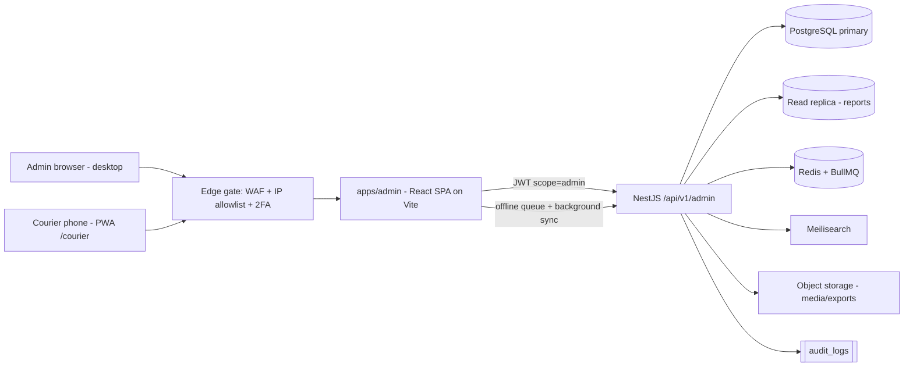
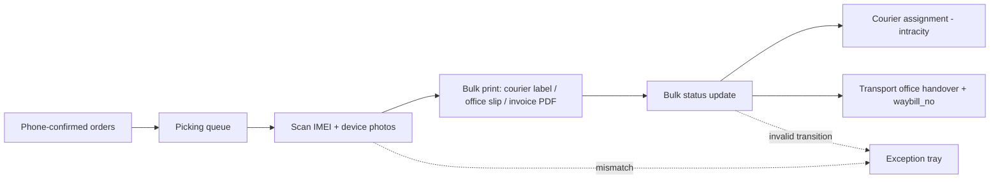
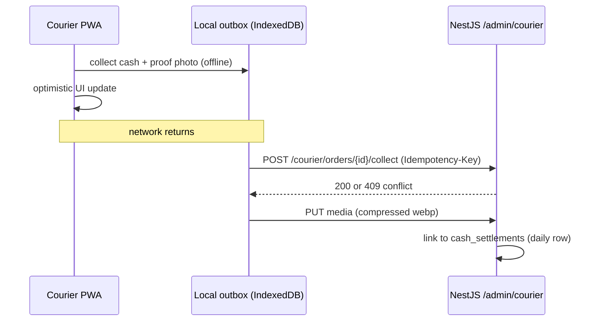

<div dir="rtl">

## 10. لوحة التحكم الإدارية والعمليات والتقارير

### 10.1 معمارية اللوحة والوصول المحمي

لوحة التحكم تطبيق مستقل داخل مساحة العمل الموحّدة (monorepo) في المسار `apps/admin` (راجع القسم رقم 2 لهيكل المستودع)، مبني بـ **React 19 SPA + Vite + TypeScript + TanStack Router + TanStack Query** مع Tailwind 4 باتجاه RTL ونظام التصميم المشترك `packages/ui`، ويُنشر على النطاق الفرعي `admin.talisham.com`. لا توليد ساكن ولا تصيير على الخادم: اللوحة جمهورها مسجَّل داخلياً وقيمتها SEO صفر، فالأولوية للتنقل الفوري بلا رحلة شبكة ولعمل واجهة المندوب دون اتصال. أسباب فصلها عن `apps/site` و`apps/app`:

- **سطح هجوم مستقل**: لا تُشحن أي شيفرة إدارية ضمن حزم المتجر، ولا تتشارك اللوحة كوكي الجلسة مع الواجهة العامة (نطاق كوكي مختلف على `admin.talisham.com` + `SameSite=Strict` + `Secure` + `HttpOnly`).
- **أولويات مختلفة**: المتجر محسّن للجوال أولاً (القسم رقم 5)، بينما اللوحة مصممة لشاشات ≥ 1280px مع وضع لوحي (tablet) لشاشات المستودع — باستثناء وحدة `/courier` المصممة للجوال أولاً وللشبكات البطيئة (10.5). كل مسارات اللوحة تُرسَل مع ترويسة `X-Robots-Tag: noindex, nofollow`، و`Cache-Control: no-store` لـ `index.html`، ولا تُسجَّل إطلاقاً في Service Worker الخاص بالمتجر — لـ `apps/admin` عامل خدمة خاص به مقصور على مسارات `/courier` (10.5).
- **دورة إصدار مستقلة**: نشر تحديث إداري لا يستدعي إعادة بناء `apps/site` ولا `apps/app`.

اللوحة لا تصل إلى PostgreSQL مباشرة؛ كل الطلبات تمر عبر مسار `/api/v1/admin/**` في NestJS (راجع القسم رقم 4)، بنفس آلية JWT (access + refresh) مع مطالبة (claim) إضافية `scope: "admin"`، وعمر رمز وصول 15 دقيقة، وانتهاء جلسة الخمول بعد 30 دقيقة. كل حسابات اللوحة تُلزَم بمصادقة ثنائية عبر TOTP (القسم رقم 9)؛ وحسابات المندوبين التي لا تملك تطبيق مُصادقة تُقبل برمز عبر **واتساب** صالح 5 دقائق كحد أقصى، مع القناة الاحتياطية SMS المحلي. حدود المعدل على كل مسارات `/admin/**` مصدرها الوحيد جدول 9.5 ولا تُكرَّر قيمها هنا.

**الأدوار والصلاحيات**: تفاصيل نموذج RBAC في القسم رقم 9، والصلاحية تُسمّى فيه — وهنا — باصطلاح واحد `مورد:فعل:نطاق` (النطاق `own` أو `any`). الحارس `PermissionsGuard` يتحقق من **الصلاحية** لا من اسم الدور، وعمود «الدور الأدنى» في جداول هذا القسم اختصار عرضي فقط. الأدوار المستخدمة: `SUPER_ADMIN`, `OPS_MANAGER`, `CATALOG_ADMIN`, `WAREHOUSE`, `SUPPORT`, `CONTENT`, `MARKETING`, `ANALYST`, `COURIER`.

| الدور | ملكيته التشغيلية | صلاحياته الجوهرية (مصدرها جدول 9.3) |
|---|---|---|
| `SUPER_ADMIN` | كل شيء | `users:manage_roles`, `settings:manage`, وكل ما دونها |
| `OPS_MANAGER` | الطلبات والشحن والتسويات والمرتجعات | `orders:update_status`, `returns:approve`, `inventory:write`, `customers:read_pii:any`, `reports:view` |
| `CATALOG_ADMIN` | **مالك صفوف الكتالوج**: المنتجات والمتغيّرات والوسائط والتسعير وسعر الصرف | `catalog:write`, `pricing:write`, `inventory:write`, `reviews:moderate`, `reports:view` (محدود) |
| `WAREHOUSE` | التجهيز ووحدات الأجهزة والبوالص | `inventory:write`, `orders:read:any`, `orders:update_status` ضمن انتقالات التجهيز فقط |
| `SUPPORT` | خدمة العملاء | `orders:read:any`, `customers:read_pii` مقنّعاً جزئياً, `reviews:moderate` |
| `CONTENT` / `MARKETING` | المحتوى والبانرات / الكوبونات والحملات | `catalog:read`, `content:write` / `promotions:write` |
| `ANALYST` | القراءة والتقارير | `reports:view`, `catalog:read` |
| `COURIER` | مهامه المسندة إليه فقط عبر `/courier` | `orders:read:own`, `orders:update_status:own`, `cash:collect:own` — و`own` هنا تعني **الطلبات المسندة إلى هذا المندوب اليوم** ويُفرض الشرط داخل استعلام Prisma نفسه لا في الواجهة |



بوابة الحافة أعلاه محايدة تجاه المزوّد: على Cloudflare تُنفَّذ بـ Access + WAF، وفي الخطة البديلة الموثّقة (خادم أوروبي بـ Docker Compose، القسم رقم 11) تُنفَّذ بوكيل عكسي مع قائمة IP مسموحة وشهادة عميل — لا ميزة حصرية لمزوّد واحد في مسار الدخول الإداري.

**نظام التصميم في اللوحة**: تُطبَّق **النسخة المقيّدة** من Liquid Glass (القسم رقم 5): الزجاج على الشريط العلوي والشريط الجانبي والنوافذ والأوراق السفلية فقط، و**أسطح صلبة** لكل الجداول وقوائم البيانات الطويلة حفاظاً على الوضوح وعلى الأداء. واجهة `/courier` تعمل افتراضياً بالبديل الصلب المموّه اللون بلا `backdrop-filter` إطلاقاً، لأن أجهزة المندوبين هي الأضعف في المنظومة.

**سجل التدقيق (`audit_logs`)**: اعتراض (interceptor) عام في NestJS يكتب سطراً في جدول `audit_logs` داخل نفس المعاملة (transaction) الخاصة بالإجراء، فلا يُسجَّل إجراء فشل ولا يضيع إجراء نجح. الجدول للقراءة فقط على مستوى قاعدة البيانات (دور التطبيق يملك `INSERT`/`SELECT` فقط)، ويُحتفظ بالبيانات 24 شهراً ثم تُؤرشف إلى التخزين الكائني وتُحذف من الجدول الحي بمهمة الصيانة الأسبوعية (10.11). تُلتقط إلزامياً: كل تعديل على `fx_rates` و`tax_rate_bp`، وكل تسجيل أو تعديل لمبلغ محصَّل، وكل تغيير حالة طلب، وكل إجراء على `phone_blocklist`.

```json
{
  "id": "0198f3a2-4b7c-7c31-9a55-2f0e6d1a8c44",
  "actor_id": "0198f2c1-9d3e-7a48-b6d2-5c81ff0a2b19",
  "actor_role": "SUPPORT",
  "action": "order.address.update",
  "entity_type": "order",
  "entity_id": "TS-2607-000148",
  "before": { "governorate": "دمشق", "city": "دمشق", "neighborhood": "المزة", "landmark": "مقابل حديقة الجاحظ" },
  "after":  { "governorate": "ريف دمشق", "city": "جرمانا", "neighborhood": "المنطقة الصناعية", "landmark": "جانب صيدلية الشام" },
  "reason": "تصحيح العنوان في مكالمة التأكيد",
  "ip": "188.x.x.x",
  "user_agent": "Chrome/139 Windows",
  "created_at": "2026-07-28T09:14:22.113Z"
}
```

### 10.2 وحدات اللوحة

| الوحدة | المسار | الدور الأدنى | الصلاحية | الوظائف الأساسية | الجداول/المصادر |
|---|---|---|---|---|---|
| لوحة المؤشرات | `/dashboard` | `ANALYST` | `reports:view` | مبيعات اليوم/الأمس (ليرة + دولار)، طلبات بانتظار التأكيد، تنبيهات مخزون، فروقات نقدية مفتوحة، أعلى 10 موديلات | `mv_daily_sales`, `orders`, `cash_settlements` |
| بانتظار التأكيد الهاتفي | `/orders/confirmation` | `SUPPORT` | `orders:update_status` | قائمة عمل، مؤقّت 48 ساعة، تسجيل محاولات الاتصال، تصحيح العنوان قبل التجهيز | `orders`, `addresses`, `order_status_history` |
| الطلبات | `/orders` | `SUPPORT` | `orders:read:any` | بحث، تفاصيل، تغيير حالة، ملاحظات داخلية، سجل التدقيق، المبلغ المستحق نقداً | `orders`, `order_items` |
| الشحنات | `/shipments` | `WAREHOUSE` | `orders:update_status` | إسناد لمندوب أو مكتب نقل، `waybill_no` وصورة الإيصال، طباعة، تحديث الحالة يدوياً، تسليم فاشل | `shipments`, `shipment_events` |
| تعريفة الشحن | `/shipping-rates` | `OPS_MANAGER` | `settings:manage` | رسوم ومهل لكل محافظة وطريقة شحن | `shipping_rates` |
| التحصيل والتسويات | `/settlements` | `OPS_MANAGER` | `cash:read:any` | حصيلة كل مندوب/مكتب يومياً، مطابقة آلية، فروقات، عمولة التوصيل، إقفال التسوية | `cash_settlements`, `orders` |
| المخزون | `/inventory` | `WAREHOUSE` | `inventory:write` | كميات لكل مستودع (`on_hand`/`reserved`/`incoming`)، تسويات، حدّ التنبيه، حجوزات مفتوحة، وحدات الأجهزة بالـ IMEI، فلترة حسب `device_origin` و`part_code` | `inventory_levels`, `inventory_movements`, `inventory_reservations`, `device_units` |
| المنتجات | `/catalog/products` | `CATALOG_ADMIN` | `catalog:write` | إنشاء/تعديل موديل ومتغيراته (سعة، ذاكرة، لون، `device_origin`، `part_code`، `dual_sim`، `esim_only`، `condition`، `battery_health_pct`، `warranty_type`، `warranty_months`)، رفع صور حقيقية للجهاز، نتيجة فحص IMEI، استيراد CSV | `products`, `product_variants`, `media`, `product_compatibility` |
| التسعير | `/catalog/pricing` | `CATALOG_ADMIN` | `pricing:write` | أسعار بسنتات الدولار (`price_usd_cents`)، قواعد التسعير، معاينة الأثر بالليرة | `price_rules`, `product_variants` |
| سعر الصرف | `/fx-rates` | `CATALOG_ADMIN` | `pricing:write` | تحديث يدوي، سجل تاريخي، معاينة أثر التغيير قبل الاعتماد (10.7) | `fx_rates` |
| المرتجعات والكفالة | `/returns` | `OPS_MANAGER` | `returns:approve` | طلبات الإرجاع/الاستبدال، فحص IMEI ومطابقة الجهاز، الاسترداد النقدي، حالات الكفالة | `returns`, `refunds`, `warranty_claims`, `device_units` |
| المستخدمون | `/users` | `SUPPORT` | `customers:read_pii` | ملف المستخدم، عناوينه، طلباته، أرقامه، تعطيل حساب | `users`, `addresses` |
| الكوبونات | `/promotions` | `MARKETING` | `promotions:write` | إنشاء كوبون، حدود الاستخدام، الشرائح المستهدفة | `coupons`, `coupon_redemptions` |
| المراجعات والأسئلة | `/moderation` | `SUPPORT` | `reviews:moderate` | اعتماد/رفض، رد رسمي، بلاغات إساءة | `reviews`, `questions` |
| المحتوى والبانرات | `/content` | `CONTENT` | `content:write` | بانرات، صفحات ثابتة، مقالات المواصفات | `banners`, `pages`, `posts`, `media` |
| واجهة المندوب | `/courier` | `COURIER` | `orders:read:own` | مهام اليوم، ترتيب المسار، التحصيل، إثبات التسليم — تعمل دون اتصال (10.5) | `orders`, `shipments`, `cash_settlements` |
| لوحة الصيانة | `/maintenance` | `SUPER_ADMIN` | `settings:manage` | نتيجة آخر تشغيل أسبوعي، ما أُصلح تلقائياً، ما يحتاج تدخلاً، حالة ترقية المكتبات (10.11) | `maintenance_runs`, GitHub Actions API |
| المستخدمون والصلاحيات | `/iam` | `SUPER_ADMIN` | `users:manage_roles` | دعوة موظف، تغيير دور، إنهاء جلسات، مفاتيح API | `users`, `roles`, `role_permissions`, `auth_sessions` |
| الإعدادات | `/settings` | `SUPER_ADMIN` | `settings:manage` | عملة العرض، `tax_rate_bp`، سقف قيمة طلب الدفع عند الاستلام، حد الطلبات المفتوحة لكل رقم، القوالب، أعلام الميزات | `settings`, `feature_flags` |

أعراف واجهة موحّدة عبر كل الوحدات: جدول قابل للفرز والفلترة مع حفظ الفلاتر في مسار الصفحة (query string) ليكون قابلاً للمشاركة، وترقيم صفحات بالمؤشر (cursor pagination) لا بالإزاحة، وإجراءات جماعية في شريط سفلي ثابت، ونموذج تحرير جانبي (drawer) بدل الانتقال لصفحة جديدة، واختصارات لوحة مفاتيح موحّدة (`g o` للطلبات، `g i` للمخزون، `g c` لقائمة التأكيد، `g s` للتسويات). التواريخ بالتقويم الميلادي وبالأرقام العربية الغربية (0-9) وبتوقيت `Asia/Damascus` دائماً.

**عرض المبالغ**: كل مبلغ يُنقل من الواجهة البرمجية كعدد صحيح بسنتات الدولار (`*_usd_cents`) ومعه — حيث يكون مثبَّتاً — نظيره بالليرة (`*_syp`) وسعر الصرف المستخدم. طبقة العرض تُظهر **الليرة السورية افتراضياً** مع مبدّل عملة عام في الشريط العلوي يقلب كل أرقام الشاشة إلى الدولار، وتُظهر في كل شاشة مالية القيمتين معاً مع طابع سعر الصرف. المبالغ النقدية المستحقة تُعرض دائماً مقرَّبة لأقرب **10 ليرات جديدة** كما تُطبع على الإيصال (القسم رقم 8).

### 10.3 قائمة عمل «بانتظار التأكيد الهاتفي»

الشاشة الأهم تشغيلياً، لأن مكالمة التأكيد هي **البوابة الوحيدة** للانتقال `PENDING_CONFIRMATION → PROCESSING` (القسم رقم 8) وهي أرخص ضابط ضد رفض الاستلام. القائمة تعرض كل طلب في `PENDING_CONFIRMATION` مرتّباً تصاعدياً بالوقت المتبقي من نافذة الـ48 ساعة.

| العنصر في الصف | المصدر | السلوك |
|---|---|---|
| المؤقّت المتبقي | `placed_at + 48h − now()` | شارة خضراء > 24 ساعة، برتقالية 6–24 ساعة، حمراء < 6 ساعات مع تثبيت الصف في أعلى القائمة |
| المحاولات | `orders.confirmation_attempts` (0–3) | ثلاث نقاط تمتلئ مع كل محاولة؛ عند 3 يظهر زر «إلغاء الطلب» بدل «تسجيل محاولة» |
| المبلغ المستحق نقداً | `orders.total_syp` مقرَّباً + مقابله بالدولار | يُقرأ على العميل حرفياً في المكالمة |
| العنوان | `governorate`, `city`, `neighborhood`, `landmark` | قابل للتصحيح داخل الصف قبل `PROCESSING` بلا مغادرة الشاشة |
| زر واتساب | `phone_e164` | يفتح محادثة على الرقم `+963…` برسالة قالبية معدّة |
| قفل الصف | Redis `confirm:lock:{orderId}` | يُخصَّص الصف للموظف الذي فتحه لمدة 10 دقائق فيمنع اتصال موظفَين بالعميل نفسه |

قواعد المحاولات: بحد أقصى **3 محاولات**، وبفاصل زمني لا يقل عن 3 ساعات بين محاولتين، ولا اتصال بين 22:00 و08:00 بتوقيت `Asia/Damascus`. النتائج الممكنة: `CONFIRMED` (تنتقل الحالة إلى `PROCESSING` ويتحول الحجز إلى مؤكَّد)، `NO_ANSWER` (تبقى الحالة ويزيد العدّاد)، `POSTPONED` (موعد اتصال لاحق داخل النافذة)، `CANCELLED` (بطلب العميل، ويُحرَّر الحجز فوراً). مهمة `orders.expire-pending` تلغي الطلب تلقائياً **بعد 48 ساعة أو بعد 3 محاولات اتصال فاشلة**، أيهما أسبق.

```json
POST /api/v1/admin/orders/TS-2607-000148/confirm
{
  "outcome": "CONFIRMED",
  "confirmation_notes": "أكد العنوان والمبلغ 11,591,000 ل.س، ووقت التسليم بعد الخامسة مساءً",
  "address_patch": { "neighborhood": "المزة 86", "landmark": "قرب فرن المزة" },
  "idempotency_key": "confirm-TS-2607-000148-a3"
}
```

الحقول المسجَّلة عند كل محاولة: `confirmation_attempts`, `confirmed_by`, `confirmed_at`, `confirmation_notes`، مع صف في `order_status_history` وسطر في `audit_logs`. مؤشرات الشاشة المعروضة أعلاها: عدد الطلبات في القائمة، متوسط زمن التأكيد من الإنشاء، نسبة التأكيد من المحاولة الأولى، وعدد الطلبات التي أُلغيت لانتهاء المهلة هذا الأسبوع.

### 10.4 شاشات تشغيل الطلبات اليومية

الهدف تقليل زمن معالجة الطلب من **تأكيد المكالمة** إلى تسليمه للمندوب أو لمكتب النقل إلى أقل من 4 ساعات عمل.

1. **قائمة عمل التجهيز (`/ops/picking`)**: عرض جدولي للطلبات في حالة `PROCESSING` مرتّبة بالأقدم أولاً، مع فرز حسب المستودع وطريقة الشحن (`COURIER_INTRACITY` / `INTERCITY_OFFICE` / `POST`) والمحافظة ونسخة الجهاز (`device_origin`, `part_code`) ونوع المنتج (جهاز يحتاج تسجيل IMEI مقابل ملحقات). صفحة واحدة تعرض 100 صف مع تمرير افتراضي (virtualized table)، وتحديث لحظي كل 30 ثانية عبر استطلاع (polling) بسيط. عند تجهيز جهاز يجب مسح رمز IMEI بالماسح قبل السماح بإغلاق البند، فتُربط وحدة الجهاز المطابقة في `device_units` ببند الطلب عبر `device_units.order_item_id` وتنتقل حالتها من `IN_STOCK` إلى `ALLOCATED`، وتُرفَق نتيجة فحص IMEI وصور الجهاز نفسه بالطلب لتُعرض للعميل — وهي من أقوى عوامل الثقة في السوق السوري.
2. **طباعة مستندات الشحن بالجملة (`/ops/labels`)**: تحديد حتى 200 طلب في الدفعة الواحدة، فتُنشئ مهمة `labels.bulk-generate` في BullMQ تُخرج ملف PDF واحداً يُرفع إلى التخزين الكائني ويُتاح برابط موقّع صالح 60 دقيقة. المخرجات ثلاثة أنواع حسب طريقة الشحن: ملصق مندوب داخل المدينة (10×15 سم) يحمل المبلغ المستحق نقداً مقرَّباً بخط بارز، وقسيمة تسليم لمكتب النقل تُملأ برقم `waybill_no` بعد استلامها من المكتب، وإيصال/فاتورة PDF قابلة للطباعة تُرفق مع الشحنة (بلا أي ضريبة قيمة مضافة؛ يظهر بند الرسوم فقط إن كان `tax_rate_bp > 0`). الطلبات المتعثرة في الدفعة تُعرض في جدول أخطاء مستقل دون إفشال الدفعة كاملة.
3. **التحديث الجماعي للحالات (`/ops/bulk-status`)**: اختيار حتى 500 طلب وتطبيق انتقال حالة واحد عليها. الواجهة تُظهر معاينة قبل التنفيذ (كم طلباً سينتقل فعلاً وكم سيُرفض لأن انتقاله غير مسموح حسب آلة الحالات في القسم رقم 8)، ثم يُنفَّذ عبر طابور مع كتابة سطر تدقيق لكل طلب.

```json
POST /api/v1/admin/orders/bulk-status
{
  "order_ids": ["TS-2607-000148", "TS-2607-000149"],
  "to_status": "SHIPPED",
  "shipping_method": "INTERCITY_OFFICE",
  "office_name": "القدموس",
  "waybill_no": "QD-884120",
  "note": "تسليم دفعة 2026-07-28 الصباحية إلى مكتب حلب",
  "idempotency_key": "bulk-2026-07-28-0930-a1"
}
```



كل استثناء (بند ناقص، IMEI غير مطابق، انتقال حالة مرفوض، غياب `waybill_no` لشحنة مكتب) يسقط في صندوق الاستثناءات `/ops/exceptions` بدل أن يوقف الدفعة، ولكل استثناء مالك ومهلة معالجة 24 ساعة، ويُحتسب عمره في مؤشر «الطلبات المتعثرة» على لوحة المؤشرات.

**لا webhooks من شركة شحن**: تحديث حالات الشحن يدوي من `/shipments` أو من واجهة المندوب، ويُحفظ `waybill_no` وصورة إيصال المكتب مع كل شحنة بين المحافظات. إن توفّر شريك يدعم webhook لاحقاً يُضاف مسار وارد اختياري بقيمة `updated_source='PARTNER_WEBHOOK'` بلا تغيير في بقية التدفق.

**البحث السريع (Ctrl/Cmd + K)**: حقل واحد يستقبل رقم الطلب (`TS-YYMM-NNNNNN`) أو رقم الهاتف (بأي صيغة: `09xxxxxxxx`, `9639xxxxxxxx`, `+9639xxxxxxxx` — تُطبَّع كلها إلى E.164 بنمط `^\+9639[0-9]{8}$`) أو IMEI (15 رقماً) أو `waybill_no` أو البريد. يُطبَّق كشف نمط (pattern detection) في الواجهة لتحديد نوع الاستعلام ثم يُوجَّه لفهرس مناسب: أرقام الطلبات والهواتف عبر فهارس PostgreSQL مباشرة (`idx_orders_phone`)، والـ IMEI على جدول `device_units` عبر `idx_device_units_imei` ثم يُعرض بند الطلب المرتبط به من `device_units.order_item_id`، لضمان دقة 100%، بينما أسماء المستخدمين والمنتجات عبر Meilisearch (القسم رقم 6). هدف الأداء: نتيجة أولى خلال أقل من 300 مللي ثانية (p95).

### 10.5 واجهة المندوب `/courier` — وحدة مستقلة تعمل دون اتصال

`/courier` وحدة مستقلة داخل `apps/admin` لها موجّه (router) وتنسيق وحزمة خاصة بها، تُحمَّل بتقسيم كود على مستوى المسار فلا ينزل أي كود إداري ثقيل على جهاز المندوب. تُثبَّت كـ PWA عبر `manifest.webmanifest`، وتُصمَّم للجوال أولاً وللشبكات البطيئة: بلا زجاج، بلا رسوم متحركة غير ضرورية، وحزمة أولية ≤ **120KB** مضغوطة وتشغيل مفيد على شبكة 3G بطيئة (نحو 400kbps، RTT 400ms) خلال أقل من 5 ثوانٍ.

| الشاشة | المسار | المحتوى | العمل دون اتصال |
|---|---|---|---|
| مهام اليوم | `/courier/today` | الطلبات المسندة إليه اليوم، ملخّص: عدد الطلبات، إجمالي النقد المتوقع تحصيله بالليرة | تُخزَّن كاملة عند أول تحميل، وتُقرأ من IndexedDB لاحقاً |
| ترتيب المسار | `/courier/route` | ترتيب يدوي بالسحب + ترتيب مقترح بالتجميع حسب المحافظة والمدينة والحي، وفتح الإحداثيات `geo_lat/geo_lng` في تطبيق خرائط خارجي إن وُجدت | يعمل كلياً محلياً |
| تفاصيل الطلب | `/courier/orders/{id}` | العنوان الكامل مع `landmark` بخط بارز، رقمان للاتصال (`phone`, `alt_phone`)، بنود الطلب، **المبلغ المستحق نقداً مقرَّباً لأقرب 10 ليرات** بأكبر خط في الشاشة | مقروء دون اتصال |
| تحديث الحالة | `/courier/orders/{id}/status` | `OUT_FOR_DELIVERY` ← `DELIVERED` أو `DELIVERY_FAILED` مع `reason_code` إلزامي (`NO_ANSWER`, `REFUSED`, `BAD_ADDRESS`, `POSTPONED`) | يُدرج في الطابور ويُرسل لاحقاً |
| تسجيل التحصيل | `/courier/orders/{id}/collect` | `collected_amount_syp` بلوحة أرقام كبيرة تقترح المبلغ المقرَّب، و`payment_status` (`COLLECTED` / `PARTIAL` مع `reason_code` وموافقة) | يُدرج في الطابور |
| إثبات التسليم | `/courier/orders/{id}/proof` | صورة من الكاميرا أو توقيع على الشاشة (canvas)، إلزامي للطلبات فوق 300 دولار | تُضغط محلياً وتُخزَّن حتى الرفع |
| إقفال اليوم | `/courier/settlement` | إجمالي ما حصّله اليوم، عدد المسلَّم مقابل الفاشل، صافي المستحق بعد عمولة التوصيل، وحالة تسوية اليوم | يُعرض من البيانات المحلية مع وسم «غير مزامَن» |

**آلية العمل دون اتصال والمزامنة**: كل إجراء يكتبه المندوب يُسجَّل أولاً في طابور محلي (IndexedDB) بمفتاح `idempotency_key` فريد ثم تُحدَّث الواجهة تفاؤلياً (optimistic)، ويُرسل الطابور بالترتيب عند عودة الشبكة عبر Background Sync أو عند فتح التطبيق. الصور تُضغط إلى WebP بحد أقصى 200KB وبعرض 1280px قبل التخزين، وتُرفع في مسار منفصل بعد نجاح إجراء الحالة المرتبط بها. **الخادم هو المرجع** عند التعارض: إن كانت حالة الطلب قد تغيّرت مركزياً، يُرفض الإجراء المتأخر برمز `409` ويظهر للمندوب كـ«يحتاج مراجعة» بدل أن يُطبَّق صامتاً.

```ts
// apps/admin/src/offline/courier-sync.ts
export async function enqueue(action: CourierAction) {
  await db.outbox.add({ ...action, key: crypto.randomUUID(), queuedAt: Date.now(), tries: 0 });
  applyOptimistic(action);                       // الواجهة تتقدم فوراً
  if (navigator.onLine) return flush();
  await (await navigator.serviceWorker.ready).sync.register('courier-outbox');
}

export async function flush() {
  for (const item of await db.outbox.orderBy('queuedAt').toArray()) {
    const res = await api.post(item.url, item.body, { headers: { 'Idempotency-Key': item.key } });
    if (res.status === 409) { await db.conflicts.add(item); await db.outbox.delete(item.id); continue; }
    if (res.ok) await db.outbox.delete(item.id);
    else await db.outbox.update(item.id, { tries: item.tries + 1 }); // تراجع أسي حتى 6 محاولات
  }
}
```



مؤشرات إشرافية على المندوب تُعرض في `/settlements`: نسبة التسليم من المحاولة الأولى، متوسط زمن التوصيل من `OUT_FOR_DELIVERY` إلى `DELIVERED`، عدد الإجراءات التي بقيت في الطابور أكثر من 6 ساعات (مؤشر انقطاع شبكة أو جهاز معطّل)، ومتوسط فرق التسوية.

### 10.6 التحصيل والتسويات النقدية وتقارير المخاطر

بما أن **الدفع عند الاستلام هو طريقة الدفع الوحيدة** (`payment_method ENUM('COD')`)، فإن التحصيل النقدي هو المسار المالي الوحيد في النظام، وحقوله مستقلة تماماً عن حالة الطلب.

**شاشة التسويات (`/settlements`)** — صف واحد لكل (نوع المحصِّل، المحصِّل، اليوم) من `cash_settlements`:

| العمود المعروض | المصدر | ملاحظة العرض |
|---|---|---|
| المحصِّل | `collector_type` (`COURIER` / `TRANSPORT_OFFICE`) + `collector_id` | اسم المندوب أو مكتب النقل |
| الطلبات المسلَّمة | `orders_count` | رابط لقائمة الطلبات المشمولة |
| المتوقَّع | `expected_amount_syp` | + مقابله بالدولار بسعر يوم التسوية |
| المحصَّل فعلاً | `collected_amount_syp` | + مقابله بالدولار |
| الفرق | `variance_syp` | أخضر إن صفر، أحمر إن سالب، برتقالي إن موجب |
| عمولة التوصيل | `delivery_commission_syp` | صافي المستحق = المحصَّل − العمولة |
| الحالة | `OPEN → RECONCILED → SETTLED` أو `DISPUTED` | زر «إقفال» يطلب `reconciled_by` وملاحظة إلزامية |

المطابقة الآلية تجري بمهمة `settlements.reconcile-daily` في 23:30 بتوقيت `Asia/Damascus` (القسم رقم 8)؛ ودور اللوحة هو **مراجعة المستثنيات وإقفالها**. كل تعديل يدوي على `collected_amount_syp` يتطلب سبباً ويُسجَّل في `audit_logs`، ولا يُقبل مبلغ محصَّل أكبر من `orders.total_syp`.

**تقرير الفروقات (`/settlements/variance`)**: كل صف بـ `variance_syp <> 0` أو حالة `DISPUTED`، مرتّباً بحجم الفرق ثم بعمره. أعمدته: المحصِّل، تاريخ التسوية، الفرق بالليرة وبالدولار، عدد الطلبات المتنازع عليها، عمر النزاع بالأيام، الإجراء المتخذ. قواعد تشغيلية: فرق مفتوح > 72 ساعة يُجمّد إسناد مهام جديدة للمحصِّل ويُرسل إشعار واتساب للمالك؛ وتُعرض في أعلى الشاشة ثلاثة أرقام: إجمالي الفروقات المفتوحة، أقدم نزاع، ونسبة التسويات المطابقة من أول مرة (الهدف ≥ 97%).

**تقرير رفض الاستلام (`/reports/cod-rejections`)** — أخطر مخاطر الدفع عند الاستلام لأن تكلفته شحن ذهاب وإياب على المتجر مع تجميد الجهاز خارج المخزون:

| المؤشر | التعريف | الهدف/الإنذار |
|---|---|---|
| معدل الرفض | طلبات `reason_code='REFUSED'` ÷ الطلبات الخارجة للتوصيل | إنذار فوق 6% أسبوعياً |
| تكلفة الشحن المهدور | مجموع `phone_blocklist.wasted_shipping_usd_cents` للفترة، معروضاً بالليرة والدولار | تقرير أسبوعي إلى المالك |
| توزيع الأسباب | `NO_ANSWER` / `REFUSED` / `BAD_ADDRESS` / `POSTPONED` | نسبة `BAD_ADDRESS` مؤشر على ضعف مكالمة التأكيد |
| الأرقام المقيَّدة | صفوف `phone_blocklist` النشطة، تاريخ الإدراج وتاريخ الانتهاء | إدارة يدوية: رفع القيد يتطلب `OPS_MANAGER` وسبباً مكتوباً |
| حسب المحافظة والمحصِّل | معدل الرفض مقسّماً | يوجّه قرار تعليق الدفع عند الاستلام في منطقة أو الاكتفاء بالاستلام من المعرض |
| أثر الضوابط | مقارنة قبل/بعد تفعيل سقف القيمة وحد الطلبات المفتوحة | تُقرأ قيم السقوف من `/settings` |

**المرتجعات والاسترداد النقدي (`/returns`)**: الاسترداد يُنشأ في `refunds` بطريقة `CASH` فقط، ولا يُصرف إلا بعد `imei_verified AND device_matched` على وحدة الجهاز في `device_units`؛ الشاشة تفرض ترتيب الخطوات: استلام ← فحص IMEI ومطابقة الجهاز وحالة البطارية ← قرار (قبول/رفض/استبدال) ← صرف نقدي بمبلغ مقرَّب لأقرب 10 ليرة مع `receipt_media_id` كإثبات.

### 10.7 إدارة سعر الصرف (`/fx-rates`)

الليرة السورية طبقة **عرض** تُحسب من الدولار، وسعر الصرف يحدّثه المدير **يدوياً** بلا أي سحب آلي من مصدر خارجي. الشاشة ثلاثة أجزاء:

1. **السعر الساري**: القيمة، `effective_from`، من غيّره (`set_by`)، ومنذ متى — مع تحذير بارز إن مضى على آخر تحديث أكثر من 72 ساعة، لأن سعراً قديماً يعني بيعاً بخسارة أو توقف مبيعات.
2. **إضافة سعر جديد**: لا تعديل على صف قديم أبداً — كل تغيير صف جديد في `fx_rates(rate, effective_from, set_by, note)`. النموذج يطلب القيمة و`effective_from` (الآن أو لاحقاً) وملاحظة، ويحسب فوراً نسبة الانحراف عن السعر الساري ويتصرف حسب سياسة القسم رقم 7: انحراف يسير يُعتمد مباشرة، والانحراف الحاد يتطلب تأكيداً ثانياً وملاحظة إلزامية ويفتح تنبيهاً بمراجعة الكوبونات وقواعد التسعير النشطة.
3. **السجل التاريخي**: جدول غير قابل للتعديل بكل الأسعار السابقة مع رسم خطي، وتصدير CSV — وهو ما يجعل إعادة بناء أي فاتورة تاريخية ممكنة بدقة.

**معاينة الأثر قبل الاعتماد** — لوحة تُظهر بوضوح ما سيتغيّر وما لن يتغيّر:

| الفئة | الأثر عند تغيير السعر | العرض في المعاينة |
|---|---|---|
| الأسعار المعروضة في المتجر | تتغيّر فوراً (تُحسب من السعر الساري) | عيّنة من 20 متغيّراً بأعلى مبيعات: السعر قبل/بعد بالليرة |
| السلال المفتوحة | تُحدَّث عند إعادة الحساب في `validate` قبل إنشاء الطلب | عدد السلال المتأثرة |
| الطلبات المثبَّتة داخل نافذة الـ48 ساعة | **لا تتغيّر** — `orders.fx_rate` و`orders.total_syp` مثبَّتان | عدد الطلبات المحمية وقيمتها |
| الطلبات التي تجاوزت 48 ساعة بلا تجهيز | تُعاد تسعيرها قبل الشحن ويُبلَّغ العميل على واتساب مع حقه في الإلغاء بلا رسوم | قائمة قابلة للتصدير ونداء جماعي |
| التسويات المفتوحة | فرق سعر الصرف بين التثبيت والتحصيل بند مستقل في `cash_settlements` ولا يُخصم من المندوب | مجموع الفرق التقديري |

الاعتماد يتطلب صلاحية `pricing:write`، ويُبطِل مفتاح `fx:current` في Redis فوراً عبر Pub/Sub فلا يبقى سعر قديم معروضاً أكثر من دقيقة، ويُسجَّل إلزامياً في `audit_logs` بمن ولماذا. الشاشة تُظهر كل مبلغ بالليرة وبالدولار جنباً إلى جنب.

### 10.8 خدمة العملاء وضوابط الصلاحية

| الإجراء | الدور الأدنى | القيد التشغيلي | الأثر |
|---|---|---|---|
| عرض تفاصيل طلب | `SUPPORT` | إخفاء آخر 4 خانات من الهاتف في القوائم، وإظهارها بضغطة تُسجَّل في التدقيق | قراءة فقط (`orders:read:any`) |
| ملاحظة داخلية | `SUPPORT` | لا تظهر للعميل إطلاقاً، غير قابلة للحذف بعد الحفظ (تعديل بإصدار جديد) | `order_notes` |
| تسجيل نتيجة مكالمة تأكيد | `SUPPORT` | داخل نافذة الـ48 ساعة وبحد 3 محاولات وبفاصل 3 ساعات | `confirmation_attempts`, `confirmed_by`, `confirmed_at`, `confirmation_notes` |
| تعديل عنوان الشحن | `SUPPORT` | مسموح فقط قبل حالة `SHIPPED`، ويتطلب حقل سبب ≥ 10 أحرف، و`landmark` يبقى إلزامياً | إعادة حساب تعريفة الشحن حسب المحافظة + إشعار واتساب للعميل |
| إلغاء طلب | `OPS_MANAGER` | ممنوع بعد `SHIPPED`؛ يحرر حجز المخزون فوراً | `orders.status = CANCELLED` |
| إعادة إرسال إشعار | `SUPPORT` | الحد المعتمد في جدول 9.5، وترتيب القنوات: واتساب ← SMS ← بريد | مهمة `notifications.dispatch` |
| تصحيح مبلغ محصَّل | `OPS_MANAGER` | لا يتجاوز `orders.total_syp`، ويتطلب سبباً وصورة إثبات | `cash_settlements` يُعاد حساب `variance_syp` |
| اعتماد استرداد نقدي | `OPS_MANAGER` | بعد `imei_verified AND device_matched` فقط؛ الصرف نقداً من المعرض أو عبر المندوب مع إيصال | صف في `refunds` بطريقة `CASH` |
| إدراج/رفع قيد رقم | `OPS_MANAGER` | سبب مكتوب إلزامي؛ الرفع يُخطر المالك | `phone_blocklist` |
| انتحال جلسة مستخدم (impersonation) | `SUPER_ADMIN` | جلسة للقراءة فقط، 15 دقيقة، شريط تحذير دائم، تنبيه إلى قناة العمليات | تدقيق إلزامي |

**ملاحظة معمارية**: لا توجد في النظام واجهة مجرّدة لمزوّد دفع ولا بوابة ولا خطوة دفع في إتمام الطلب. إضافة طريقة دفع مستقبلاً = قيمة جديدة في `payment_method` وخطوة إضافية في التدفق، دون إعادة هيكلة.

### 10.9 التقارير والمؤشرات

كل التقارير تُنفَّذ على نسخة القراءة (read replica) لعزلها عن حركة المتجر، وتعتمد على عروض مادية (materialized views) تُحدَّث بمهمة مجدولة، مع فلاتر موحّدة: الفترة، القناة، العلامة التجارية، الموديل، المحافظة، المدينة، `device_origin`، `condition`. **كل مبلغ في كل تقرير وفي كل تصدير يُعرض بعمودين: الليرة السورية والدولار الأمريكي**، مع طابع سعر الصرف المستخدم — الدولار محسوب من `*_usd_cents` مباشرة (مرجع ثابت)، والليرة من سعر الصرف المثبَّت على الطلب لا من سعر اليوم، فلا تتغيّر تقارير الماضي كلما تحرّك السعر.

| التقرير | التعريف/الحساب | مصدر البيانات | التحديث | التصدير |
|---|---|---|---|---|
| المبيعات حسب الفترة | مجموع `orders.total_usd_cents` للطلبات غير الملغاة، ومقابله `orders.total_syp` بالسعر المثبَّت | `mv_daily_sales` | كل ساعة | CSV |
| المبيعات حسب العلامة/الموديل | تجميع `order_items` مع `products.brand_id` | `mv_sales_by_model` | كل ساعة | CSV |
| المبيعات حسب المحافظة | تجميع حسب `addresses.governorate` مع معدل التسليم الناجح | `mv_sales_by_governorate` | كل ساعة | CSV |
| أفضل المنتجات | ترتيب بالكمية والإيراد معاً (عمودان) | `mv_sales_by_model` | كل ساعة | CSV |
| الجديد مقابل المستعمل | الإيراد وهامش الربح حسب `condition` و`device_origin` و`part_code` | `order_items`, `product_variants` | يومي | CSV |
| التحصيل النقدي | المحصَّل مقابل المتوقَّع، الفروقات، عمولة التوصيل، متوسط زمن التحصيل | `cash_settlements`, `orders` | يومي 23:45 | CSV |
| رفض الاستلام وتكلفته | معدل الرفض، توزيع الأسباب، الشحن المهدور | `orders`, `phone_blocklist` | يومي | CSV + إشعار أسبوعي |
| التأكيد الهاتفي | نسبة التأكيد من المحاولة الأولى، متوسط زمن التأكيد، الملغى لانتهاء 48 ساعة | `orders`, `order_status_history` | كل ساعة | CSV |
| معدل التحويل حسب الجهاز/المتصفح | جلسات ← طلبات، مقسّمة على `device_type`, `browser`, نوع الشبكة | تحليلات + `orders` عبر `session_id` | يومي 03:00 | CSV |
| متوسط قيمة الطلب (AOV) | إجمالي الإيراد ÷ عدد الطلبات المسلَّمة (يُحسب بسنتات الدولار ويُعرض بالعملتين) | `mv_daily_sales` | كل ساعة | CSV |
| معدل الإرجاع | بنود مرتجعة ÷ بنود مُسلَّمة، حسب الموديل والحالة | `returns`, `order_items` | يومي | CSV |
| دوران المخزون | تكلفة المبيعات ÷ متوسط قيمة المخزون (30/90 يوماً، بسنتات الدولار) | `inventory_movements`, `inventory_levels` | يومي | CSV |
| المنتجات الراكدة | متغيرات بلا مبيعات ≥ 60 يوماً ومخزون > 0 | `product_variants`, `order_items` | يومي | CSV |
| تنبيهات نفاد المخزون | `(on_hand − reserved) ≤ reorder_point` (الافتراضي 5) | `inventory_levels` | كل 15 دقيقة | CSV + إشعار |

التصدير: حتى 5,000 صف يُولَّد فوراً (استجابة متدفقة، ترميز UTF-8 مع BOM لضمان فتح صحيح للعربية في الجداول الحسابية)، وما زاد يُحوَّل إلى مهمة `reports.export` في BullMQ ترفع الملف إلى التخزين الكائني وترسل رابطاً موقّعاً صالحاً 24 ساعة. كل عملية تصدير تُسجَّل في `audit_logs` بعدد الصفوف والفلاتر المستخدمة.

### 10.10 الأتمتة والمهام المجدولة (BullMQ)

| المهمة | الطابور | الجدولة | سياسة الفشل وإعادة المحاولة |
|---|---|---|---|
| فحص حدود المخزون وإرسال التنبيهات | `inventory` | كل 15 دقيقة | 3 محاولات، تراجع أسي 30ث/2د/8د ← DLQ |
| تذكير السلة المتروكة | `marketing` | بعد 60 دقيقة ثم بعد 24 ساعة | محاولتان؛ تُلغى المهمة إن اكتمل الطلب أو ألغى العميل الاشتراك |
| تحرير الحجوزات المنتهية `inventory.release-reservations` | `inventory` | كل 5 دقائق | 3 محاولات |
| إلغاء الطلبات المعلّقة `orders.expire-pending` | `orders` | مهمة مؤجلة تُجدول عند إنشاء الطلب وتُنفَّذ بعد **48 ساعة** (نهاية نافذة التأكيد والحجز المؤكَّد)، أو فوراً بعد 3 محاولات اتصال فاشلة | 3 محاولات؛ تُلغى إن تأكّد الطلب قبل موعدها |
| تذكير فريق التأكيد بالطلبات المقتربة من انتهاء المهلة | `orders` | كل ساعة (تنبيه عند تبقّي < 6 ساعات) | محاولتان؛ إشعار واتساب لمناوب الدعم |
| المطابقة النقدية اليومية `settlements.reconcile-daily` | `cash` | يومياً 23:30 بتوقيت `Asia/Damascus` | محاولتان؛ الفرق غير الصفري يضع الصف في `DISPUTED` وينبّه المالك |
| إعادة تسعير الطلبات المتجاوزة لنافذة الـ48 ساعة | `pricing` | كل 30 دقيقة | 3 محاولات؛ منع الشحن حتى إعادة التسعير وإبلاغ العميل |
| مزامنة فهرس Meilisearch (تفاضلية) | `search` | كل 5 دقائق | 5 محاولات، تراجع 10ث→5د؛ فشل متكرر يرفع إنذاراً |
| إعادة بناء الفهرس كاملاً | `search` | يومياً 04:00 | محاولة واحدة، قفل توزيعي يمنع التزامن |
| تحديث العروض المادية للتقارير | `reports` | كل ساعة + يومياً 03:00 | محاولتان؛ التقرير يعرض طابع آخر تحديث ناجح |
| أرشفة الطلبات الأقدم من 18 شهراً | `maintenance` | أسبوعياً الجمعة 02:00 | دفعات 1,000 صف؛ يُستأنف من آخر نقطة عند الفشل |
| حزمة الصيانة الأسبوعية (10.11) | `maintenance` | الأحد 03:00 بتوقيت `Asia/Damascus` | كل مهمة فرعية معزولة؛ فشل واحدة لا يوقف البقية |

```ts
// apps/api/src/jobs/schedules.ts
await queues.inventory.add(
  'low-stock-scan',
  { threshold: 'per_variant' },
  { repeat: { pattern: '*/15 * * * *', tz: 'Asia/Damascus' },
    attempts: 3, backoff: { type: 'exponential', delay: 30_000 },
    removeOnComplete: 200, removeOnFail: 1_000 },
);
```

لوحة `/ops/jobs` تعرض حالة كل طابور (منتظر، قيد التنفيذ، فاشل، مؤجل) مع إمكانية إعادة تشغيل مهمة فاشلة أو تفريغ طابور الرسائل الميتة (DLQ) لدور `SUPER_ADMIN` فقط. تجاوز 50 مهمة فاشلة في طابور واحد يطلق إنذاراً (راجع القسم رقم 11).

### 10.11 لوحة الصيانة (`/maintenance`)

الواجهة الإدارية لدورة الصيانة الأسبوعية والترقية كل شهرين (تفاصيل خطوط الأنابيب والبوابات في القسم رقم 11). الشاشة أربع بطاقات:

| البطاقة | ما تعرضه | مصدرها |
|---|---|---|
| آخر تشغيل أسبوعي | التاريخ والوقت (الأحد 03:00 بتوقيت `Asia/Damascus`)، المدة، النتيجة الإجمالية (نجاح/جزئي/فشل)، ورابط تقرير التشغيل | `maintenance_runs` + GitHub Actions API |
| أُصلح تلقائياً | قائمة بما عالجه النظام بنفسه هذا الأسبوع مع عدّاد لكل بند | `maintenance_runs.results` |
| يحتاج تدخلاً | قائمة عمل مرتّبة بالخطورة، لكل بند مالك ومهلة، وزر «فتح» يقود إلى الشاشة المعنية | `maintenance_runs.findings` |
| حالة ترقية المكتبات | قناة الأمن (دمج تلقائي بعد نجاح CI)، القناة الدورية كل شهرين (PR مجمّع لترقيات minor/patch)، وترقيات major كـPR منفصل لكل تبعية بمالك مسمّى | Renovate + GitHub API |

**بنود «أُصلح تلقائياً» المعروضة** (طبقة البيانات والتشغيل عبر مهام BullMQ): `VACUUM ANALYZE` وإعادة بناء الفهارس المتضخمة، أرشفة `audit_logs` القديمة، حذف السلال المهجورة والحجوزات المعلَّقة، إعادة بناء فهرس البحث والتحقق من تطابق عدد المستندات، كنس المهام الفاشلة من الطوابير، حذف الوسائط اليتيمة من `media`، والتحقق من تطابق `device_units` مع `inventory_levels` وتصحيح الانحراف.

**بنود «يحتاج تدخلاً» النموذجية**: ثغرة أمنية بدون تصحيح متاح، انحدار في ميزانية الأداء أو حجم الحزمة، فشل اختبار استعادة النسخة الاحتياطية في البيئة المؤقتة، شهادة أو سرّ ينتهي خلال 30 يوماً، انحراف مخزون لم يُصحَّح آلياً، طلبات عالقة بلا حركة أكثر من 7 أيام، وصفوف `cash_settlements` غير مطابقة، وترقية major معلّقة بلا مالك.

```json
GET /api/v1/admin/maintenance/last-run
{
  "run_id": "0198f9c4-1a22-7e35-9b01-6d4c2f8e0a77",
  "started_at": "2026-07-26T00:00:04Z",
  "finished_at": "2026-07-26T00:41:52Z",
  "timezone": "Asia/Damascus",
  "status": "PARTIAL",
  "auto_fixed": {
    "vacuum_analyze_tables": 34, "reindexed": 6, "audit_logs_archived": 128400,
    "abandoned_carts_purged": 512, "stale_reservations_released": 47,
    "search_docs_reconciled": 3, "orphan_media_deleted": 19, "inventory_drift_corrected": 2
  },
  "needs_action": [
    { "severity": "high", "code": "BACKUP_RESTORE_SLOW", "detail": "استعادة النسخة نجحت في 41 دقيقة (الحد 30)", "owner": "OPS_MANAGER", "due_in_days": 7 },
    { "severity": "medium", "code": "SETTLEMENT_DISPUTED", "detail": "3 تسويات غير مطابقة أقدمها 4 أيام", "owner": "OPS_MANAGER", "due_in_days": 3 },
    { "severity": "medium", "code": "DEP_MAJOR_PENDING", "detail": "ترقية major لمكتبة معالجة الصور بلا مالك", "owner": "SUPER_ADMIN", "due_in_days": 14 }
  ],
  "report_issue_url": "https://github.com/<org>/talisham/issues/812"
}
```

التقرير نفسه يُنشر آلياً كـ GitHub Issue أسبوعي ويُرسل ملخّصه بإشعار واتساب للمالك، مقسّماً إلى «أُصلح تلقائياً» و«يحتاج تدخلاً» — واللوحة هي واجهة المتابعة والإقفال: كل بند «يحتاج تدخلاً» يُقفل بسبب مكتوب يُسجَّل في `audit_logs`. تُعرض أيضاً حالة الإصلاح الذاتي وقت التشغيل (فحوص الصحة وإعادة التشغيل التلقائية، إعادة المحاولة الأسّية، وقاطع الدارة للخدمات الخارجية: مزوّد واتساب، مجمّع SMS، التخزين الكائني).

### 10.12 إدارة المحتوى

- **بانرات الصفحة الرئيسية**: كل بانر يحمل صورة للجوال (1080×1350) وأخرى لسطح المكتب (1920×640)، مع نص بديل (alt) إلزامي بالعربية، ورابط وجهة، ونافذة زمنية (`starts_at`/`ends_at`)، وترتيب عرض، واستهداف اختياري (زائر جديد/عائد). المعاينة داخل اللوحة تحاكي عرض جوال 390px **وعلى شبكة 3G بطيئة** قبل النشر، وتُظهر وزن الصفحة الناتج مقابل ميزانية الأداء (القسم رقم 5) فتمنع نشر بانر يكسرها.
- **الصفحات الثابتة**: محرر منظّم (blocks) ينتج JSON بدل HTML خام، مع حقول SEO (عنوان، وصف، رابط دائم عربي مُعرَّب) لكل لغة على مسار `/[locale]/` — يخدم القسم رقم 12. النصوص تُحفظ في أعمدة `JSONB {ar,en}`.
- **مدونة مواصفات الأجهزة**: نوع محتوى مستقل يربط المقال بموديل واحد أو أكثر عبر `post_products`، فتظهر بطاقات المقارنة داخل المقال وروابط المقال في صفحة المنتج، وهي أساس اكتساب الزيارات العضوية في مواجهة صفحات فيسبوك وإنستغرام ومنصات الإعلانات المبوّبة.
- **الوسائط**: كل الصور والملفات في جدول `media` وحده، مع ربطها بالكيانات عبر مفاتيح خارجية؛ الرفع من اللوحة يمر بضغط وتحويل إلى WebP/AVIF وتوليد مقاسات متجاوبة.
- كل تعديل محتوى يُنشئ نسخة (revision) قابلة للاستعادة، والنشر يُبطل ذاكرة الحافة للمسارات المتأثرة فقط عبر وسم تخزين (cache tag) لكل صفحة — وهي آلية متوفرة في المزوّد الأول وفي الخطة البديلة (شبكة توصيل محتوى + إبطال بالوسم) على السواء.

</div>
