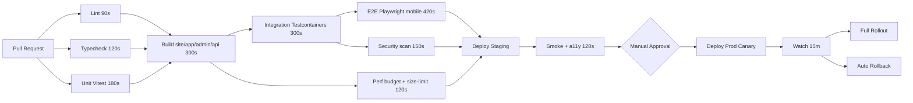

<div dir="rtl">

## 11. البيئات وCI/CD والاختبارات والمراقبة والنسخ الاحتياطي

### 11.1 مصفوفة البيئات الأربع

أربع بيئات معزولة تماماً على مستوى قاعدة البيانات والأسرار (secrets) وأسماء النطاقات (domains). بيانات العملاء الحقيقية لا تغادر بيئة الإنتاج إطلاقاً؛ ما يُنقل إلى `staging` نسخة مُقنَّعة (anonymized) عبر `pnpm db:anonymize` التي تستبدل أرقام الجوال والأسماء والعناوين والمعالم بقيم مولَّدة وتُبقي التوزيعات الإحصائية كما هي.

| البيئة | النطاق | البنية التحتية | قاعدة البيانات | البيانات | الوصول |
|---|---|---|---|---|---|
| محلي (local) | `localhost` (المنافذ 4321/5173/5174/4000) | Docker Compose على جهاز المطوّر | Postgres 16 في حاوية | بذور القسم رقم 3 | كل المطورين |
| تطوير (dev) | `dev.talisham.com` | Cloudflare Pages (preview) + حاوية خلفية واحدة | فرع قاعدة بيانات `dev` | بذور موسّعة، تُعاد كل ليلة 02:00 بتوقيت دمشق | كل المطورين + المصمم |
| تجريبي (staging) | `stg.talisham.com` | مطابق للإنتاج بمقياس 1:4 | فرع `stg` بحجم كامل | نسخة إنتاج مُقنَّعة أسبوعياً | المطورون (قراءة)، القيادة التقنية (كتابة) |
| إنتاج (prod) | `talisham.com` · `api.talisham.com` · `admin.talisham.com` | Cloudflare Pages/Workers + حاويات خلفية خلف موازن حمل | Postgres مُدار + نسخة قراءة | بيانات حقيقية | مسؤول التشغيل فقط، بموافقة ثنائية |

قاعدة صارمة: كل تغيير يمر بالتسلسل `local → dev → staging → prod`، ولا يُنشر إلى الإنتاج إلا ما مكث في `staging` ساعتين على الأقل ونجحت عليه اختبارات الدخان (smoke tests).

### 11.2 التطوير المحلي عبر Docker Compose

ملف `infra/docker/docker-compose.yml` يشغّل الخدمات المساندة، بينما تعمل التطبيقات الأربعة (موقع Astro، تطبيق `/app`، لوحة الإدارة، واجهة NestJS) خارج الحاويات بوضع watch لسرعة إعادة التحميل.

```yaml
services:
  postgres:
    image: postgres:16-alpine
    environment:
      POSTGRES_DB: talisham
      POSTGRES_PASSWORD: dev_only_pw
    ports: ["5432:5432"]
    volumes: ["pgdata:/var/lib/postgresql/data"]
    healthcheck:
      test: ["CMD-SHELL", "pg_isready -U postgres -d talisham"]
      interval: 5s
      retries: 10
  redis:
    image: redis:7-alpine
    command: ["redis-server", "--appendonly", "yes"]
    ports: ["6379:6379"]
  meilisearch:
    image: getmeili/meilisearch:v1.11
    environment:
      MEILI_MASTER_KEY: dev_master_key
      MEILI_ENV: development
    ports: ["7700:7700"]
    volumes: ["meili:/meili_data"]
  minio:                       # بديل محلي للتخزين المتوافق مع S3
    image: minio/minio
    command: server /data --console-address ":9001"
    ports: ["9000:9000", "9001:9001"]
    volumes: ["minio:/data"]
  mailpit:                     # التقاط بريد الإشعارات محلياً
    image: axllent/mailpit
    ports: ["1025:1025", "8025:8025"]
volumes: { pgdata: {}, meili: {}, minio: {} }
```

أمر الإقلاع الموحّد `pnpm dev:up` ينفّذ `docker compose -f infra/docker/docker-compose.yml up -d` ثم `prisma migrate dev` ثم `pnpm db:seed` ثم الفهرسة الأولية لـ Meilisearch. زمن الإقلاع البارد المستهدف أقل من 90 ثانية. رسائل التحقق (OTP) في البيئة المحلية تُكتب في سجل الخادم ولا تُرسل إلى واتساب أو مزوّد الرسائل، والبريد يُلتقط عبر Mailpit على `http://localhost:8025`. بيانات البذر معرَّفة في القسم رقم 3 وهو مصدرها الوحيد.

### 11.3 خط أنابيب CI/CD على GitHub Actions

المستودع أحادي (monorepo) يبني أربعة أهداف، ويستفيد من ذاكرة Turborepo المؤقتة لتخطّي ما لم يتغيّر.



```yaml
name: ci
on: { pull_request: {}, push: { branches: [main] } }
concurrency: { group: ci-${{ github.ref }}, cancel-in-progress: true }
jobs:
  quality:
    runs-on: ubuntu-latest
    timeout-minutes: 12
    steps:
      - uses: actions/checkout@v4
      - uses: pnpm/action-setup@v4
      - run: pnpm install --frozen-lockfile
      - run: pnpm lint && pnpm typecheck
      - run: pnpm test:unit -- --coverage
      - run: pnpm build --filter "@talisham/*"
      - run: pnpm size-limit          # ميزانيات الحزم، القسم رقم 5
  integration:
    needs: quality
    steps:
      - run: pnpm test:integration    # Testcontainers: postgres:16 + redis:7
  e2e:
    needs: integration
    steps:
      - run: pnpm exec playwright install --with-deps chromium webkit
      - run: pnpm test:e2e --project=iphone-14 --project=pixel-7
  security:
    needs: quality
    steps:
      - run: pnpm dlx osv-scanner --lockfile=pnpm-lock.yaml
      - uses: aquasecurity/trivy-action@master
      - uses: gitleaks/gitleaks-action@v2
```

الميزانية الزمنية: **أقل من 12 دقيقة** لطلب السحب و**أقل من 20 دقيقة** من الدمج إلى الإنتاج. يُحجب الدمج إذا هبطت التغطية أكثر من نقطتين مئويتين، أو ظهرت ثغرة بدرجة `high` فأعلى، أو تجاوزت أي حزمة ميزانيتها. **جدول ميزانيات الأداء في القسم رقم 5 هو المصدر الوحيد** لعتبات بوابة الأداء (صفحات Astro، تطبيق `/app`، LCP وINP وCLS، وإجمالي أول زيارة)، ولا تُعرَّف عتبات بديلة هنا.

### 11.4 هرم الاختبارات وأرقام التغطية

| الطبقة | الأداة | النطاق | الهدف الرقمي | التشغيل |
|---|---|---|---|---|
| وحدات | Vitest | التسعير وتحويل العملة، حساب المخزون، تقريب المبلغ النقدي، قواعد الشحن حسب المحافظة | ≥70% للمنطق الحرج، ≥55% إجمالاً | كل PR |
| تكامل | Vitest + Testcontainers | مستودعات Prisma، معاملات الطلبات والحجز، طوابير BullMQ، تسويات النقد | ≥60 حالة على Postgres 16 حقيقي | كل PR |
| E2E | Playwright | 12 مساراً حرجاً: بحث، مقارنة، سلة، دخول OTP، إنشاء طلب حتى `PENDING_CONFIRMATION`، تأكيد هاتفي، تسجيل تحصيل من واجهة المندوب، تتبّع طلب | نجاح 100%، تقلب <2% | كل PR |
| انحدار بصري | Playwright snapshots | 18 لقطة تشمل أسطح Liquid Glass في الوضعين الفاتح والداكن وRTL، والبديل الصلب عند تعطيل الشفافية | عتبة اختلاف 0.1% | كل PR |
| حمل | k6 | ذروة إطلاق جهاز جديد | مفصّلة أدناه | ليلي + قبل كل إطلاق |
| إمكانية الوصول | axe-core + Playwright | 10 صفحات + كل ورقة سفلية | صفر مخالفات critical/serious | كل PR |

اختبارات E2E تعمل على محاكاة أجهزة حقيقية (`iPhone 14` بمحرك WebKit و`Pixel 7` بمحرك Chromium) مع خنق الشبكة إلى **400 كيلوبت/ث تنزيل وزمن استجابة 400 مللي ثانية** (3G بطيء) وتأخير معالجة 4×، لأن هذه هي ظروف جزء كبير من الزيارات لا الاستثناء فيها. ويُشغَّل مسار موازٍ على 3G سريع للمقارنة.

يغطّي مسار الطلب دورة الحالات المعتمدة في القسم رقم 8 حصراً: `PENDING_CONFIRMATION → PROCESSING → SHIPPED → OUT_FOR_DELIVERY → DELIVERED`، إضافة إلى `DELIVERY_FAILED` و`RETURN_REQUESTED` و`CANCELLED`. ويتحقق اختبار مخصّص من أن إنشاء الطلب يحوّل الحجز المرن إلى حجز أوّلي مدته **ساعتان** يُمدَّد بعد التفاعل، ومن أن انتهاء الحجز لا يلغي الطلب بل يوجب إعادة التحقق من التوفر عند التأكيد، وأن `orders.expire-pending` تلغي الطلب بعد 48 ساعة أو بعد ثلاث محاولات اتصال فاشلة، وأن سعر الصرف المثبّت على الطلب لا يتغيّر بتغيّر السعر المعروض في الواجهة.

سيناريو k6 لذروة الإطلاق: تصاعد من صفر إلى **1200 مستخدم افتراضي** خلال 3 دقائق، ثبات 10 دقائق، بتوزيع 70% تصفح وبحث و20% صفحة منتج و10% إضافة إلى السلة، بمعدل **450 طلباً/ثانية** على القراءة و**60 طلباً/ثانية** على الكتابة. معايير النجاح: `http_req_duration p(95) < 800ms` و`p(99) < 1500ms` ونسبة أخطاء دون 0.5%. وبعد الجولة يُتحقق آلياً من تحرير الحجوزات عبر `inventory.release-reservations` (كل 5 دقائق)، ومن عودة `inventory_levels.on_hand − reserved` إلى قيمته قبل الاختبار.

### 11.5 استراتيجية النشر والتراجع

النشر **كناري (canary)**: 5% من حركة المرور لمدة 15 دقيقة، ثم 25% لمدة 10 دقائق، ثم 100%. التراجع التلقائي إذا تجاوز معدل أخطاء 5xx نسبة 1% أو ارتفع p95 بأكثر من 30% عن الإصدار السابق، بزمن تراجع مستهدف **أقل من 3 دقائق**. صفحات Astro الساكنة تُنشر كإصدار كامل قابل للاستبدال الفوري، وهو ما يجعل التراجع فيها شبه لحظي.

ترحيلات قاعدة البيانات تتبع نمط **خطوتين (expand/contract)**: تُضاف الأعمدة الجديدة اختيارية مع كتابة مزدوجة، وبعد الترحيل الخلفي عبر مهمة BullMQ يأتي إصدار ثانٍ يحذف القديم. لا ترحيل يكسر التوافق الخلفي في نشرة واحدة، ولا `DROP COLUMN` قبل مرور نشرتين. الأقفال الطويلة ممنوعة: `SET lock_timeout = '3s'` و`statement_timeout = '30s'` في جلسة الترحيل، والفهارس تُنشأ بـ `CREATE INDEX CONCURRENTLY`.

أعلام الميزات (feature flags) في جدول `feature_flags` مع ذاكرة Redis مؤقتة لخمس ثوانٍ، وتدعم الاستهداف بنسبة مئوية أو بقائمة مستخدمين. كل ميزة كبيرة تُطلق خلف علم يُحذف خلال 30 يوماً من الإطلاق الكامل.

### 11.6 الاستضافة وقابلية النقل

**قرار النشر: Cloudflare** — موقع Astro وتطبيق `/app` ولوحة الإدارة على Cloudflare Pages/Workers، والوسائط على تخزين متوافق مع S3 خلف Cloudflare Images والـCDN، والخلفية في حاويات Docker.

لكن القرار مقترن بخطة بديلة موثّقة وجاهزة للتنفيذ، لا كإجراء احترازي شكلي بل لأن قبول الحسابات وسداد الاشتراكات من داخل سوريا قد يصطدم بعقبات عملية (راجع القسم رقم 13 لتفصيل ما رُفع من العقوبات وما بقي، ولنتيجة التحقق من قبول كل مزوّد):

| المكوّن | الخيار الأول | البديل الجاهز |
|---|---|---|
| استضافة الواجهات | Cloudflare Pages/Workers | خادم أوروبي (Hetzner/Contabo) خلف Nginx + Bunny CDN |
| الوسائط | تخزين متوافق مع S3 + Cloudflare Images | MinIO ذاتي الاستضافة أو Backblaze B2 + معالجة صور محلية |
| قاعدة البيانات | Postgres مُدار | Postgres في حاوية على الخادم نفسه مع نسخ خارج الموقع |
| البحث | Meilisearch ذاتي الاستضافة | كما هو (لا تبعية لمزوّد) |
| السجلات والمراقبة | Sentry + Better Stack | Sentry ذاتي الاستضافة + Grafana/Loki |

ثلاث قواعد تحفظ إمكانية الهجرة: (1) كل خدمة تعمل داخل حاوية Docker قابلة للتشغيل على أي خادم لينكس، (2) لا استخدام لميزة حصرية بمزوّد واحد دون طبقة تجريد أمامها، (3) تمرين هجرة فعلي مرة سنوياً إلى الخيار البديل في بيئة `staging` مع توثيق زمن التنفيذ. النطاق يُسجَّل ويُجدَّد بحيث لا يرتبط بقاؤه بمزوّد الاستضافة نفسه.

### 11.7 المراقبة وSLO/SLI

المؤشرات الذهبية الأربعة (زمن الاستجابة، حركة المرور، الأخطاء، الإشباع) تُجمع لكل خدمة. التتبّع الموزّع عبر OpenTelemetry يمتد من الحافة إلى NestJS إلى Prisma وBullMQ بمعرّف `trace_id` واحد، بمعدل عيّنات 10% للنجاح و100% للأخطاء. السجلات منظّمة بصيغة JSON وتتضمن `trace_id` و`request_id` و`user_id_hash`، مع حجب أرقام الجوال والعناوين تلقائياً.

| SLI | الهدف (SLO) | نافذة القياس | التنبيه |
|---|---|---|---|
| توافر API | 99.9% | 30 يوماً | استهلاك 2% من ميزانية الخطأ خلال ساعة |
| p95 لواجهة الكتالوج | < 300 مللي ثانية | 7 أيام | تجاوز 500 مللي ثانية لـ 5 دقائق |
| زمن البحث | حسب جدول القسم رقم 6 (مصدره الوحيد) | 7 أيام | حسب عتبة التنبيه هناك |
| LCP على الجوال (ميداني) | حسب جدول القسم رقم 5 | 28 يوماً | تجاوز الحد الأحمر ليومين متتاليين |
| INP على الجوال | حسب جدول القسم رقم 5 | 28 يوماً | تجاوز الحد الأحمر |
| نجاح تسليم رمز التحقق | ≥ 97% خلال 30 ثانية | 24 ساعة | هبوط دون 95% لـ 15 دقيقة، مع تبديل تلقائي إلى القناة الاحتياطية |
| تأخّر طوابير BullMQ | < 60 ثانية | مباشر | تجاوز 300 ثانية |
| فجوة التسوية النقدية | صفر فروقات غير مفسَّرة | يومي | أي فرق يتجاوز حد التسامح المعرَّف في القسم رقم 8 |

قياس المستخدم الحقيقي (RUM) يُجمع بمكتبة `web-vitals` ويُرسل عبر `navigator.sendBeacon` إلى `/api/v1/rum` (القسم رقم 4 مرجع المسارات)، مقسّماً حسب نوع الجهاز والشبكة والمحافظة والمتصفح — أرقام المختبر لا تعكس واقع أجهزة أندرويد متوسطة الفئة على شبكة مزدحمة. ويُسجَّل مؤشر إضافي خاص بهذا السوق: **نسبة الجلسات التي فُعِّل فيها البديل الصلب لأسطح Liquid Glass** (لضعف الجهاز أو تفضيل المستخدم)، لأنها تقيس كم من الجمهور لا يرى التصميم كما صُمِّم.

### 11.8 النسخ الاحتياطي والتعافي من الكوارث

| الأصل | التكرار | الاحتفاظ | RPO | RTO |
|---|---|---|---|---|
| PostgreSQL (PITR) | مستمر عبر WAL | 30 يوماً | 5 دقائق | 30 دقيقة |
| PostgreSQL (لقطة كاملة) | يومياً 03:00 بتوقيت دمشق | 90 يوماً | 24 ساعة | 60 دقيقة |
| الوسائط | نسخ متماثل عبر موقعين | إصدارات 60 يوماً | قرابة الصفر | 15 دقيقة |
| فهرس Meilisearch | لقطة يومية + إعادة بناء | 7 أيام | 24 ساعة | 20 دقيقة (إعادة بناء من Postgres) |
| Redis (سلات وطوابير) | AOF كل ثانية | يومان | ثانية واحدة | 10 دقائق |
| أسرار وتهيئة | نسخة مشفرة أسبوعياً | 180 يوماً | 7 أيام | 15 دقيقة |

النسخ مشفّرة أثناء النقل والسكون، وتُخزَّن **خارج مزوّد الإنتاج وخارج البلد**، لأن خطر فقدان الوصول إلى المزوّد هنا لا يقل عن خطر عطبه. **اختبار الاستعادة إلزامي أسبوعياً** ضمن دورة الصيانة (11.9): استعادة كاملة إلى بيئة مؤقتة مع تحقق آلي من عدد صفوف `orders` ومجموع المبالغ، وتطابق `inventory_levels.on_hand` مع رصيد `inventory_movements`، وتساوي عدد `device_units` بحالة `IN_STOCK` مع `on_hand` للفئات التي تتطلب IMEI، وسلامة المفاتيح الأجنبية — ويُوثَّق زمن الاستعادة الفعلي في كل مرة.

خطة الاستمرارية تراعي واقع انقطاع الكهرباء والإنترنت: وضع «الحد الأدنى» يُبقي التصفح والبحث يعملان من ذاكرة الـCDN المؤقتة مع تعطيل الكتابة وصفحة إشعار بالعربية؛ ولوحة الإدارة تحتفظ بقائمة طلبات اليوم قابلة للطباعة حتى يستمر التجهيز والتوصيل أثناء انقطاع الاتصال؛ وواجهة المندوب تعمل دون اتصال وتزامن لاحقاً. تمرين تعافٍ كامل كل ستة أشهر.

### 11.9 دورة الصيانة: إصلاح أسبوعي تلقائي وترقية كل شهرين

المشروع يتعفّن إن تُرك: التبعيات تتقادم، والفهارس تتضخم، والبيانات تنحرف، والنسخ الاحتياطية تفشل بصمت. لذلك الصيانة مؤتمتة ومجدولة لا متروكة للانتباه البشري.

**أ. ترقية المكتبات كل شهرين عبر Renovate**

| القناة | الجدولة | السلوك |
|---|---|---|
| أمنية | فور صدور تنبيه | PR تلقائي، ودمج تلقائي لتصحيحات الأمان من نوع patch بعد نجاح CI كاملاً |
| دورية | أول يوم من كل شهرين | PR واحد مجمّع لكل ترقيات minor/patch مع سجل تغييرات مولَّد |
| كبرى (major) | نفس الدورة، PR منفصل لكل تبعية | لا دمج تلقائي، ومالك مسمّى لكل تبعية حرجة |
| صيانة القفل | أسبوعياً | `lockfileMaintenance` لمنع تراكم الانحراف |

```json
{
  "$schema": "https://docs.renovatebot.com/renovate-schema.json",
  "extends": ["config:recommended", ":semanticCommits"],
  "timezone": "Asia/Damascus",
  "schedule": ["* 0-6 1 */2 *"],
  "prConcurrentLimit": 3,
  "vulnerabilityAlerts": { "schedule": ["at any time"], "labels": ["security"] },
  "lockFileMaintenance": { "enabled": true, "schedule": ["before 5am on sunday"] },
  "packageRules": [
    { "matchUpdateTypes": ["minor", "patch"], "groupName": "تحديث دوري (كل شهرين)", "automerge": false },
    { "matchUpdateTypes": ["patch"], "matchDepTypes": ["devDependencies"], "automerge": true },
    { "matchUpdateTypes": ["major"], "dependencyDashboardApproval": true,
      "matchPackageNames": ["astro", "react", "vite", "@nestjs/core", "prisma", "meilisearch"],
      "labels": ["major", "يحتاج مالكاً"] }
  ]
}
```

مالكو التبعيات الحرجة: Astro وVite وReact (مسؤول الواجهة)، NestJS وPrisma (مسؤول الخلفية)، PostgreSQL وRedis وMeilisearch (مسؤول التشغيل). سياسة الإصدارات: البقاء على آخر إصدارين رئيسيين لكل تبعية، ونافذة ترقية لقواعد البيانات مرة كل ربع سنة بعيداً عن مواسم الذروة.

**بوابات القبول قبل أي دمج** (تنطبق على PRs الترقية كما على غيرها): بناء الأهداف الأربعة، فحص الأنواع، اختبارات الوحدات والتكامل، E2E على محاكاة جوال وشبكة بطيئة، ميزانيات الأداء وحجم الحزم، `osv-scanner` وTrivy، ثم نشر إلى `staging` واختبارات دخان. أي بوابة تسقط يُغلق الـPR آلياً ويُفتح تنبيه بالسبب.

**ب. الصيانة الأسبوعية التلقائية — ليل الأحد 03:00 بتوقيت دمشق**

الطبقة الأولى، الكود والبنية، عبر GitHub Actions:

```yaml
name: weekly-maintenance
on:
  schedule: [{ cron: "0 0 * * 0" }]   # 03:00 بتوقيت دمشق
  workflow_dispatch: {}
jobs:
  maintain:
    runs-on: ubuntu-latest
    steps:
      - uses: actions/checkout@v4
      - run: pnpm dlx osv-scanner --lockfile=pnpm-lock.yaml   # ثغرات التبعيات
      - uses: aquasecurity/trivy-action@master                # ثغرات صور Docker
      - run: pnpm dlx knip                                    # حزم وملفات ميتة
      - run: pnpm dlx lychee ./apps --exclude-mail            # روابط وصور مكسورة
      - run: pnpm lhci autorun                                # Lighthouse على 5 صفحات
      - run: pnpm test:a11y                                   # axe على الشاشات الحرجة
      - run: pnpm sitemap:generate && pnpm sitemap:diff       # خريطة الموقع
      - run: pnpm ops:restore-drill                           # استعادة نسخة احتياطية والتحقق منها
      - run: pnpm ops:expiry-check                            # شهادات وأسرار تنتهي خلال 30 يوماً
      - run: pnpm ops:report >> $GITHUB_STEP_SUMMARY
```

الطبقة الثانية، البيانات والتشغيل، عبر مهام BullMQ متكررة:

| المهمة | الدورية | ما تفعله | عند الفشل |
|---|---|---|---|
| `maint.db-vacuum` | أسبوعياً | `VACUUM ANALYZE` وإعادة بناء الفهارس المتضخمة | تنبيه فوري، لا إعادة محاولة تلقائية |
| `maint.archive-audit` | أسبوعياً | أرشفة أقسام `audit_logs` الأقدم من 24 شهراً | 3 محاولات بتباعد أسّي |
| `maint.purge-carts` | يومياً | حذف السلال المهجورة والحجوزات المنتهية | 3 محاولات |
| `maint.reindex-verify` | أسبوعياً | مقارنة عدد مستندات Meilisearch بعدد المنتجات المنشورة، وإعادة الفهرسة عند الانحراف | إعادة فهرسة كاملة ثم تنبيه |
| `maint.stock-reconcile` | أسبوعياً | التحقق من تطابق `device_units` بحالة `IN_STOCK` مع `inventory_levels.on_hand`، وتسجيل كل انحراف في `inventory_movements` بسبب `ADJUSTMENT` | تنبيه إلزامي — الانحراف هنا يعني بيعاً زائداً محتملاً |
| `maint.cash-audit` | أسبوعياً | رصد تسويات `cash_settlements` غير المطابقة والمعلّقة أكثر من 3 أيام | تنبيه للإدارة المالية |
| `maint.stuck-orders` | يومياً | رصد الطلبات بلا حركة أكثر من 7 أيام والحجوزات العالقة | تنبيه تشغيلي |
| `maint.orphan-media` | شهرياً | حذف الوسائط غير المرتبطة بأي كيان | 3 محاولات |
| `maint.dead-letter` | يومياً | كنس المهام الفاشلة وإعادة محاولتها ثم تصعيدها | تصعيد بعد محاولتين |
| `maint.fallback-channel-drill` | أسبوعياً | **إرسال رسالة اختبار حقيقية عبر قناة SMS الاحتياطية** إلى رقم داخلي والتحقق من الوصول خلال 30 ثانية | تنبيه فوري — القناة الاحتياطية غير المختبَرة تفشل يوم الحاجة إليها بالضبط |
| `maint.fx-freshness` | كل ساعة | التحقق من أن سعر الصرف الساري ضمن `valid_until`، وتطبيق التصعيد المعرَّف في القسم 3 (تنبيه ← هامش أمان ← إيقاف البيع) | تصعيد فوري للمدير |
| `maint.tracking-lag` | أسبوعياً | قياس **فارق التسجيل**: الفرق بين وقت حدوث التسليم فعلياً ووقت توثيقه في النظام | تقرير جودة بيانات |

**ج. التقرير والمتابعة**

ينتهي كل تشغيل أسبوعي بتقرير آلي يُنشر كـ GitHub Issue بعنوان مؤرَّخ ويُرسَل ملخّصه إلى المالك عبر واتساب، مقسّماً إلى **«أُصلح تلقائياً»** و**«يحتاج تدخلاً»** — والقسم الثاني هو جدول أعمال الأسبوع. ولوحة الإدارة (القسم رقم 10) تعرض آخر تشغيل ونتيجته وحالة ترقيات المكتبات، حتى لا تكون الصيانة صندوقاً أسود يراه المطورون وحدهم.

**د. الإصلاح الذاتي وقت التشغيل**: فحوص صحة (`/health` و`/ready`) مع إعادة تشغيل تلقائية للحاويات غير السليمة، وإعادة محاولة أسّية لكل مهمة، وقاطع دارة (circuit breaker) لكل خدمة خارجية (واتساب، الرسائل، التخزين) يتحوّل إلى القناة أو الوضع الاحتياطي بدل تعطّل الطلب كله.

### 11.10 تقدير تكلفة التشغيل الشهرية

الأرقام تقريبية بالدولار الأمريكي، وتفترض الخيار الأول (Cloudflare)؛ الخيار البديل على خادم أوروبي يقلّص البنود الثلاثة الأولى إلى نحو 40–120 دولاراً شهرياً مقابل عبء تشغيل أعلى.

| البند | إطلاق (حتى 30 ألف زيارة/شهر) | نمو (300 ألف) | توسّع (2 مليون) |
|---|---|---|---|
| استضافة الواجهات والـCDN | 20 | 80 | 300 |
| حاويات الخلفية | 40 | 160 | 600 |
| PostgreSQL مُدار | 30 | 120 | 450 |
| Redis مُدار | 15 | 45 | 160 |
| Meilisearch | 0 (ذاتي الاستضافة) | 60 | 220 |
| تخزين الوسائط والنقل | 8 | 30 | 110 |
| المراقبة والسجلات | 30 | 110 | 340 |
| رسائل التحقق والإشعارات (واتساب/SMS) | 25 | 150 | 720 |
| **الإجمالي التقريبي** | **~170** | **~755** | **~2900** |

بند الرسائل هو الأسرع نمواً، لذا تُفرض حدود المعدل على طلب رمز التحقق وتُفضَّل قناة واتساب حيث تكون أرخص (راجع القسم رقم 9). ولا يوجد بند لبوابة دفع لأن الدفع عند الاستلام لا يستهلك رسوم معالجة، لكن يقابله بند تشغيلي غير تقني: تكلفة التوصيل المهدور على الطلبات المرفوضة، وهو مؤشر يُقاس في القسم رقم 12. ملاحظة عملية: سداد هذه الاشتراكات من داخل سوريا قد يحتاج ترتيباً خاصاً — راجع القسم رقم 13.

</div>
