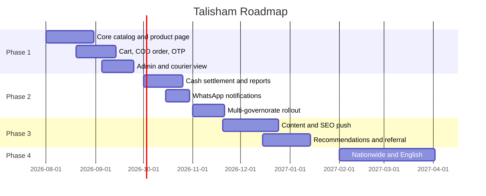

<div dir="rtl">

## 12. النمو (SEO عربي، تحليلات، إشعارات) وخارطة الطريق والمخاطر ومعايير النجاح

### 12.1 تحسين محركات البحث للعربية على بنية Astro

اختيار Astro لصفحات المحتوى قرار تسويقي بقدر ما هو تقني: كل صفحة منتج وفئة وعلامة تُولَّد ساكنة (static) وتُقدَّم من الحافة بلا وقت تشغيل JavaScript، فتصل إلى زاحف محرك البحث كاملة من أول طلب، وتصل إلى المستخدم على شبكة بطيئة قبل أن يفقد صبره.

**بنية الروابط**

| النوع | النمط | مثال |
|---|---|---|
| منتج | `/p/[slug]` | `/p/iphone-17-pro-max-256gb-titanium` |
| فئة | `/c/[slug]` | `/c/جوالات-ايفون` |
| علامة | `/b/[slug]` | `/b/samsung` |
| مقارنة | `/compare/[a]-vs-[b]` | `/compare/iphone-17-vs-galaxy-s26` |
| محتوى | `/blog/[slug]` | `/blog/كيف-تتحقق-من-أصالة-جهازك` |

قرار الـ slug: **لاتيني منقحر للمنتجات والعلامات** (أكثر أماناً في المشاركة عبر واتساب وفي الأنظمة القديمة)، و**عربي لصفحات الفئات والمحتوى** حيث تطابق الكلمة المفتاحية العربية نية البحث مباشرة. الروابط العربية تُرمَّز (percent-encoded) آلياً، ويُمنع تغيير أي slug منشور إلا مع إعادة توجيه 301 دائمة.

**قوالب الوسوم**

| الصفحة | العنوان | الوصف |
|---|---|---|
| منتج | `{الاسم} {السعة} {اللون} — السعر اليوم في سوريا \| تالي شام` | `اشترِ {الاسم} {السعة} بسعر {السعر}. {نوع الكفالة} {مدة الكفالة}، دفع عند الاستلام، توصيل إلى {المحافظة}. المواصفات الكاملة و{عدد} تقييماً.` |
| فئة | `{الفئة} في سوريا — أسعار محدَّثة اليوم \| تالي شام` | `تصفّح {عدد} جهازاً في {الفئة} مع الأسعار والمواصفات ومصدر الاستيراد والكفالة. دفع عند الاستلام في كل المحافظات المخدَّمة.` |

القوالب تُنفَّذ في `apps/site/src/lib/seo/meta.ts` وتُحقن عبر تخطيط Astro، وتُقصّ آلياً باحترام عرض الحروف العربية. وثلاث كلمات مفتاحية يجب أن تظهر طبيعياً في صفحة المنتج لأنها ما يبحث عنه المشتري هنا فعلياً: **السعر اليوم**، و**مصدر الجهاز/النسخة**، و**الكفالة**.

**البيانات المنظمة (Schema.org)**

```json
{
  "@context": "https://schema.org",
  "@type": "Product",
  "name": "آيفون 17 برو ماكس 256 جيجابايت",
  "image": ["https://cdn.talisham.com/p/apl-ip17pm-256-ti/1600.avif"],
  "brand": { "@type": "Brand", "name": "Apple" },
  "offers": {
    "@type": "Offer",
    "url": "https://talisham.com/p/iphone-17-pro-max-256gb-titanium",
    "priceCurrency": "USD",
    "price": "1199.00",
    "priceValidUntil": "2026-07-29",
    "availability": "https://schema.org/InStock",
    "itemCondition": "https://schema.org/NewCondition"
  },
  "aggregateRating": { "@type": "AggregateRating", "ratingValue": "4.7", "reviewCount": 128 }
}
```

قاعدتان تفرضهما طبيعة السوق: (1) العملة المعلنة في البيانات المنظمة يجب أن **تطابق العملة المعروضة افتراضياً في الصفحة**؛ فإن كان العرض الافتراضي بالليرة وجب إصدارها بالليرة، وإلا عُدَّت الصفحة مضلِّلة. (2) `priceValidUntil` قصير (24 ساعة) لأن سعر الصرف يتحرك — ويترتب على ذلك متطلب تقني صريح: **تحديث سعر الصرف يشغّل إعادة بناء تدريجية (incremental rebuild)** للصفحات الساكنة المتأثرة، وإلا بقيت الصفحة تعلن سعراً ميتاً. هذا الارتباط بين لوحة سعر الصرف وخط البناء موثَّق في القسمين 7 و11. ولا يحمل الكائن أي معلومة عن وسائل الدفع.

**خريطة الموقع وhreflang**: فهرس على `https://talisham.com/sitemap-index.xml` يُولَّد عند البناء عبر `@astrojs/sitemap`، مقسّماً إلى `sitemap-products-{n}.xml` (بحد أقصى 45,000 رابط للملف) و`sitemap-categories.xml` و`sitemap-brands.xml` و`sitemap-content.xml`، و`lastmod` مشتق من `products.updated_at`. المنتجات المنتهية نهائياً تُحذف من الخريطة وتُعاد توجيهها 301 إلى صفحة الموديل. الإنجليزية مؤجلة إلى مرحلة لاحقة، وعند إضافتها تُستخدم وسوم `hreflang` الثلاثة (`ar`, `en`, `x-default`) على مسار `/en/`.

**المحتوى محرك زيارات**: صفحات مقارنة مولَّدة آلياً بين الموديلات الشائعة، وأدلة قصيرة تجيب أسئلة السوق الحقيقية: «كيف تتحقق من أصالة الجهاز»، «ما الفرق بين النسخ ورموزها»، «كيف تقرأ نسبة صحة البطارية في جهاز مستعمل»، «ما الذي تغطيه كفالة المحل». هذه الأدلة ليست ترفاً تسويقياً، بل جواب مباشر على سبب التردد الأول في هذا السوق، وتخدم الثقة والفهرسة معاً.

**الأداء عامل ترتيب**: الميزانيات وحدودها الحمراء معرَّفة في القسم رقم 5 وتُفرض في التكامل المستمر (القسم رقم 11)، ولا تُكرَّر هنا. وهدف السنة الأولى تحسينها إلى LCP ≤ 2.0 ثانية وINP ≤ 180 مللي ثانية وCLS ≤ 0.05 وحزمة أولية ≤ 120 كيلوبايت — بوصفها **أهداف الشهر 12** لا حدوداً ملزِمة.

### 12.2 التحليلات ومخطط الأحداث

| الحدث | متى يُطلق | خصائص أساسية |
|---|---|---|
| `view_item_list` | عرض قائمة فئة أو نتائج بحث | `list_id`, `items[]`, `filters_applied` |
| `select_item` | نقر بطاقة منتج | `item_id`, `position`, `list_id` |
| `view_item` | فتح صفحة منتج | `item_id`, `variant_id`, `device_origin`, `condition`, `price_usd` |
| `add_to_cart` | إضافة متغيّر إلى السلة | `variant_id`, `qty`, `price_usd` |
| `begin_checkout` | بدء إدخال بيانات التسليم | `cart_value_usd`, `items_count` |
| `add_shipping_info` | اختيار المحافظة وطريقة الشحن | `governorate`, `shipping_method`, `fee_usd` |
| `purchase` | **إنشاء الطلب بنجاح** (لا التحصيل) | `order_no`, `value_usd`, `value_syp`, `fx_rate`, `payment_method: "COD"` |
| `order_confirmed` | نجاح مكالمة التأكيد | `order_no`, `attempts`, `hours_to_confirm` |
| `order_delivered` | التسليم والتحصيل | `order_no`, `collected_syp`, `days_to_deliver` |
| `order_refused` | رفض الاستلام | `order_no`, `reason_code`, `wasted_shipping_usd` |
| `whatsapp_click` | نقر زر التواصل | `page_type`, `item_id` |
| `fx_display_toggle` | تبديل العملة المعروضة | `from`, `to` |

الحدثان الأخيران لا يوجدان في مخططات التجارة الإلكترونية الجاهزة، لكنهما هنا من أهم ما يُقاس: أحدهما يقيس كم من الزيارات يتحوّل إلى محادثة بدل طلب، والآخر يقيس أي عملة يثق بها الزبون فعلياً.

**قيم المبالغ**: تُرسل بالدولار (`value_usd`) لأنه وحدة التخزين المرجعية، ومعها `value_syp` و`fx_rate` لحظة الحدث حتى تبقى التقارير التاريخية قابلة للتفسير رغم تحرك سعر الصرف. وأي تقرير يجمع مبيعات فترة طويلة يجب أن يستخدم الدولار، لأن جمع الليرات عبر الزمن بلا سعر صرف يعطي رقماً بلا معنى.

**الخصوصية والموافقة**: بانر موافقة من ثلاث طبقات (ضروري / تحليلي / تسويقي)؛ وقبل الموافقة تُرسل أحداث مجمّعة بلا معرّفات وبلا كوكيز إعلانية. لا يُرسل رقم الجوال ولا العنوان إلى أي مزوّد تحليلات — يُستبدل بـ `user_pseudo_id` و`hashed_user_id` (SHA-256 مع ملح خادمي). وحالة الموافقة تُخزَّن 180 يوماً في `consent_logs` (راجع القسم رقم 9).

### 12.3 قنوات الاكتساب في السوق السوري

البحث في جوجل قناة مهمة لكنها ليست الأولى هنا؛ الشراء يبدأ غالباً من منشور أو محادثة. والخطة تعامل ذلك بوصفه الواقع لا الاستثناء:

| القناة | الدور | التنفيذ التقني المطلوب |
|---|---|---|
| فيسبوك وإنستغرام | الاكتشاف الأول وبناء السمعة | صور منتج جاهزة للنشر تُولَّد آلياً بأبعاد المنصات، ورابط قصير لكل منتج، ووسوم `og:` دقيقة لأن معاينة الرابط هي الإعلان فعلياً |
| واتساب | التحوّل وإغلاق البيع والدعم | زر «تواصل عبر واتساب» في صفحة المنتج برسالة مُعبّأة تتضمن المنتج والمتغيّر ورابط الصفحة، وقياس النقر حدثاً |
| تيليغرام | قناة عروض ومتابعة | نشر آلي عند إضافة منتج أو انخفاض سعر |
| البحث العضوي | نية شراء عالية وأثر طويل الأمد | كل ما في 12.1 |
| الإحالة الشفهية | أقوى قناة ثقة في هذا السوق | كود إحالة بسيط يمنح خصماً للطرفين ويُقاس في `orders` |

ملاحظة صريحة: ترتيب هذه القنوات وأوزانها مبني على ما رصدته دراسة القسم رقم 13 بدرجات ثقة متفاوتة، ويجب إعادة تقييمه بعد أول 500 طلب ببيانات المتجر نفسه لا بالتقديرات.

### 12.4 الإشعارات والاحتفاظ

| القناة | الاستخدام | التوقيت | سياسة عدم الإزعاج |
|---|---|---|---|
| واتساب | تأكيد الطلب، الشحن، الخروج للتوصيل، التسليم | فوري عند تغيّر الحالة | لا إرسال بين 22:00 و09:00 بتوقيت دمشق إلا لحالة الخروج للتوصيل |
| SMS | القناة الاحتياطية عند فشل واتساب، ورمز التحقق | فوري | النافذة الزمنية نفسها |
| Web Push | سلة متروكة، تنبيه توفر، انخفاض سعر | بعد 60 دقيقة ثم بعد 24 ساعة | حد أقصى 4 رسائل أسبوعياً |
| بريد إلكتروني | الفاتورة وسجل الطلب | عند التسليم | اختياري تماماً |

**قيد منصّة يجب ألا يُتجاهل**: إشعارات المتصفح (Web Push) لا تعمل داخل تبويب Safari على iOS؛ إذ تشترط تثبيت تطبيق الويب على الشاشة الرئيسية (iOS ≥ 16.4) وطلب الإذن من إيماءة مستخدم. لذلك Web Push قناة **ثانوية** في هذه الخطة، وسلاسل الاحتفاظ الأساسية تمر عبر واتساب، ومؤشر الاشتراك يُقاس بوصفه نسبة من زوار أندرويد ومن مثبّتي تطبيق الويب على iOS، لا نسبة من كل الزوار.

### 12.5 المراجعات والثقة

التقييم لا يُقبل إلا من طلب مسلَّم فعلياً (`DELIVERED`)، ويُشجَّع إرفاق صورة. وثلاثة عناصر ثقة تظهر في صفحة المنتج ويُقاس أثرها على التحويل: **نتيجة فحص IMEI** معروضة للعميل، و**صور حقيقية للجهاز نفسه** في حالتَي المستعمل والمجدد، و**نص الكفالة مكتوباً** لا مجرد أيقونة. أما برنامج الولاء والنقاط فخارج نطاق السنة الأولى (راجع القسم رقم 1).

### 12.6 خارطة الطريق التنفيذية

| المرحلة | المدة | النطاق | معيار الخروج |
|---|---|---|---|
| 1 — نواة تعمل | 8–10 أسابيع | كتالوج بمتغيّرات، بحث أساسي، صفحة منتج، سلة، طلب بالدفع عند الاستلام، دخول OTP، لوحة إدارة مصغّرة، واجهة مندوب أولية، عربية فقط، محافظة واحدة | 100 طلب حقيقي مكتمل، صفر بيع زائد، ومعدل رفض استلام مقيس |
| 2 — تشغيل كامل | 6–8 أسابيع | التسويات النقدية، التقارير، مرشحات موسّعة، المقارنة، إشعارات واتساب، التوسع إلى ثلاث محافظات، تطبيق الويب والعمل دون اتصال | زمن تجهيز وسطي < 24 ساعة، فجوة تسوية صفر، تغطية ثلاث محافظات |
| 3 — نمو | 8–10 أسابيع | صفحات المحتوى والمقارنات، التوصيات، برنامج الإحالة، تعميق SEO، أتمتة الاستيراد الجماعي، تعميق الاحتفاظ عبر الإشعارات | 40% من الزيارات عضوية، وتكرار شراء 15% |
| 4 — توسّع | مستمر | تغطية كل المحافظات، الإنجليزية، خط منفصل للأجهزة المجددة، تحسين التوصيات | تغطية وطنية، ومعدل رفض استلام تحت الهدف |



الجدول أعلاه يفترض فريقاً بالحجم المذكور في 12.7 وعملاً متصلاً؛ وانقطاع الكهرباء والإنترنت عامل تأخير حقيقي يجب حسابه بهامش لا يقل عن 20% على كل مرحلة.

### 12.7 تركيبة الفريق المقترحة

| الدور | العدد | يبدأ من | المسؤولية |
|---|---|---|---|
| مهندس واجهات (Astro/React/RTL) | 1–2 | المرحلة 1 | الموقع والتطبيق، نظام Liquid Glass، الأداء، إمكانية الوصول |
| مهندس خلفية (NestJS/PostgreSQL) | 1–2 | المرحلة 1 | الواجهة البرمجية، المخزون والطلبات، التسويات |
| مسؤول تشغيل (نصف وقت) | 1 | المرحلة 1 | البنية، النشر، المراقبة، دورة الصيانة |
| مسؤول كتالوج | 1 | المرحلة 1 | إدخال المنتجات وجودة البيانات والصور |
| موظف تأكيد ودعم | 1–2 | المرحلة 1 | مكالمات التأكيد والدعم عبر واتساب |
| مندوبو توصيل | حسب المحافظة | المرحلة 1 | التوصيل والتحصيل |

الحد الأدنى لإطلاق المرحلة الأولى: مهندسان + مسؤول كتالوج + موظف تأكيد + مندوب واحد. أما توفر الكوادر التقنية محلياً وكلفتها فمن المسائل التي تتناولها دراسة القسم رقم 13.

### 12.8 سجل المخاطر

| الخطر | الاحتمال | الأثر | التخفيف |
|---|---|---|---|
| تقلّب سعر الصرف يأكل الهامش | عالٍ جداً | عالٍ | تسعير مرجعي بالدولار، تثبيت السعر 48 ساعة فقط، إعادة تسعير قبل الشحن، مراجعة يومية للسعر المعروض |
| انقطاع الكهرباء والإنترنت | عالٍ | متوسط–عالٍ | عمل دون اتصال في الواجهة وواجهة المندوب، قائمة طلبات قابلة للطباعة، وضع الحد الأدنى، هوامش زمنية في الخطة |
| رفض الاستلام وتكلفة الشحن المهدور | عالٍ | عالٍ | تأكيد هاتفي إلزامي، سقف لقيمة الطلب، حد للطلبات المفتوحة، قائمة تقييد، وقياس التكلفة مؤشراً |
| تعذّر فتح حساب لدى مزوّد أو سداد اشتراكه | متوسط | عالٍ | خطة بديلة جاهزة وقابلية نقل كاملة بـ Docker (القسم 11)، ومتابعة وضع العقوبات (القسم 13) |
| تعذّر واتساب التجاري أو تقييده | متوسط | عالٍ | قناة SMS احتياطية مصمَّمة من البداية، وتصميم لا يعتمد على قناة واحدة |
| تقطّع التوريد وتذبذب توفر الأجهزة | عالٍ | متوسط | تنبيه التوفر، الطلب المسبق، إظهار البدائل المتوافقة، دورة مخزون قصيرة |
| فقدان الثقة بسبب جهاز غير مطابق | متوسط | عالٍ جداً | فحص IMEI موثَّق، صور حقيقية، سياسة إرجاع واضحة، كفالة مكتوبة |
| سرقة أو ضياع في نقل بضاعة ثمينة أو نقد | متوسط | عالٍ | سقف نقدي لكل مندوب، تسوية يومية، توثيق التسليم بصورة أو توقيع، تقييد الصلاحيات |
| تسرّب بيانات شخصية | منخفض | عالٍ جداً | تشفير في النقل والسكون، تقليل البيانات، مراجعة أمنية دورية، خطة استجابة للحوادث |
| تراكم الديون التقنية | عالٍ | متوسط | 15% من كل دورة عمل للصيانة، وبوابات تغطية في CI، ودورة الصيانة الأسبوعية (القسم 11) |

### 12.9 معايير النجاح للسنة الأولى

| المؤشر | الشهر 3 | الشهر 12 | المصدر |
|---|---|---|---|
| طلبات مكتملة شهرياً | 150 | 1,200 | `orders` |
| معدل التحويل على الجوال | 0.8% | 2.0% | التحليلات |
| **معدل رفض الاستلام** | ≤ 15% | ≤ 8% | `orders.status` |
| **فجوة التسوية النقدية** | صفر غير مفسَّر | صفر غير مفسَّر | `cash_settlements` |
| متوسط قيمة الطلب (بالدولار مرجعياً) | 180 | 240 | `orders` |
| زمن التأكيد الهاتفي الوسطي | < 6 ساعات | < 2 ساعة | `orders.confirmed_at` |
| زمن التسليم داخل المدينة | < 48 ساعة | < 24 ساعة | `shipments` |
| نسبة الزيارات العضوية | 15% | 40% | التحليلات |
| تكرار الشراء خلال 6 أشهر | 5% | 18% | `orders` |
| LCP الميداني للمئين 75 | ضمن الحد الأحمر | ضمن الهدف | RUM |
| تقييمات موثَّقة | 60 | 700 | `reviews` |

المؤشران بالخط العريض هما مقياس صحة نموذج الدفع عند الاستلام تحديداً: الأول يقيس كم من الشحن يُهدر، والثاني يقيس ما إذا كان النقد المحصَّل يصل كاملاً. ومتجر بهذا النموذج قد يبدو ناجحاً في المبيعات وهو يخسر في هذين الرقمين.

</div>
