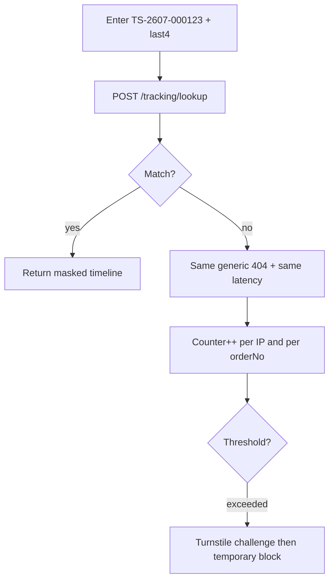

<div dir="rtl">

## 14. حساب العميل وخدمة العملاء والدعم

### 14.1 نطاق الفصل ومبدأ الثقة

الأقسام 6 و7 و8 تغطّي الاكتشاف والشراء والتسليم. هذا القسم يغطّي ما بعدها: العميل بوصفه **مستخدماً دائماً** لا زائراً عابراً. المبدأ الحاكم مستمد من القسم 13: الثقة بالشراء عن بُعد منخفضة، ولذلك كل شاشة هنا مصمَّمة للإجابة عن سؤال واحد قبل غيره — «أين طلبي، ومن أكلّم إن حصل خطأ؟». لهذا: التتبع متاح بلا حساب، وقناة الدعم الأساسية واتساب لأنها القناة التي يستخدمها السوق فعلاً، وكل تذكرة قابلة للربط بطلب أو بجهاز عبر IMEI. الجداول المضافة هنا **امتداد لنموذج البيانات في القسم 3** وتلتزم اصطلاحاته (UUIDv7، `snake_case` جمع، `JSONB {ar,en}`، الوسائط في `media` وحدها). حدود المعدل لكل مسار جديد تُسجَّل حصراً في جدول 9.5، وميزانيات الأداء في القسم 5.

### 14.2 منطقة الحساب في `/app`

| # | الشاشة | المسار | الوظيفة | ملاحظة تنفيذية |
|---|---|---|---|---|
| 1 | الملف الشخصي | `/app/account` | الاسم، لغة العرض، عملة العرض، الجوال (تغييره يتطلب OTP على الرقم الجديد) | الرقم مفتاح الهوية؛ لا يُغيَّر بلا تحقق |
| 2 | دفتر العناوين | `/app/account/addresses` | إضافة/تعديل/حذف/تعيين افتراضي، حقل «معلم قريب» إلزامي | نسخ العنوان إلى الطلب وقت التأكيد (القسم 8) |
| 3 | طلباتي | `/app/orders` | قائمة بـ `TS-YYMM-NNNNNN` والحالة والمبلغ | `total_syp` و`fx_rate` المثبّتان يُعرضان كما وقت التأكيد |
| 4 | تفاصيل الطلب والتتبع | `/app/orders/:orderNo` | خط زمني للحالات، اسم المندوب أو مكتب النقل و`waybill_no`، المبلغ المطلوب نقداً | يعمل من ذاكرة TanStack Query عند انقطاع الشبكة مع شارة «بيانات محفوظة» |
| 5 | إعادة الطلب بنقرة | زر داخل 4 | `POST /orders/{orderNo}/reorder` يبني سلة جديدة | يتحقق من التوفر والسعر الحالي ويعرض فروقات صريحة قبل المتابعة |
| 6 | المفضلة | `/app/wishlist` | متغيّرات محفوظة (`wishlists` من 3.x) | من هنا يُفعَّل تنبيه السعر أو التوفر بنقرة |
| 7 | المقارنات المحفوظة | `/app/account/comparisons` | حفظ `compareToken` باسم مختار وإعادة فتحه | مشاركة الرابط عبر واتساب سلوك شائع في السوق |
| 8 | التنبيهات | `/app/account/alerts` | إدارة `price_alerts` و`stock_alerts` وإلغاؤها | 14.6 |
| 9 | تفضيلات الإشعارات | `/app/account/notifications` | تفعيل/تعطيل لكل قناة ولكل نوع | 14.3 |
| 10 | الأجهزة والجلسات | `/app/account/sessions` | قائمة الجلسات وإنهاء واحدة أو **الخروج من كل الأجهزة** | 14.3 |
| 11 | تذاكري | `/app/support` | فتح تذكرة، متابعة الردود، إغلاق | 14.7 |
| 12 | حذف الحساب | `/app/account/delete` | طلب حذف مع شرح ما يُحذف وما يبقى | 14.3 |

القاعدة البصرية: كل هذه الشاشات SPA خلف مصادقة، فلا قيمة SEO لها ولا تُفهرس، والأسطح الزجاجية فيها محصورة بشريط الحالة العلوي وبطاقة الطلب فقط، مع البديل الصلب على الأجهزة الضعيفة كما في القسم 5.

### 14.3 التفضيلات والجلسات وحذف الحساب

تفضيلات الإشعار تُخزَّن **لكل نوع ولكل قناة** لا كخيار واحد. الترتيب الافتراضي واتساب ← SMS ← بريد، وWeb Push ثانوي. إشعارات دورة حياة الطلب (تأكيد، خروج للتوصيل، تسليم) **إلزامية على قناة واحدة على الأقل** ولا يمكن تعطيلها كلياً؛ التسويقية اختيارية بالكامل.

«تسجيل الخروج من كل الأجهزة» يُبطل كل رموز التحديث للمستخدم ويرفع `token_version` في `users`، فتسقط رموز الوصول القصيرة خلال دقائق (القسم 9).

طلب حذف الحساب (`account_deletion_requests`) ينفَّذ بعد **مهلة 7 أيام** قابلة للإلغاء من نفس الشاشة، ثم يُنفَّذ **إخفاء هوية** لا حذفاً فيزيائياً: تُمسح `users.full_name` والبريد وتُستبدل أرقام الجوال بقيمة مُلبّدة (hash) ذات ملح ثابت، وتُحذف `addresses` و`price_alerts` و`stock_alerts` و`wishlists` وتفضيلات الإشعار. **يُحتفظ** بـ `orders` و`order_items` و`shipments` و`cash_settlements` و`refunds` و`device_units` و`audit_logs` لأنها سجلات مالية وضمانية (الاحتفاظ التشغيلي في 9.6)، ويُستبدل فيها ربط المستخدم بمعرّف مجهول. المراجعات والأسئلة المنشورة تبقى منشورة باسم «عميل تالي شام». يُرفض الطلب مؤقتاً إذا كان للعميل طلب نشط قبل `DELIVERED` أو مطالبة ضمان مفتوحة، ويُبلَّغ بالسبب.

### 14.4 تتبع الطلب بلا حساب

كثير من الطلبات تُقدَّم لأول مرة بلا رغبة في إنشاء حساب، وكثير من المستخدمين يفقدون الوصول إلى الجهاز. الصفحة العامة `/app/track` تطلب **رقم الطلب + آخر أربعة أرقام من الجوال** فقط.



ضوابط منع التعداد إلزامية: استجابة واحدة موحّدة `TRACKING_NOT_FOUND` للحالتين (رقم غير موجود / رقم لا يطابق)، مقارنة بزمن ثابت (constant-time) للأرقام الأربعة، تأخير صناعي يوحّد زمن الاستجابة، عدّاد فشل مزدوج على IP وعلى `order_no` في Redis، ثم تحدٍّ آلي فبلوك مؤقت. الحدود العددية في 9.5. الاستجابة **مقنّعة**: الحالة والخط الزمني والمحافظة والمبلغ المستحق فقط — بلا عنوان تفصيلي ولا اسم كامل ولا IMEI، ورقم الجوال بصيغة `+963 9•• ••• •23`. الصفحة تعمل بلا رمز وصول، وتُقدَّم من قشرة Astro خفيفة تُحمّل جزيرة React واحدة.

### 14.5 أسئلة المنتج والمراجعات والإشراف

**الأسئلة (`product_questions`)**: يسأل أي مستخدم مسجَّل (لا زائر — لمنع البريد المزعج)، ويجيب فريق `SUPPORT` أو `CATALOG_ADMIN` رسمياً، ويجوز لعميل **اشترى المنتج فعلاً** أن يقترح إجابة تمرّ بالإشراف نفسه. السير: `PENDING → PUBLISHED | REJECTED` مع سبب رفض من قائمة ثابتة. الأسئلة المنشورة تُدرج في صفحة المنتج الساكنة المولَّدة من Astro مع مخطط `FAQPage` في JSON-LD، وتُلتقط بإعادة توليد الصفحة عند النشر (نفس آلية القسم 7)، فلا تُحمَّل عبر جافاسكربت على الشبكة البطيئة.

**المراجعات**: شرط النشر هو **شراء مسلَّم** — لا تُقبل مراجعة إلا بربط `order_item_id` لطلب في `DELIVERED` ومضى على تسليمه 3 أيام على الأقل. يُسمح بإرفاق حتى 4 صور تُخزَّن في `media` بعد إعادة ترميز إلى WebP وتجريد بيانات EXIF. طابور الإشراف في `/moderation` بلوحة الإدارة (القسم 10): فحص آلي مسبق بقائمة كلمات محظورة قابلة للتحرير (`moderation_terms`) يرفع الراية دون رفض تلقائي، ثم قرار بشري خلال يوم عمل واحد. الإبلاغ عن مراجعة في `review_reports` بأسباب `SPAM|OFFENSIVE|FAKE|WRONG_PRODUCT|PRIVACY`، وثلاثة بلاغات مقبولة تُخفي المراجعة مؤقتاً حتى المراجعة. رد المتجر الرسمي يُخزَّن في `reviews.merchant_reply` و`merchant_reply_at` ويُعرض تحت المراجعة موسوماً «رد تالي شام».

### 14.6 تنبيهات التوفر وانخفاض السعر

`stock_alerts` يُشغَّل حين ينتقل `inventory_levels.on_hand - reserved` من صفر إلى موجب، و`price_alerts` حين ينخفض `price_usd_cents` بمقدار `threshold_bp` أو أكثر عن السعر وقت الاشتراك. **المقارنة بالدولار حصراً** حتى لا يولّد تغيّر سعر الصرف تنبيهات كاذبة، ونص الرسالة يعرض الليرة مقرَّبة لأقرب 1000. حد أقصى إشعار واحد لكل تنبيه كل 24 ساعة، والتنبيه يُغلق تلقائياً بعد الإرسال أو بعد 90 يوماً من الخمول.

### 14.7 الدعم: التذاكر واتفاقية مستوى الخدمة

قناة الدخول الأساسية واتساب. رسالة العميل الأولى ينشئها العامل (worker) كتذكرة تلقائياً بـ `channel='WHATSAPP'` و`external_thread_id` = معرّف المحادثة، وتُربط بالمستخدم عبر رقم الجوال إن وُجد. الوكيل يرد من لوحة الإدارة، والرد يُرسَل إلى واتساب ويُخزَّن في `ticket_messages` — فلا يوجد سجل خارج النظام.

| الحالة | المعنى | تحسب ضمن SLA |
|---|---|---|
| `NEW` | واردة بلا تعيين | نعم |
| `OPEN` | معيَّنة ويجري العمل | نعم |
| `PENDING_CUSTOMER` | بانتظار رد العميل | لا (يُجمَّد العداد) |
| `ESCALATED` | مصعَّدة إلى مدير العمليات | نعم |
| `RESOLVED` | حُلَّت، تُغلق آلياً بعد 72 ساعة | لا |
| `CLOSED` | مغلقة | لا |

| الأولوية | أمثلة | أول رد | الحل |
|---|---|---|---|
| `URGENT` | جهاز مسلَّم لا يعمل، خطأ في مبلغ محصَّل | 30 دقيقة | 4 ساعات عمل |
| `HIGH` | طلب لم يصل بعد موعده، طلب إلغاء قبل الشحن | ساعتان | يوم عمل |
| `NORMAL` | سؤال عن ضمان أو توافق ملحق | 4 ساعات | يومان عمل |
| `LOW` | استفسار عام، اقتراح | يوم عمل | 5 أيام عمل |

العداد يعمل ضمن **ساعات العمل** (السبت–الخميس 10:00–20:00 بتوقيت دمشق) لا على مدار الساعة، لأن انقطاع الكهرباء والاتصال يجعل التعهّد 24/7 غير قابل للوفاء. التصعيد آلي عند تجاوز نصف مهلة أول رد (تنبيه للوكيل) وعند تجاوزها (تعيين لمدير العمليات وتغيير الحالة إلى `ESCALATED`).

كل تذكرة قابلة للربط بـ `order_id` أو بـ `device_unit_id` (IMEI) أو بـ `warranty_claim_id` (القسم 8) — الربط بالجهاز ضروري لأن ملكية الجهاز تنتقل كثيراً في السوق المحلي. قوالب الردود في `ticket_macros` بنص `JSONB {ar,en}` ومتغيّرات `{{orderNo}} {{courierName}} {{etaDate}}`، وأكثرها استعمالاً: «طلبك خرج للتوصيل»، «تعذّر الاتصال — محاولة ثانية»، «شرح شرط الضمان»، «تثبيت سعر الصرف 48 ساعة».

### 14.8 مركز المساعدة

يُقدَّم بالكامل من `apps/site` (Astro) كصفحات ساكنة تحت `/help/*` و`/help/faq`: أسئلة شائعة قابلة للبحث محلياً (فهرس JSON مبني وقت البناء، بلا استدعاء شبكة)، وصفحات إرشادية: «كيف أطلب بالدفع عند الاستلام»، «كيف يُحسب السعر بالليرة»، «كيف أفحص IMEI عند الاستلام»، «سياسة الإرجاع خلال 3 أيام»، «الشحن بين المحافظات». كل صفحة تحمل JSON-LD مناسباً وزر «هل كانت مفيدة؟» يكتب في `help_article_feedback`، والأسئلة التي تفشل نتائجها تُسجَّل لتغذية 14.9.

### 14.9 مؤشرات الدعم

| المؤشر | التعريف | الهدف |
|---|---|---|
| FRT | وسيط زمن أول رد بشري ضمن ساعات العمل | ≤ 60 دقيقة |
| FCR | نسبة التذاكر المحلولة برسالة وكيل واحدة بلا إعادة فتح | ≥ 55% |
| CSAT | سؤال واحد بعد الإغلاق عبر واتساب: «هل حُلَّت مشكلتك؟ 1–5» | ≥ 4.3 |
| Reopen rate | نسبة `RESOLVED → OPEN` خلال 7 أيام | ≤ 8% |
| Contact rate | تذاكر لكل 100 طلب مسلَّم | ≤ 12 |

توزيع `contact_reason` هو المخرج الأهم: تكرار «أين طلبي» يعني ضعف إشعارات التتبع، وتكرار «السعر تغيّر» يعني خللاً في عرض تثبيت سعر الصرف، وتكرار «الجهاز غير مطابق» يعني وصفاً ناقصاً في الكتالوج. يُراجَع أعلى ثلاثة أسباب أسبوعياً في لوحة `/reports/support` (القسم 10) وتُحوَّل إلى مهام منتج لا إلى تدريب وكلاء.

### 14.10 الجداول الجديدة (امتداد للقسم 3)

```sql
CREATE TYPE ticket_status   AS ENUM ('NEW','OPEN','PENDING_CUSTOMER','ESCALATED','RESOLVED','CLOSED');
CREATE TYPE ticket_priority AS ENUM ('LOW','NORMAL','HIGH','URGENT');
CREATE TYPE ticket_channel  AS ENUM ('WHATSAPP','PHONE','WEB','EMAIL','ADMIN');

CREATE TABLE support_tickets (
  id UUID PRIMARY KEY, ticket_no TEXT NOT NULL UNIQUE,           -- TK-YYMM-NNNNNN
  user_id UUID NULL REFERENCES users(id), phone TEXT NOT NULL,
  order_id UUID NULL REFERENCES orders(id),
  device_unit_id UUID NULL REFERENCES device_units(id),
  warranty_claim_id UUID NULL REFERENCES warranty_claims(id),
  channel ticket_channel NOT NULL, external_thread_id TEXT NULL,
  subject JSONB NULL, contact_reason TEXT NOT NULL,
  status ticket_status NOT NULL DEFAULT 'NEW',
  priority ticket_priority NOT NULL DEFAULT 'NORMAL',
  assignee_id UUID NULL REFERENCES users(id),
  first_response_at TIMESTAMPTZ NULL, resolved_at TIMESTAMPTZ NULL, closed_at TIMESTAMPTZ NULL,
  sla_first_response_due_at TIMESTAMPTZ NULL, sla_resolution_due_at TIMESTAMPTZ NULL,
  sla_breached BOOLEAN NOT NULL DEFAULT FALSE,
  csat_score SMALLINT NULL CHECK (csat_score BETWEEN 1 AND 5), csat_comment TEXT NULL,
  created_at TIMESTAMPTZ NOT NULL DEFAULT now(), updated_at TIMESTAMPTZ NOT NULL
);
CREATE INDEX ON support_tickets (status, priority, created_at DESC);
CREATE INDEX ON support_tickets (phone); CREATE INDEX ON support_tickets (order_id);

CREATE TABLE ticket_messages (
  id UUID PRIMARY KEY, ticket_id UUID NOT NULL REFERENCES support_tickets(id) ON DELETE CASCADE,
  author_type TEXT NOT NULL CHECK (author_type IN ('CUSTOMER','AGENT','SYSTEM')),
  author_id UUID NULL REFERENCES users(id), body TEXT NOT NULL,
  is_internal_note BOOLEAN NOT NULL DEFAULT FALSE, macro_id UUID NULL REFERENCES ticket_macros(id),
  media_ids UUID[] NOT NULL DEFAULT '{}', delivery_channel ticket_channel NULL,
  delivery_status TEXT NULL, created_at TIMESTAMPTZ NOT NULL DEFAULT now()
);
CREATE INDEX ON ticket_messages (ticket_id, created_at);

CREATE TABLE ticket_macros (
  id UUID PRIMARY KEY, code TEXT NOT NULL UNIQUE, title JSONB NOT NULL, body JSONB NOT NULL,
  variables TEXT[] NOT NULL DEFAULT '{}', is_active BOOLEAN NOT NULL DEFAULT TRUE,
  usage_count INTEGER NOT NULL DEFAULT 0, created_at TIMESTAMPTZ NOT NULL DEFAULT now()
);

-- التعريف الكامل للجدول المشار إليه اختصاراً بـ questions في 3.x؛ الاسم القانوني product_questions
CREATE TABLE product_questions (
  id UUID PRIMARY KEY, product_id UUID NOT NULL REFERENCES products(id),
  user_id UUID NOT NULL REFERENCES users(id), body TEXT NOT NULL,
  answer_body TEXT NULL, answer_source TEXT NULL CHECK (answer_source IN ('STAFF','CUSTOMER')),
  answered_by UUID NULL REFERENCES users(id), answered_at TIMESTAMPTZ NULL,
  status TEXT NOT NULL DEFAULT 'PENDING' CHECK (status IN ('PENDING','PUBLISHED','REJECTED')),
  reject_reason TEXT NULL, helpful_count INTEGER NOT NULL DEFAULT 0,
  created_at TIMESTAMPTZ NOT NULL DEFAULT now(), updated_at TIMESTAMPTZ NOT NULL
);
CREATE INDEX ON product_questions (product_id) WHERE status = 'PUBLISHED';

CREATE TABLE review_reports (
  id UUID PRIMARY KEY, review_id UUID NOT NULL REFERENCES reviews(id) ON DELETE CASCADE,
  reporter_id UUID NULL REFERENCES users(id), reporter_ip INET NULL,
  reason TEXT NOT NULL CHECK (reason IN ('SPAM','OFFENSIVE','FAKE','WRONG_PRODUCT','PRIVACY')),
  note TEXT NULL, status TEXT NOT NULL DEFAULT 'OPEN' CHECK (status IN ('OPEN','ACCEPTED','DISMISSED')),
  resolved_by UUID NULL REFERENCES users(id), resolved_at TIMESTAMPTZ NULL,
  created_at TIMESTAMPTZ NOT NULL DEFAULT now(),
  UNIQUE (review_id, reporter_id)
);

CREATE TABLE price_alerts (
  id UUID PRIMARY KEY, user_id UUID NOT NULL REFERENCES users(id),
  variant_id UUID NOT NULL REFERENCES product_variants(id),
  base_price_usd_cents BIGINT NOT NULL, threshold_bp INTEGER NOT NULL DEFAULT 500,
  is_active BOOLEAN NOT NULL DEFAULT TRUE, last_notified_at TIMESTAMPTZ NULL,
  expires_at TIMESTAMPTZ NOT NULL, created_at TIMESTAMPTZ NOT NULL DEFAULT now(),
  UNIQUE (user_id, variant_id)
);

CREATE TABLE stock_alerts (
  id UUID PRIMARY KEY, user_id UUID NULL REFERENCES users(id), phone TEXT NOT NULL,
  variant_id UUID NOT NULL REFERENCES product_variants(id),
  is_active BOOLEAN NOT NULL DEFAULT TRUE, notified_at TIMESTAMPTZ NULL,
  expires_at TIMESTAMPTZ NOT NULL, created_at TIMESTAMPTZ NOT NULL DEFAULT now(),
  UNIQUE (phone, variant_id)
);

CREATE TABLE notification_preferences (
  id UUID PRIMARY KEY, user_id UUID NOT NULL REFERENCES users(id) ON DELETE CASCADE,
  event_type TEXT NOT NULL,                                      -- ORDER_STATUS | ALERTS | SUPPORT | MARKETING
  whatsapp BOOLEAN NOT NULL DEFAULT TRUE, sms BOOLEAN NOT NULL DEFAULT TRUE,
  email BOOLEAN NOT NULL DEFAULT FALSE, web_push BOOLEAN NOT NULL DEFAULT FALSE,
  updated_at TIMESTAMPTZ NOT NULL, UNIQUE (user_id, event_type)
);

CREATE TABLE account_deletion_requests (
  id UUID PRIMARY KEY, user_id UUID NOT NULL REFERENCES users(id),
  reason TEXT NULL, status TEXT NOT NULL DEFAULT 'PENDING'
    CHECK (status IN ('PENDING','CANCELLED','BLOCKED','COMPLETED')),
  block_reason TEXT NULL, execute_after TIMESTAMPTZ NOT NULL,
  executed_at TIMESTAMPTZ NULL, created_at TIMESTAMPTZ NOT NULL DEFAULT now()
);

CREATE TABLE help_articles (
  id UUID PRIMARY KEY, slug TEXT NOT NULL UNIQUE, category TEXT NOT NULL,
  title JSONB NOT NULL, body_md JSONB NOT NULL, keywords TEXT[] NOT NULL DEFAULT '{}',
  is_faq BOOLEAN NOT NULL DEFAULT FALSE, sort_order INTEGER NOT NULL DEFAULT 0,
  published_at TIMESTAMPTZ NULL, updated_at TIMESTAMPTZ NOT NULL
);

CREATE TABLE help_article_feedback (
  id UUID PRIMARY KEY, article_id UUID NOT NULL REFERENCES help_articles(id) ON DELETE CASCADE,
  is_helpful BOOLEAN NOT NULL, search_query TEXT NULL, created_at TIMESTAMPTZ NOT NULL DEFAULT now()
);

CREATE TABLE moderation_terms (
  id UUID PRIMARY KEY, term TEXT NOT NULL UNIQUE, lang CHAR(2) NOT NULL DEFAULT 'ar',
  severity SMALLINT NOT NULL DEFAULT 1, is_active BOOLEAN NOT NULL DEFAULT TRUE
);
```

### 14.11 مسارات API الجديدة

| Endpoint | Method | الوصف | الصلاحية |
|---|---|---|---|
| `/me/addresses/{id}/default` | PUT | تعيين العنوان الافتراضي | `addresses:write:own` |
| `/me/sessions` | GET | قائمة الجلسات والأجهزة | `auth:token:own` |
| `/me/sessions` | DELETE | تسجيل الخروج من كل الأجهزة | `auth:token:own` |
| `/me/notification-preferences` | GET / PUT | التفضيلات لكل نوع وقناة | `profile:write:own` |
| `/me/comparisons` | GET / POST / DELETE | المقارنات المحفوظة بـ `compareToken` | `profile:write:own` |
| `/me/alerts/price` | GET / POST | إنشاء وقائمة تنبيهات السعر | `alerts:write:own` |
| `/me/alerts/stock` | GET / POST | إنشاء وقائمة تنبيهات التوفر | `alerts:write:own` |
| `/me/alerts/{id}` | DELETE | إلغاء تنبيه | `alerts:write:own` |
| `/orders/{orderNo}/reorder` | POST | بناء سلة من طلب سابق (`Idempotency-Key`) | `orders:read:own` |
| `/tracking/lookup` | POST | تتبع بلا حساب: `{orderNo, phoneLast4}` | عام (بلا رمز) |
| `/catalog/products/{id}/questions` | GET / POST | الأسئلة المنشورة / طرح سؤال | `catalog:read:any` / `questions:write:own` |
| `/questions/{id}/answers` | POST | اقتراح إجابة من مشترٍ موثّق | `questions:write:own` |
| `/reviews/{id}/reports` | POST | الإبلاغ عن مراجعة | `reviews:report:own` |
| `/support/tickets` | GET / POST | تذاكري / فتح تذكرة | `tickets:read:own` / `tickets:write:own` |
| `/support/tickets/{ticketNo}` | GET | تفاصيل تذكرة ورسائلها | `tickets:read:own` |
| `/support/tickets/{ticketNo}/messages` | POST | إضافة رسالة أو مرفق | `tickets:write:own` |
| `/support/tickets/{ticketNo}/csat` | POST | تقييم بعد الإغلاق (رابط موقّع صالح 7 أيام) | عام موقّع |
| `/help/articles` | GET | مقالات ومقالات FAQ لبناء Astro | `help:read:any` |
| `/help/articles/{slug}/feedback` | POST | «هل كانت مفيدة؟» + استعلام البحث الفاشل | `help:read:any` |
| `/admin/questions` | GET | طابور أسئلة بانتظار الاعتماد | `questions:moderate:any` |
| `/admin/questions/{id}` | PATCH | نشر/رفض/إجابة رسمية | `questions:moderate:any` |
| `/admin/reviews/{id}/reply` | POST | رد المتجر الرسمي | `reviews:moderate:any` |
| `/admin/reviews/reports` | GET / PATCH | معالجة بلاغات المراجعات | `reviews:moderate:any` |
| `/admin/tickets` | GET | طابور التذاكر بفلاتر الحالة والأولوية وخرق SLA | `tickets:read:any` |
| `/admin/tickets/{id}` | PATCH | تعيين، أولوية، حالة، تصعيد | `tickets:write:any` |
| `/admin/tickets/{id}/messages` | POST | رد الوكيل أو ملاحظة داخلية | `tickets:write:any` |
| `/admin/ticket-macros` | GET / POST / PATCH | إدارة قوالب الردود | `tickets:write:any` |
| `/admin/reports/support` | GET | FRT وFCR وCSAT وتوزيع أسباب التواصل | `reports:view:any` |

مثال استجابة التتبع بلا حساب:

```json
{
  "orderNo": "TS-2607-000123",
  "status": "OUT_FOR_DELIVERY",
  "governorate": "دمشق",
  "shippingMethod": "COURIER_INTRACITY",
  "amountDueSyp": 1435000,
  "phoneMasked": "+963 9•• ••• •23",
  "timeline": [
    { "status": "PENDING_CONFIRMATION", "at": "2026-07-24T09:12:00Z" },
    { "status": "PROCESSING", "at": "2026-07-24T11:40:00Z" },
    { "status": "SHIPPED", "at": "2026-07-25T06:05:00Z" },
    { "status": "OUT_FOR_DELIVERY", "at": "2026-07-26T07:30:00Z" }
  ]
}
```

كل تغيير حالة تذكرة أو قرار إشراف أو تنفيذ حذف حساب يُقيَّد في `audit_logs` بالفاعل والسبب والقيمة السابقة، بلا استثناء.

</div>
