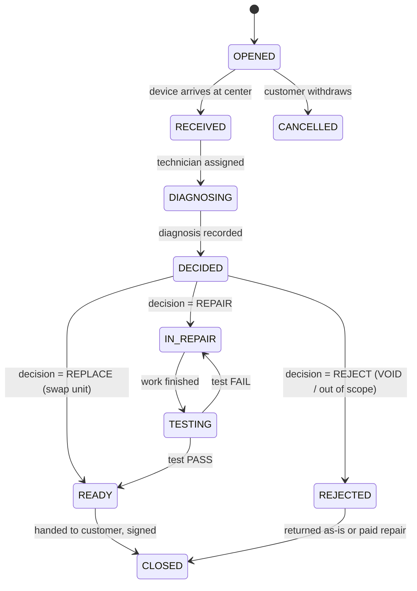

<div dir="rtl">

## 15. ما بعد البيع: الكفالة ومركز الصيانة والاستبدال

متجر الجوالات لا يُقاس بجودة صفحة المنتج بل بما يحدث بعد ثلاثة أشهر من التسليم. في سوق تُشترى فيه الأجهزة نقداً بلا بطاقات ائتمان ولا حماية مشتريات، تكون **كفالة المحل** هي عقد الثقة الوحيد، وغياب مركز صيانة منظّم يحوّل كل عطل إلى نزاع على واتساب. هذا القسم يعرّف دورة حياة الكفالة ومطالبات الصيانة كاملةً، امتداداً لنموذج البيانات في القسم 3، ولرحلة الطلب والإرجاع في القسم 8 (سياسة الإرجاع خلال مهلة عدم الرضا معرّفة هناك حصراً ولا تُكرَّر هنا).

### 15.1 تسجيل الكفالة لحظة البيع وبطاقة الكفالة الرقمية

الكفالة ليست حقلاً على المنتج بل **صفة على وحدة جهاز بعينها**. عند مسح IMEI في التجهيز تنتقل الوحدة في `device_units` إلى `ALLOCATED`، وعند تسجيل حالة الطلب `DELIVERED` يشغّل النظام معالج `WarrantyActivation` الذي يملأ على الوحدة نفسها:

| الحقل على `device_units` | مصدر القيمة | ملاحظة |
|---|---|---|
| `warranty_type` | من متغيّر المنتج (`STORE` / `AGENT` / `IMPORTER` / `NONE`) | يُثبَّت لحظة البيع ولا يتغيّر لاحقاً |
| `warranty_months` | من `warranty_policies.duration_months` | جديد 12 شهراً، مستعمل درجة A 3 أشهر، ملحقات 1 شهر |
| `warranty_start_at` | **تاريخ التسليم الفعلي** لا تاريخ الطلب | فرق مهم مع الشحن بين المحافظات الذي قد يستغرق أسبوعاً |
| `warranty_end_at` | `warranty_start_at + warranty_months` | يُعاد حسابه عند الاستبدال بجهاز آخر |
| `order_item_id` | من بند الطلب | يربط الوحدة بالعميل والسعر ومصدر الشراء |

البطاقة الرقمية تُولَّد فوراً وتظهر للعميل في `/app/account/warranties`، وتتضمن: الموديل، آخر 4 أرقام من IMEI، تاريخ البدء والانتهاء، عدّاد الأيام المتبقية، نوع الكفالة، ورقم الطلب `TS-YYMM-NNNNNN`، مع زر «فتح مطالبة» وزر تنزيل PDF خفيف (أقل من 120 كيلوبايت) يعمل دون اتصال بعد التنزيل — ضرورة في بلد ينقطع فيه التيار.

**التحقق العام بالـIMEI** من صفحة `/warranty-check` في `apps/site` (Astro مع جزيرة React واحدة): يُدخل الزائر IMEI كاملاً فيرد النظام بحالة الكفالة فقط (`ACTIVE` / `EXPIRED` / `VOID` / `NOT_FOUND`) وتاريخ الانتهاء والموديل، **دون** أي بيانات شخصية للمشتري. هذه الصفحة تخدم غرضاً تجارياً مباشراً: سوق إعادة البيع نشط جداً، والمشتري الثاني يتحقق قبل الشراء فيصل إلى المتجر مجاناً. الحد على هذه الصفحة معرَّف في القسم 9 وتُحمى بتحدٍّ عند تجاوز العتبة لمنع حصاد قاعدة الأجهزة.

### 15.2 ما تغطيه الكفالة وما لا تغطيه

| البند | مغطّى | غير مغطّى | ملاحظة تشغيلية |
|---|---|---|---|
| عيوب تصنيع في اللوحة الأم أو الشاشة أو الشاحن | نعم | — | إصلاح أو استبدال على حساب المتجر |
| تدهور بطارية دون 80% خلال مدة الكفالة | نعم (أجهزة جديدة) | مستعمل مباع بصحة بطارية معلنة | القيمة المعلنة في `battery_health_pct` هي المرجع |
| كسر شاشة أو انثناء هيكل أو أثر صدم | — | نعم | يُوثَّق بالصور عند الاستلام |
| دخول سوائل (مؤشر LCI محمرّ) | — | نعم | يُصوَّر المؤشر ويُرفق بالمطالبة |
| فتح الجهاز لدى ورشة خارجية أو أختام مكسورة | — | نعم، تسقط الكفالة كاملة (`VOID`) | سبب الرفض الأول عملياً |
| تغيير قطعة بغير أصلية أو محاولة صيانة خارجية | — | نعم | يُكشف بفحص القطع والأرقام التسلسلية |
| برمجيات: تحديث فاشل، حساب مقفل، كلمة مرور منسية | جزئياً (خدمة برسم) | فك أقفال الحسابات | خدمة مدفوعة لا كفالة |
| ملحقات صندوق الجهاز | 30 يوماً | بعدها | تُذكر صراحة في نص السياسة |

الخلاف الأكثر تكراراً في السوق ليس على وجود الكفالة بل على مداها: العميل يفهم «كفالة سنة» تغطيةً شاملة تشمل الكسر، والمتجر يقصد عيوب التصنيع. لذلك تُصاغ البنود بلغة يومية لا قانونية، وتُعرض داخل بطاقة الكفالة نفسها لا في صفحة شروط منفصلة، وتُقرأ بنودها الأربعة الحرجة (الكسر، السوائل، الفتح الخارجي، الملحقات) في مكالمة التأكيد المذكورة في القسم 8.

نص السياسة يُخزَّن في `warranty_policies.terms JSONB {ar,en}` بإصدار مرقّم، ويُعرض في شاشة المراجعة قبل إنشاء الطلب مع مربع إقرار إلزامي، ويُثبَّت `policy_version` على بند الطلب، ويوقّع العميل ورقياً أو رقمياً على إيصال التسليم لدى المندوب. هذا التثبيت يمنع الجدل لاحقاً حين تتغير السياسة.

### 15.3 جداول ما بعد البيع (امتداد للقسم 3)

كل ما يلي `id UUID` بنمط UUIDv7، و`created_at`/`updated_at` من نوع `TIMESTAMPTZ`، والمبالغ بالدولار في `*_usd_cents BIGINT` والمبالغ النقدية المحصّلة بالليرة مقرَّبة لأقرب 1000.

**`warranty_claims`** — المطالبة، مرتبطة بـIMEI لا بالطلب:

| العمود | النوع | وصف |
|---|---|---|
| `claim_no` | `VARCHAR(20) UNIQUE` | `WC-YYMM-NNNNNN` |
| `device_unit_id` | `UUID FK device_units` | الجهاز المعني |
| `order_item_id` | `UUID FK order_items NULL` | فارغ لو المالك ثانٍ |
| `customer_id` | `UUID FK users NULL` | مقدّم المطالبة |
| `contact_phone` | `VARCHAR(20)` | `+963...` |
| `governorate` / `city` | `VARCHAR(64)` | لتحديد قناة الاستلام |
| `status` | `ENUM` | `OPENED, RECEIVED, DIAGNOSING, DECIDED, IN_REPAIR, TESTING, READY, CLOSED, REJECTED, CANCELLED` |
| `decision` | `ENUM NULL` | `REPAIR, REPLACE, REJECT` |
| `coverage` | `ENUM` | `IN_WARRANTY, OUT_OF_WARRANTY, VOID` |
| `reported_issue` | `TEXT` | بكلام العميل |
| `intake_channel` | `ENUM` | `COURIER_PICKUP, TRANSPORT_OFFICE, WALK_IN` |
| `intake_cost_bearer` | `ENUM` | `STORE, CUSTOMER` |
| `policy_version` | `INT` | إصدار السياسة المثبّت |
| `loaner_device_id` | `UUID FK loaner_devices NULL` | جهاز بديل مؤقت |
| `supplier_claim_id` | `UUID FK supplier_claims NULL` | تكامل القسم 16 |
| `sla_due_at` | `TIMESTAMPTZ` | موعد الاستحقاق الحالي |
| `closed_at` | `TIMESTAMPTZ NULL` | |

**`repair_jobs`** — أمر العمل الفني (علاقة 1:1 غالباً مع المطالبة، وقد تتعدد عند إعادة الفتح):

| العمود | النوع | وصف |
|---|---|---|
| `claim_id` | `UUID FK warranty_claims` | |
| `technician_id` | `UUID FK users` | الفني المسؤول |
| `diagnosis` | `TEXT` | التشخيص |
| `fault_category` | `ENUM` | `BOARD, SCREEN, BATTERY, CHARGING_PORT, CAMERA, AUDIO, SOFTWARE, LIQUID, PHYSICAL, OTHER` |
| `labor_cost_usd_cents` | `BIGINT` | أجرة عمل داخلية للتكلفة |
| `parts_cost_usd_cents` | `BIGINT` | مجموع القطع |
| `billed_to` | `ENUM` | `STORE, CUSTOMER, SUPPLIER` |
| `charged_syp` | `BIGINT NULL` | محصّل نقداً، `CHECK (charged_syp % 1000 = 0)` |
| `started_at` / `finished_at` | `TIMESTAMPTZ NULL` | لحساب زمن الإصلاح |
| `test_result` | `ENUM NULL` | `PASS, FAIL` |

**`claim_media`** — التوثيق المصوَّر (يشير إلى جدول `media` وحده كما ينص القسم 3):

| العمود | النوع | وصف |
|---|---|---|
| `claim_id` | `UUID FK warranty_claims` | |
| `media_id` | `UUID FK media` | الأصل |
| `stage` | `ENUM` | `INTAKE, DIAGNOSIS, REPAIR, HANDOVER` |
| `kind` | `ENUM` | `PHOTO, VIDEO, SIGNATURE, DOCUMENT` |
| `note` | `TEXT NULL` | «خدش على الإطار الأيسر» |
| `captured_by` | `UUID FK users` | فني أو مندوب |

**`spare_parts`** و**`repair_part_usages`**:

| العمود (`spare_parts`) | النوع | وصف |
|---|---|---|
| `sku` | `VARCHAR(48) UNIQUE` | `SP-SCR-A54-BLK` |
| `name` | `JSONB {ar,en}` | |
| `part_type` | `ENUM` | `SCREEN, BATTERY, BACK_COVER, CHARGING_PORT, CAMERA, SPEAKER, FLEX, OTHER` |
| `quality_grade` | `ENUM` | `ORIGINAL, OEM, COPY_A, REFURB` |
| `compatible_variant_ids` | `UUID[]` | ربط بالموديلات |
| `cost_usd_cents` | `BIGINT` | تكلفة الشراء |
| `sell_price_usd_cents` | `BIGINT` | للإصلاح خارج الكفالة |
| `supplier_id` | `UUID FK suppliers NULL` | |

مخزون القطع **مستقل عن مخزون البيع** ولا يظهر في الكتالوج، لكنه يستخدم الآلية نفسها المعرَّفة في القسم 7: صف في `inventory_levels` بمرجع `spare_part_id` وحركاته في `inventory_movements` بأسباب `REPAIR_CONSUME` و`SUPPLIER_RECEIVE`. الجدول `repair_part_usages(repair_job_id, spare_part_id, qty, unit_cost_usd_cents, serial_no NULL)` يخصم القطعة عند التركيب ويثبّت تكلفتها لحظتها بالدولار، فلا يتشوّه احتساب كلفة الكفالة عند تحرّك سعر الصرف. التوريد متقطع فيحمل كل صف `reorder_point` وتنبيهاً في اللوحة، وتُصنَّف الجودة صراحةً لأن العميل يسأل عن نوع الشاشة المركّبة، ويُذكر نوع القطعة في تقرير التسليم.

**`loaner_devices`**: `device_unit_id FK`, `status ENUM('AVAILABLE','ASSIGNED','MAINTENANCE','RETIRED')`, `assigned_claim_id NULL`, `assigned_at`, `due_at`, `deposit_syp BIGINT`, `condition_in_media_id`, `condition_out_media_id`. الجهاز البديل وحدة مخزون حقيقية في `device_units` بحالة مخصصة `LOANER` فلا يُباع بالخطأ.

### 15.4 سير مطالبة الصيانة والمهل المستهدفة



| الانتقال | من يملكه (صلاحية) | المهلة المستهدفة |
|---|---|---|
| `OPENED` | العميل أو خدمة العملاء | فوري |
| `→ RECEIVED` | مركز الصيانة `claim:receive:center` | 48 ساعة داخل المدينة، 5 أيام بين المحافظات |
| `→ DIAGNOSING` | فني `claim:diagnose:center` | 24 ساعة من الاستلام |
| `→ DECIDED` | مشرف الصيانة `claim:decide:center` | 72 ساعة من الاستلام |
| `→ IN_REPAIR` | فني | فوري بعد توفر القطعة |
| `→ TESTING` | فني | 7 أيام عمل للإصلاح المعتاد، 14 عند انتظار قطعة |
| `→ READY` | فني `claim:test:center` | 24 ساعة اختبار تشغيل |
| `→ CLOSED` | استلام موقّع `claim:close:center` | خلال 7 أيام من الجاهزية |

التوثيق المصوَّر **إلزامي حجباً**: لا يمكن الانتقال إلى `RECEIVED` دون 4 صور على الأقل (أمام، خلف، الجانبان) وصورة الملحقات المرفقة، ولا إلى `CLOSED` دون صور تسليم وتوقيع. كل صورة تُضغط على الجهاز إلى ≤300 كيلوبايت قبل الرفع مراعاةً للشبكة، ويعمل الرفع بطابور معاود عند انقطاع الاتصال (مطبَّق في واجهة المندوب `/courier` ضمن `apps/admin`).

### 15.5 وصول الجهاز إلى المركز ومن يتحمل الكلفة

| الحالة | القناة | من يدفع |
|---|---|---|
| ضمن الكفالة، دمشق وريفها | مندوب المتجر يستلم من العنوان | المتجر |
| ضمن الكفالة، حلب/حمص/حماة/اللاذقية/طرطوس | مكتب النقل البري، بوليصة باسم المتجر | المتجر ذهاباً وإياباً |
| خارج الكفالة أو رفض المطالبة | مندوب أو مكتب نقل | العميل، ويُحصَّل نقداً مع أجرة الإصلاح |
| تسليم يدوي في المركز | حضور شخصي | لا كلفة |
| مطالبة ثبت أنها كسر/سوائل بعد الفحص | إعادة الجهاز | العميل يتحمل الإياب فقط |

قيمة `intake_cost_bearer` تُحدَّد عند الفتح مبدئياً وتُصحَّح بعد التشخيص، وأي كلفة على العميل تُقيَّد في `repair_jobs.charged_syp` وتُسوّى ضمن `cash_settlements` كما في القسم 8، مقرَّبة لأقرب 1000 ليرة ومحسوبة من سعر الدولار المثبّت يوم إصدار عرض الإصلاح وصلاحيته 48 ساعة كسائر الأسعار.

قاعدة عملية تنبع من واقع الشحن البري: **لا يُشحن جهاز إلى المركز قبل تشخيص أوّلي عن بُعد**. يجري موظف الدعم مكالمة قصيرة أو محادثة واتساب يطلب فيها صورة للشاشة وفيديو 10 ثوانٍ للعطل وصورة لمؤشر السوائل، وتُرفق هذه الوسائط بالمطالبة بمرحلة `INTAKE`. نحو ثلث الحالات تُحل عن بُعد (إعادة ضبط، تحديث، شاحن معطوب) فتُغلق بحالة `CANCELLED` دون كلفة شحن على أحد. كذلك يُطلب إخراج شريحة الاتصال وبطاقة الذاكرة وتعطيل قفل الحساب، ضمن قائمة تحقّق إلزامية عند `RECEIVED`، لأن جهازاً مقفلاً بحساب يتعذّر اختباره ويعطّل الانتقال إلى `TESTING`.

### 15.6 الجهاز البديل المؤقت والاستبدال في فترة العيب المبكر

الجهاز البديل خيار **اختياري** يُمنح عند تجاوز الإصلاح 7 أيام أو للعملاء ذوي القيمة العالية، بتأمين نقدي مسترد وعقد قصير موقّع. تعيينه يغيّر حالة الوحدة إلى `ASSIGNED` ويولّد تذكيراً عبر واتساب قبل يومين من `due_at`.

**فترة العيب المبكر** هي أول 14 يوماً من التسليم: إذا كان العطل تصنيعياً ومؤكداً بالتشخيص، يُستبدل الجهاز بوحدة جديدة مطابقة مباشرة دون مرور بمسار الإصلاح، ويُنشأ صف جديد في `device_units` مع نقل `warranty_start_at` الأصلي أو إعادة ضبطه حسب `warranty_policies.reset_on_replace`. الفرق عن الإرجاع في القسم 8 واضح: الإرجاع يعيد النقد وينهي البيع، أما الاستبدال هنا فيبقي البيع قائماً ويحافظ على التدفق النقدي — وهو الأنسب لسيولة متجر يعمل نقداً.

### 15.7 مطالبة المورد ومسارات API والمؤشرات

الجهاز المرفوض داخلياً لعيب تصنيعي يُجمَّع في `supplier_claims(supplier_id, device_unit_id, claim_id, status ENUM('DRAFT','SUBMITTED','ACCEPTED','REJECTED','SETTLED'), claimed_usd_cents, credit_usd_cents, submitted_at, settled_at)`، ويُتابَع رصيد المطالبات المفتوحة لكل مورد ليُخصم من فاتورة التوريد التالية (التفاصيل المحاسبية في القسم 16).

| المسار | الصلاحية |
|---|---|
| `GET /api/v1/warranties/verify?imei=` | عام (بلا مصادقة) |
| `GET /api/v1/me/warranties` | `warranty:read:own` |
| `POST /api/v1/me/warranty-claims` | `claim:create:own` |
| `GET /api/v1/me/warranty-claims/{id}` | `claim:read:own` |
| `POST /api/v1/admin/warranty-claims/{id}/transition` | `claim:transition:center` |
| `POST /api/v1/admin/warranty-claims/{id}/media` | `claim:media:center` |
| `POST /api/v1/admin/repair-jobs/{id}/parts` | `repair:parts:center` |
| `GET/POST /api/v1/admin/spare-parts` | `sparepart:read:all` / `sparepart:write:all` |
| `POST /api/v1/admin/loaners/{id}/assign` | `loaner:assign:center` |
| `POST /api/v1/admin/supplier-claims` | `supplierclaim:write:all` |

```json
{
  "claim_no": "WC-2607-000318",
  "status": "IN_REPAIR",
  "coverage": "IN_WARRANTY",
  "decision": "REPAIR",
  "device": { "model": "Galaxy A54 128GB", "imei_masked": "35847******4471" },
  "sla_due_at": "2026-08-04T09:00:00Z",
  "timeline": [
    { "status": "OPENED", "at": "2026-07-26T10:12:00Z", "by": "customer" },
    { "status": "RECEIVED", "at": "2026-07-27T13:40:00Z", "by": "center", "media_count": 5 },
    { "status": "DIAGNOSING", "at": "2026-07-28T08:05:00Z", "by": "tech_02" }
  ],
  "loaner": { "assigned": true, "due_at": "2026-08-10T00:00:00Z" }
}
```

العميل يتابع من `/app/account/claims/{claim_no}` بخط زمني، ويصله عند كل انتقال إشعار واتساب بقالب معتمد (`claim_received_ar`, `claim_decision_ar`, `claim_ready_ar`) وفق ترتيب القنوات: واتساب ← SMS ← بريد.

**المؤشرات** في القسم 10 كلوحة «ما بعد البيع»: معدل المطالبات لكل موديل ولكل مورد (`claims / units_sold` خلال 90 يوماً) وهو الرقم الذي يُغذّي قرار الشراء مباشرة — أي موديل يتجاوز 6% يوضع تحت المراقبة وفوق 10% يُوقف توريده؛ زمن الإصلاح الوسطي (هدف ≤7 أيام)؛ كلفة الكفالة كنسبة من المبيعات (قطع + أجور + شحن، هدف <1.5%)؛ نسبة المطالبات المرفوضة (هدف <20%، وارتفاعها فوق ذلك مؤشر على وصف منتج مضلل لا على سوء استخدام).

---

**ما غطّاه هذا الفصل (لبقية الكتّاب):**

1. تفعيل الكفالة على `device_units` من تاريخ التسليم، بطاقة كفالة رقمية في `/app/account/warranties`، وصفحة تحقق عامة بالـIMEI على `/warranty-check` ترد بحالة الكفالة فقط بلا بيانات شخصية.
2. جدول تغطية صريح (عيوب تصنيع مقابل كسر/سوائل/فتح خارجي)، ونص سياسة مُصدَّر في `warranty_policies.terms` مع `policy_version` مثبّت على بند الطلب وإقرار موقّع عند التسليم.
3. سير المطالبة الكامل بمالك كل انتقال ومهلة مستهدفة، وتوثيق مصوَّر إلزامي حاجب عند `RECEIVED` و`CLOSED` مع ضغط الصور ≤300KB وطابور رفع معاود.
4. لوجستيات الاستلام (مندوب / مكتب نقل / تسليم يدوي) وقواعد تحمّل الكلفة، مخزون قطع غيار مستقل مربوط بالموديلات، جهاز بديل مؤقت كوحدة مخزون، واستبدال العيب المبكر خلال 14 يوماً (متمايز عن الإرجاع في القسم 8).
5. مطالبات المورد ورصيدها (تكامل القسم 16)، ومؤشرات معدل المطالبات لكل موديل/مورد وزمن الإصلاح وكلفة الكفالة ونسبة الرفض.

**جداول جديدة مضافة:** `warranty_claims`, `repair_jobs`, `claim_media`, `spare_parts`, `repair_part_usages`, `loaner_devices`, `warranty_policies`, `supplier_claims` — إضافة إلى حالة `LOANER` في `device_units` وسببي حركة `REPAIR_CONSUME` و`SUPPLIER_RECEIVE` في `inventory_movements`.

**مسارات API جديدة:** `GET /api/v1/warranties/verify`, `GET /api/v1/me/warranties`, `POST|GET /api/v1/me/warranty-claims[/{id}]`, `POST /api/v1/admin/warranty-claims/{id}/transition`, `POST /api/v1/admin/warranty-claims/{id}/media`, `POST /api/v1/admin/repair-jobs/{id}/parts`, `GET|POST /api/v1/admin/spare-parts`, `POST /api/v1/admin/loaners/{id}/assign`, `POST /api/v1/admin/supplier-claims`.

</div>
