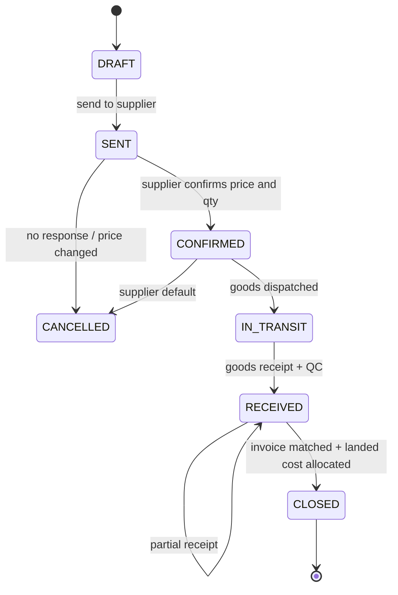

<div dir="rtl">

## 16. المشتريات والموردون والتكلفة والتقارير المالية

المتجر الذي يعرف مبيعاته ولا يعرف تكلفته لا يعرف شيئاً. في سوق تتقلب فيه الليرة أسبوعياً ويُشترى فيه المخزون نقداً من مستوردين محليين، يمكن أن ترتفع المبيعات بالليرة 40% بينما يتآكل الربح الحقيقي بالدولار. هذا القسم يعرّف سلسلة التوريد المالية كاملة: من المورّد إلى أمر الشراء إلى الاستلام والفحص، ثم إلى التكلفة الشاملة وتقييم المخزون وتكلفة البضاعة المباعة، وانتهاءً بقوائم الأرباح والتنبيهات. كل الجداول أدناه **امتداد لنموذج البيانات في القسم 3**: المعرّفات `UUIDv7`، والأسماء snake_case جمعاً، والنصوص متعددة اللغات `JSONB {ar,en}`، وكل المبالغ المرجعية `*_usd_cents BIGINT` (ممنوع تخزين التكلفة بالليرة)، وكل تعديل يُسجَّل في `audit_logs`.

### 16.1 الموردون: البيانات والشروط والتقييم وسجل الأسعار

**`suppliers`**

| العمود | النوع | وصف |
|---|---|---|
| `id` | `UUID PK` | UUIDv7 |
| `code` | `VARCHAR(16) UNIQUE` | `SUP-0001` للاستخدام الورقي |
| `name` | `JSONB {ar,en}` | اسم المحل أو الشركة |
| `type` | `ENUM('IMPORTER','WHOLESALER','LOCAL_SHOP','INDIVIDUAL','AGENT')` | المستورد أرخص، والمحل المحلي أسرع |
| `governorate` / `city` | `VARCHAR(64)` | دمشق، حلب... |
| `contact_name` / `phone` / `alt_phone` | `VARCHAR(64)` / `VARCHAR(20)` | `+963`، والتواصل واتساب غالباً |
| `payment_terms` | `ENUM('PREPAID','ON_DELIVERY','NET_7','NET_15','NET_30','CONSIGNMENT')` | الأمانة (`CONSIGNMENT`) شائعة محلياً |
| `credit_limit_usd_cents` | `BIGINT` | سقف الدين المسموح |
| `lead_time_days` | `SMALLINT` | مهلة التوريد المتعاقد عليها |
| `default_currency` | `ENUM('USD','SYP')` | الغالب `USD` |
| `is_active` | `BOOLEAN` | |
| `notes` | `TEXT` | |

**`supplier_scorecards`** (يُعاد حسابها ليلياً لآخر 180 يوماً): `supplier_id`, `period_start`, `period_end`, `orders_count`, `on_time_rate_bp`, `defect_rate_bp`, `spec_accuracy_bp`, `avg_delay_days`, `price_variance_bp`, `score` (0–100), `computed_at`.

المعايير الثلاثة: **الالتزام بالمواعيد** = نسبة الاستلامات التي تمت خلال `lead_time_days`؛ **نسبة العيوب** = وحدات مرفوضة في الفحص أو عائدة بمطالبة كفالة خلال 30 يوماً ÷ الوحدات المستلمة؛ **دقة المواصفات** = وحدات طابقت `part_code` و`device_origin` و`battery_health_pct` المتفق عليها. الوزن: 40% مواعيد، 40% عيوب، 20% مواصفات. المورد دون 60 يُمنع من إنشاء أوامر شراء جديدة إلا بموافقة مدير.

**`supplier_price_history`**: `supplier_id`, `variant_id`, `unit_price_usd_cents`, `min_qty`, `quoted_at`, `source ENUM('PO','QUOTE','MANUAL')`, `po_id NULL`. يغذّي مقارنة العروض: عند إنشاء أمر شراء تُعرض آخر ثلاثة أسعار لكل مورد للمتغيّر نفسه، وهو ما يمنع الشراء بسعر أعلى من آخر صفقة دون انتباه.

**`supplier_claims`** (المرجع من القسم 15): `supplier_id`, `device_unit_id`, `warranty_claim_id NULL`, `status ENUM('OPEN','SENT','ACCEPTED','REJECTED','SETTLED')`, `resolution ENUM('REPLACE','CREDIT','REPAIR','NONE')`, `credit_usd_cents`, `sent_at`, `settled_at`.

شرط الدفع ليس تفصيلاً إدارياً بل قرار سيولة: `PREPAID` يعني تجميد نقد قبل أن يدرّ المخزون ديناراً واحداً، و`CONSIGNMENT` (البضاعة أمانة تُحاسَب عند البيع) هو الأفضل نقدياً لكنه عادةً بسعر وحدة أعلى 5–8%، وهذا الفرق يجب أن يظهر صراحةً في مقارنة العروض لا أن يُنسى. لذلك تحمل بنود الشراء بالأمانة راية `is_consignment` على أمر الشراء، وتدخل المخزون بتكلفتها الكاملة لكنها لا تولّد التزاماً في `supplier_invoices` إلا عند البيع، فتبقى صورة الدين دقيقة.

### 16.2 دورة الشراء



**`purchase_orders`**: `id`, `po_no VARCHAR(20) UNIQUE` بنمط `PO-YYMM-NNNNNN`, `supplier_id`, `status ENUM('DRAFT','SENT','CONFIRMED','IN_TRANSIT','RECEIVED','CLOSED','CANCELLED')`, `currency ENUM('USD','SYP')`, `fx_rate NUMERIC(14,4) NULL` (إن كان الشراء بالليرة، يُثبَّت السعر لحظة التأكيد من `fx_rates` ويُحوَّل فوراً إلى دولار)، `subtotal_usd_cents`, `other_costs_usd_cents`, `total_usd_cents`, `expected_at DATE`, `confirmed_at`, `received_at`, `closed_at`, `created_by`, `notes`.

**`purchase_order_items`**: `id`, `po_id`, `variant_id`, `qty_ordered`, `qty_received`, `unit_price_usd_cents`, `line_total_usd_cents`, `expected_grade ENUM`, `expected_part_code VARCHAR(8)`, `unit_weight_g INT NULL`, `landed_unit_cost_usd_cents NULL` (تُملأ بعد التوزيع).

عند الانتقال إلى `CONFIRMED` تُزاد `inventory_levels.incoming` بالكميات المؤكدة، فيرى فريق البيع البضاعة القادمة دون أن تصبح قابلة للحجز.

### 16.3 الاستلام والفحص وإدخال IMEI دفعة واحدة

**`goods_receipts`**: `id`, `receipt_no VARCHAR(20)` بنمط `GR-YYMM-NNNNNN`, `po_id`, `received_at`, `received_by`, `status ENUM('DRAFT','QC','POSTED')`, `transport_office VARCHAR(120) NULL`, `waybill_no NULL`, `notes`.
**`goods_receipt_items`**: `id`, `receipt_id`, `po_item_id`, `variant_id`, `qty_accepted`, `qty_rejected`, `reject_reason ENUM('WRONG_SPEC','DAMAGED','FAKE','SHORT_SHIPMENT','BATTERY_BELOW_SPEC','OTHER') NULL`, `grade`, `battery_health_pct NULL`.

إدخال IMEI يتم دفعةً واحدة عبر `POST /api/v1/admin/goods-receipts/{id}/device-units:bulk` بمصفوفة تصل إلى 500 عنصر، مع تحقق فوري من صيغة Luhn ومن عدم التكرار في `device_units`:

```json
{
  "receipt_item_id": "0192f3c1-...-a91b",
  "units": [
    {"imei": "356938035643809", "imei2": "356938035643817", "grade": "A", "battery_health_pct": 100},
    {"imei": "356938035643825", "grade": "A", "battery_health_pct": 98}
  ],
  "warranty_type": "STORE", "warranty_months": 12
}
```

الفحص قبل الترحيل إلزامي وقائمته ثابتة لكل وحدة جوال: مطابقة IMEI المطبوع على العلبة لشاشة `*#06#`، وحالة الأختام، وصحة البطارية المقروءة من إعدادات الجهاز، ومطابقة `part_code` و`device_origin`، وعمل الشريحتين ومنفذ الشحن، وسلامة الشاشة تحت إضاءة موحدة، واكتمال ملحقات الصندوق. الفاحص يسجّل النتيجة مرة واحدة على الوحدة، ويُلتقط صف واحد في `goods_receipt_items` لكل بند شراء. الاستلام الجزئي مدعوم: يبقى أمر الشراء في `RECEIVED` ما دام `qty_received < qty_ordered` لأي بند، وتُنشأ إيصالات متعددة لأمر واحد — وهو الوضع الطبيعي حين تصل الشحنة على دفعتين عبر مكتبي نقل مختلفين.

عند `POSTED` تُنفَّذ معاملة واحدة ذرّية: إنشاء صفوف `device_units` بحالة `IN_STOCK` وتكلفتها `acquisition_cost_usd_cents`، وزيادة `inventory_levels.on_hand` وإنقاص `incoming` مع رفع `version`، وكتابة `inventory_movements` بسبب `RECEIPT` مرجعها `goods_receipt_item_id`، وتحديث `qty_received` على بند الشراء، وإعادة حساب المتوسط المرجح في `inventory_valuations`. الوحدات المرفوضة لا تدخل المخزون وتُفتح لها `supplier_claims`.

### 16.4 التكلفة الشاملة (Landed Cost)

**`landed_costs`**: `id`, `po_id`, `receipt_id NULL`, `type ENUM('FREIGHT','CUSTOMS','CLEARANCE','TRANSPORT_OFFICE','INSURANCE','HANDLING','OTHER')`, `amount_usd_cents`, `allocation_method ENUM('BY_VALUE','BY_WEIGHT','BY_QTY')`, `document_media_id NULL`, `incurred_at`, `created_by`.
**`landed_cost_allocations`**: `id`, `landed_cost_id`, `po_item_id`, `allocated_usd_cents`, `allocated_per_unit_usd_cents`.

مثال كامل على أمر شراء واحد:

| البند | الكمية | سعر الوحدة | قيمة السطر |
|---|---|---|---|
| هاتف A | 40 | 150.00$ | 6,000.00$ |
| هاتف B | 25 | 320.00$ | 8,000.00$ |
| ملحق C | 60 | 6.00$ | 360.00$ |
| **إجمالي البضاعة** | | | **14,360.00$** |

التكاليف الإضافية: شحن 620.00$ + جمارك 1,150.00$ + رسوم تخليص ومكتب نقل 230.00$ = **2,000.00$**. بالتوزيع **بالقيمة**: المعامل = 2,000 ÷ 14,360 = 0.139276.

| البند | الحصة | لكل وحدة | التكلفة الشاملة للوحدة |
|---|---|---|---|
| هاتف A | 835.65$ | 20.891$ | **170.89$** (`17089` سنتاً) |
| هاتف B | 1,114.21$ | 44.568$ | **364.57$** |
| ملحق C | 50.14$ | 0.836$ | **6.84$** |

مجموع الحصص 2,000.00$ بالضبط؛ فروق التقريب بالسنت تُسنَد إلى السطر الأكبر قيمة. التوزيع **بالوزن** يُستخدم حين تكون الأجرة على الكيلوغرام (شحنات الملحقات الثقيلة)، و**بالعدد** حين تكون الرسوم لكل قطعة (رسوم تخليص ثابتة). طريقة التوزيع تُختار لكل بند تكلفة على حدة، فالجمارك بالقيمة والشحن البري بالوزن في الشحنة نفسها.

### 16.5 تقييم المخزون وتكلفة البضاعة المباعة والهامش

**`inventory_valuations`**: `id`, `variant_id`, `as_of_date DATE`, `method ENUM('WAVG')`, `on_hand INT`, `avg_unit_cost_usd_cents BIGINT`, `total_value_usd_cents BIGINT`, `last_movement_id`, `computed_at`. قيد `UNIQUE(variant_id, as_of_date)`.

الطريقة المعتمدة: **المتوسط المرجح المتحرك (Weighted Moving Average) بالدولار**. تبريرها عملي: الوارد من موردين متعددين بأسعار متقلبة أسبوعياً، وFIFO تتطلب تتبع طبقات لكل استلام وتنتج هامشاً متذبذباً بين طلبين متتاليين للمنتج نفسه، وLIFO غير مقبولة محاسبياً وتفقد معنى التكلفة. المتوسط المتحرك يعطي رقماً واحداً مستقراً يصلح أساساً للتسعير اليومي. الأجهزة ذات IMEI تحتفظ إضافةً إلى ذلك بتكلفتها الفعلية على `device_units.acquisition_cost_usd_cents`، فيمكن حساب هامش الوحدة تحديداً عند الحاجة.

مثال: الرصيد 12 وحدة بمتوسط 168.00$ = 2,016.00$، ويرد 40 وحدة بتكلفة شاملة 170.89$ = 6,835.65$. المتوسط الجديد = (2,016.00 + 6,835.65) ÷ 52 = **170.22$** (`17022` سنتاً).

عند تسجيل الطلب `DELIVERED` تُثبَّت التكلفة على `order_items` بعمودين إضافيين (امتداد للقسم 3): `cogs_usd_cents` و`cogs_locked_at`. الهامش:

| البند | القيمة |
|---|---|
| سعر البيع (مرجعي) | 199.00$ |
| تكلفة البضاعة | 170.22$ |
| **مجمل الربح** | **28.78$ (14.46%)** |
| أجرة مندوب/مكتب نقل | 1.20$ |
| تغليف واتصالات تأكيد | 0.30$ |
| **صافي المساهمة** | **27.28$** |

**لماذا بالدولار حصراً؟** لو سُجلت التكلفة بالليرة يوم الشراء وبيعت البضاعة بعد شهرين بسعر صرف أعلى، سيُظهر الدفتر ربحاً بالليرة لا يكفي لإعادة شراء الوحدة نفسها — ربح محاسبي وهمي وتآكل حقيقي لرأس المال. لذلك التكلفة والسعر المرجعي والهامش كلها بالدولار، والليرة عرضٌ وتحصيلٌ فقط عبر `fx_rates` و`orders.fx_rate`. فرق الصرف بين `orders.fx_rate` المثبّت وسعر يوم التحصيل يُسجَّل مصروفاً أو إيراداً في `expenses` بفئة `FX_DIFFERENCE`.

### 16.6 المصاريف التشغيلية والتدفق النقدي

**`expenses`**: `id`, `expense_no`, `category ENUM('RENT','SALARIES','COURIER','TRANSPORT','PACKAGING','MARKETING','TELECOM','UTILITIES','FUEL_GENERATOR','BANK_FEES','FX_DIFFERENCE','MAINTENANCE','OTHER')`, `amount_usd_cents`, `amount_syp NULL`, `fx_rate NULL`, `paid_at`, `payment_status ENUM('DUE','PAID')`, `cash_account_id`, `supplier_id NULL`, `receipt_media_id NULL`, `note`, `created_by`.

**`supplier_invoices`**: `id`, `invoice_no`, `supplier_id`, `po_id NULL`, `issue_date`, `due_date`, `currency`, `fx_rate NULL`, `amount_usd_cents`, `paid_usd_cents`, `status ENUM('OPEN','PARTIAL','PAID','DISPUTED','VOID')`, `document_media_id`.
**`supplier_payments`**: `id`, `supplier_id`, `invoice_id NULL`, `amount_usd_cents`, `amount_syp NULL`, `fx_rate`, `method ENUM('CASH','EXCHANGE_OFFICE','TRANSFER')`, `paid_at`, `cash_account_id`, `reference`, `created_by`.

**`cash_accounts`**: `id`, `name JSONB`, `type ENUM('MAIN_SAFE','COURIER_FLOAT','BRANCH')`, `currency`, `balance_usd_cents`, `balance_syp`, `is_active`.
**`cash_movements`**: `id`, `cash_account_id`, `direction ENUM('IN','OUT')`, `source ENUM('COD_SETTLEMENT','SUPPLIER_PAYMENT','EXPENSE','REFUND','TRANSFER','ADJUSTMENT')`, `source_id`, `amount_syp`, `amount_usd_cents`, `fx_rate`, `occurred_at`, `created_by`.

تصنيف المصاريف مقصود بحيث يجيب عن سؤال واحد: هل هذا المصروف يتحرك مع حجم المبيعات أم لا؟ فئات `COURIER` و`TRANSPORT` و`PACKAGING` متغيرة وتُحمَّل على مستوى الطلب لحساب المساهمة، بينما `RENT` و`SALARIES` و`FUEL_GENERATOR` ثابتة وتُوزَّع شهرياً في قائمة الأرباح فقط. مصروف المولّدة بند حقيقي لا هامشي في هذا السوق ويستحق فئة مستقلة كي يظهر أثره على نقطة التعادل بدل أن يذوب في «مصاريف أخرى».

التدفق النقدي البسيط: نقد داخل من `cash_settlements` (تسويات تحصيل المندوبين ومكاتب النقل، القسم 8) → رصيد `cash_accounts` → نقد خارج عبر `supplier_payments` و`expenses` و`refunds`. لوحة «الصندوق» تعرض يومياً: محصّل اليوم، مدفوع اليوم، الرصيد، والنقد العالق لدى المندوبين ومكاتب النقل (وهو أخطر رقم في هذا النموذج لأن رأس المال يمشي في الشارع).

### 16.7 التقارير المالية

| التقرير | المسار | المحتوى |
|---|---|---|
| قائمة أرباح شهرية | `/api/v1/admin/reports/pnl?month=2026-07` | إيراد مسلَّم − تكلفة بضاعة = مجمل ربح، ناقص المصاريف بالفئات = صافي؛ بالدولار وبالليرة بمتوسط صرف مرجّح |
| ربحية لكل موديل/متغيّر/مورد | `/api/v1/admin/reports/profitability?dimension=variant\|model\|supplier` | كمية مباعة، إيراد، تكلفة، مجمل ربح، نسبة الهامش، معدل الإرجاع |
| عمر المخزون ودورانه | `/api/v1/admin/reports/inventory-aging` | شرائح 0–30، 31–60، 61–90، 90+ يوماً؛ معدل الدوران = COGS ÷ متوسط قيمة المخزون |
| رأس المال المجمّد | `/api/v1/admin/reports/dead-stock?days=60` | قيمة الوحدات بلا بيع منذ 60 يوماً، مقترح خصم |
| أفضل/أسوأ عشرة | `/api/v1/admin/reports/top-products?metric=gross_profit&limit=10&order=asc\|desc` | مرتبة بمجمل الربح لا بعدد القطع |

كل التقارير قابلة للتصدير CSV، وتُبنى من لقطات `inventory_valuations` اليومية لا من إعادة حساب تاريخي مكلف. مثال مصغّر لشهر واحد:

| البند | القيمة |
|---|---|
| إيراد الطلبات المسلَّمة | 48,600.00$ |
| تكلفة البضاعة المباعة | 41,300.00$ |
| **مجمل الربح** | **7,300.00$ (15.0%)** |
| مصاريف التوصيل والنقل | 1,180.00$ |
| رواتب وإيجار ومولّدة | 2,950.00$ |
| تسويق واتصالات وتغليف | 640.00$ |
| فروق صرف | 210.00$ |
| **صافي الربح** | **2,320.00$ (4.8%)** |

الإيراد يُحتسب على الطلبات `DELIVERED` فقط؛ الطلبات في `OUT_FOR_DELIVERY` أو `DELIVERY_FAILED` ليست مبيعات، وإدراجها هو الخطأ الأشيع في متاجر الدفع عند الاستلام، إذ ترتفع نسبة الطلبات غير المسلَّمة إلى مستويات تجعل «المبيعات» رقماً بلا معنى. كذلك تُخصم قيمة `RETURNED` من إيراد الشهر الذي تم فيه الإرجاع، وتعود الوحدة إلى المخزون بتكلفتها الأصلية لا بتكلفة اليوم. أما المخزون الراكد فيُعالَج بسلّم خصم: 61–90 يوماً خصم 5% وعرضه في مجموعة «توفير»، و91–120 يوماً خصم 10% مع دفعة إعلانية، وفوق 120 يوماً بيع بالجملة لمورد أو محل آخر ولو بهامش صفري — لأن الوحدة الراكدة في هذا السوق تخسر قيمتها بالدولار مع كل إصدار جديد.

### 16.8 التنبيهات المالية الآلية

**`financial_alerts`**: `id`, `type ENUM('SOLD_BELOW_COST','DEAD_STOCK','SUPPLIER_LATE','MARGIN_DROP','NEGATIVE_CASH','INVOICE_OVERDUE')`, `severity ENUM('INFO','WARN','CRITICAL')`, `subject_type`, `subject_id`, `payload JSONB`, `status ENUM('OPEN','ACK','RESOLVED')`, `triggered_at`, `resolved_at`.

القواعد: بيع تحت التكلفة يُطلق فوراً عند تثبيت COGS إذا `unit_price < cogs`، وأيضاً **قبل** التأكيد إذا كان سعر المتغيّر الحالي أقل من `avg_unit_cost × 1.05`؛ مخزون راكد عند تجاوز 60 يوماً بلا حركة بيع بقيمة تفوق 200$؛ مورد متأخر عند تجاوز `expected_at` بثلاثة أيام وأمر الشراء في `CONFIRMED` أو `IN_TRANSIT`؛ انخفاض هامش عند هبوط الهامش المتحرك لسبعة أيام تحت 8% أو تحت عتبة الفئة. التنبيهات تصل لمدير المشتريات عبر ترتيب القنوات المعتمد (واتساب ← SMS ← بريد) وتظهر في لوحة القسم 10.

### 16.9 سعر الصرف وإعادة التسعير الدوري

التكلفة بالدولار ثابتة، والسعر المعروض بالليرة مشتق من `fx_rates`. عند تغيّر السعر بأكثر من 3% يشغّل النظام مراجعة تسعير: يحسب لكل متغيّر الهامش الناتج عن السعر الحالي، ويقترح سعراً جديداً يحفظ الهامش المستهدف، ويعرضه للمدير للاعتماد الجماعي (لا تغيير تلقائي للأسعار، القسم 7 هو المرجع لقواعد التسعير). المراجعة تُشغَّل كذلك بجدولة ثابتة كل يوم عند الساعة 09:00 بتوقيت دمشق، وتنتج قائمة عمل مرتبة بالأثر المالي: المتغيرات التي هبط هامشها أكثر أولاً، ثم الأكثر مبيعاً. المدير يرى في الصف الواحد: التكلفة الشاملة الحالية، السعر المرجعي، الهامش الحالي، السعر المقترح بالليرة مقرَّباً لأقرب 1000، وآخر سعر شراء من كل مورد. الطلبات المؤكدة قبل التغيير محمية بـ `orders.fx_rate` المثبّت لمدة 48 ساعة، وأي فرق يظهر في `FX_DIFFERENCE`، وهكذا يبقى الهامش الحقيقي مرئياً بدل أن يختبئ خلف أرقام بالليرة.

### 16.10 مسارات API والصلاحيات

| المسار | الصلاحية |
|---|---|
| `GET/POST /api/v1/admin/suppliers`، `PATCH /{id}` | `supplier:read:all` / `supplier:create:all` / `supplier:update:all` |
| `GET /api/v1/admin/suppliers/{id}/scorecard`، `/price-history` | `supplier:read:all` |
| `GET/POST /api/v1/admin/purchase-orders`، `POST /{id}/send`، `/confirm`، `/cancel` | `purchase_order:read:all` / `purchase_order:create:all` / `purchase_order:approve:all` |
| `POST /api/v1/admin/purchase-orders/{id}/goods-receipts` | `goods_receipt:create:all` |
| `POST /api/v1/admin/goods-receipts/{id}/device-units:bulk`، `POST /{id}/post` | `goods_receipt:update:all` |
| `POST /api/v1/admin/purchase-orders/{id}/landed-costs`، `POST /landed-costs/{id}/allocate` | `landed_cost:create:all` |
| `GET/POST /api/v1/admin/supplier-invoices`، `/supplier-payments` | `finance:read:all` / `finance:pay:all` |
| `GET/POST/PATCH /api/v1/admin/expenses` | `expense:read:all` / `expense:create:all` |
| `GET /api/v1/admin/cash/accounts`، `/cash/movements` | `finance:read:all` |
| `GET /api/v1/admin/inventory/valuation` | `finance:read:all` |
| `GET /api/v1/admin/reports/*` | `report:read:finance` |
| `GET/PATCH /api/v1/admin/finance/alerts` | `finance:read:all` / `finance:update:all` |

لا يملك المندوب ولا موظف الدعم أي صلاحية تبدأ بـ`finance:` أو `purchase_order:`؛ تكلفة الشراء لا تظهر إطلاقاً خارج `apps/admin`، ولا تُرسَل في أي استجابة من مسارات المتجر. حدود المعدل لهذه المسارات معرَّفة في القسم 9، وميزانيات الأداء في القسم 5.

</div>
