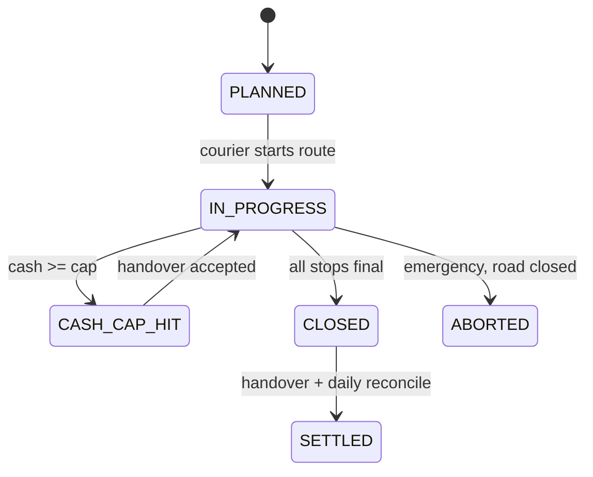

<div dir="rtl">

## 17. إدارة التوصيل: المندوبون والمناطق والعمولات

التوصيل في «تالي شام» ليس خطوة أخيرة في رحلة الطلب بل **مركز الكلفة والمخاطرة الأكبر**: كل ليرة من الإيراد تمر بيد مندوب، وكل عنوان غامض يتحول إلى محاولة فاشلة بشحن ذهاب وإياب على حساب المتجر، وكل يوم انقطاع كهرباء أو طريق يعيد ترتيب جدول اليوم. هذا القسم يحوّل التوصيل من اجتهاد يومي إلى عملية مُدارة بمعطيات: مَن يوصّل، وإلى أي منطقة، وبأي سعة، وكم نقداً يحمل، وكم يستحق. آليات التسوية النقدية النهائية مرجعها القسم رقم 8 (`cash_settlements`)، وصلاحيات المندوب وحدود المعدل وأمن جهازه مرجعها القسم رقم 9، وشاشات `/courier` الأساسية وطابور المزامنة مرجعها 10.5 — ولا يُعاد شيء منها هنا.

### 17.1 ملف المندوب وحالته وسعته

`couriers` سجل تشغيلي مستقل عن حساب المستخدم (`users`) الذي يمنحه الدخول؛ الفصل مقصود لأن المندوب قد يُوقَف تشغيلياً مع بقاء حسابه للاطلاع على مستحقاته.

| العمود | النوع | الوصف |
|---|---|---|
| `id` | `UUID` (v7) | المعرّف |
| `user_id` | `UUID` FK `users` | حساب الدخول برقم `+963` |
| `code` | `VARCHAR(8)` UNIQUE | رمز قصير للطباعة على الملصقات، مثل `DMS-04` |
| `full_name` | `VARCHAR(120)` | الاسم الثلاثي كما في الهوية |
| `national_id_hash` | `TEXT` | تجزئة رقم الهوية (لا يُخزَّن نصاً — القسم 9) |
| `id_media_id`, `license_media_id`, `vehicle_doc_media_id` | `UUID` FK `media` | صور الهوية ورخصة القيادة وأوراق المركبة |
| `employment_type` | `ENUM('EMPLOYEE','CONTRACTOR')` | موظف براتب أو متعاقد بالقطعة |
| `vehicle_type` | `ENUM('MOTORCYCLE','CAR','VAN','ON_FOOT')` | الدراجة هي الغالبة داخل دمشق |
| `vehicle_plate` | `VARCHAR(20)` | رقم اللوحة |
| `home_governorate` | `VARCHAR(40)` | محافظة العمل الأساسية |
| `daily_capacity` | `SMALLINT` | سقف الطلبات اليومي، افتراضي 18 للدراجة و28 للسيارة |
| `cash_cap_usd_cents` | `BIGINT` | السقف النقدي المسموح بحمله (بالمرجع الدولاري) |
| `status` | `ENUM('AVAILABLE','ON_ROUTE','OFF_DUTY','SUSPENDED')` | الحالة اللحظية |
| `suspension_reason` | `TEXT` | إلزامي عند `SUSPENDED` |
| `guarantor_name`, `guarantor_phone` | `VARCHAR` | كفيل شخصي — عرف سوري راسخ يقلل مخاطر النقد |
| `deposit_usd_cents` | `BIGINT` | تأمين نقدي مودع لدى المتجر |
| `rating_avg` | `NUMERIC(3,2)` | متوسط تقييم العملاء (القسم 14) |
| `active`, `created_at`, `updated_at` | | |

كل الجداول في هذا القسم امتداد لنموذج البيانات في القسم رقم 3: المعرّفات `UUIDv7`، والأسماء snake_case جمعاً، والمبالغ المرجعية `*_usd_cents BIGINT`، والمبالغ النقدية بالليرة مقرَّبة لأقرب 1000.

انتقالات الحالة: `AVAILABLE → ON_ROUTE` عند بدء جولة، والعودة إلى `AVAILABLE` عند إقفالها، و`OFF_DUTY` خارج الوردية، و`SUSPENDED` يدوياً أو **آلياً** عند تجاوز السقف النقدي 24 ساعة أو تكرار فروقات التسوية (القسم 9). المندوب في `SUSPENDED` أو `OFF_DUTY` لا يظهر في أي اقتراح إسناد.

### 17.2 مناطق التوصيل

المدينة السورية لا تُقسَّم برموز بريدية بل بأحياء معروفة بالاسم، فوحدة التخطيط هي **الحي**، وتُجمَّع الأحياء في مناطق (`delivery_zones`).

| العمود | النوع | الوصف |
|---|---|---|
| `id` | `UUID` | |
| `code` | `VARCHAR(16)` UNIQUE | مثل `DMS-C1` |
| `name` | `JSONB {ar,en}` | «دمشق - المركز» |
| `governorate`, `city` | `VARCHAR(40)` | مطابقة لقيم العنوان في القسم 8 |
| `neighborhoods` | `JSONB` (مصفوفة نصوص) | أسماء الأحياء المشمولة، مع مرادفات شائعة للمطابقة |
| `zone_type` | `ENUM('URBAN_CORE','URBAN_OUTER','SUBURBAN','REMOTE')` | يحدد التعريفة والمهلة |
| `surcharge_usd_cents` | `BIGINT` | رسم إضافي فوق تعريفة المحافظة (8.6) |
| `sla_hours` | `SMALLINT` | مهلة التوصيل المتعهد بها |
| `default_courier_id` | `UUID` FK `couriers` | المندوب الافتراضي |
| `cod_max_usd_cents` | `BIGINT` | سقف قيمة الطلب المسموح تسليمه نقداً في المنطقة |
| `active` | `BOOLEAN` | إيقاف منطقة مؤقتاً عند انقطاع طريق |

وجدول ربط `courier_zones(courier_id, zone_id, priority SMALLINT, PRIMARY KEY(courier_id, zone_id))` يسمح لمندوب بخدمة عدة مناطق بأولويات مختلفة.

| نموذج المنطقة | مثال | `surcharge` | `sla_hours` | ملاحظة |
|---|---|---|---|---|
| `URBAN_CORE` | المزرعة، الشعلان، الصالحية | 0 | 24 | كثافة عالية، جولة واحدة تكفي |
| `URBAN_OUTER` | برزة، القدم، دمر | 50 | 36 | مسافات أطول |
| `SUBURBAN` | جرمانا، صحنايا، قدسيا | 100 | 48 | حواجز وازدحام |
| `REMOTE` | الزبداني، قطنا | 200 | 72 | يوم توصيل محدد أسبوعياً |

تعريفة المحافظة الأساسية وعتبة الشحن المجاني معرَّفتان في 8.6؛ ما يضيفه هذا القسم هو **الرسم الإضافي للمنطقة** الذي يُجمع فوقها، ويُحتسب في `GET /api/v1/shipping/quote` قبل إنشاء الطلب. الشحن المجاني فوق العتبة يُسقط تعريفة المحافظة فقط ويُبقي رسم `REMOTE` ظاهراً بوضوح للعميل. **كلفة الإرجاع**: يتحملها المتجر إن كان سبب الفشل تشغيلياً (`ITEM_MISMATCH`, `LATE`)، ويُحتسب رسم إعادة يساوي تعريفة الشحن على العميل إن كان السبب `REFUSED` بلا مبرر أو `NO_ANSWER` بعد ثلاث محاولات، ويُقيَّد على `phone_blocklist` (8.8).

### 17.3 تعيين الطلبات والاقتراح الآلي

التعيين **قرار بشري** لدى مدير العمليات، لكن اللوحة تقترح الأنسب بترتيب مرجَّح يوازن ثلاثة قيود متضاربة: تغطية المنطقة، والسعة المتبقية، والنقد المحمول.

```text
score = 45 × zone_match          -- 1.0 مندوب المنطقة الافتراضي، 0.6 مغطٍّ ثانوي، 0 غير مغطٍّ
      + 30 × (1 - load/capacity) -- السعة المتبقية اليوم
      + 20 × (1 - cash/cash_cap) -- المتسع النقدي المتبقي
      + 5  × first_attempt_rate  -- أداء تاريخي (17.7)
      - 100 × hard_block         -- SUSPENDED أو تجاوز السقف أو خارج الوردية
```

`courier_assignments` هو سجل الإسناد وتاريخه:

| العمود | النوع | الوصف |
|---|---|---|
| `id`, `order_id`, `courier_id` | `UUID` | |
| `zone_id` | `UUID` FK `delivery_zones` | المنطقة المستنتجة من العنوان |
| `assigned_by` | `UUID` FK `users` | `NULL` إن كان إسناداً آلياً معتمداً |
| `assignment_mode` | `ENUM('MANUAL','SUGGESTED_ACCEPTED','AUTO')` | |
| `score` | `NUMERIC(5,2)` | درجة الاقتراح لحظة الإسناد (للتدقيق) |
| `state` | `ENUM('ASSIGNED','ACCEPTED','REASSIGNED','CANCELLED','COMPLETED')` | |
| `reassign_reason` | `ENUM('CAPACITY','ZONE_CHANGE','CASH_CAP','COURIER_UNAVAILABLE','CUSTOMER_REQUEST')` | إلزامي عند `REASSIGNED` |
| `expected_cash_usd_cents` | `BIGINT` | لقطة من `orders.total_usd_cents` وقت الإسناد |
| `assigned_at`, `released_at` | `TIMESTAMPTZ` | |

قيد جزئي: `UNIQUE(order_id) WHERE state IN ('ASSIGNED','ACCEPTED')` — لا يُسنَد طلب لمندوبين في آن واحد. إعادة التعيين تُغلق الصف القديم بـ `REASSIGNED` وتفتح صفاً جديداً، فيبقى الأثر كاملاً في `audit_logs`.

**التجميع في جولة**: اللوحة تقترح تجميع الطلبات غير المسنَدة حسب (المنطقة، نافذة الوقت)، وتنشئ جولة واحدة بضغطة، بحد أدنى 4 محطات لتبرير الجولة وحد أقصى `daily_capacity`.

قواعد إعادة التعيين عملية بحتة: لا تُعاد بعد بدء الجولة إلا بموافقة مدير العمليات، ولا تُعاد إطلاقاً بعد تسجيل محاولة تسليم على الطلب إلا بسبب `COURIER_UNAVAILABLE` (عطل مركبة، مرض، اعتقال طريق)، ويُبلَّغ العميل بواتساب فور تغيّر المندوب لأن اسم المندوب ورقمه ظهرا له مسبقاً. الاقتراح الآلي لا يُنفَّذ من تلقاء نفسه في الوضع الافتراضي: `assignment_mode='AUTO'` يبقى معطّلاً حتى يستقر معدل قبول الاقتراحات فوق 85% لثلاثين يوماً، عندها يُفعَّل للمناطق `URBAN_CORE` وحدها ويظل الإسناد اليدوي متاحاً دائماً.

### 17.4 جولة التوصيل والمحاولات



`delivery_routes`: `id`, `courier_id`, `route_date DATE`, `zone_ids UUID[]`, `state ENUM('PLANNED','IN_PROGRESS','CASH_CAP_HIT','CLOSED','ABORTED')`, `stops_planned SMALLINT`, `stops_done SMALLINT`, `expected_cash_usd_cents`, `collected_cash_syp BIGINT`, `started_at`, `closed_at`, `odometer_km NUMERIC(6,1)`، بقيد `UNIQUE(courier_id, route_date, seq)`.

`route_stops`: `id`, `route_id`, `order_id`, `seq SMALLINT`, `stop_state ENUM('PENDING','ARRIVED','DONE','FAILED','SKIPPED','RESCHEDULED')`, `eta_at`, `arrived_at`, `completed_at`, `rescheduled_to DATE`, `notes`. الترتيب يدوي بالسحب مع اقتراح تجميعي بالحي (لا حساب مسارات آلي: لا خرائط موثوقة ولا باقة بيانات تحتمله).

`delivery_attempts` سجل كل محاولة تسليم — ثلاث محاولات كحد أقصى لكل طلب، منسجماً مع سياسة المحاولات في القسم 8:

| العمود | النوع | الوصف |
|---|---|---|
| `id`, `order_id`, `courier_id`, `route_id` | `UUID` | |
| `attempt_no` | `SMALLINT` | 1..3، بقيد `UNIQUE(order_id, attempt_no)` |
| `outcome` | `ENUM('DELIVERED','FAILED','PARTIAL','RESCHEDULED')` | |
| `failure_reason` | `ENUM('NO_ANSWER','PHONE_OFF','REFUSED','BAD_ADDRESS','CUSTOMER_ABSENT','POSTPONED','NO_CASH','ITEM_MISMATCH','AREA_UNSAFE','ROAD_CLOSED','POWER_OUTAGE')` | إلزامي عند `FAILED` |
| `attempted_at`, `synced_at` | `TIMESTAMPTZ` | الفرق بينهما مؤشر انقطاع الشبكة |
| `geo_lat`, `geo_lng` | `NUMERIC(9,6)` | اختياري |
| `proof_media_id` | `UUID` | صورة أو توقيع |
| `courier_fault` | `BOOLEAN` | يحدده مدير العمليات، ويؤثر في العمولة (17.6) |

بعد المحاولة الثالثة الفاشلة ينتقل الطلب تلقائياً إلى `RETURNED_TO_ORIGIN`، وتُحرَّر حجوزات المخزون وفق القسم 7.

### 17.5 النقد: السقف وتسليم الحصيلة

السقف النقدي هو ضابط المخاطرة الأول. عند بلوغ `sum(collected) ≥ cash_cap_usd_cents` تتحول الجولة إلى `CASH_CAP_HIT`، ويحجب التطبيق زر التحصيل للمحطات التالية حتى يُسجَّل تسليم حصيلة مقبول. السقوف الافتراضية: 800 دولار للمندوب الجديد (أقل من 90 يوماً)، و2000 دولار بعد ثلاثة أشهر بلا فروقات، و3500 دولار للمندوب المودِع تأميناً.

`cash_handovers`: `id`, `courier_id`, `route_id`, `handover_no VARCHAR(16)` مطبوع مسبقاً على الإيصال الورقي، `amount_syp BIGINT` (مقرَّب لأقرب 1000)، `orders_count`, `fx_rate_used`, `amount_usd_cents`, `received_by UUID FK users`, `state ENUM('DECLARED','RECEIVED','DISPUTED','VOID')`, `declared_at`, `received_at`, `variance_syp BIGINT`, `denomination_breakdown JSONB` (عدّ الفئات النقدية)، `proof_media_id`, `settlement_id UUID FK cash_settlements`, `notes`.

السقف ليس تعبيراً عن انعدام الثقة بل عن واقع سوق تُنقل فيه ملايين الليرات ورقاً في حقيبة على دراجة، وفئة العملة الكبرى لا تكفي فيصبح مبلغ طلب واحد حزمة ضخمة. لذلك يقاس السقف بالمرجع الدولاري لا بالليرة، فلا يتآكل مع كل تحرك في سعر الصرف، ويُترجَم على شاشة المندوب إلى مبلغ بالليرة بسعر اليوم. ونظراً لانقطاع الكهرباء وتعذّر العدّ الآلي، يبقى **الإيصال الورقي المرقَّم مسبقاً** هو المستند الأصلي، ورقمه (`handover_no`) يُدخَل في النظام لربط الورق بالسجل الرقمي.

التدفق: يعلن المندوب المبلغ من `/courier/handover` فيُنشأ صف `DECLARED`؛ ويستلم أمين الصندوق فعلياً ويؤكد بـ `RECEIVED` مع عدّ الفئات؛ وأي فرق يفتح `DISPUTED` ويجمّد إسناد مهام جديدة. المطابقة النهائية بين مجموع `cash_handovers` وصف اليوم في `cash_settlements` تجري في مهمة التسوية اليومية المعرَّفة في القسم 8 — وهذا القسم لا يعيد تعريفها بل يغذّيها. **لا يجوز** أن يكون المستلم هو المندوب نفسه (فصل الواجبات، القسم 9).

### 17.6 العمولات

`commission_plans`: `id`, `name JSONB`, `model ENUM('PER_ORDER','PER_ZONE','PCT_OF_SHIPPING','HYBRID')`, `per_order_usd_cents`, `pct_of_shipping_bp SMALLINT`, `zone_rates JSONB` (خريطة `zone_id → usd_cents`), `failed_attempt_penalty_usd_cents`, `min_first_attempt_rate_bp`, `bonus_usd_cents`, `active_from`, `active_to`.

| النموذج | الاحتساب | متى يُستخدم |
|---|---|---|
| `PER_ORDER` | 120 سنتاً لكل طلب مسلَّم | جولات المدينة المتجانسة |
| `PER_ZONE` | تعريفة لكل منطقة (0.90 مركز، 1.60 خارجي، 2.50 بعيد) | مدينة متفاوتة المسافات |
| `PCT_OF_SHIPPING` | 60% من `shipping_fee` المحصَّل | متعاقدون بالقطعة |
| `HYBRID` | أساس ثابت + نسبة + مكافأة أداء | المندوب المثبَّت |

`courier_commissions`: `id`, `courier_id`, `plan_id`, `period_start DATE`, `period_end DATE`, `delivered_count`, `failed_courier_fault_count`, `gross_usd_cents`, `penalty_usd_cents`, `bonus_usd_cents`, `net_usd_cents`, `fx_rate_id`, `net_syp BIGINT`, `state ENUM('DRAFT','APPROVED','PAID','ON_HOLD')`, `approved_by`, `paid_at`, `payout_proof_media_id`، بقيد `UNIQUE(courier_id, period_start, period_end)`.

الدورة نصف شهرية (1–15، 16–نهاية الشهر): مهمة `commissions.calculate` تنشئ `DRAFT`، ثم يراجع مدير العمليات ويعتمد، والصرف نقداً خلال ثلاثة أيام عمل بالليرة بسعر يوم الاعتماد مقرَّباً لأقرب 1000. الخصم: كل محاولة فاشلة بـ `courier_fault = true` تخصم 60 سنتاً، وأي فرق نقدي غير مسوّى يضع الدورة في `ON_HOLD` حتى الإقفال.

### 17.7 مكاتب النقل البري

بين المحافظات لا يوجد مندوب ولا تكامل آلي؛ الشريك مكتب نقل يعمل بالبوليصة الورقية، والعقد معه يُوقَّع ورقياً ويُصوَّر ويُخزَّن في `media`، ويحدد أربعة بنود لا يجوز تركها شفوية: التعريفة لكل محافظة، وعمولة التحصيل النقدي، وزمن التسليم المتفق عليه، ومسؤولية التلف أو الفقد وسقف التعويض عن جهاز مفقود.

`transport_offices`: `id`, `name JSONB`, `contact_phone`, `governorates_covered JSONB`, `contract_media_id`, `tariff JSONB` (تعريفة لكل محافظة)، `cod_commission_bp SMALLINT` (عمولة التحصيل، عادة 100–200 نقطة أساس)، `settlement_cycle ENUM('DAILY','WEEKLY')`, `agreed_transit_hours SMALLINT`, `active`.

`transport_office_settlements`: `id`, `office_id`, `period_start`, `period_end`, `waybills_count`, `collected_amount_syp`, `office_fees_syp`, `net_due_syp`, `state ENUM('OPEN','RECONCILED','SETTLED','DISPUTED')`, `reconciled_by`, `settled_at`.

المتابعة بلا تكامل: مهمة يومية `shipments.stale-waybill-check` ترفع تنبيهاً لكل بوليصة تجاوزت `agreed_transit_hours` بلا تحديث، فيتصل موظف العمليات بالمكتب هاتفياً ويحدّث الحالة يدوياً بمصدر `OFFICE_SYNC`، ويُخطر العميل عبر واتساب. مؤشر `office_on_time_rate` لكل مكتب يُراجَع شهرياً، وتحت 80% يُوقف المكتب عن الطلبات الجديدة.

### 17.8 شاشات `/courier` الخاصة بهذا القسم

بالإضافة إلى شاشات 10.5، تضيف إدارة التوصيل: `/courier/route/{id}` (المحطات بالترتيب مع حالة كل محطة وزر «وصلت»)، و`/courier/attempts/{orderId}` (تسجيل محاولة بسبب مصنَّف من قائمة مغلقة)، و`/courier/handover` (إعلان الحصيلة مع عدّ الفئات ورقم الإيصال الورقي)، و`/courier/earnings` (عمولة الدورة الحالية للقراءة فقط). كل هذه الشاشات تكتب في طابور المزامنة نفسه الموصوف في 10.5. **حد البيانات على الجهاز**: طلبات اليوم فقط، وتُمسح محلياً بعد 24 ساعة من إقفال الجولة، ولا يُخزَّن أبداً IMEI كاملاً ولا رقم العميل الكامل بعد الإقفال — تفصيل الضوابط في القسم 9.

### 17.9 لوحة تقييم المندوب الشهرية

التقييم شهري لا يومي، وغرضه التصحيح لا العقاب: تُعرض اللوحة للمندوب نفسه في `/courier/earnings` بجانب عمولته، لأن ربط الأداء بالدخل مباشرةً أنجع من التنبيه الإداري. المؤشرات تُحتسب من بيانات موجودة أصلاً بلا إدخال يدوي إضافي، وتُقرأ تقاريرها من لوحة التحكم (القسم 10) لا من واجهة المندوب.

| المؤشر | المصدر | الهدف | حد التدخل |
|---|---|---|---|
| نسبة التسليم من أول محاولة | `delivery_attempts` | ≥ 85% | < 70% |
| متوسط زمن `OUT_FOR_DELIVERY → DELIVERED` | `order_status_history` | ≤ 6 ساعات داخل المدينة | > 12 ساعة |
| نسبة الفشل بخطأ المندوب | `courier_fault = true` | ≤ 3% | > 8% |
| فرق النقد التراكمي | `cash_handovers.variance_syp` | 0 | أي فرق غير مبرَّر |
| شكاوى العملاء | تذاكر الدعم (القسم 14) | ≤ 2 شهرياً | > 5 |
| زمن بقاء الإجراءات في الطابور | `synced_at - attempted_at` | ≤ 2 ساعة | > 6 ساعات |

### 17.10 مسارات API الجديدة

| المسار | الصلاحية | الغرض |
|---|---|---|
| `GET/POST /api/v1/admin/couriers` | `couriers:read:any` / `couriers:write:any` | إدارة المندوبين |
| `PATCH /api/v1/admin/couriers/{id}/status` | `couriers:write:any` | تغيير الحالة أو الإيقاف |
| `GET /api/v1/admin/couriers/{id}/scorecard` | `couriers:read:any` | لوحة التقييم الشهرية |
| `GET/POST/PATCH /api/v1/admin/delivery-zones` | `zones:read:any` / `zones:write:any` | المناطق وربط المندوبين |
| `GET /api/v1/admin/assignments/suggest?orderId=` | `assignments:read:any` | الاقتراح الآلي مرتباً بالدرجة |
| `POST /api/v1/admin/orders/{id}/assign` | `assignments:write:any` | الإسناد وإعادة الإسناد |
| `POST/PATCH /api/v1/admin/routes` | `routes:write:any` | إنشاء الجولات وترتيب المحطات |
| `POST /api/v1/courier/routes/{id}/start\|close` | `routes:update:own` | بدء الجولة وإقفالها |
| `POST /api/v1/courier/orders/{id}/attempts` | `attempts:write:own` | تسجيل محاولة تسليم |
| `POST /api/v1/courier/handovers` | `cash:handover:own` | إعلان تسليم الحصيلة |
| `POST /api/v1/admin/handovers/{id}/receive` | `cash:handover:approve:any` | استلام الحصيلة وعدّ الفئات |
| `GET/POST /api/v1/admin/commission-plans` | `commissions:write:any` | خطط العمولة |
| `POST /api/v1/admin/commissions/run` | `commissions:write:any` | تشغيل دورة الاحتساب |
| `GET /api/v1/courier/commissions/me` | `commissions:read:own` | مستحقات المندوب |
| `GET/POST /api/v1/admin/transport-offices` | `logistics:write:any` | مكاتب النقل وتعريفاتها |
| `POST /api/v1/admin/transport-offices/{id}/settlements/{sid}/settle` | `settlements:write:any` | إقفال مستحقات المكتب |
| `GET /api/v1/shipping/quote` | عام | تعريفة المحافظة + رسم المنطقة + المهلة |

مثال استجابة الاقتراح:

```json
{
  "orderId": "018f5b2c-9a41-7c3e-b8d2-6f0a1c4e7d55",
  "zone": { "id": "018f5a10-4c22-7b11-9f30-2a7c5d9e1b04", "code": "DMS-C1" },
  "suggestions": [
    { "courierId": "018f59aa-1b02-7d44-8e91-3c5b7f2a6d18", "code": "DMS-04",
      "score": 92.4, "load": 9, "capacity": 18, "cashUsedPct": 31, "firstAttemptRate": 0.91 },
    { "courierId": "018f59ab-7e13-7a05-9c22-8d4f1e6b3a72", "code": "DMS-07",
      "score": 61.8, "load": 15, "capacity": 18, "cashUsedPct": 74, "firstAttemptRate": 0.78 }
  ]
}
```

</div>
