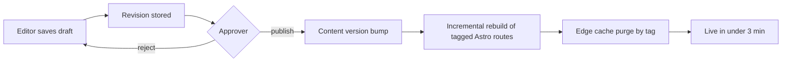
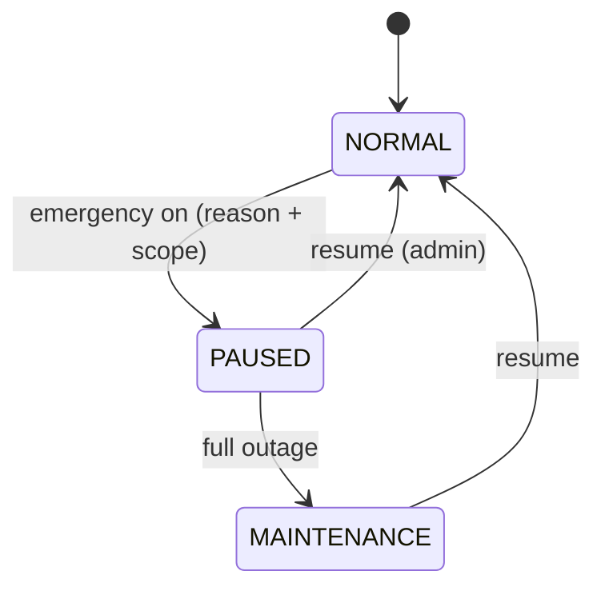

<div dir="rtl">

## 18. المحتوى والسياسات وإعدادات المتجر

### 18.1 المبدأ الحاكم: قيمة واحدة، مصدر واحد، بلا نشر كود

كل رقم أو نص يتغيّر بتغيّر السوق أو الموسم أو الظرف الأمني يجب أن يكون صفاً في قاعدة البيانات يحرّره مخوَّل من `admin.talisham.com`، لا ثابتاً في الكود. القاعدة العملية ثلاثية:

| النوع | أين يعيش | من يغيّره | أثر التغيير |
|---|---|---|---|
| إعداد سلوكي (سقوف، مهل، محافظات مخدَّمة) | `store_settings` | `settings:manage:any` | فوري، يقرأه `apps/api` من ذاكرة مؤقتة عمرها 60 ثانية |
| محتوى تسويقي (بانر، مجموعة، إعلان، صفحة، مقال) | `banners`, `collections`, `announcements`, `pages`, `posts` | `content:write:any` ثم `content:publish:any` | يستدعي **إعادة بناء تدريجية** لصفحات Astro المتأثرة فقط |
| نص واجهة | `ui_strings` | `content:write:any` + مراجعة | نشر دفعة نصوص كملف JSON على الحافة |

ما يبقى في الكود: منطق الأعمال، مخطط قاعدة البيانات، وقيم لا يجوز لغير المطوّر لمسها (خوارزمية الحجز، صيغة رقم الطلب `TS-YYMM-NNNNNN`). ميزانيات الأداء مرجعها القسم رقم 5 حصراً، وحدود المعدل القسم رقم 9 حصراً؛ هذا القسم لا يعيد تعريف أي منهما.

### 18.2 إدارة المحتوى: البانرات والمجموعات وشريط الإعلان

شاشات التحرير والمعاينة موصوفة في القسم رقم 10 (10.12)؛ هنا العقد البياني والسلوكي.

**البانرات** (`banners`): كل بانر نافذة زمنية `starts_at`/`ends_at` بتوقيت `Asia/Damascus`، وترتيب `sort_order`، وموضع `placement`، ونص بديل عربي إلزامي. الجدولة تعني أن المدير يجهّز حملة العيد مسبقاً وتُنشر تلقائياً دون تدخل ليلي — مهم في بلد ينقطع فيه التيار ليلاً.

**المجموعات المختارة** (`collections`): ثلاثة أنماط في نموذج واحد:

- `MANUAL`: انتقاء يدوي مرتّب عبر `collection_items` (مثال: «اختيار المدير هذا الأسبوع»).
- `RULE`: قاعدة JSON تُترجَم إلى استعلام على الكتالوج (القسم رقم 7)، مثل `{"brand":["samsung"],"price_usd_cents":{"lte":25000},"in_stock":true}`.
- `AUTO`: مؤشر محسوب دورياً — `BEST_SELLERS` (مبيعات 30 يوماً)، `MOST_VIEWED`، `PRICE_DROPS`.

في كل الأنماط يُطبَّق مرشّح إلزامي: لا يُعرض متغيّر `on_hand - reserved <= 0`، لأن عرض منتج غير متوفر على شبكة بطيئة يكلّف الزبون قليل الثقة رحلة كاملة بلا نتيجة.

**شريط الإعلان العلوي** (`announcements`): سطر واحد فوق الترويسة، بلون خلفية وأيقونة نصية ورابط اختياري ونافذة زمنية وإمكانية إغلاق من المستخدم (`dismissible`) تُحفظ محلياً. استعمالاته الفعلية: تغيّر سعر الصرف، تعطّل التوصيل في محافظة، رفض فئة نقدية معيّنة، تعليق الطلبات مؤقتاً.



النشر لا يعيد بناء الموقع كاملاً: كل صفحة Astro تحمل وسم تخزين، والنشر يبطل وسوم المسارات المتأثرة فقط ويعيد بناءها تدريجياً (تفاصيل المعمارية في القسم رقم 2، وأثر ذلك على SEO في القسم رقم 12). تغيير سعر الصرف **لا** يستدعي إعادة بناء: الأسعار بالليرة تُحسب في جزيرة React من `/api/v1/fx-rates/current`، وإلا لاحتجنا بناءً كاملاً كلما تحرّك السوق.

### 18.3 الصفحات القانونية والسياسات

كل صفحة سياسة صف في `pages` بنوع `LEGAL`، لها مالك بشري ودورية مراجعة. القاعدة الصارمة: **كل رقم داخل نص السياسة يُحقن من `store_settings` وقت البناء عبر شفرات `{{setting.key}}`**، فلا تقول السياسة «الإرجاع خلال 7 أيام» بينما النظام يطبّق 14.

| الصفحة | المسار | المالك | دورية المراجعة | الحقول المحقونة من الإعدادات |
|---|---|---|---|---|
| الشروط والأحكام | `/terms` | المالك + مستشار قانوني | سنوياً أو عند تغيير قانوني | `cod_max_order_usd_cents`, `max_open_orders_per_phone` |
| سياسة الخصوصية | `/privacy` | المالك | سنوياً | `data_retention_months`, `support_email` |
| سياسة الإرجاع والاستبدال | `/returns` | مدير العمليات | ربع سنوي | `return_window_days`, `return_shipping_payer`, `restocking_fee_bp` |
| سياسة الكفالة | `/warranty` | مدير ما بعد البيع | ربع سنوي | `default_warranty_months`, `warranty_center_addresses` |
| سياسة الشحن والتوصيل | `/shipping` | مدير العمليات | شهري | `free_shipping_threshold_usd_cents`, `served_governorates`, `delivery_sla_days` |
| الأسئلة الشائعة | `/faq` | خدمة العملاء | شهري | `confirmation_window_hours`, `cash_rounding_unit_syp` |
| من نحن | `/about` | التسويق | نصف سنوي | `branches` (فروع فعلية إن وُجدت) |
| تواصل معنا | `/contact` | خدمة العملاء | شهري | `support_phone`, `whatsapp_official`, `business_hours` |

المراجعة ليست شعاراً: مهمة مجدولة تفتح مهمة في اللوحة لمالك كل صفحة تجاوز `reviewed_at + review_every_days`، وتظهر ضمن «يحتاج تدخلاً» في لوحة الصيانة (القسم رقم 10). ولأن نص السياسة قد يُحتجّ به، كل نسخة منشورة تُحفظ في `content_revisions` بختم زمني ومحرِّر، ويُسجَّل النشر في `audit_logs`.

### 18.4 إعدادات المتجر

جدول `store_settings` مفتاح/قيمة مطبوع (`value JSONB` + `value_type`) لا صف عريض، ليتوسّع دون هجرات. المفاتيح المعتمدة عند الإطلاق:

| المفتاح | النوع | القيمة الافتراضية | ملاحظة |
|---|---|---|---|
| `business_hours` | `JSON` | سبت–خميس 10:00–20:00، الجمعة مغلق | أيام العطل الرسمية في `holidays` |
| `orders_paused` | `BOOL` | `false` | يوقف زر «إتمام الطلب» ويُبقي التصفح |
| `orders_paused_reason` | `I18N` | — | يُعرض للزبون كما هو |
| `maintenance_mode` | `BOOL` | `false` | صفحة صيانة كاملة عدا `/status` |
| `display_currency_default` | `STRING` | `SYP` | العرض بالليرة، والتخزين المرجعي `price_usd_cents` |
| `fx_source_note` | `I18N` | — | سطر يشرح مصدر السعر وتاريخ تحديثه |
| `fx_quote_ttl_hours` | `INT` | `48` | صلاحية `orders.fx_rate` المثبَّت |
| `served_governorates` | `JSON` | دمشق، ريف دمشق، حلب، حمص، حماة، اللاذقية، طرطوس | غير المخدَّمة تظهر «قريباً» |
| `free_shipping_threshold_usd_cents` | `INT` | `30000` | صفر = تعطيل |
| `cod_max_order_usd_cents` | `INT` | `120000` | السقف والاستثناءات في القسم رقم 7 |
| `max_open_orders_per_phone` | `INT` | `3` | ضابط مكافحة الطلبات الوهمية |
| `confirmation_window_hours` | `INT` | `48` | نافذة التأكيد الهاتفي |
| `confirmation_max_attempts` | `INT` | `3` | ثلاث محاولات ثم `CANCELLED` |
| `cash_rounding_unit_syp` | `INT` | `1000` | تقريب المبلغ النقدي لأقرب 10 ليرات |
| `return_window_days` | `INT` | `7` | يُحقن في `/returns` |
| `support_phone` / `whatsapp_official` | `STRING` | `+963…` | رقم واتساب الرسمي قناة أولى |
| `dnd_windows` | `JSON` | `22:00–09:00` + الجمعة صباحاً | نوافذ عدم الإزعاج: تؤجَّل الإشعارات غير الحرجة |
| `tax_rate_bp` | `INT` | `0` | لا ضريبة قيمة مضافة |

نوافذ عدم الإزعاج تحكم قناة واتساب ← SMS ← بريد؛ الاستثناء الوحيد رسائل رمز التحقق ومكالمة المندوب «أنا أمام البناء».

ثلاثة سلوكيات تستحق التنصيص لأنها مصدر لبس متكرر. **ساعات العمل لا توقف الطلب**: خارج الدوام يبقى الشراء متاحاً، لكن الواجهة تعرض بصراحة «سنتصل بك لتأكيد الطلب غداً بعد الساعة 10:00»، وعدّاد نافذة التأكيد (48 ساعة) يبدأ من أول ساعة عمل لا من لحظة الإنشاء، وإلا احترقت محاولات التأكيد الثلاث في عطلة الجمعة. **عتبة الشحن المجاني تُقارَن بالإجمالي بالدولار قبل الشحن وبعد الخصم**، لأن المقارنة بالليرة تجعل العتبة تتحرك مع كل تعديل صرف ويشتكي الزبون من تغيّر الشرط بين زيارتين. **وحدة تقريب النقد** تُطبَّق على المبلغ النهائي المطلوب من المندوب فقط، بينما `orders.total_syp` يبقى بالقيمة المحسوبة الدقيقة، وفرق التقريب يُسجَّل بنداً صريحاً حتى تُقفل `cash_settlements` بلا انحراف تراكمي. وأي تعديل على مفاتيح السقوف أو المهل يُطبَّق على الطلبات الجديدة فقط، ولا يُعاد احتسابه بأثر رجعي على طلب قائم — السعر والمهلة المثبَّتان وقت التأكيد هما العقد مع الزبون.

### 18.5 نصوص الواجهة (i18n) بمراجعة قبل النشر

`ui_strings` مفتاح مسطّح (`checkout.cod_notice`) بقيمة `JSONB {ar,en}` ونطاق (`site`, `app`, `admin`, `courier`, `notifications`). التحرير من اللوحة ينشئ مسودة بحالة `PENDING_REVIEW`؛ لا تصل إلى الإنتاج إلا بموافقة صاحب `content:publish:any`. عند النشر تُصدَّر دفعة كاملة كملف `ar.json` موقّع برقم إصدار، ويُحمّل من الحافة مع رجوع تلقائي إلى الملف المضمَّن في الحزمة إن فشل الجلب — فالواجهة لا تُظهر مفاتيح خام على شبكة سيئة. أي مفتاح ناقص في `en` يرث العربية.

### 18.6 وضع الطوارئ

زر واحد في `/settings/emergency` يوقف استقبال الطلبات فوراً بسبب معلَّل. لحالات: انقطاع كهرباء طويل، نفاد شامل بعد قفزة صرف، أو ظرف أمني في محافظة.



سلوكه بالتفصيل: يعطّل إنشاء الطلبات ويُبقي التصفح والبحث والسلة؛ يعرض شريط إعلان بنص السبب؛ يوقف الحملات الإعلانية عبر علم `ads_paused`؛ يحوّل زر السلة إلى «اطلب عبر واتساب»؛ ولا يمسّ الطلبات الجارية — التوصيل والتحصيل يستمران. النطاق قد يكون كلياً أو محافظات محددة (`scope.governorates`)، فيُغلق حلب مثلاً ويبقى الساحل يعمل. التفعيل والإيقاف يُسجَّلان في `audit_logs` مع مدة نافذة إلزامية `expires_at` تعيد المتجر تلقائياً إن نُسي الزر مفعّلاً.

### 18.7 وحدة اختيارية لمرحلة لاحقة: الفرع الفعلي ونقطة البيع

جدول `branches` يُنشأ من الآن (تعبئته اختيارية) لأن صفحات «من نحن» و«تواصل معنا» تقرأ منه، وثقة السوق السوري ترتفع كثيراً بوجود عنوان فعلي. الوحدة الكاملة تأتي في مرحلة لاحقة من خارطة الطريق (القسم رقم 12) بثلاث قدرات: بيع مباشر في المحل يخصم من **نفس** `inventory_levels` عبر `inventory_movements` بسبب `POS_SALE`؛ حجز أونلاين واستلام من الفرع بطريقة شحن جديدة `BRANCH_PICKUP` تُضاف إلى `shipping_method`؛ ومزامنة النقد بجلسة صندوق `pos_sessions` تُقفل يومياً وتغذّي `cash_settlements` نفسه. أثرها على نموذج البيانات: `branches`, `pos_sessions`, `pos_sales`, وعمود `branch_id` على `warehouses` و`orders`. لا يُبنى شيء منها قبل وجود فرع فعلي.

### 18.8 الجداول الجديدة (امتداد لنموذج البيانات في القسم رقم 3)

كلها `UUIDv7` وطوابع `created_at`/`updated_at TIMESTAMPTZ`.

| الجدول | الأعمدة | قيود |
|---|---|---|
| `store_settings` | `id`, `key VARCHAR(64)`, `value JSONB NOT NULL`, `value_type setting_type`, `scope VARCHAR(32) DEFAULT 'global'`, `is_public BOOLEAN DEFAULT false`, `description JSONB`, `updated_by FK users` | `UNIQUE(key, scope)`؛ `is_public` يحدد ما يظهر في `/settings/public` |
| `banners` | `id`, `title JSONB`, `alt_text JSONB NOT NULL`, `media_mobile_id FK media`, `media_desktop_id FK media`, `link_url TEXT`, `placement banner_placement`, `audience VARCHAR(16)`, `starts_at`, `ends_at`, `sort_order SMALLINT`, `status content_status`, `deleted_at` | `CHECK (ends_at IS NULL OR ends_at > starts_at)`، فهرس `(placement, status, starts_at, ends_at)` |
| `announcements` | `id`, `text JSONB NOT NULL`, `link_url TEXT`, `severity VARCHAR(12)`, `dismissible BOOLEAN DEFAULT true`, `starts_at`, `ends_at`, `status content_status` | صف نشط واحد كحد أقصى: فهرس جزئي فريد على `status='PUBLISHED'` مع نوافذ غير متداخلة |
| `collections` | `id`, `slug`, `title JSONB`, `type collection_type`, `rules JSONB NULL`, `max_items SMALLINT DEFAULT 12`, `sort_order SMALLINT`, `status content_status`, `refreshed_at`, `deleted_at` | `UNIQUE(slug) WHERE deleted_at IS NULL`، `CHECK (type <> 'RULE' OR rules IS NOT NULL)` |
| `collection_items` | `id`, `collection_id FK`, `variant_id FK product_variants`, `position SMALLINT`, `pinned BOOLEAN DEFAULT false` | `UNIQUE(collection_id, variant_id)`؛ يُستخدم في `MANUAL` وللتثبيت فوق نتائج القاعدة |
| `pages` | `id`, `slug`, `type page_type`, `title JSONB`, `body JSONB NOT NULL`, `seo JSONB`, `owner_role VARCHAR(32)`, `review_every_days SMALLINT`, `reviewed_at`, `published_at`, `status content_status`, `deleted_at` | `UNIQUE(slug) WHERE deleted_at IS NULL`؛ `body` محتوى كتل لا HTML خام |
| `posts` | `id`, `slug`, `title JSONB`, `excerpt JSONB`, `body JSONB`, `cover_media_id FK media`, `seo JSONB`, `author_id FK users`, `published_at`, `reading_minutes SMALLINT`, `status content_status`, `deleted_at` | `UNIQUE(slug) WHERE deleted_at IS NULL`؛ الربط بالمنتجات عبر `post_products` (القسم رقم 10) |
| `ui_strings` | `id`, `key VARCHAR(96)`, `namespace VARCHAR(16)`, `value JSONB NOT NULL`, `status string_status`, `reviewed_by FK users`, `version INT` | `UNIQUE(key, namespace)`؛ `CHECK (value ? 'ar')` |
| `content_revisions` | `id`, `entity_type VARCHAR(24)`, `entity_id UUID`, `snapshot JSONB NOT NULL`, `version INT`, `actor_id FK users`, `note TEXT`, `created_at` | فهرس `(entity_type, entity_id, version DESC)`؛ غير قابل للتعديل |
| `holidays` | `id`, `date DATE`, `name JSONB`, `closes_orders BOOLEAN DEFAULT false` | `UNIQUE(date)` |
| `branches` | `id`, `name JSONB`, `governorate governorate`, `city`, `neighborhood`, `street`, `landmark NOT NULL`, `phone`, `geo_lat`, `geo_lng`, `hours JSONB`, `warehouse_id FK NULL`, `is_pickup_point BOOLEAN DEFAULT false`, `status`, `deleted_at` | نفس بنية العنوان في القسم رقم 3، بلا رمز بريدي |

### 18.9 مسارات API الجديدة

| المسار | الفعل | الصلاحية | الوصف |
|---|---|---|---|
| `/api/v1/content/home` | GET | عام | بانرات + مجموعات + إعلان نشط في استدعاء واحد |
| `/api/v1/content/pages/{slug}` | GET | عام | صفحة ثابتة أو قانونية بعد حقن الإعدادات |
| `/api/v1/content/posts` · `/{slug}` | GET | عام | قائمة المقالات ومقال مفرد |
| `/api/v1/settings/public` | GET | عام | الإعدادات العلنية فقط (`is_public`) |
| `/api/v1/i18n/{namespace}/{locale}` | GET | عام | دفعة نصوص الواجهة المنشورة برقم إصدار |
| `/api/v1/admin/settings` | GET, PATCH | `settings:manage:any` | قراءة وتعديل المفاتيح مع تدقيق |
| `/api/v1/admin/settings/emergency` | POST, DELETE | `settings:manage:any` | تفعيل/إلغاء وضع الطوارئ بسبب ونطاق ومهلة |
| `/api/v1/admin/banners` · `/{id}` | GET, POST, PATCH, DELETE | `content:write:any` | إدارة البانرات |
| `/api/v1/admin/announcements` · `/{id}` | GET, POST, PATCH | `content:write:any` | شريط الإعلان |
| `/api/v1/admin/collections` · `/{id}` · `/{id}/preview` | GET, POST, PATCH | `content:write:any` | المجموعات ومعاينة نتيجة القاعدة قبل النشر |
| `/api/v1/admin/pages` · `/{id}` · `/{id}/publish` | GET, POST, PATCH | `content:write:any` / `content:publish:any` | الصفحات والسياسات |
| `/api/v1/admin/posts` · `/{id}` · `/{id}/publish` | GET, POST, PATCH | `content:write:any` / `content:publish:any` | المدونة |
| `/api/v1/admin/ui-strings` · `/{id}/approve` | GET, PUT, POST | `content:write:any` / `content:publish:any` | نصوص الواجهة والمراجعة |
| `/api/v1/admin/content/revisions` · `/{id}/restore` | GET, POST | `content:publish:any` | النسخ والاستعادة |
| `/api/v1/admin/content/revalidate` | POST | `content:publish:any` | إعادة بناء تدريجية لمسارات محددة |
| `/api/v1/branches` · `/api/v1/admin/branches` | GET · CRUD | عام · `settings:manage:any` | الفروع ونقاط الاستلام |

```json
POST /api/v1/admin/settings/emergency
{
  "reason": { "ar": "انقطاع تيار طويل في دمشق، نستأنف غداً 10 صباحاً", "en": "Extended power outage in Damascus" },
  "scope": { "governorates": ["DAMASCUS", "RURAL_DAMASCUS"] },
  "pause_orders": true,
  "pause_ads": true,
  "expires_at": "2026-07-29T07:00:00Z"
}
```

---

**ما غطّاه هذا القسم (لبقية الكتّاب):**

1. مبدأ الفصل بين الإعداد السلوكي والمحتوى ونصوص الواجهة، وأن تغيير المحتوى يستدعي إعادة بناء تدريجية لمسارات Astro المتأثرة فقط بينما سعر الصرف لا يستدعيها.
2. البانرات المجدولة، المجموعات بأنماط `MANUAL`/`RULE`/`AUTO` مع إخفاء غير المتوفر، وشريط الإعلان العلوي، والنسخ القابلة للاستعادة.
3. جدول الصفحات القانونية بمالك ودورية مراجعة، مع قاعدة حقن كل رقم من `store_settings` بشفرات `{{setting.key}}` لمنع تناقض السياسة مع سلوك النظام.
4. جدول إعدادات المتجر الكامل (ساعات العمل، الصيانة، إيقاف الطلبات، المحافظات المخدَّمة، عتبة الشحن المجاني، سقف الدفع عند الاستلام، حد الطلبات المفتوحة، مهلة التأكيد 48 ساعة، تقريب النقد 10 ليرات جديدة، نوافذ عدم الإزعاج)، وإدارة i18n بمراجعة، ووضع الطوارئ بنطاق ومهلة تلقائية.
5. وحدة الفرع ونقطة البيع كامتداد لمرحلة لاحقة يخصم من نفس المخزون ويغذّي `cash_settlements`.

**الجداول الجديدة:** `store_settings`, `banners`, `announcements`, `collections`, `collection_items`, `pages`, `posts`, `ui_strings`, `content_revisions`, `holidays`, `branches` (ولاحقاً: `pos_sessions`, `pos_sales`). **الأنواع المعدودة الجديدة:** `setting_type`, `content_status`, `collection_type`, `page_type`, `banner_placement`, `string_status`.

**المسارات الجديدة:** `/api/v1/content/*`, `/api/v1/settings/public`, `/api/v1/i18n/{namespace}/{locale}`, `/api/v1/branches`, و`/api/v1/admin/{settings,settings/emergency,banners,announcements,collections,pages,posts,ui-strings,content/revisions,content/revalidate,branches}`.

</div>
