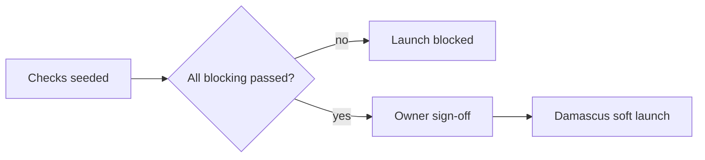

<div dir="rtl">

## 19. مصفوفة الاكتمال: ما يخدم العميل وما يخدم الإدارة

هذا القسم **مرجعي لا شرحي**. غايته إثبات أن «تالي شام» منظومة مكتملة لا مجموعة شاشات، وأن كل ما هو خارجها مستبعَد بقرار مكتوب لا بسهو. كل صف يحيل إلى الفصل صاحب التعريف، ولا يعيد تعريف شيء. المراحل الزمنية ثلاث: **M0** إطلاق دمشق وريفها، **M1** التوسع إلى بقية المحافظات (شهر 2–4)، **M2** ما بعد الاستقرار (شهر 5+).

### 19.1 رحلة العميل من الاكتشاف إلى ما بعد البيع

| المرحلة | ما يستطيع العميل فعله | الشاشة أو المسار | الفصل المرجعي | المرحلة الزمنية |
|---|---|---|---|---|
| الاكتشاف | يصل من بحث Google أو رابط واتساب إلى صفحة ساكنة كاملة المحتوى تفتح على 3G بطيء بلا انتظار JavaScript | `/`، `/c/[slug]`، `/b/[slug]`، `/blog/[slug]` | 5، 12 | M0 |
| التصفح والتصنيف | يرشّح بالعلامة والسعر والحالة (جديد/مستعمل) وصحة البطارية والتوفر، ويفرز، ويتصفح بترقيم صفحات يعمل بلا JS | `/c/[slug]?brand=…&condition=…` | 6، 7 | M0 |
| البحث | يبحث بالعربية والإنجليزية مع تسامح إملائي واقتراحات فورية، ويبحث عن ملحق يناسب جهازه | `/search`، جزيرة `SearchBar` | 6 | M0 |
| المقارنة | يقارن حتى 4 أجهزة في جدول فروق، ويحفظ المقارنة في حسابه ويشاركها برابط | `/compare`، `/app/account/comparisons` | 6 | M0 |
| صفحة المنتج | يرى السعر بالليرة وبالدولار، والتوفر الحقيقي، وحالة الجهاز ودرجته وصحة بطاريته ونوع الكفالة، والصور، والأسئلة والأجوبة، والمراجعات | `/p/[slug]` | 5، 7، 14 | M0 |
| تنبيه السعر والتوفر | يطلب إشعاراً عند نزول السعر أو عودة التوفر عبر واتساب | `/app/account/alerts` | 12، 14 | M1 |
| السلة | يضيف ويعدّل الكميات ويرى تكلفة الشحن حسب المحافظة قبل تسجيل الدخول، وتبقى السلة بعد إغلاق المتصفح | `/app/cart` | 8 | M0 |
| قائمة الرغبات | يحفظ منتجات للعودة إليها ويحوّلها إلى سلة | `/app/wishlist` | 14 | M0 |
| الدخول | يدخل برقم `+963` ورمز تحقق عبر واتساب، وSMS احتياطاً | `/app/login` | 9 | M0 |
| إتمام الطلب | يختار عنواناً (محافظة، مدينة، حي، شارع، معلم قريب إلزامي) وطريقة شحن ودفعاً عند الاستلام حصراً، ويرى المبلغ النقدي مقرَّباً لأقرب 1000 ليرة وسعر الصرف المثبَّت | `/app/checkout` | 8، 13 | M0 |
| التأكيد | يستقبل رقم طلب `TS-YYMM-NNNNNN` عبر واتساب، ثم مكالمة تأكيد ضمن 48 ساعة وثلاث محاولات، ويستطيع الإلغاء قبل التجهيز | `/app/orders/:orderNo` | 8 | M0 |
| التتبع | يتابع الحالة من `PROCESSING` إلى `DELIVERED`، ويرى اسم المندوب ورقمه أو مكتب النقل ورقم البوليصة، ويتتبع بلا تسجيل دخول برقم الطلب والهاتف | `/app/orders/:id/tracking`، `/app/track` | 8، 17 | M0 |
| إعادة الجدولة | يطلب تأجيل التسليم أو تغيير العنوان قبل خروج المندوب | `/app/orders/:id` | 17 | M1 |
| الاستلام والدفع | يعاين الجهاز عند الباب، ويدفع نقداً، ويستلم إيصالاً ورقياً ورسالة تحصيل على واتساب مع IMEI المسلَّم | واجهة المندوب `/courier/orders/{id}/collect` | 8، 17 | M0 |
| التقييم | يقيّم المنتج والتجربة بعد 3 أيام من التسليم برابط موجّه، بشارة «شراء موثّق» | `/app/orders/:id`، نموذج المراجعة | 14 | M0 |
| الدعم | يفتح تذكرة أو يسأل سؤالاً عن منتج أو يقرأ المساعدة، مع تصعيد إلى واتساب | `/app/support`، `/help/faq`، `/help/articles` | 14 | M0 |
| الإرجاع | يطلب إرجاعاً ضمن مهلة عدم الرضا، ويتابع `RETURN_REQUESTED → RETURNED`، ويستلم المبلغ نقداً | `/app/orders/:id` ← طلب إرجاع | 8 | M0 |
| الكفالة والصيانة | يرى كفالات أجهزته بتواريخ بدايتها ونهايتها، ويفتح مطالبة صيانة ويتابع مراحلها ويستلم جهاز إعارة عند توفره | `/app/account/warranties`، `/app/account/claims/{claim_no}` | 15 | M0 |
| إدارة الحساب | يدير عناوينه وأجهزته المسجَّلة وجلساته وتفضيلات الإشعار، ويطلب حذف حسابه | `/app/account/*` | 9، 14 | M0 |
| إعادة الشراء | يعيد طلب محتويات طلب سابق بضغطة، ويشتري ملحقات مقترحة لجهازه المُسلَّم | `/app/orders`، `/orders/{orderNo}/reorder` | 12، 14 | M1 |

### 19.2 عمل الإدارة اليومي والأسبوعي والشهري

**اليومي**

| المهمة | من يقوم بها | الشاشة | الفصل المرجعي | آلية أم يدوية |
|---|---|---|---|---|
| مراجعة طابور `PENDING_CONFIRMATION` ومكالمات التأكيد (48 ساعة/3 محاولات) | الدعم | `/admin/orders?status=PENDING_CONFIRMATION` | 8 | يدوية بجدولة آلية للتذكير |
| فحص طلبات الخطر (COD متكرر الفشل، رقم محظور) | العمليات | `/admin/cod/blocklist` | 8، 13 | آلية الترشيح، يدوية القرار |
| تجهيز الطلبات وربط `device_units` بالـ IMEI وطباعة الإيصال | العمليات | `/admin/orders/{id}`، `/admin/device-units` | 7، 8 | يدوية بمسح باركود |
| تعيين المندوبين وبناء مسارات اليوم | العمليات | `/admin/assignments/suggest`، `/admin/routes` | 17 | اقتراح آلي + إقرار يدوي |
| تسليم البضاعة للمندوب واستلام العهدة | العمليات | `/admin/handovers/{id}/receive` | 17 | يدوية |
| متابعة التسليم والمحاولات الفاشلة خلال اليوم | العمليات | `/admin/shipments` | 8، 17 | آلية التحديث من `/courier` |
| تسوية نقد المندوبين في نهاية الدوام | المدير العام (لا المحصِّل) | `/admin/settlements` | 8، 17 | يدوية بإقفال مُدقَّق |
| الرد على التذاكر ضمن اتفاقية مستوى الخدمة | الدعم | `/admin/tickets` | 14 | يدوية بقوالب |
| مراجعة تنبيهات المخزون المنخفض والنافد | الكتالوج | `/admin/products?low_stock=1` | 7، 16 | آلية التنبيه، يدوي الإجراء |
| مراجعة أسئلة المنتجات المعلّقة | الكتالوج/الدعم | `/admin/questions` | 14 | يدوية |

**الأسبوعي**

| المهمة | من يقوم بها | الشاشة | الفصل المرجعي | آلية أم يدوية |
|---|---|---|---|---|
| تحديث سعر الصرف في `fx_rates` ومراجعة الطلبات المثبَّتة قرب انتهاء 48 ساعة | المدير العام حصراً | `/admin/fx` | 7، 13 | يدوية بإلزام سبب في `audit_logs` |
| مراجعة الأسعار بالدولار مقابل تكلفة الشراء وهامش الربح | المدير العام | `/admin/reports/profitability` | 7، 16 | تقرير آلي + قرار يدوي |
| مراجعة المرتجعات وأسبابها ومعالجة `RETURNED_TO_ORIGIN` | العمليات | `/admin/orders?status=RETURNED` | 8 | يدوية |
| مراجعة مطالبات الكفالة المفتوحة وأجهزة RMA لدى الموردين | الدعم/العمليات | `/admin/warranty-claims`، `/admin/supplier-claims` | 15، 16 | يدوية |
| تقرير الصيانة الآلي (نسخ احتياطي، فهرسة، طوابير، مساحة، شهادات) | آلي | `/admin/maintenance/last-run` | 11 | آلية بالكامل |
| مراجعة المراجعات المعلّقة والبلاغات | الدعم/الكتالوج | `/admin/reviews/reports` | 14 | يدوية |
| إصدار أوامر الشراء وطلبات إعادة التزويد | العمليات | `/admin/purchase-orders` | 16 | اقتراح آلي بنقطة إعادة الطلب |
| مراجعة أداء المندوبين الأسبوعي (نسبة التسليم من أول محاولة) | العمليات | `/admin/couriers/{id}/scorecard` | 17 | تقرير آلي |

**الشهري**

| المهمة | من يقوم بها | الشاشة | الفصل المرجعي | آلية أم يدوية |
|---|---|---|---|---|
| إقفال التقارير المالية وقائمة الأرباح والخسائر | المدير العام | `/admin/reports/pnl` | 16 | تقرير آلي + إقفال يدوي |
| تقييم الموردين (الالتزام بالمواعيد، نسبة العيوب، فارق السعر) | العمليات | `/admin/suppliers/{id}/scorecard` | 16 | آلية الاحتساب |
| احتساب عمولات المندوبين واعتماد الصرف | المدير العام | `/admin/commissions/run` | 17 | آلية الاحتساب، يدوي الاعتماد |
| مراجعة المخزون الراكد وتقادمه واقتراح التخفيض | المدير العام | `/admin/reports/dead-stock`، `/admin/reports/inventory-aging` | 16 | تقرير آلي |
| مراجعة الأسعار مقابل السوق المحلي وتحديث قوائم الأسعار | المدير العام | `/admin/products` | 7، 13 | يدوية بمسح سوقي |
| جرد فعلي جزئي ومطابقة `inventory_levels` بالواقع | العمليات | `/admin/variants/{id}/inventory-adjustments` | 7 | يدوية بتسجيل حركات |
| مراجعة الصلاحيات والجلسات الإدارية النشطة | المدير العام | `/admin/users` | 9 | يدوية |

### 19.3 مصفوفة الأدوار والصلاحيات على مستوى الوظائف

الرموز: **ن** = كامل، **ج** = جزئي/مقيَّد بالنطاق `own` أو بحقول مقنّعة، **—** = ممنوع. الصلاحيات المذكورة معرَّفة حصراً في القسم 9 باصطلاح `مورد:فعل:نطاق`.

| الوظيفة | الصلاحية | عميل | مندوب | دعم | كتالوج | عمليات | مدير عام |
|---|---|---|---|---|---|---|---|
| تصفح الكتالوج والبحث | `catalog:read:any` | ن | ن | ن | ن | ن | ن |
| إنشاء طلب ومتابعته | `orders:write:own` | ن | — | — | — | — | — |
| عرض كل الطلبات | `orders:read:any` | — | ج | ن | — | ن | ن |
| مكالمة التأكيد وتحويل الحالة الأولى | `orders:confirm:any` | — | — | ن | — | ن | ن |
| تغيير حالة الشحن والتسليم | `orders:update_status:any` | — | ج | — | — | ن | ن |
| تحصيل النقد وإثبات التسليم | `payments:collect:own` | — | ن | — | — | — | — |
| إقفال التسوية النقدية | `settlements:write:any` | — | — | — | — | ن | ن |
| تحرير المنتجات والوسائط | `catalog:write:any` | — | — | — | ن | — | ن |
| تعديل المخزون ووحدات الأجهزة | `inventory:write:any` | — | — | — | ن | ن | ن |
| تعديل الأسعار وسعر الصرف و`tax_rate_bp` | `pricing:write:any` | — | — | — | — | — | ن |
| اعتماد الإرجاع والاسترداد النقدي | `returns:approve:any` | — | — | ج (اقتراح) | — | ن | ن |
| إدارة مطالبات الكفالة والصيانة | `warranty:manage:any` | ج (فتح) | — | ن | — | ن | ن |
| أوامر الشراء والموردون | `procurement:write:any` | — | — | — | — | ن | ن |
| تعيين المندوبين وبناء المسارات | `delivery:assign:any` | — | — | — | — | ن | ن |
| الاطلاع على بيانات العملاء | `users:read_pii:any` | ج (own) | ج (طلبه فقط) | ج (مقنّع) | — | ن | ن |
| ضبط المراجعات والأسئلة | `reviews:moderate:any` | — | — | ن | ن | ن | ن |
| التقارير المالية | `reports:view:any` | — | — | — | ج | ن | ن |
| قائمة الجاهزية والمهام الدورية | `readiness:read:any` | — | — | ج | ج | ن | ن |
| تأشير بنود الجاهزية | `readiness:update:any` | — | — | — | — | ج | ن |
| إدارة الأدوار والإعدادات | `users:manage_roles:any` | — | — | — | — | — | ن |

### 19.4 ما استُبعد عمداً ولماذا

| البند | سبب الاستبعاد | ما يلزم لإضافته لاحقاً | المرحلة المرشَّحة |
|---|---|---|---|
| بوابات الدفع الإلكتروني | لا بنية بطاقات فعّالة ولا قبول عام للدفع المسبق؛ الثقة معدومة بالدفع قبل المعاينة. `payment_method` مقفل على `COD` بلا واجهة `PaymentProvider` | مزوّد محلي مرخّص + توسيع الـ ENUM + مطابقة تسويات + مراجعة أمنية كاملة | M2+ |
| التقسيط | لا سجل ائتماني ولا آلية تحصيل قانونية عملية؛ تقلب سعر الصرف يجعل الأقساط بالليرة خسارة شبه مؤكدة | جدول عقود وأقساط، تقييم مخاطر، شريك تمويلي، تسعير مربوط بالدولار | M2+ |
| برنامج الولاء والنقاط | يشتّت الجهد قبل تثبيت التسليم والتحصيل، ويصعب تسويته محاسبياً مع النقد؛ الخصم المباشر أوقع أثراً في هذا السوق | محرك نقاط، رصيد قابل للاسترداد، قيود محاسبية، سياسة انتهاء صلاحية | M2 |
| تعدد البائعين (marketplace) | المخزون مملوك للمتجر ومربوط بـ IMEI وكفالة محل؛ إدخال بائعين يفكك ضمان الجودة وتسوية النقد | جداول بائعين وتسويات، صلاحيات معزولة، سياسة نزاعات، عمولة | M2+ |
| تطبيق جوال أصلي | كلفة تطوير ونشر مضاعفة، وحاجز تحميل عالٍ على شبكة بطيئة؛ تطبيق الويب التقدمي يغطي الحاجة عدا Web Push على iOS | فريق جوال، متجر تطبيقات، توزيع بديل، تحديثات مستقلة | M2 |
| الإنجليزية في المرحلة الأولى | الجمهور عربي بالكامل، وترجمة الكتالوج تستهلك وقت الإطلاق. البنية جاهزة (`JSONB {ar,en}` وبادئة `[locale]`) لكن الواجهة تُطلق بالعربية فقط | تعبئة `en` للمنتجات، مراجعة لغوية، خرائط موقع منفصلة، `hreflang` | M1–M2 |
| الاشتراكات والباقات الدورية | لا وسيلة تحصيل متكررة مع الدفع النقدي، والفئة (أجهزة وملحقات) لا تُشترى دورياً | تحصيل متكرر، إدارة تجديد، سياسة إلغاء | مؤجل بلا تاريخ |
| التتبع اللحظي عبر webhooks من ناقل | لا ناقل محلي يوفّر واجهات برمجية موثوقة؛ التحديث يدوي من اللوحة و`/courier` | شريك لوجستي بواجهة برمجية + طبقة مطابقة أحداث | M2+ |

### 19.5 فحص الجاهزية قبل الإطلاق

بنود الجاهزية ليست وثيقة خارجية بل صفوف في قاعدة البيانات، وكلها **امتداد لنموذج البيانات في القسم 3**: المعرّفات `UUIDv7`، والأسماء snake_case جمعاً، وكل تغيير يُسجَّل في `audit_logs`.

**جدول `readiness_checks`**

| العمود | النوع | ملاحظات |
|---|---|---|
| `id` | `UUID` PK | UUIDv7 |
| `code` | `TEXT` UNIQUE | مثل `TECH_LCP_3G` |
| `category` | `ENUM('TECH','CONTENT','OPS','LEGAL','FINANCE')` | التصنيف |
| `title` | `JSONB {ar,en}` | نص البند بصيغة نعم/لا |
| `is_blocking` | `BOOLEAN` DEFAULT true | يمنع الإطلاق إن لم يُحقَّق |
| `owner_role` | `TEXT` | الدور المسؤول |
| `evidence_url` | `TEXT` NULL | رابط إثبات (تقرير، لقطة، عقد) |
| `status` | `ENUM('PENDING','PASSED','FAILED','WAIVED')` | الحالة |
| `checked_by` | `UUID` FK `users(id)` NULL | من أشّر |
| `checked_at` | `TIMESTAMPTZ` NULL | وقت التأشير |
| `waiver_reason` | `TEXT` NULL | إلزامي عند `WAIVED` |
| `sort_order` | `INT` | الترتيب |
| `created_at` / `updated_at` | `TIMESTAMPTZ` | — |

**جدول `ops_routine_runs`** (تنفيذ المهام الدورية في 19.2)

| العمود | النوع | ملاحظات |
|---|---|---|
| `id` | `UUID` PK | UUIDv7 |
| `routine_code` | `TEXT` | مثل `DAILY_SETTLEMENT` |
| `cadence` | `ENUM('DAILY','WEEKLY','MONTHLY')` | الدورية |
| `period_key` | `TEXT` | `2026-07-28` أو `2026-W31` أو `2026-07` |
| `performed_by` | `UUID` FK `users(id)` NULL | فارغ إن آلية |
| `is_automated` | `BOOLEAN` | آلية أم يدوية |
| `status` | `ENUM('DONE','SKIPPED','FAILED')` | النتيجة |
| `notes` | `TEXT` NULL | ملاحظة |
| `completed_at` | `TIMESTAMPTZ` | — |

القيد `UNIQUE(routine_code, period_key)` يمنع ازدواج التنفيذ.



**مسارات جديدة**

| المسار | الصلاحية |
|---|---|
| `GET /api/v1/admin/readiness/checks?category=TECH` | `readiness:read:any` |
| `PATCH /api/v1/admin/readiness/checks/{id}` | `readiness:update:any` |
| `GET /api/v1/admin/readiness/summary` | `readiness:read:any` |
| `GET /api/v1/admin/ops/routines?cadence=DAILY&period_key=2026-07-28` | `ops_routines:read:any` |
| `POST /api/v1/admin/ops/routines/{code}/runs` | `ops_routines:complete:any` |

```json
{
  "launch_ready": false,
  "blocking_total": 22,
  "blocking_passed": 19,
  "failed": [
    { "code": "LEGAL_RETURN_POLICY", "category": "LEGAL", "owner_role": "owner" },
    { "code": "OPS_COURIER_DAMASCUS_3", "category": "OPS", "owner_role": "operations" },
    { "code": "FIN_FX_SOURCE_DOCUMENTED", "category": "FINANCE", "owner_role": "owner" }
  ]
}
```

**تقني** — (1) هل LCP لصفحة المنتج ضمن ميزانية القسم 5 على 3G بطيء؟ (2) هل الموقع يعمل كاملاً مع JavaScript معطّل في التصفح والبحث؟ (3) هل البديل الصلب لـ Liquid Glass يعمل على جهاز ضعيف؟ (4) هل RTL سليم في كل الشاشات بلا انكسار؟ (5) هل النسخ الاحتياطي يعمل واستُعيد اختبارياً مرة واحدة على الأقل؟ (6) هل المراقبة والتنبيهات مفعّلة مع مستقبِل بشري؟ (7) هل حدود المعدل في القسم 9 مطبَّقة على مسارات OTP والطلبات؟ (8) هل شهادات TLS ونطاقات `talisham.com` و`api` و`admin` مضبوطة؟ (9) هل الفهرسة (Meilisearch) تُعاد آلياً عند النشر؟ (10) هل طابور المزامنة في `/courier` يعمل بلا إنترنت ثم يزامن؟

**محتوى** — (11) هل 100% من المنتجات المنشورة لها صورة أساسية ووصف عربي؟ (12) هل حالة كل جهاز مستعمل ودرجته وصحة بطاريته معبّأة؟ (13) هل نوع الكفالة ومدتها ظاهران على كل منتج؟ (14) هل صفحات المساعدة والأسئلة الشائعة منشورة؟ (15) هل خريطة الموقع والبيانات المنظَّمة صحيحة؟ (16) هل رسائل واتساب القالبية معتمدة ومختبرة؟

**تشغيلي** — (17) هل يوجد ثلاثة مندوبون فعّالون لدمشق وريفها بمناطق محددة؟ (18) هل مكاتب النقل البري لكل محافظة مسجَّلة بأسعارها؟ (19) هل سيناريو المحاولة الفاشلة مجرَّب من طرف إلى طرف؟ (20) هل التسوية النقدية اليومية مجرَّبة بفصل واجبات فعلي؟ (21) هل ساعات الدعم معلنة ومغطّاة بموظف؟ (22) هل خطة انقطاع الكهرباء والإنترنت (طاقة احتياطية، مناوبة) مكتوبة؟ (23) هل جرد افتتاحي مطابق بين النظام والرف؟

**قانوني** — (24) هل سياسة الإرجاع والاستبدال منشورة وموافقة لما ينفَّذ فعلياً؟ (25) هل شروط الاستخدام وسياسة الخصوصية وحذف الحساب منشورة؟ (26) هل شروط الكفالة تفصل بين كفالة المحل وكفالة الوكيل؟ (27) هل الفاتورة الورقية تحمل البيانات المطلوبة نظامياً؟ (28) هل معالجة بيانات الهوية والصور محدودة بمدة احتفاظ معلنة؟

**مالي** — (29) هل مصدر سعر الصرف وآلية تحديثه موثّقان ومسنَدان لشخص واحد؟ (30) هل هامش الربح محسوب بعد الشحن والمرتجعات والعمولة على عيّنة 20 منتجاً؟ (31) هل سقف النقد المسموح بحمله لكل مندوب محدَّد؟ (32) هل صندوق استرداد نقدي مخصَّص متوفر لتغطية إرجاعات الأسبوع الأول؟

</div>
